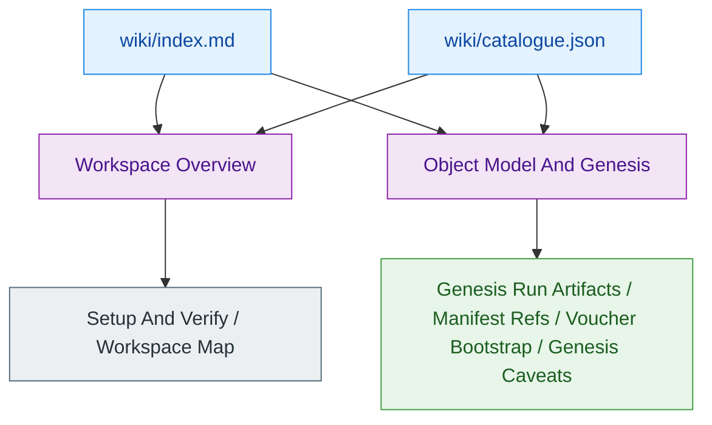
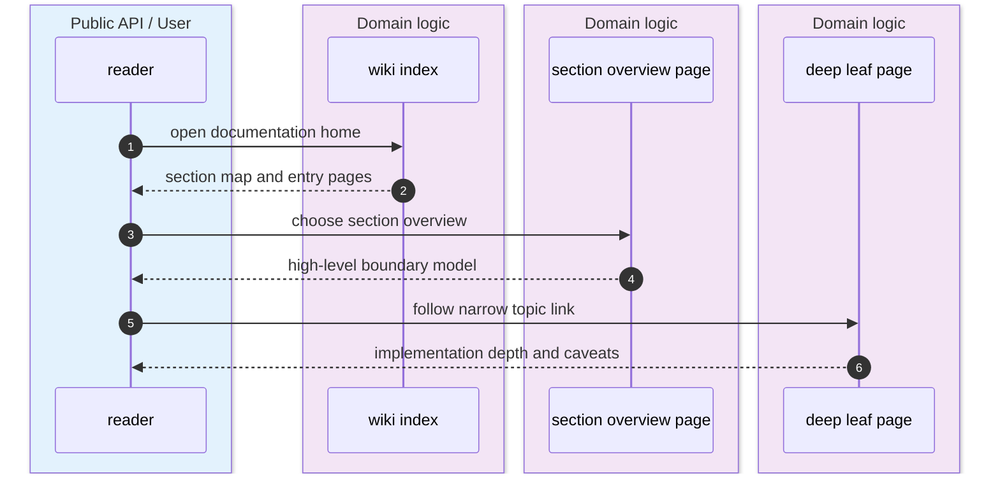
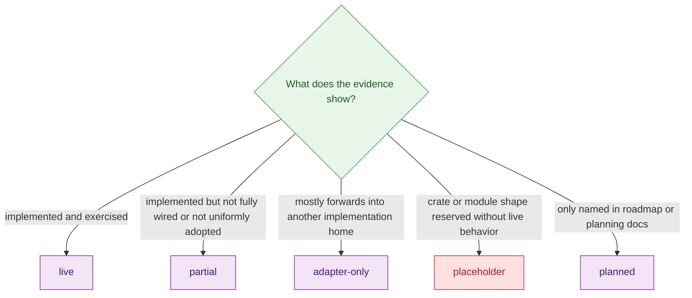

> [!IMPORTANT]
> The current Z00Z wiki already behaves like a routed technical knowledge base: `index.md` is a developer landing page, `catalogue.json` is the structure authority, and section pages such as `Workspace Overview` or `Object Model And Genesis` sit above more specific leaves. The recommendation to **keep overview pages** and hang deeper pages beneath them is therefore an inference from the current repository structure and deep-wiki packaging rules, not a new schema invented out of thin air. `wiki/index.md:70-80` `wiki/catalogue.json:40-64` `wiki/catalogue.json:107-136` `.github/plugins/deep-wiki/README.md:163-165` `.github/plugins/deep-wiki/commands/build.md:46-50`

This page exists because the wiki now has enough depth that readers need two things at once: a **stable routing model** and a **consistent maturity legend**. The routing model prevents high-level pages from being replaced by ever-more-specific leaves, while the status legend makes it obvious whether a surface is fully live, only partly wired, a thin adapter, an empty placeholder, or only named in planning docs. `deep-wiki-readme.md:36-43` `.github/plugins/deep-wiki/commands/generate.md:42-53` `wiki/01-getting-started/workspace-overview.md:72-79` `wiki/03-core-protocol/object-model-and-genesis.md:65-71`

## At A Glance

| Surface | Status | Responsibility | Key file | Source |
|---|---|---|---|---|
| Wiki root landing page | `live` | Gives the developer-facing home page, quick start, and section map. | `wiki/index.md` | `wiki/index.md:1-18` `wiki/index.md:70-80` |
| Catalogue-driven hierarchy | `live` | Stores the section tree and leaf-page placement rules that VitePress packaging follows. | `wiki/catalogue.json` | `wiki/catalogue.json:40-64` `wiki/catalogue.json:107-136` |
| Section overview pages | `live` | Provide the first page inside a section before readers branch into narrower leaves. | `wiki/01-getting-started/workspace-overview.md`, `wiki/03-core-protocol/object-model-and-genesis.md` | `wiki/01-getting-started/workspace-overview.md:1-16` `wiki/03-core-protocol/object-model-and-genesis.md:1-16` |
| Deep child coverage | `partial` | Several sections already have specific deep leaves, but the pattern is not equally deep everywhere yet. | `wiki/catalogue.json` | `wiki/catalogue.json:111-136` `wiki/catalogue.json:164-222` |
| Thin re-export or shim surfaces | `adapter-only` | Signals a boundary that mostly forwards into a deeper implementation home. | `crates/z00z_core/src/genesis/genesis_output.rs` | `crates/z00z_core/src/genesis/genesis_output.rs:1-55` |
| Reserved crate-shaped seams | `placeholder` | Signals namespace reservation without a real execution path yet. | `crates/z00z_extensions/README.md`, `crates/z00z_networks/onionnet/README.md` | `crates/z00z_extensions/README.md:3-12` `crates/z00z_networks/onionnet/README.md:9-31` |
| Roadmap-only add-on families | `planned` | Names future lanes that belong in the architecture story but are not yet live code. | `docs/tech-papers/Z00Z-Gant.md` | `docs/tech-papers/Z00Z-Gant.md:121-125` |

## Architecture

<!-- Sources: wiki/index.md:70-80, wiki/catalogue.json:40-64, wiki/catalogue.json:118-147, wiki/01-getting-started/workspace-overview.md:72-79 -->

<!-- Sources: wiki/index.md:70-80, wiki/01-getting-started/workspace-overview.md:72-79, wiki/catalogue.json:118-147 -->

<!-- Sources: crates/z00z_core/src/genesis/genesis_output.rs:1-55, crates/z00z_core/src/genesis/genesis_run.rs:2-25, crates/z00z_extensions/README.md:3-12, crates/z00z_networks/onionnet/README.md:27-31, docs/tech-papers/Z00Z-Gant.md:121-125 -->

## Routing Model

The deep-wiki tooling itself is structure-first. The repository guide says `catalogue` maps the documentation structure first, and the plugin README makes that principle explicit as a design rule: generate the table of contents before page content. The build command then requires `index.md` to be a technical landing page rather than a disposable placeholder. `deep-wiki-readme.md:36-43` `.github/plugins/deep-wiki/README.md:163-165` `.github/plugins/deep-wiki/commands/generate.md:42-53` `.github/plugins/deep-wiki/commands/build.md:46-50`

The current wiki already follows that shape. `wiki/index.md` is a root landing page with a documentation map, while the catalogue breaks the site into section nodes such as `01-getting-started` and `03-core-protocol`, each with child pages. `Workspace Overview` and `Object Model And Genesis` are not tiny appendix pages; they are section-front-door summaries that introduce the terrain before narrower leaves take over. `wiki/index.md:70-80` `wiki/catalogue.json:40-64` `wiki/catalogue.json:107-136` `wiki/01-getting-started/workspace-overview.md:62-79` `wiki/03-core-protocol/object-model-and-genesis.md:56-71`

That is why deleting overview pages would be the wrong extension of the current design. The repository already has a landing-page pattern at the root and overview-page pattern inside sections. The consistent move is to keep those pages as routers and add progressively narrower leaves beneath them. This conclusion is an inference from the present structure, but it is a strong one because both the generated wiki and the underlying deep-wiki tooling are already arranged around that flow. `wiki/index.md:1-18` `wiki/catalogue.json:66-68` `.github/plugins/deep-wiki/commands/generate.md:67-80`

## Status Legend

> [!NOTE]
> The five labels below are a documentation legend for this wiki. They are not a Rust enum in the codebase. The point is to compress the maturity signals the repository already emits through code, crate READMEs, and roadmap docs.

| Label | Use when | Example surface | Source |
|---|---|---|---|
| `live` | The code path is implemented, exported, or exercised as a real surface. | `wiki/index.md`, `run_genesis()`, `Workspace Overview` | `wiki/index.md:1-18` `crates/z00z_core/src/genesis/genesis_run.rs:2-25` `wiki/01-getting-started/workspace-overview.md:1-16` |
| `partial` | The surface exists, but some expected wiring or site-wide adoption is still incomplete. | Deep-child coverage across sections | `wiki/catalogue.json:111-136` |
| `adapter-only` | The file or module mainly delegates into a deeper implementation home. | `validator.rs` | `crates/z00z_core/src/genesis/validator.rs:16-23` |
| `placeholder` | The namespace is intentionally reserved but not yet a live implementation surface. | `z00z_extensions`, `OnionNet` | `crates/z00z_extensions/README.md:3-12` `crates/z00z_networks/onionnet/README.md:27-31` |
| `planned` | The family is only named in roadmap material and should not be narrated as shipped behavior. | Cross-chain registry, treasury, liability extension lanes | `docs/tech-papers/Z00Z-Gant.md:121-125` |

## Current Routing Pattern

| Section | Router page to keep | Existing deeper leaves | Current status | Source |
|---|---|---|---|---|
| Getting Started | `Workspace Overview` | `Setup And Verify`, `Workspace Map`, `Wiki Routing Status` | `live` router, `partial` depth growth | `wiki/catalogue.json:44-63` |
| Core Protocol | `Object Model And Genesis` | `Genesis Run Artifacts`, `Genesis Manifest Refs`, `Genesis Voucher Bootstrap`, `Genesis Caveats` | `live` router, `live`/`partial` leaves depending on surface | `wiki/catalogue.json:111-141` |
| Storage Runtime And Rollup | `Settlement Runtime And Rollup` | object package, publication, recovery, aggregator, validator, watcher, rollup leaves | `live` router, broad deep coverage | `wiki/catalogue.json:164-222` |

The important pattern is that router pages and deep pages do different jobs. Router pages explain why a section exists and where to go next. Deep pages should not replace them; they should narrow the scope, add caveats, and expose code-path detail that would otherwise overload the section entry page. `wiki/index.md:70-80` `wiki/03-core-protocol/genesis-run-artifacts.md:69-104`

## Maintenance Rules

| Rule | Why it follows from current repo structure | Source |
|---|---|---|
| Keep overview pages | The root and section structure already depends on landing pages and map tables. | `wiki/index.md:70-80` `.github/plugins/deep-wiki/commands/build.md:46-50` |
| Add deep pages as child leaves in `catalogue.json` | The generated wiki is catalogue-driven and leaf pages are emitted from that structure. | `deep-wiki-readme.md:41-43` `.github/plugins/deep-wiki/commands/generate.md:67-80` |
| Mark each deep-page surface with one status label | The repo already mixes live, partial, adapter-only, placeholder, and planned maturity states. Hiding that mix makes readers overestimate readiness. | `crates/z00z_core/src/genesis/genesis_output.rs:52-55` `crates/z00z_extensions/README.md:3-12` `docs/tech-papers/Z00Z-Gant.md:121-125` |
| Link router pages to their deepest siblings | Cross-links preserve progressive disclosure instead of forcing readers to jump back through search. | `.github/plugins/deep-wiki/commands/generate.md:73-80` |

## Related Pages

| Page | Relationship |
|---|---|
| [Workspace Overview](./workspace-overview.md) | Existing section overview page that already acts as a router for Getting Started. |
| [Object Model And Genesis](../03-core-protocol/object-model-and-genesis.md) | Example of a section overview page that now sits above multiple genesis deep leaves. |
| [Genesis Caveats](../03-core-protocol/genesis-caveats.md) | Example of a deep page that narrows one non-obvious topic instead of replacing the overview. |
