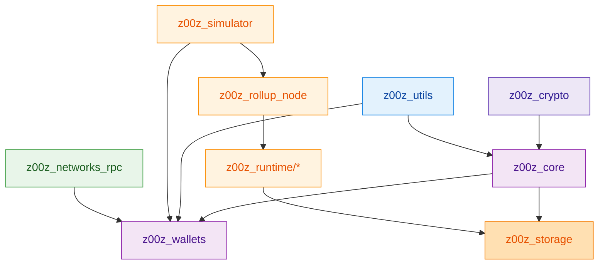
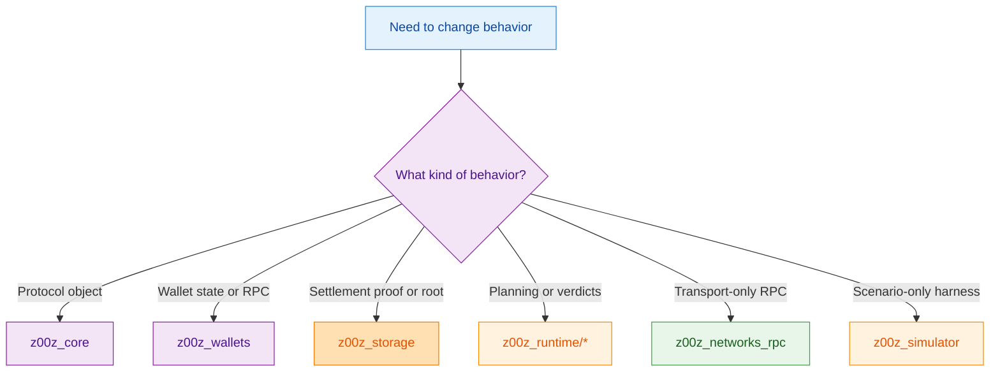
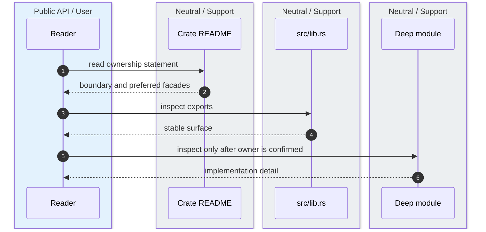

This page is the practical inventory: which crate owns what, which crates are intentionally thin, and where a contributor should look before opening implementation files. It follows crate READMEs and root facades instead of inferring ownership from directory names alone. `crates/z00z_core/README.md:3-36` `crates/z00z_wallets/README.md:171-183` `crates/z00z_utils/README.md:3-25`

## 🎯 At A Glance

| Crate | Role | Key file | Source |
|---|---|---|---|
| `z00z_core` | Protocol objects and genesis. | `crates/z00z_core/src/lib.rs` | `crates/z00z_core/src/lib.rs:103-132` |
| `z00z_wallets` | Wallet state, object inventory, RPC, receiver, tx. | `crates/z00z_wallets/src/lib.rs` | `crates/z00z_wallets/src/lib.rs:97-156` |
| `z00z_storage` | Settlement truth and proof contracts. | `crates/z00z_storage/src/settlement/mod.rs` | `crates/z00z_storage/src/settlement/mod.rs:32-93` |
| `z00z_simulator` | Canonical cross-crate scenario harness. | `crates/z00z_simulator/src/scenario_1/mod.rs` | `crates/z00z_simulator/src/scenario_1/mod.rs:8-37` |
| Runtime crates | Planning, validation, observation. | `crates/z00z_runtime/*/src/lib.rs` | `crates/z00z_runtime/aggregators/src/lib.rs:18-44` `crates/z00z_runtime/validators/src/lib.rs:14-28` `crates/z00z_runtime/watchers/src/lib.rs:13-20` |

## 🧭 Crate Inventory

<!-- Sources: crates/z00z_simulator/Cargo.toml:38-55, crates/z00z_wallets/Cargo.toml:76-87, crates/z00z_rollup_node/src/lib.rs:15-31 -->

<!-- Sources: crates/z00z_core/README.md:8-17, crates/z00z_wallets/README.md:171-183, crates/z00z_storage/README.md:4-18, crates/z00z_networks/rpc/README.md:3-18, crates/z00z_simulator/README.md:12-22 -->

<!-- Sources: crates/z00z_core/README.md:3-20, crates/z00z_wallets/README.md:171-183, crates/z00z_storage/src/settlement/README.md:34-80 -->

## 📦 Major Crates

| Crate | What it owns | What it explicitly does not own | Source |
|---|---|---|---|
| `z00z_core` | Assets, genesis, actions, policies, rights, vouchers. | It does not treat `configs/devnet_assets_config.yaml` as a second genesis authority. | `crates/z00z_core/README.md:22-43` |
| `z00z_wallets` | Wallet object inventory, services, receiver, tx, RPC, persistence. | It does not overload `wallet.asset.*` with voucher/right semantics. | `crates/z00z_wallets/README.md:11-37` |
| `z00z_storage` | Settlement paths, roots, stores, proof envelopes, checkpoint-facing roots. | It does not collapse checkpoint/snapshot/serialization into one generic backup layer. | `crates/z00z_storage/README.md:4-18` |
| `z00z_runtime/aggregators` | Planner, placement, publication, recovery, distributed scheduler. | It does not own settlement semantics, proof verification, or rollup orchestration. | `crates/z00z_runtime/aggregators/README.md:18-29` |
| `z00z_runtime/validators` | Checkpoint, spend, tx/claim verification, verdicts. | It does not own planner admission or watcher projection. | `crates/z00z_runtime/validators/README.md:13-18` |
| `z00z_runtime/watchers` | Observation snapshots, alerts, publication and provider health evidence. | It does not create semantic truth beside validators and storage. | `crates/z00z_runtime/watchers/README.md:11-16` |
| `z00z_rollup_node` | Composition root for rollup-mode services and settlement theorem verification. | It does not move planner authority out of runtime or storage truth out of storage. | `crates/z00z_rollup_node/README.md:3-15` |
| `z00z_networks_rpc` | Request dispatch and transport adaptation. | It does not own peer identity, auth, retry, or connection lifecycle. | `crates/z00z_networks/rpc/README.md:5-18` |
| `z00z_networks/onionnet` | Reserved privacy-overlay namespace. | It is not an RPC alias or separate application service. | `crates/z00z_networks/onionnet/README.md:3-25` |

## 🔑 Thin But Important Crates

| Crate | Why it stays thin | Source |
|---|---|---|
| `z00z_telemetry` | Provides one stable observability entrypoint without yet claiming domain behavior. | `crates/z00z_telemetry/README.md:3-12` `crates/z00z_telemetry/src/lib.rs:1-2` |
| `z00z_extensions` | Reserves an add-on boundary without stealing ownership from core crates. | `crates/z00z_extensions/README.md:3-12` `crates/z00z_extensions/Cargo.toml:2-8` |

## 📖 References

- `crates/z00z_core/README.md:3-43`
- `crates/z00z_wallets/README.md:11-37`
- `crates/z00z_storage/README.md:4-18`
- `crates/z00z_runtime/aggregators/README.md:3-29`
- `crates/z00z_rollup_node/README.md:3-15`

## Related Pages

| Page | Relationship |
|---|---|
| [System Overview](../02-architecture/system-overview.md) | Converts this inventory into system interactions. |
| [Crate Boundaries](../02-architecture/crate-boundaries.md) | Goes deeper on why these ownership seams exist. |
| [Object Model And Genesis](../03-core-protocol/object-model-and-genesis.md) | Starts from the main protocol owner highlighted here. |
