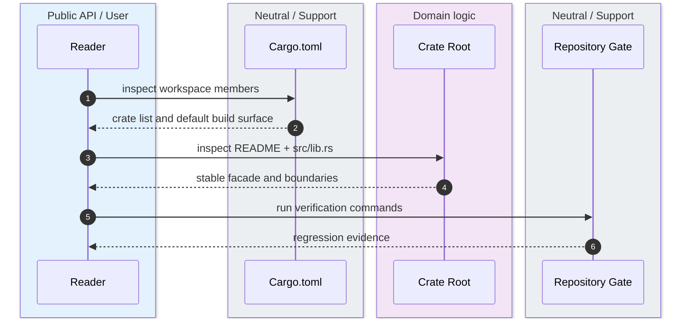

The first useful fact about Z00Z is that the repository is not a single executable with helper folders around it. It is a Cargo workspace whose root manifest, crate READMEs, and crate roots all treat ownership boundaries as the primary architectural control. `Cargo.toml:1-76` `crates/z00z_core/README.md:3-17` `crates/z00z_simulator/README.md:6-30`

## 🎯 At A Glance

| Component | Responsibility | Key file | Source |
|---|---|---|---|
| Workspace root | Declares members, default members, and workspace-wide package metadata. | `Cargo.toml` | `Cargo.toml:1-76` |
| Protocol owner | Exposes assets, genesis, policies, rights, and vouchers. | `crates/z00z_core/src/lib.rs` | `crates/z00z_core/src/lib.rs:103-132` |
| Wallet owner | Publishes the stable wallet, receiver, stealth, and tx entrypoints. | `crates/z00z_wallets/src/lib.rs` | `crates/z00z_wallets/src/lib.rs:97-156` |
| Storage owner | Publishes settlement, checkpoint, snapshot, and backend seams. | `crates/z00z_storage/src/lib.rs` | `crates/z00z_storage/src/lib.rs:4-15` |
| Integration harness | Runs repository scenarios through stable facades. | `crates/z00z_simulator/src/lib.rs` | `crates/z00z_simulator/src/lib.rs:6-39` |

## 🧭 Workspace Shape

```mermaid
graph TB
  Root[Cargo Workspace] --> Protocol[z00z_core]
  Root --> Crypto[z00z_crypto]
  Root --> Utils[z00z_utils]
  Root --> Wallet[z00z_wallets]
  Root --> Storage[z00z_storage]
  Root --> Runtime[z00z_runtime/*]
  Root --> Rollup[z00z_rollup_node]
  Root --> Networks[z00z_networks/*]
  Root --> Simulator[z00z_simulator]
  Root --> Telemetry[z00z_telemetry]
  Root --> Extensions[z00z_extensions]

  style Root fill:#E3F2FD,stroke:#1E88E5,stroke-width:1px,color:#0D47A1
  style Protocol fill:#F3E5F5,stroke:#8E24AA,stroke-width:1px,color:#4A148C
  style Crypto fill:#EDE7F6,stroke:#5E35B1,stroke-width:1px,color:#311B92
  style Utils fill:#F3E5F5,stroke:#8E24AA,stroke-width:1px,color:#4A148C
  style Wallet fill:#F3E5F5,stroke:#8E24AA,stroke-width:1px,color:#4A148C
  style Storage fill:#FFE0B2,stroke:#F57C00,stroke-width:1px,color:#E65100
  style Runtime fill:#FFF3E0,stroke:#FB8C00,stroke-width:1px,color:#E65100
  style Rollup fill:#FFF3E0,stroke:#FB8C00,stroke-width:1px,color:#E65100
  style Networks fill:#E8F5E9,stroke:#43A047,stroke-width:1px,color:#1B5E20
  style Simulator fill:#FFF3E0,stroke:#FB8C00,stroke-width:1px,color:#E65100
  style Telemetry fill:#F3E5F5,stroke:#8E24AA,stroke-width:1px,color:#4A148C
  style Extensions fill:#F3E5F5,stroke:#8E24AA,stroke-width:1px,color:#4A148C
```

<!-- Sources: Cargo.toml:3-17, crates/z00z_simulator/Cargo.toml:38-55, crates/z00z_rollup_node/README.md:3-15 -->

<!-- Sources: crates/z00z_core/README.md:3-20, crates/z00z_wallets/README.md:171-183, crates/z00z_storage/README.md:4-18, .github/skills/z00z-full-verify-gate/scripts/full_verify.sh:64-103 -->

<!-- Sources: Cargo.toml:3-34, crates/z00z_core/src/lib.rs:103-132, crates/z00z_wallets/src/lib.rs:97-156, .github/skills/z00z-full-verify-gate/scripts/full_verify.sh:73-83 -->

## 📦 Crate Families

| Family | Crates | Why they are separate | Source |
|---|---|---|---|
| Domain core | `z00z_core` | Keeps assets, genesis, policies, rights, and vouchers behind one protocol owner. | `crates/z00z_core/src/lib.rs:103-132` |
| Shared primitives | `z00z_crypto`, `z00z_utils` | Crypto and cross-cutting infrastructure stay reusable and audited once. | `crates/z00z_crypto/README.md:7-25` `crates/z00z_utils/README.md:3-25` |
| User and transport edges | `z00z_wallets`, `z00z_networks/rpc`, `z00z_networks/onionnet` | Wallet state, RPC transport, and privacy-overlay concerns are intentionally not collapsed. | `crates/z00z_wallets/README.md:47-55` `crates/z00z_networks/rpc/README.md:3-18` `crates/z00z_networks/onionnet/README.md:16-31` |
| State and publication | `z00z_storage`, `z00z_runtime/aggregators`, `validators`, `watchers`, `z00z_rollup_node` | Storage owns settlement truth; runtime plans; validators and watchers consume published state; rollup node composes. | `crates/z00z_storage/README.md:4-18` `crates/z00z_runtime/aggregators/README.md:3-16` `crates/z00z_rollup_node/README.md:3-15` |
| Harness and support | `z00z_simulator`, `z00z_telemetry`, `z00z_extensions` | Scenario execution, telemetry entrypoints, and repository-owned add-ons stay outside the domain owners. | `crates/z00z_simulator/README.md:6-30` `crates/z00z_telemetry/README.md:3-12` `crates/z00z_extensions/README.md:3-12` |

## 🔑 Reading Order

| Step | Read this | Reason | Source |
|---|---|---|---|
| 1 | Root `Cargo.toml` | Learn the live workspace surface. | `Cargo.toml:3-34` |
| 2 | Owner crate README | Understand declared boundaries before reading internals. | `crates/z00z_core/README.md:3-36` `crates/z00z_wallets/README.md:171-183` |
| 3 | `src/lib.rs` facade | See the stable exported surface. | `crates/z00z_core/src/lib.rs:112-132` `crates/z00z_wallets/src/lib.rs:120-156` |
| 4 | Integration harness docs | See how crates are supposed to compose. | `crates/z00z_simulator/README.md:46-60` |

## 📖 References

- `Cargo.toml:1-76`
- `crates/z00z_core/README.md:3-36`
- `crates/z00z_wallets/src/lib.rs:97-156`
- `crates/z00z_storage/src/lib.rs:4-15`
- `crates/z00z_simulator/README.md:6-30`

## Related Pages

| Page | Relationship |
|---|---|
| [Setup And Verify](./setup-and-verify.md) | Converts the workspace shape into a concrete command sequence. |
| [Workspace Map](./workspace-map.md) | Expands this overview into a crate-by-crate inventory. |
| [Wiki Routing Status](./wiki-routing-status.md) | Explains why overview pages stay as section routers and how deep-page status labels should be read. |
| [System Overview](../02-architecture/system-overview.md) | Shows how these crate families interact at runtime. |
