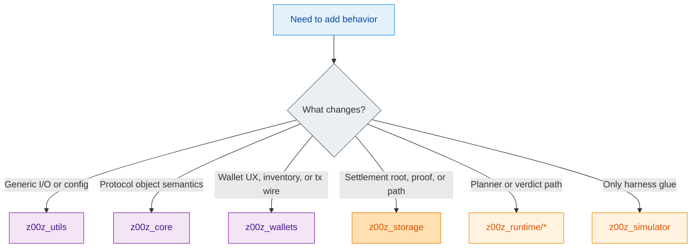
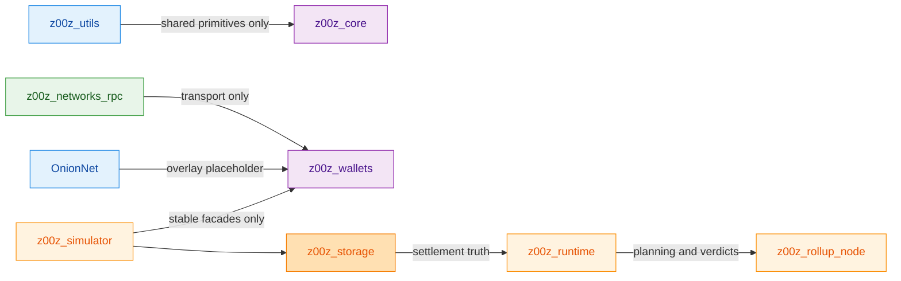
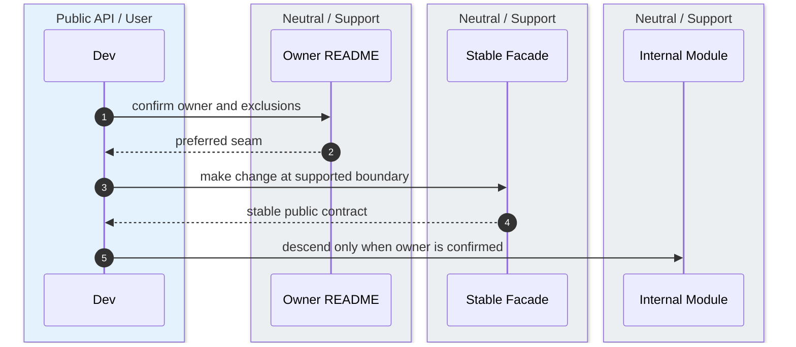

Z00Z’s most important architectural habit is that each crate says what it owns and what it must not absorb. The READMEs and crate roots are unusually explicit about these negative boundaries, so they are the right source for deciding whether a change belongs in an owner crate, a transport seam, or the simulator. `crates/z00z_utils/README.md:3-25` `crates/z00z_runtime/aggregators/README.md:18-29` `crates/z00z_simulator/README.md:12-22`

## 🎯 At A Glance

| Boundary owner | Owns | Refuses to own | Source |
|---|---|---|---|
| `z00z_utils` | Shared infrastructure primitives. | Product-domain behavior. | `crates/z00z_utils/README.md:3-25` |
| `z00z_networks_rpc` | Transport dispatch and adaptation. | Peer identity, auth, retry, lifecycle policy. | `crates/z00z_networks/rpc/src/lib.rs:4-19` |
| `z00z_storage` | Settlement roots, proofs, and stores. | Generic backup ownership and public physical-root authority. | `crates/z00z_storage/README.md:4-18` `crates/z00z_storage/src/settlement/README.md:104-121` |
| `z00z_simulator` | Cross-crate harness behavior and artifacts. | A second owner for wallet, storage, crypto, or network rules. | `crates/z00z_simulator/README.md:12-22` |

## 🧭 Ownership Decision Tree

<!-- Sources: crates/z00z_utils/README.md:11-25, crates/z00z_wallets/README.md:23-37, crates/z00z_storage/src/settlement/README.md:82-121, crates/z00z_simulator/README.md:12-22 -->

<!-- Sources: crates/z00z_utils/README.md:53-77, crates/z00z_networks/rpc/README.md:5-18, crates/z00z_networks/onionnet/README.md:16-31, crates/z00z_simulator/README.md:24-30 -->

<!-- Sources: crates/z00z_core/README.md:3-20, crates/z00z_wallets/README.md:171-183, crates/z00z_storage/src/settlement/README.md:144-157 -->

## 🔑 Reserved And Protected Seams

| Seam | Why it exists | Practical implication | Source |
|---|---|---|---|
| `z00z_networks/onionnet` placeholder | Reserves the namespace and module layout before live overlay code lands. | New privacy-overlay work should fill reserved modules in place instead of inventing a new crate. | `crates/z00z_networks/onionnet/README.md:3-31` |
| `z00z_telemetry` thin facade | Holds one stable observability entrypoint without yet claiming richer behavior. | Observability code should point here, but domain semantics still belong elsewhere. | `crates/z00z_telemetry/README.md:3-12` |
| `z00z_extensions` boundary | Preserves a space for repository-owned add-ons. | Extensions may compose owner APIs but must not fork ownership. | `crates/z00z_extensions/README.md:3-12` |

## 📖 References

- `crates/z00z_utils/README.md:3-25`
- `crates/z00z_networks/rpc/src/lib.rs:4-19`
- `crates/z00z_storage/src/settlement/README.md:104-121`
- `crates/z00z_runtime/aggregators/README.md:18-29`
- `crates/z00z_simulator/README.md:12-30`

## Related Pages

| Page | Relationship |
|---|---|
| [Workspace Map](../01-getting-started/workspace-map.md) | Lists the crates whose boundaries are described here. |
| [Wallet Architecture](../04-wallet-and-rpc/wallet-architecture.md) | Shows one of the most boundary-sensitive crates in detail. |
| [Networking And Telemetry](../07-networking-and-observability/networking-and-telemetry.md) | Expands the transport and reserved-overlay seams mentioned here. |
