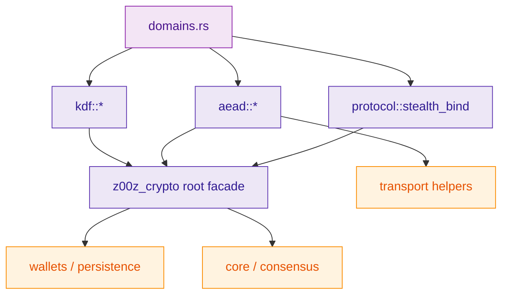
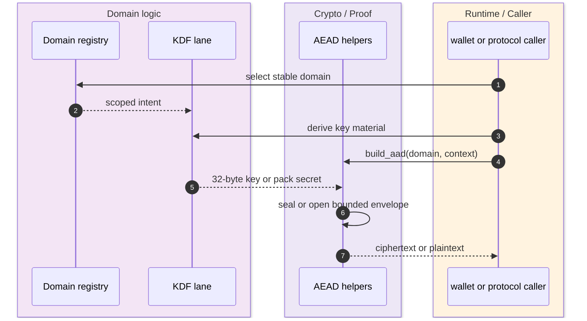
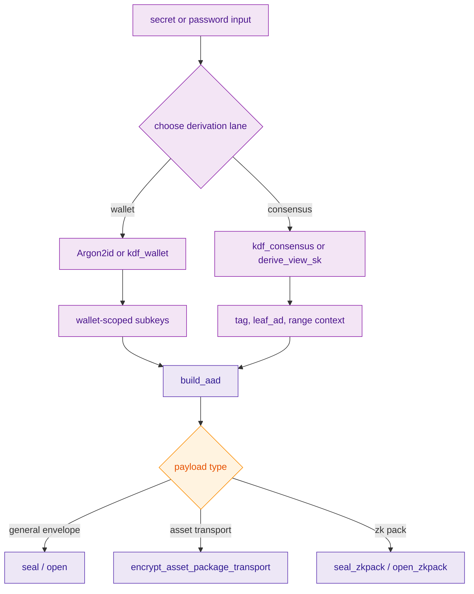

> [!IMPORTANT]
> Manual domain-separation string construction is forbidden. The safe path is to enter through the declared domain registry and the approved `z00z_crypto` facade surfaces, not ad hoc strings or direct internal vendor-subpath imports. `(crates/z00z_crypto/src/domains.rs:1)` `(crates/z00z_crypto/src/domains.rs:64)` `(crates/z00z_crypto/README.md:9)` `(crates/z00z_crypto/README.md:12)`

`z00z_crypto` already exposes a coherent KDF and AEAD surface, but the logic is spread across registry, derivation, envelope, transport, and consensus-helper modules. The important design point is that these are not unrelated utility buckets. Domains define stable intent, KDF lanes derive scoped secrets, AEAD helpers enforce bounded authenticated-encryption entrypoints, and stealth-binding helpers keep consensus output derivation aligned with the same domain policy. `(crates/z00z_crypto/src/lib.rs:96)` `(crates/z00z_crypto/src/lib.rs:151)` `(crates/z00z_crypto/src/protocol/stealth_bind.rs:9)`

## 🎯 Overview

| Surface | Status | Responsibility | Source |
|---|---|---|---|
| Domain registry | `live` | Declare stable hash/KDF/signature domains in one audited file. | `(crates/z00z_crypto/src/domains.rs:1)` |
| Root KDF facade | `live` | Re-export the canonical derivation entrypoints used by the workspace. | `(crates/z00z_crypto/src/lib.rs:96)` |
| Wallet password KDF | `live` | Derive bounded Argon2id 32-byte secrets for wallet-local encryption. | `(crates/z00z_crypto/src/kdf/argon2_kdf.rs:5)` |
| AEAD envelope API | `live` | Provide bounded XChaCha20-Poly1305 seal/open with algorithm-tagged envelopes. | `(crates/z00z_crypto/src/aead/aead_envelope.rs:20)` `(crates/z00z_crypto/src/aead/aead_envelope.rs:122)` |
| Asset transport helpers | `live` | Wrap AEAD with a fixed asset-pack AAD domain. | `(crates/z00z_crypto/src/aead/transport.rs:7)` `(crates/z00z_crypto/src/aead/transport.rs:47)` |
| ZK pack helpers | `partial` | Feature-oriented pack encryption path for consensus pack payloads. | `(crates/z00z_crypto/src/aead/mod.rs:56)` `(crates/z00z_crypto/src/aead/aead_zkpack.rs:92)` |

## 🧭 Architecture

<!-- Sources: crates/z00z_crypto/src/lib.rs:31, crates/z00z_crypto/src/lib.rs:96, crates/z00z_crypto/src/lib.rs:151, crates/z00z_crypto/src/domains.rs:1, crates/z00z_crypto/src/protocol/stealth_bind.rs:9, crates/z00z_crypto/src/aead/transport.rs:7 -->

| Component | Why it exists | Notes | Source |
|---|---|---|---|
| domain registry | Keeps domain strings centralized and versioned. | Includes wallet backup, wallet encrypt, payment request, and receiver card domains. | `(crates/z00z_crypto/src/domains.rs:64)` `(crates/z00z_crypto/src/domains.rs:67)` `(crates/z00z_crypto/src/domains.rs:196)` |
| `kdf_consensus` / `kdf_wallet` | Separate consensus and wallet derivation lanes. | Avoids cross-lane secret reuse under one generic helper. | `(crates/z00z_crypto/src/kdf/mod.rs:119)` `(crates/z00z_crypto/src/kdf/mod.rs:125)` |
| public KDF helpers | Make common intent explicit at the root path. | Includes `derive_view_sk`, `derive_pack_key`, `derive_db_encryption_key`, and `generate_hedged_r`. | `(crates/z00z_crypto/src/lib.rs:96)` `(crates/z00z_crypto/src/kdf/mod.rs:74)` `(crates/z00z_crypto/src/kdf/mod.rs:152)` `(crates/z00z_crypto/src/kdf/mod.rs:178)` |
| AAD builders | Canonicalize AEAD context construction with size limits. | Multipart builders exist for larger structured context. | `(crates/z00z_crypto/src/aead/aead_aad.rs:5)` `(crates/z00z_crypto/src/aead/aead_aad.rs:84)` |
| envelope seal/open | Enforce bounded plaintext, bounded AAD, algorithm tag, and nonce handling. | This is the high-level, DoS-guarded AEAD seam re-exported from root. | `(crates/z00z_crypto/src/aead/aead_envelope.rs:20)` `(crates/z00z_crypto/src/aead/aead_envelope.rs:122)` `(crates/z00z_crypto/src/lib.rs:149)` |
| stealth-bind helpers | Preserve consensus binding compatibility for tag, leaf AD, and range context. | These are protocol helpers, not generic app-level hashes. | `(crates/z00z_crypto/src/protocol/stealth_bind.rs:9)` `(crates/z00z_crypto/src/protocol/stealth_bind.rs:14)` `(crates/z00z_crypto/src/protocol/stealth_bind.rs:44)` |

## 📦 Components

| Use case | Canonical entrypoint | Why this is the right lane | Source |
|---|---|---|---|
| Wallet password unlock | `derive_argon2id32_key(...)` | Bounded password KDF for wallet-local secrets. | `(crates/z00z_crypto/src/kdf/argon2_kdf.rs:5)` |
| Wallet encryption subkeys | `derive_db_encryption_key(...)` or `derive_encrypt_and_mac_keys(...)` | Explicit wallet-scoped derivations rather than consensus helpers. | `(crates/z00z_crypto/src/kdf/mod.rs:165)` `(crates/z00z_crypto/src/kdf/mod.rs:168)` |
| Receiver and stealth derivation | `derive_owner_handle(...)`, `derive_view_sk(...)`, `derive_leaf_ad(...)` | Keeps consensus route material bound to the declared domains. | `(crates/z00z_crypto/src/kdf/mod.rs:74)` `(crates/z00z_crypto/src/lib.rs:96)` |
| Asset-pack transport | `encrypt_asset_package_transport(...)` / `decrypt_asset_package_transport(...)` | Reuses bounded AEAD with fixed asset-pack AAD domain. | `(crates/z00z_crypto/src/aead/transport.rs:7)` `(crates/z00z_crypto/src/aead/transport.rs:47)` `(crates/z00z_crypto/src/aead/transport.rs:56)` |
| General AEAD envelope | `seal(...)` / `open(...)` plus `build_aad(...)` | Canonical algorithm-tagged envelope path. | `(crates/z00z_crypto/src/aead/aead_aad.rs:5)` `(crates/z00z_crypto/src/aead/aead_envelope.rs:20)` `(crates/z00z_crypto/src/aead/aead_envelope.rs:122)` |
| Consensus pack payload | `seal_zkpack(...)` / `open_zkpack(...)` | Specialized pack key/nonce/XOF/MAC derivation path. | `(crates/z00z_crypto/src/aead/aead_zkpack.rs:92)` `(crates/z00z_crypto/src/aead/aead_zkpack.rs:119)` |

## 🔄 Data Flow

<!-- Sources: crates/z00z_crypto/src/domains.rs:1, crates/z00z_crypto/src/lib.rs:96, crates/z00z_crypto/src/aead/aead_aad.rs:5, crates/z00z_crypto/src/aead/aead_envelope.rs:20, crates/z00z_crypto/src/aead/aead_envelope.rs:122 -->

Two distinct examples show the intended usage split. Wallet-local persistence should start from wallet-scoped KDF lanes such as Argon2id plus `derive_db_encryption_key(...)` or `derive_encrypt_and_mac_keys(...)`, while transport or protocol payloads should build explicit AAD and pass through the bounded envelope APIs. Consensus-specific routes then add `compute_tag16(...)`, `compute_leaf_ad(...)`, and `range_ctx_hash(...)` so that stealth and proof context stay aligned with production domains. `(crates/z00z_crypto/src/kdf/argon2_kdf.rs:5)` `(crates/z00z_crypto/src/kdf/mod.rs:165)` `(crates/z00z_crypto/src/aead/aead_aad.rs:5)` `(crates/z00z_crypto/src/protocol/stealth_bind.rs:9)`

## ⚙️ Implementation

<!-- Sources: crates/z00z_crypto/src/kdf/argon2_kdf.rs:5, crates/z00z_crypto/src/kdf/mod.rs:119, crates/z00z_crypto/src/kdf/mod.rs:125, crates/z00z_crypto/src/aead/aead_aad.rs:5, crates/z00z_crypto/src/aead/aead_envelope.rs:20, crates/z00z_crypto/src/aead/transport.rs:47, crates/z00z_crypto/src/aead/aead_zkpack.rs:92 -->

The AEAD layer is intentionally opinionated. `seal(...)` rejects oversized plaintext, validates AAD size, generates a fresh nonce, and emits an envelope with an explicit algorithm byte; `open(...)` rejects undersized or oversized envelopes and refuses the wrong algorithm id before decryption. That makes the high-level facade materially safer than open-coded use of primitives. `(crates/z00z_crypto/src/aead/aead_envelope.rs:20)` `(crates/z00z_crypto/src/aead/aead_envelope.rs:57)` `(crates/z00z_crypto/src/aead/aead_envelope.rs:122)` `(crates/z00z_crypto/src/aead/aead_primitives.rs:12)`

> [!TIP]
> The domain registry also self-checks its own safety assumptions. Tests assert uniqueness and exact expected domain strings, including `PaymentRequestDomain` and `ReceiverCardDomain`, which is valuable because these names are security boundaries, not cosmetic labels. `(crates/z00z_crypto/src/domains.rs:219)` `(crates/z00z_crypto/src/domains.rs:395)` `(crates/z00z_crypto/src/domains.rs:400)`

## 📖 References

- `(crates/z00z_crypto/src/lib.rs:31)`
- `(crates/z00z_crypto/src/lib.rs:96)`
- `(crates/z00z_crypto/src/lib.rs:149)`
- `(crates/z00z_crypto/src/domains.rs:1)`
- `(crates/z00z_crypto/src/domains.rs:64)`
- `(crates/z00z_crypto/src/domains.rs:196)`
- `(crates/z00z_crypto/src/kdf/mod.rs:23)`
- `(crates/z00z_crypto/src/kdf/mod.rs:119)`
- `(crates/z00z_crypto/src/kdf/mod.rs:165)`
- `(crates/z00z_crypto/src/kdf/argon2_kdf.rs:5)`
- `(crates/z00z_crypto/src/aead/aead_aad.rs:5)`
- `(crates/z00z_crypto/src/aead/aead_envelope.rs:20)`
- `(crates/z00z_crypto/src/aead/transport.rs:7)`
- `(crates/z00z_crypto/src/aead/aead_zkpack.rs:92)`
- `(crates/z00z_crypto/src/protocol/stealth_bind.rs:9)`

## 🔗 Related Pages

| Page | Relationship |
|---|---|
| [Z00Z Crypto Facade](./z00z-crypto-facade.md) | Explains the broader crate-root and vendor-boundary policy that this page narrows to KDF and AEAD surfaces. |
| [Receiver Request Flow](../04-wallet-and-rpc/receiver-request-flow.md) | Shows how `PaymentRequestDomain`, `ReceiverCardDomain`, and stealth-binding helpers surface in wallet receiver flows. |
| [Wallet WLT Restore](../04-wallet-and-rpc/wallet-wlt-restore.md) | Connects wallet-local encryption and export/restore semantics to the crypto KDF/AEAD primitives used underneath. |
