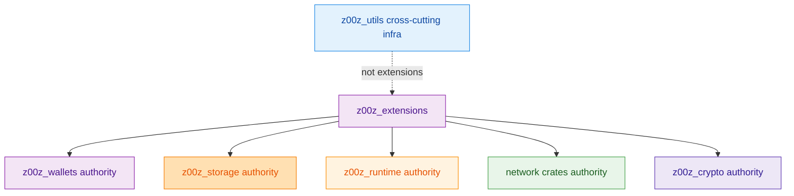
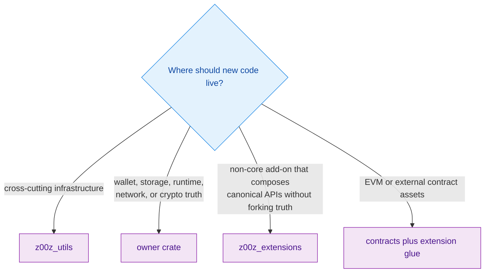
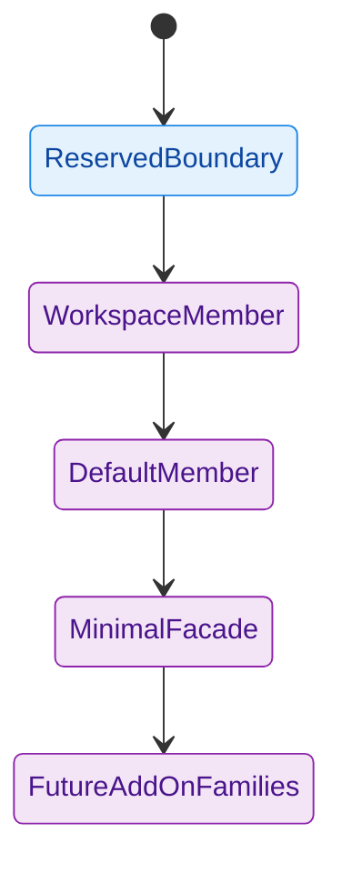

> [!IMPORTANT]
> `z00z_extensions` is a **real workspace crate** but only a **minimal boundary surface**. The repository uses it to reserve space for add-ons that are above the core wallet, storage, runtime, and network seams, while keeping persistence, transport, crypto, and runtime truth with the owner crates. `crates/z00z_extensions/README.md:3-12` `crates/z00z_extensions/src/lib.rs:1-2` `Cargo.toml:3-18`

This crate exists to solve a repository-structure problem before it becomes a code problem. Optional ecosystems, product overlays, and non-core coordination layers need a place to live, but that place cannot be allowed to absorb core semantics just because it is "convenient." The README states that extensions may compose canonical APIs but must not redefine domain ownership, and the surrounding workspace docs repeatedly describe the crate as reserved or minimal rather than mature. `crates/z00z_extensions/README.md:6-12` `crates/z00z-crates-overview.md:65-70` `docs/tech-papers/Z00Z-Roadmap-Blueprint.md:232-246`

## At A Glance

| Surface | Responsibility | Key file | Source |
|---|---|---|---|
| Boundary statement | Defines `z00z_extensions` as the reserved home for repository-owned add-ons outside core crates. | `crates/z00z_extensions/README.md` | `crates/z00z_extensions/README.md:3-12` |
| Public facade | Exposes the README through rustdoc and forbids unsafe code, but declares no extension modules yet. | `crates/z00z_extensions/src/lib.rs` | `crates/z00z_extensions/src/lib.rs:1-2` |
| Package posture | Declares package metadata only and no dependencies. | `crates/z00z_extensions/Cargo.toml` | `crates/z00z_extensions/Cargo.toml:2-8` |
| Workspace status | Includes the crate in both `members` and `default-members`. | `Cargo.toml` | `Cargo.toml:3-18` `Cargo.toml:27-42` |
| Feature posture | Records that the crate currently has no dedicated feature flags. | `Cargo-features.md` | `Cargo-features.md:50-53` |
| Architecture overview | Labels the crate a reserved extension layer with minimal present implementation. | `crates/z00z-crates-overview.md` | `crates/z00z-crates-overview.md:65-70` `crates/z00z-crates-overview.md:342-348` |
| Roadmap examples | Names future non-core lanes such as cross-chain registries, treasury, rewards, and liability. | `docs/tech-papers/Z00Z-Roadmap-Blueprint.md`, `docs/tech-papers/Z00Z-Gant.md` | `docs/tech-papers/Z00Z-Roadmap-Blueprint.md:1401-1404` `docs/tech-papers/Z00Z-Gant.md:121-125` |

## Architecture

<!-- Sources: crates/z00z_extensions/README.md:3-12, crates/z00z_extensions/src/lib.rs:1-2, crates/z00z-crates-overview.md:65-70 -->

<!-- Sources: crates/z00z_extensions/README.md:8-12, docs/tech-papers/Z00Z-Gant.md:121-125 -->

<!-- Sources: Cargo.toml:3-18, Cargo.toml:27-42, crates/z00z_extensions/src/lib.rs:1-2, docs/tech-papers/Z00Z-Roadmap-Blueprint.md:1401-1404, docs/tech-papers/Z00Z-Gant.md:121-125 -->

## The Boundary Rule

The README gives three hard rules. First, extensions are for repository-owned add-ons that do not belong inside the core wallet, storage, runtime, or network crates. Second, extensions may compose canonical APIs, but they must not fork domain ownership. Third, cross-cutting infrastructure still belongs in `z00z_utils`, not in `z00z_extensions`. Those rules are the anti-dumping policy. `crates/z00z_extensions/README.md:3-12`

The rest of the repository repeats the same message in a different vocabulary. The crate overview calls the surface "reserved" and "minimal present implementation," and the roadmap blueprint groups `z00z_extensions` with other namespaces that are intentionally reserved or minimal until stronger node and operator evidence exists. That means the emptiness of the crate is not accidental neglect; it is part of the ownership strategy. `crates/z00z-crates-overview.md:65-70` `crates/z00z-crates-overview.md:342-348` `docs/tech-papers/Z00Z-Roadmap-Blueprint.md:232-246` `docs/tech-papers/Z00Z-Roadmap-Blueprint.md:1401-1404`

## Why The Crate Is Empty On Purpose

`src/lib.rs` does nothing except include the README in rustdoc and forbid unsafe code. `Cargo.toml` adds only package metadata and no dependencies. In other words, the crate is currently a declared architectural boundary more than an implementation substrate. That is consistent with the roadmap language saying there is "no real extension execution path yet." `crates/z00z_extensions/src/lib.rs:1-2` `crates/z00z_extensions/Cargo.toml:2-8` `docs/tech-papers/Z00Z-Roadmap-Blueprint.md:236-238`

At the same time, the root workspace manifest includes `crates/z00z_extensions` in both `members` and `default-members`. That is a strong signal that the boundary is first-class in repository structure even before it carries meaningful logic. The team wants the namespace present, visible, and buildable, but not yet bloated. `Cargo.toml:3-18` `Cargo.toml:27-42`

## Anti-Dumping Matrix

| Concern | Correct owner | Why it should not land in `z00z_extensions` | Source |
|---|---|---|---|
| Cross-cutting helpers, generic infra, shared utilities | `z00z_utils` | The README explicitly reserves that class of code for `z00z_utils`. | `crates/z00z_extensions/README.md:10` |
| Persistence and settlement truth | `z00z_storage` | Extensions must stay explicit about the owning crate for persistence semantics. | `crates/z00z_extensions/README.md:11-12` |
| Transport and overlay semantics | network crates | The same owner-of-truth rule applies to transport semantics. | `crates/z00z_extensions/README.md:11-12` |
| Crypto boundary | `z00z_crypto` | README requires explicit owner for crypto semantics instead of extension-local forks. | `crates/z00z_extensions/README.md:11-12` |
| Runtime planning, validation, and execution truth | runtime crates | Extensions may compose runtime APIs but must not redefine runtime ownership. | `crates/z00z_extensions/README.md:8-12` |
| Optional ecosystems and add-on overlays | `z00z_extensions` | This is the class of work the crate is reserving space for. | `crates/z00z_extensions/README.md:3-9` |

The practical reading is strict: `z00z_extensions` is acceptable only when a feature is above the theorem- or wallet-owned core and can be implemented by composing canonical APIs instead of redefining them. If the new code needs to become the source of truth for persistence, transport, crypto, or runtime semantics, it belongs somewhere else. `crates/z00z_extensions/README.md:8-12`

## Future Add-On Families Already Named

The repository documents do name plausible residents for this crate, but they name them as future-facing add-ons, not as shipped core protocol. The roadmap blueprint says the same future-tense rule applies to broader ecosystem layers, and the Gant document lists concrete examples that would fit here with minimal disruption to the core crates. `docs/tech-papers/Z00Z-Roadmap-Blueprint.md:240-246` `docs/tech-papers/Z00Z-Gant.md:121-125`

| Documented future lane | Suggested placement | Why it fits the boundary | Source |
|---|---|---|---|
| Cross-chain asset family registry and locker flows | `crates/z00z_extensions/src/cross_chain/*` plus external contracts if needed | Non-core ecosystem glue that should not bloat Rust core protocol crates. | `docs/tech-papers/Z00Z-Gant.md:121-122` |
| Treasury, payouts, and incentive policy | `crates/z00z_extensions/src/treasury/*` and `src/rewards/*` | Explicitly above the settlement theorem according to the roadmap note. | `docs/tech-papers/Z00Z-Gant.md:123` |
| Linked Liability v1 | `crates/z00z_extensions/src/liability/*` | Reuses storage-backed primitives without turning liability overlays into core theorem code. | `docs/tech-papers/Z00Z-Gant.md:124` |
| Reserved or minimal namespaces | use after node and operator evidence exists | The blueprint explicitly warns against treating reserved namespaces as early blockers or shipped core. | `docs/tech-papers/Z00Z-Roadmap-Blueprint.md:1401-1404` |

## Configuration And Workspace Posture

`z00z_extensions` currently has no meaningful runtime configuration surface. Its operational posture is structural: package metadata, workspace inclusion, and absence of features or dependencies. `crates/z00z_extensions/Cargo.toml:2-8` `Cargo-features.md:50-53`

| Key | Current value | Why it matters | Source |
|---|---|---|---|
| Workspace membership | Included | Makes the boundary visible in normal workspace operations. | `Cargo.toml:3-18` |
| Default-member status | Included | Keeps the crate in the default build surface even while it is thin. | `Cargo.toml:27-42` |
| Crate dependencies | None | Confirms the current crate is not secretly carrying core implementation logic. | `crates/z00z_extensions/Cargo.toml:2-8` |
| Dedicated feature flags | None | Reinforces that the surface is reserved rather than already diversified. | `Cargo-features.md:50-53` |
| Public API surface | README-only rustdoc facade | Prevents accidental authority creep through a half-designed API. | `crates/z00z_extensions/src/lib.rs:1-2` |

## Related Pages

| Page | Relationship |
|---|---|
| [Crate Boundaries](./crate-boundaries.md) | Broader workspace ownership map that makes the extension rule easier to place. |
| [Z00Z Utils Admission](./z00z-utils-admission.md) | Shows why shared infrastructure must go to `z00z_utils`, not to `z00z_extensions`. |
| [Z00Z Crypto Facade](./z00z-crypto-facade.md) | Another example of a strict ownership seam that extension code must compose rather than bypass. |
