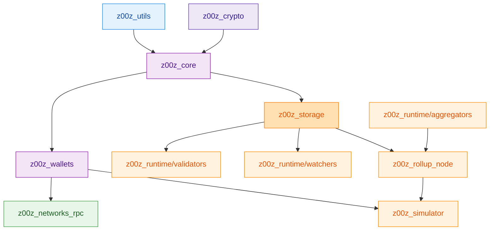
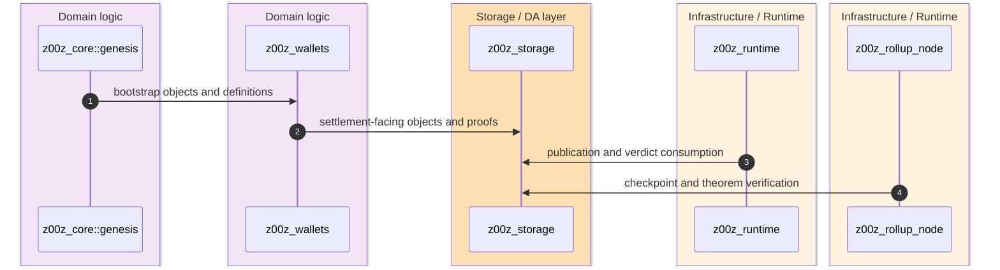
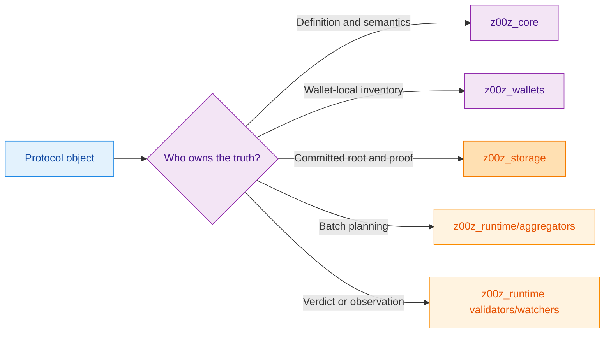

The architecture is intentionally layered around ownership, not around one universal service abstraction. `z00z_core` defines protocol objects, `z00z_crypto` and `z00z_utils` provide shared primitives, `z00z_wallets` and `z00z_storage` own durable user and settlement state, runtime crates process publication and verdicts, and `z00z_rollup_node` composes the live rollup-facing theorem path. `crates/z00z_core/src/lib.rs:103-132` `crates/z00z_crypto/src/lib.rs:31-102` `crates/z00z_utils/src/lib.rs:20-69` `crates/z00z_rollup_node/src/lib.rs:33-45`

## 🎯 At A Glance

| Layer | Responsibility | Key file | Source |
|---|---|---|---|
| Protocol | Asset, genesis, policy, right, voucher contracts. | `crates/z00z_core/src/lib.rs` | `crates/z00z_core/src/lib.rs:103-132` |
| Shared primitives | Crypto, codecs, config, I/O, logging, metrics, time, RNG. | `crates/z00z_crypto/src/lib.rs`, `crates/z00z_utils/src/lib.rs` | `crates/z00z_crypto/src/lib.rs:31-102` `crates/z00z_utils/src/lib.rs:20-69` |
| User state | Wallet inventory, receiver and tx facades, RPC registration. | `crates/z00z_wallets/src/lib.rs` | `crates/z00z_wallets/src/lib.rs:97-156` |
| Settlement and runtime | Storage truth, planning, validation, observation. | `crates/z00z_storage/src/settlement/mod.rs`, `crates/z00z_runtime/*/src/lib.rs` | `crates/z00z_storage/src/settlement/mod.rs:32-93` `crates/z00z_runtime/aggregators/src/lib.rs:18-44` |
| Composition and harness | Rollup node and simulator. | `crates/z00z_rollup_node/src/lib.rs`, `crates/z00z_simulator/src/lib.rs` | `crates/z00z_rollup_node/src/lib.rs:85-165` `crates/z00z_simulator/src/lib.rs:6-39` |

## 🧭 Layer Map

<!-- Sources: crates/z00z_wallets/Cargo.toml:76-87, crates/z00z_simulator/Cargo.toml:38-55, crates/z00z_rollup_node/src/lib.rs:15-31 -->

<!-- Sources: crates/z00z_core/README.md:22-43, crates/z00z_wallets/README.md:27-37, crates/z00z_storage/README.md:4-18, crates/z00z_rollup_node/README.md:3-15 -->

<!-- Sources: crates/z00z_core/README.md:22-43, crates/z00z_wallets/README.md:23-37, crates/z00z_storage/src/settlement/README.md:82-121, crates/z00z_runtime/validators/README.md:13-18, crates/z00z_runtime/watchers/README.md:11-16 -->

## 📦 Architectural Rules Visible In Code

| Rule | How the code shows it | Source |
|---|---|---|
| Shared primitives are centralized | `z00z_utils` re-exports codec/config/io/logger/metrics/rng/time from one crate. | `crates/z00z_utils/src/lib.rs:20-69` |
| Crypto remains behind one facade | `z00z_crypto` re-exports the supported public crypto surface from its crate root. | `crates/z00z_crypto/src/lib.rs:53-155` |
| Wallet transport is distinct from overlay/network policy | `z00z_networks_rpc` limits itself to transport and dispatch; OnionNet is a separate placeholder boundary. | `crates/z00z_networks/rpc/src/lib.rs:4-19` `crates/z00z_networks/onionnet/src/lib.rs:2-18` |
| Rollup node is a composition root, not a second protocol owner | `z00z_rollup_node` wires services and verifies a theorem bundle instead of minting new semantics. | `crates/z00z_rollup_node/README.md:3-15` `crates/z00z_rollup_node/src/lib.rs:97-165` |

## 📖 References

- `crates/z00z_core/src/lib.rs:103-132`
- `crates/z00z_crypto/src/lib.rs:31-155`
- `crates/z00z_utils/src/lib.rs:20-69`
- `crates/z00z_rollup_node/src/lib.rs:97-165`
- `crates/z00z_simulator/src/lib.rs:6-39`

## Related Pages

| Page | Relationship |
|---|---|
| [Crate Boundaries](./crate-boundaries.md) | Explains the ownership rules underneath this layered map. |
| [Object Model And Genesis](../03-core-protocol/object-model-and-genesis.md) | Details the protocol layer shown here. |
| [Settlement Runtime And Rollup](../05-storage-runtime/settlement-runtime-and-rollup.md) | Expands the storage/runtime/rollup layers. |
