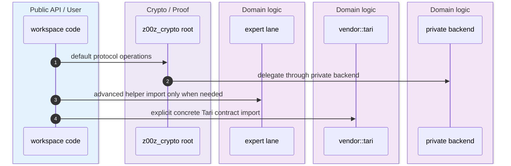
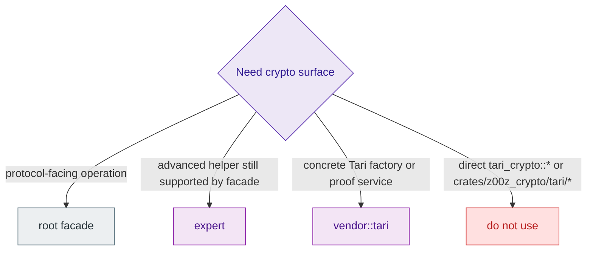

`z00z_crypto` is the workspace's cryptographic ownership boundary. Its README says the stable root crate is the only approved facade for workspace code, `expert` is the public advanced lane, and callers should not bypass that design by importing vendored Tari code directly. The source reinforces that split by exposing a rich root API, a separate `expert` namespace, an explicit `vendor::tari` opt-in lane, and a private backend selector. `crates/z00z_crypto/README.md:7-26` `crates/z00z_crypto/src/lib.rs:31-235` `crates/z00z_crypto/src/vendor.rs:1-30`

## At A Glance

| Lane | Responsibility | Key file | Source |
|---|---|---|---|
| Stable root `z00z_crypto` | Default protocol-facing facade for hashes, KDFs, proofs, AEAD, wrappers, and selected backend-backed public types. | `crates/z00z_crypto/src/lib.rs` | `crates/z00z_crypto/README.md:7-13` `crates/z00z_crypto/src/lib.rs:31-206` |
| Advanced lane `expert` | Supported but non-default helpers for encoding, traits, and concrete key types. | `crates/z00z_crypto/src/expert.rs` | `crates/z00z_crypto/src/expert.rs:1-32` |
| Explicit vendor lane `vendor::tari` | Concrete Tari contracts behind an opt-in namespace. | `crates/z00z_crypto/src/vendor.rs` | `crates/z00z_crypto/src/vendor.rs:1-30` |
| Private backend selector | Chooses the active backend internally and keeps backend choice out of external APIs. | `crates/z00z_crypto/src/lib.rs` | `crates/z00z_crypto/src/lib.rs:211-235` |
| Surface guard tests | Prevent raw `tari_crypto::*` leakage and lock namespace layout. | `crates/z00z_crypto/tests/test_public_surface.rs` | `crates/z00z_crypto/tests/test_public_surface.rs:77-118` `crates/z00z_crypto/tests/test_public_surface.rs:163-219` |

## Architecture

```mermaid
graph TB
  Caller[workspace caller] --> Root[z00z_crypto root]
  Caller --> Expert[z00z_crypto::expert]
  Caller --> Vendor[z00z_crypto::vendor::tari]
  Root --> Backend[private default_backend()]
  Vendor --> Tari[vendored Tari contracts]
  Expert --> TariHelpers[Tari-backed helper traits and key types]

  style Caller fill:#E3F2FD,stroke:#1E88E5,stroke-width:1px,color:#0D47A1
  style Root fill:#EDE7F6,stroke:#5E35B1,stroke-width:1px,color:#311B92
  style Expert fill:#EDE7F6,stroke:#5E35B1,stroke-width:1px,color:#311B92
  style Vendor fill:#EDE7F6,stroke:#5E35B1,stroke-width:1px,color:#311B92
  style Backend fill:#F3E5F5,stroke:#8E24AA,stroke-width:1px,color:#4A148C
  style Tari fill:#F3E5F5,stroke:#8E24AA,stroke-width:1px,color:#4A148C
  style TariHelpers fill:#ECEFF1,stroke:#546E7A,stroke-width:1px,color:#263238
```
<!-- Sources: crates/z00z_crypto/README.md:7-13, crates/z00z_crypto/src/lib.rs:31-41, crates/z00z_crypto/src/lib.rs:71-76, crates/z00z_crypto/src/lib.rs:211-235, crates/z00z_crypto/src/vendor.rs:1-30, crates/z00z_crypto/src/expert.rs:1-32 -->


<!-- Sources: crates/z00z_crypto/src/lib.rs:31-41, crates/z00z_crypto/src/lib.rs:149-206, crates/z00z_crypto/src/lib.rs:211-235, crates/z00z_crypto/src/expert.rs:1-32, crates/z00z_crypto/src/vendor.rs:1-30 -->


<!-- Sources: crates/z00z_crypto/README.md:9-13, crates/z00z_crypto/src/expert.rs:3-16, crates/z00z_crypto/src/vendor.rs:1-30, crates/z00z_crypto/tests/test_public_surface.rs:185-209 -->

## The Three Supported Lanes

| Lane | When to use it | Representative surface | What not to do | Source |
|---|---|---|---|---|
| Root `z00z_crypto` | Default for workspace protocol and application code. | Claims, hashes, KDFs, commitments, range proofs, AEAD, wrappers, selected Tari-backed public types. | Do not bypass it for ordinary protocol work. | `crates/z00z_crypto/README.md:9-13` `crates/z00z_crypto/src/lib.rs:53-206` |
| `z00z_crypto::expert` | Advanced but still supported helpers that are intentionally off the default root surface. | `hash_domain`, encoding helpers, key traits, concrete Ristretto key types. | Do not treat it as backend implementation internals. | `crates/z00z_crypto/src/expert.rs:1-32` |
| `z00z_crypto::vendor::tari` | Only when code truly needs a concrete Tari contract such as a factory, service, or signature type. | `HomomorphicCommitmentFactory`, `RangeProofService`, `BulletproofsPlusService`, Tari signature types. | Do not replace the root facade with raw Tari imports. | `crates/z00z_crypto/src/vendor.rs:1-30` |
| Direct vendored Tari crates or repo subpaths | Never for new workspace-facing imports. | None. | Avoid `tari_crypto::*`, `tari_utilities::*`, or direct `crates/z00z_crypto/tari/*` consumption from application code. | `crates/z00z_crypto/README.md:9-13` `crates/z00z_crypto/tests/test_public_surface.rs:185-209` |

## Why The README And Code Are Not In Conflict

At first glance there is tension: the README says not to import the internal vendor subpath from workspace code, yet `src/lib.rs` publicly exposes `vendor`, and even re-exports selected Tari-backed contracts from `vendor::tari` at the root. The code clarifies the intended reading: **backend choice stays private**, but a small explicit vendor lane is allowed when a caller truly needs a concrete Tari contract. What is forbidden is treating raw vendored Tari crates or ad hoc passthroughs as the public workspace contract. `crates/z00z_crypto/src/lib.rs:71-76` `crates/z00z_crypto/src/lib.rs:211-235` `crates/z00z_crypto/src/vendor.rs:1-30`

That interpretation is also what the surface tests enforce. They require the stable secondary namespaces `hash_policy`, `hash_types`, `kdf_consensus`, `kdf_extended`, `aead_transport`, `expert`, and `vendor`, while separately asserting that raw `pub use tari_crypto::...` passthroughs and other backend leaks do not appear in `lib.rs`. `crates/z00z_crypto/tests/test_public_surface.rs:107-118` `crates/z00z_crypto/tests/test_public_surface.rs:185-209`

## Surface Details That Matter

| Design choice | Why it matters | Source |
|---|---|---|
| Root re-exports selected Tari-backed public types via `vendor::tari` | Keeps caller imports rooted under `z00z_crypto` even when concrete Tari-backed contracts are part of the supported API. | `crates/z00z_crypto/src/lib.rs:71-76` |
| `default_backend()` is `pub(crate)` and static | Backend selection remains an internal implementation detail. | `crates/z00z_crypto/src/lib.rs:223-235` |
| `vendor::tari` reuses `expert` helpers instead of redefining them | Concrete backend lane is layered on top of the approved advanced helper lane. | `crates/z00z_crypto/src/vendor.rs:6-12` |
| `expert` is documented as public advanced API, not backend code | Prevents callers from conflating "advanced facade" with "private implementation." | `crates/z00z_crypto/src/expert.rs:1-16` |
| Tests reject root-level backend leakage | Stops surface drift that would normalize direct Tari imports in application code. | `crates/z00z_crypto/tests/test_public_surface.rs:185-209` |

## Guarded Non-Production Surface

The same facade discipline shows up in the AEAD test helpers. The README marks caller-supplied nonce helpers as non-production, and the public-surface tests enforce that the test-only namespace remains cfg-gated and absent from the stable root. `crates/z00z_crypto/README.md:14-17` `crates/z00z_crypto/tests/test_public_surface.rs:211-219`

## Related Pages

| Page | Relationship |
|---|---|
| [Crate Boundaries](./crate-boundaries.md) | General ownership map across the workspace. |
| [Z00Z Utils Admission](./z00z-utils-admission.md) | Another curated facade with explicit admission rules. |
| [Wallet Architecture](../04-wallet-and-rpc/wallet-architecture.md) | Major consumer of the crypto facade from application-facing code. |
