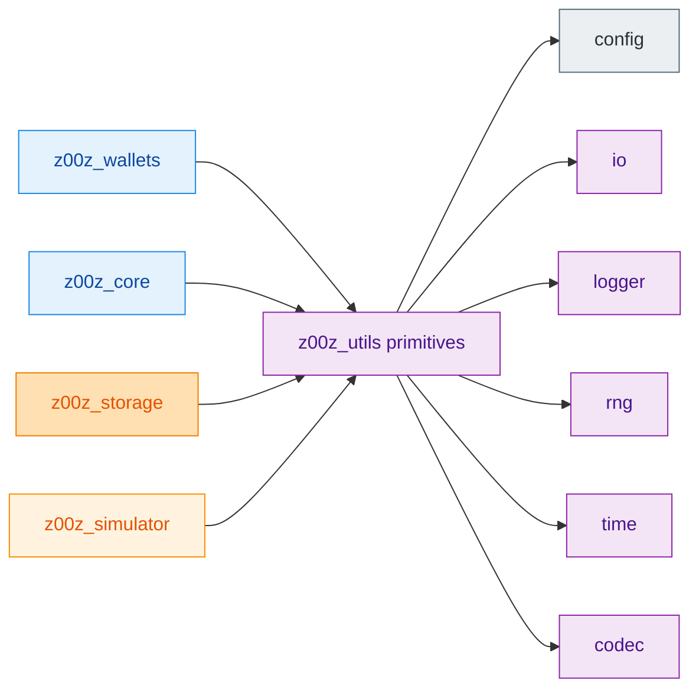
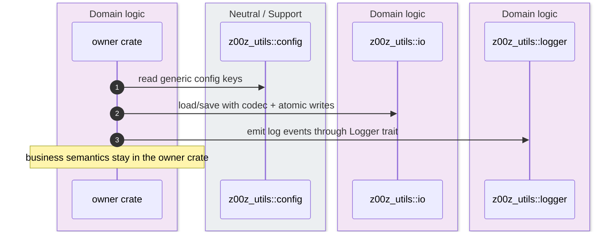
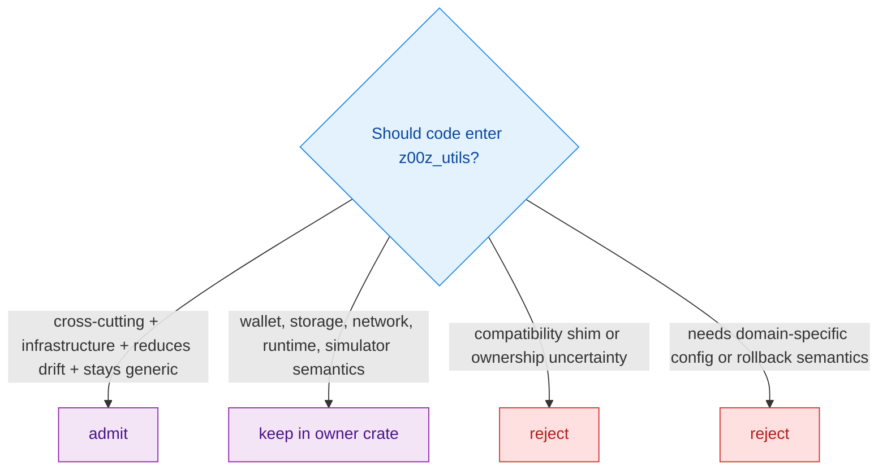

`z00z_utils` is not merely a convenience crate. Its README defines it as the repository's **cross-cutting policy crate**: one audited home for infrastructure primitives that multiple crates genuinely need, with an explicit admission rule designed to stop business logic, compatibility shims, and ownership ambiguity from leaking into a shared bucket. `crates/z00z_utils/README.md:3-25`

## At A Glance

| Component | Responsibility | Key file | Source |
|---|---|---|---|
| Boundary and admission rule | Defines what belongs in `z00z_utils` and what must stay in owner crates. | `crates/z00z_utils/README.md` | `crates/z00z_utils/README.md:3-25` `crates/z00z_utils/README.md:53-77` |
| Root facade | Re-exports the admitted utility modules and a curated `prelude`. | `crates/z00z_utils/src/lib.rs` | `crates/z00z_utils/src/lib.rs:5-29` `crates/z00z_utils/src/lib.rs:31-69` |
| Config surface | Owns generic config loading and a single `YamlValue` re-export. | `crates/z00z_utils/src/config/mod.rs` | `crates/z00z_utils/src/config/mod.rs:1-55` |
| I/O surface | Owns codec-integrated file I/O, bounded reads, atomic writes, and managed-root helpers. | `crates/z00z_utils/src/io/mod.rs` | `crates/z00z_utils/src/io/mod.rs:1-43` |
| Logger, RNG, and time surfaces | Own logging abstraction, deterministic-RNG gating, and timestamp conventions. | `crates/z00z_utils/src/logger/mod.rs`, `src/rng/mod.rs`, `src/time/mod.rs` | `crates/z00z_utils/src/logger/mod.rs:1-116` `crates/z00z_utils/src/rng/mod.rs:1-55` `crates/z00z_utils/src/time/mod.rs:1-56` |

## Architecture

<!-- Sources: crates/z00z_utils/README.md:5-9, crates/z00z_utils/src/lib.rs:11-29, crates/z00z_utils/src/lib.rs:31-69 -->

<!-- Sources: crates/z00z_utils/README.md:8-25, crates/z00z_utils/src/config/mod.rs:1-30, crates/z00z_utils/src/io/mod.rs:1-43, crates/z00z_utils/src/logger/mod.rs:1-16 -->

<!-- Sources: crates/z00z_utils/README.md:11-25, crates/z00z_utils/README.md:53-77 -->

## Admission Policy

| Admission question | Required answer | Why it exists | Source |
|---|---|---|---|
| Is the concern genuinely cross-cutting? | Yes. | Prevents `z00z_utils` from becoming a single-crate convenience dump. | `crates/z00z_utils/README.md:13-18` |
| Is it infrastructure-level, not product behavior? | Yes. | Keeps wallet, storage, network, and simulator semantics in owner crates. | `crates/z00z_utils/README.md:15-25` |
| Does centralization reduce security or correctness drift? | Yes. | Justifies one audited implementation rather than duplicated copies. | `crates/z00z_utils/README.md:17-18` |
| Can the API stay generic without domain types? | Yes. | If not, a domain crate is the better owner. | `crates/z00z_utils/README.md:18-25` |

## One-Source-Of-Truth Surfaces

The "one source of truth" idea here is structural rather than magical. `z00z_utils` centralizes the generic representations and traits that many crates should not reinvent: config loading, codec-aware file I/O, logging, deterministic-test RNG access, and time formatting rules. `crates/z00z_utils/src/lib.rs:5-29`

| Module | Shared truth it centralizes | What it avoids | Source |
|---|---|---|---|
| `config` | `ConfigSource`, `LayeredConfig`, and `YamlValue` re-export so YAML value handling does not fork per crate. | Ad hoc env/YAML parsing types in owner crates. | `crates/z00z_utils/src/config/mod.rs:22-34` |
| `io` | Atomic writes, bounded loads, managed roots, and codec-integrated save/load helpers. | Each crate inventing its own file durability and root-reset rules. | `crates/z00z_utils/src/io/mod.rs:26-43` |
| `logger` | The `Logger` abstraction and concrete logger implementations. | Hardcoded logging backend calls spread through domain crates. | `crates/z00z_utils/src/logger/mod.rs:1-16` `crates/z00z_utils/src/logger/mod.rs:106-113` |
| `rng` | Secure RNG trait plus deterministic and mock gates only under explicit test-oriented cfgs. | Hidden reproducibility knobs leaking into production by default. | `crates/z00z_utils/src/rng/mod.rs:18-23` `crates/z00z_utils/src/rng/mod.rs:36-52` |
| `time` | Timestamp naming convention and UTC rendering rules. | Per-crate ambiguity over `*_at`, `*_ms`, `*_secs`, and security-sensitive timestamp calls. | `crates/z00z_utils/src/time/mod.rs:6-24` |

## What Must Stay Outside

The README is explicit that `z00z_utils` must not absorb wallet session rules, key-derivation policy, transport behavior, storage checkpoint semantics, simulator artifact contracts, overlay lifecycle logic, or runtime orchestration. Those are not "shared utilities"; they are ownership seams. `crates/z00z_utils/README.md:53-61`

| Rejected category | Correct owner | Source |
|---|---|---|
| Wallet session, backup, or RPC behavior | `z00z_wallets` or wallet-facing crates | `crates/z00z_utils/README.md:57` |
| Storage checkpoint or proof-retention semantics | `z00z_storage` | `crates/z00z_utils/README.md:58` |
| Simulator artifact or sandbox ownership | `z00z_simulator` | `crates/z00z_utils/README.md:59` |
| Network retry, peer identity, or overlay lifecycle | network crates | `crates/z00z_utils/README.md:60` |
| Runtime orchestration that happens to call utilities | runtime owner crates | `crates/z00z_utils/README.md:61` |

## Practical Reading Of The Facade

`src/lib.rs` reinforces the policy by making the admitted modules obvious and small, then offering a curated `prelude` that re-exports only the generic utility types and functions. That prelude is not a domain facade; it is a convenience lane for infrastructure surfaces already admitted into the crate. `crates/z00z_utils/src/lib.rs:20-29` `crates/z00z_utils/src/lib.rs:31-69`

## Related Pages

| Page | Relationship |
|---|---|
| [Crate Boundaries](./crate-boundaries.md) | Higher-level map of ownership seams across the workspace. |
| [Z00Z Crypto Facade](./z00z-crypto-facade.md) | Another example of a curated cross-workspace facade with strict admission boundaries. |
| [RPC Overlay Boundary](../07-networking-and-observability/rpc-overlay-boundary.md) | Shows a different crate family applying the same "keep policy with the right owner" rule. |
