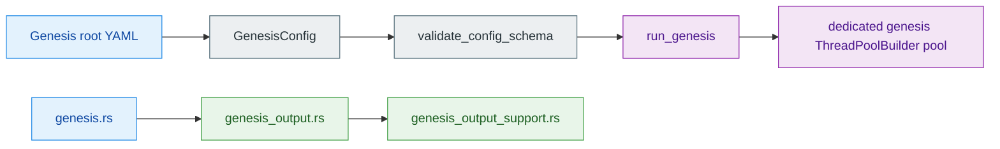

> [!CAUTION]
> Two genesis details still deserve explicit attention. First, `performance.num_threads` is no longer schema-only: `run_genesis()` resolves it and builds a dedicated genesis Rayon pool through `ThreadPoolBuilder`, so the manifest field is the canonical execution knob for genesis throughput. Second, `crate::genesis` now uses explicit internal submodules in `genesis.rs`, and `genesis_output.rs` remains the canonical output entry inside that surface while reaching `genesis_output_support` through a normal nested module import. `crates/z00z_core/src/genesis/genesis_config.rs` `crates/z00z_core/src/genesis/genesis_config_validate.rs` `crates/z00z_core/src/genesis/genesis_run.rs` `crates/z00z_core/src/genesis/genesis.rs` `crates/z00z_core/src/genesis/genesis_output.rs`

This page exists because those details affect authority and maintenance, not just code style. Readers should now reason from one live path: the manifest owns genesis thread count, `run_genesis()` owns dedicated-pool execution, and the flattened `crate::genesis::*` surface remains the only canonical module entrypoint.

## 🎯 At A Glance

| Surface | Status | What it actually does | Key file |
|---|---|---|---|
| `performance` root manifest section | `live` | Keeps `performance` beside `chain` and `outputs` in the root config shape. | `crates/z00z_core/src/genesis/genesis_config.rs` |
| `performance.num_threads` validation | `live` | Rejects `0` and accepts `auto` or positive fixed counts. | `crates/z00z_core/src/genesis/genesis_config_validate.rs` |
| `performance.num_threads` effect on execution | `live` | Resolves the configured value and builds a dedicated genesis Rayon pool through `ThreadPoolBuilder`. | `crates/z00z_core/src/genesis/genesis_run.rs` |
| `RAYON_NUM_THREADS` | `secondary` | May still affect unrelated process-global Rayon work or standalone benches, but it is no longer the canonical genesis-orchestration knob. | `crates/z00z_core/benches/README.md` |
| `genesis.rs` composition root | `live` | Declares the internal genesis submodules explicitly and re-exports the canonical surface through `crate::genesis::*`. | `crates/z00z_core/src/genesis/genesis.rs` |
| `genesis_output.rs` | `live` | Keeps the timestamp helper and declares the output support module inside the canonical genesis surface. | `crates/z00z_core/src/genesis/genesis_output.rs` |
| `genesis_output_support.rs` | `live` | Holds the concrete managed-root reset, output-dir creation, and snapshot ZIP logic behind that nested support module. | `crates/z00z_core/src/genesis/genesis_output_support.rs` |

## 🧭 Architecture

## ⚙️ Thread-Count Caveat

`performance` is part of the live root-manifest contract, and `performance.num_threads` is now part of the live execution contract as well. The config loader parses it, the validator rejects invalid zero values, and `run_genesis()` resolves the configured mode before constructing a dedicated genesis pool. Host parallelism is logged separately from the configured genesis pool so operators can see both numbers during a run. `crates/z00z_core/src/genesis/genesis_config.rs` `crates/z00z_core/src/genesis/genesis_config_validate.rs` `crates/z00z_core/src/genesis/genesis_run.rs`

The practical reading is now straightforward:

| Surface | Status | Reader should conclude |
|---|---|---|
| Manifest key `performance.num_threads` | `live` | The field is part of the accepted genesis schema and runtime contract. |
| Dedicated pool wiring | `live` | Genesis generation and proof verification run inside a dedicated manifest-driven Rayon pool. |
| Process-global `RAYON_NUM_THREADS` | `secondary` | It may matter for other Rayon users, but it is not the canonical genesis tuning path anymore. |

## 📦 Module Composition Caveat

`genesis.rs` is the physical composition root of the genesis surface, but it now declares its internal modules explicitly instead of stitching them together through `include!`. That means the canonical public path remains `crate::genesis::*`, and the implementation stays flattened across owner-local files without reintroducing a second public owner path. `crates/z00z_core/src/genesis/genesis.rs`

Inside that surface, `genesis_output.rs` is no longer a path-module shim that re-exports a hidden support module. It keeps `generate_timestamp()` locally, declares `mod genesis_output_support;`, and imports the support helpers through ordinary module use statements, so there is one canonical output entry inside the genesis surface and one nested implementation module behind it. The remaining caveat is owner-local structure, not competing public output paths. `crates/z00z_core/src/genesis/genesis_output.rs` `crates/z00z_core/src/genesis/genesis_output_support.rs`

## 🔑 Practical Reading Rules

| If you are reading... | Use this interpretation |
|---|---|
| `performance.num_threads` in YAML | Treat it as the canonical genesis throughput knob. |
| `run_genesis()` logs | Read `Host parallelism` and `Genesis thread pool threads` together; they intentionally separate machine capacity from configured pool size. |
| `genesis.rs` internal modules | Treat them as the one canonical genesis surface, not as competing public modules. |
| `genesis_output.rs` | Treat it as the canonical output entry inside `crate::genesis`, with `genesis_output_support.rs` as the nested support module behind it. |

## Related Pages

| Page | Relationship |
|---|---|
| [Object Model And Genesis](./object-model-and-genesis.md) | High-level bootstrap overview that points readers here for the non-obvious execution and composition details. |
| [Genesis Run Artifacts](./genesis-run-artifacts.md) | Covers the output layout driven by the canonical genesis output surface. |
| [Genesis Manifest Refs](./genesis-manifest-refs.md) | Shows why `performance` stays in the root manifest even though only selected object-family sections may fan out into refs. |
