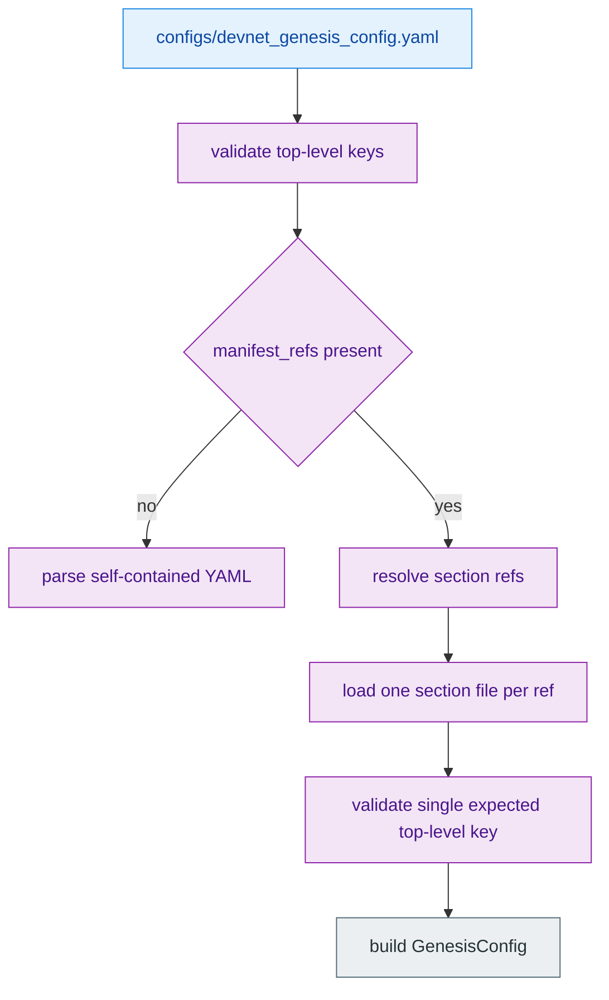
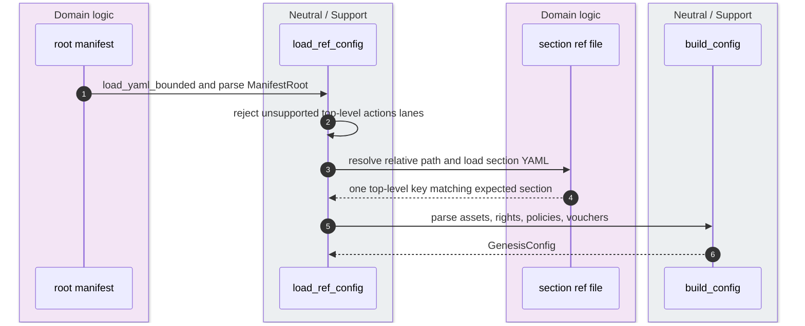
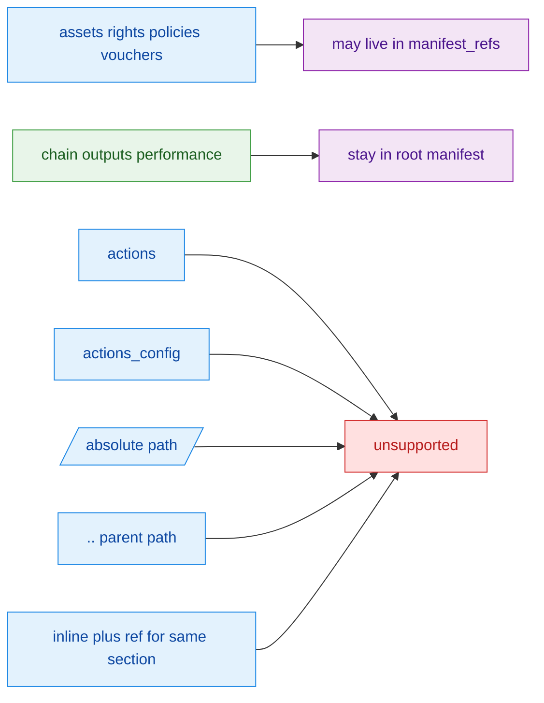

The genesis loader supports two input shapes: a self-contained YAML document or a canonical root manifest that keeps `chain`, `outputs`, and `performance` in the root file while delegating only `assets`, `rights`, `policies`, and `vouchers` to `manifest_refs`. That split is not a loose convenience feature; it is guarded by explicit section allow-lists, duplicate-path checks, single-key subfile rules, and an intentional rejection of `actions` or `actions_config` as top-level lanes. `crates/z00z_core/src/genesis/genesis_config.rs:223-238` `crates/z00z_core/src/genesis/manifest_ref_loader.rs:21-115` `crates/z00z_core/src/genesis/genesis_config_validate.rs:1-55`

> [!NOTE]
> `performance` really does stay in the root manifest, and `performance.num_threads` now stays on the same canonical path all the way into execution: the validator accepts only valid values and `run_genesis()` uses that field to build the dedicated genesis pool. See [Genesis Caveats](./genesis-caveats.md). `crates/z00z_core/src/genesis/manifest_ref_loader.rs` `crates/z00z_core/src/genesis/genesis_config_validate.rs` `crates/z00z_core/src/genesis/genesis_run.rs`

## 🎯 At A Glance

| Component | Responsibility | Key file | Source |
|---|---|---|---|
| Root config shape | Defines the full `GenesisConfig` and the `load_genesis_config(...)` entrypoint. | `crates/z00z_core/src/genesis/genesis_config.rs` | `crates/z00z_core/src/genesis/genesis_config.rs:49-61` `crates/z00z_core/src/genesis/genesis_config.rs:223-238` |
| Ref loader | Rehydrates ref-based manifests into the same `GenesisConfig` shape. | `crates/z00z_core/src/genesis/manifest_ref_loader.rs` | `crates/z00z_core/src/genesis/manifest_ref_loader.rs:21-115` |
| Validator | Enforces allowed sections, unsupported keys, and exact top-level key names. | `crates/z00z_core/src/genesis/genesis_config_validate.rs` | `crates/z00z_core/src/genesis/genesis_config_validate.rs:1-55` |
| Canonical root manifest example | Shows `manifest_refs` plus inline `chain`, `outputs`, and `performance`. | `crates/z00z_core/configs/devnet_genesis_config.yaml` | `crates/z00z_core/configs/devnet_genesis_config.yaml:1-23` |
| Canonical subfile example | Shows a section file with exactly one top-level key. | `crates/z00z_core/configs/devnet_assets_config.yaml` | `crates/z00z_core/configs/devnet_assets_config.yaml:1-13` |

## 📦 Architecture

<!-- Sources: crates/z00z_core/src/genesis/genesis_config.rs:223-238, crates/z00z_core/src/genesis/manifest_ref_loader.rs:50-115, crates/z00z_core/src/genesis/genesis_config_validate.rs:4-55 -->
<!-- YAML source: crates/z00z_core/configs/devnet_genesis_config.yaml:1-23 -->

<!-- Sources: crates/z00z_core/src/genesis/manifest_ref_loader.rs:50-115, crates/z00z_core/src/genesis/manifest_ref_loader.rs:134-203, crates/z00z_core/src/genesis/genesis_config_validate.rs:22-55 -->

<!-- Sources: crates/z00z_core/src/genesis/genesis_config_validate.rs:1-37, crates/z00z_core/src/genesis/manifest_ref_loader.rs:117-190 -->
<!-- YAML source: crates/z00z_core/configs/devnet_genesis_config.yaml:3-23 -->

## 🔑 Root-Manifest Contract

| Rule | What the code enforces | Source |
|---|---|---|
| Allowed ref sections | Only `assets`, `rights`, `policies`, and `vouchers` are legal `manifest_refs` targets. | `crates/z00z_core/src/genesis/genesis_config_validate.rs:1-37` |
| Root-only sections | `chain`, `outputs`, and `performance` are parsed from the root document and are not ref-expanded. | `crates/z00z_core/src/genesis/genesis_config.rs:49-61` |
| Alias support | `manifest_refs` also accepts the alias `refs`. | `crates/z00z_core/src/genesis/manifest_ref_loader.rs:21-33` |
| No dual ownership | A section cannot be defined both inline and via `manifest_refs`. | `crates/z00z_core/src/genesis/manifest_ref_loader.rs:117-131` |
| No path alias reuse | One ref path cannot be reused by multiple section keys. | `crates/z00z_core/src/genesis/manifest_ref_loader.rs:140-159` |

## 📁 Subfile Contract

| Subfile rule | Meaning | Source |
|---|---|---|
| Single-key file | Each ref file must be a mapping with exactly one top-level key matching the expected section name. | `crates/z00z_core/src/genesis/genesis_config_validate.rs:40-55` |
| Relative-only | Absolute paths are rejected. | `crates/z00z_core/src/genesis/manifest_ref_loader.rs:162-174` |
| No root escape | `..`, root-dir, or prefix components are rejected so refs cannot leave the manifest root. | `crates/z00z_core/src/genesis/manifest_ref_loader.rs:176-190` |
| Non-empty path | Blank ref paths are rejected before load. | `crates/z00z_core/src/genesis/manifest_ref_loader.rs:163-167` |
| Canonical sample | The devnet asset ref file starts with exactly `assets:` and then the array payload. | `crates/z00z_core/configs/devnet_assets_config.yaml:1-13` |

## ⚙️ Unsupported And Intentional Omissions

The loader explicitly rejects top-level `actions` and `actions_config`. The validator error text is not vague here: actions must stay nested under policies, and `actions_config.yaml` is intentionally absent from the supported manifest model. `crates/z00z_core/src/genesis/genesis_config_validate.rs:4-26`

That means the canonical ref shape is not “any section can be split out later.” The project deliberately allows only the object-family-bearing sections to fan out into subfiles. Policy action pools still travel inside `policies`, as shown by the canonical policy sample. `crates/z00z_core/configs/devnet_policies_config.yaml:1-120`

## 📌 Root Example

| Root key | Present in the canonical devnet root file | Why it stays there | Source |
|---|---|---|---|
| `manifest_refs` | Yes | Declares section fanout. | `crates/z00z_core/configs/devnet_genesis_config.yaml:3-7` |
| `chain` | Yes | Needed before generation begins and never ref-expanded. | `crates/z00z_core/configs/devnet_genesis_config.yaml:9-15` |
| `outputs` | Yes | Owns output paths and logging configuration. | `crates/z00z_core/configs/devnet_genesis_config.yaml:17-20` |
| `performance` | Yes | Carries `num_threads`; this is parsed as core config, not a ref section. | `crates/z00z_core/configs/devnet_genesis_config.yaml:22-23` |

## Related Pages

| Page | Relationship |
|---|---|
| [Genesis Run Artifacts](./genesis-run-artifacts.md) | Follows this manifest after it has been fully rehydrated. |
| [Object Model And Genesis](./object-model-and-genesis.md) | Broader overview of what the rehydrated config eventually bootstraps. |
| [Genesis Caveats](./genesis-caveats.md) | Explains why the root-owned `performance` section remains special and how it now reaches the live execution path. |
| [Genesis Voucher Bootstrap](./genesis-voucher-bootstrap.md) | Shows how one of the ref-loaded sections is later materialized into concrete runtime records. |
