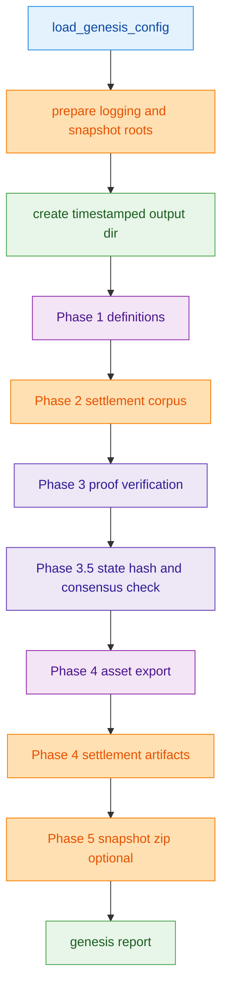
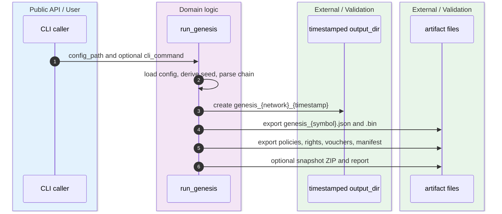
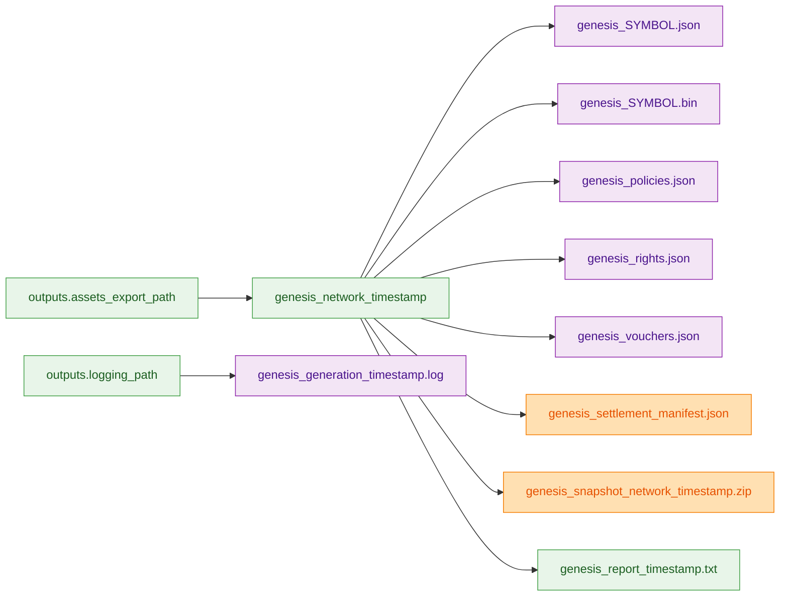

`run_genesis()` is the canonical orchestration path for bootstrap generation. It does not write directly into the raw `outputs.assets_export_path` root; it first prepares managed roots, then creates a timestamped `genesis_{network}_{timestamp}` directory, exports per-asset files there, writes settlement artifacts there, optionally builds a snapshot ZIP there, and keeps logs under the separate logging root. `crates/z00z_core/src/genesis/genesis_run.rs:2-25` `crates/z00z_core/src/genesis/genesis_output_support.rs:11-35`

> [!CAUTION]
> This artifact path is real, and two supporting caveats sit behind it: `performance.num_threads` is the canonical manifest-driven thread-pool knob used by `run_genesis()`, and `genesis.rs` now owns the internal genesis submodules explicitly even though `genesis_output.rs` remains the one canonical output entry with a normal nested support-module import. See [Genesis Caveats](./genesis-caveats.md). `crates/z00z_core/src/genesis/genesis_config_validate.rs` `crates/z00z_core/src/genesis/genesis_run.rs` `crates/z00z_core/src/genesis/genesis.rs` `crates/z00z_core/src/genesis/genesis_output.rs`

## 🎯 At A Glance

| Component | Responsibility | Key file | Source |
|---|---|---|---|
| `run_genesis` | Owns phase ordering, verification, export, and report emission. | `crates/z00z_core/src/genesis/genesis_run.rs` | `crates/z00z_core/src/genesis/genesis_run.rs:2-228` |
| Managed output root | Resets the managed root and creates `genesis_{network}_{timestamp}`. | `crates/z00z_core/src/genesis/genesis_output_support.rs` | `crates/z00z_core/src/genesis/genesis_output_support.rs:11-30` |
| Asset export | Writes `genesis_{symbol}.json` and `genesis_{symbol}.bin` atomically into the chosen export directory. | `crates/z00z_core/src/genesis/serde.rs` | `crates/z00z_core/src/genesis/serde.rs:59-110` |
| Settlement artifact export | Writes policies, rights, vouchers, and `genesis_settlement_manifest.json`, then round-trips them back through JSON to catch drift. | `crates/z00z_core/src/genesis/genesis_settlement_manifest.rs` | `crates/z00z_core/src/genesis/genesis_settlement_manifest.rs:341-493` |
| Canonical output entry | Keeps `generate_timestamp()` in `genesis_output.rs` and imports the actual support implementation through a nested module. | `crates/z00z_core/src/genesis/genesis_output.rs` | `crates/z00z_core/src/genesis/genesis_output.rs` |

## 📦 Architecture

<!-- Sources: crates/z00z_core/src/genesis/genesis_run.rs:7-25, crates/z00z_core/src/genesis/genesis_run.rs:26-215, crates/z00z_core/src/genesis/genesis_output_support.rs:11-35, crates/z00z_core/src/genesis/genesis_output_support.rs:93-187 -->

<!-- Sources: crates/z00z_core/src/genesis/genesis_run.rs:2-25, crates/z00z_core/src/genesis/genesis_run.rs:147-225, crates/z00z_core/src/genesis/serde.rs:71-97, crates/z00z_core/src/genesis/genesis_settlement_manifest.rs:353-493, crates/z00z_core/src/genesis/genesis_output_support.rs:93-187 -->

<!-- Sources: crates/z00z_core/src/genesis/genesis_config.rs:180-199, crates/z00z_core/src/genesis/genesis_output_support.rs:20-29, crates/z00z_core/src/genesis/serde.rs:61-94, crates/z00z_core/src/genesis/genesis_settlement_manifest.rs:353-369, crates/z00z_core/src/genesis/genesis_settlement_manifest.rs:487-493, crates/z00z_core/src/genesis/genesis_output_support.rs:103-186, crates/z00z_core/src/genesis/genesis_run.rs:46-60 -->

## 🔑 Phase Trace

| Phase | What actually happens | Files written in this phase | Source |
|---|---|---|---|
| Setup | Loads config, derives `GenesisSeed`, parses `ChainType`, prepares logging root, optionally prepares snapshot root, creates timestamped output dir, resolves `performance.num_threads`, and builds plus logs the dedicated genesis pool. | Managed directories only | `crates/z00z_core/src/genesis/genesis_run.rs` |
| Phase 1 | Builds and registers asset definitions from manifest assets. | None | `crates/z00z_core/src/genesis/genesis_run.rs:26-38` |
| Phase 2 | Generates policies and the prechecked settlement corpus. | None | `crates/z00z_core/src/genesis/genesis_run.rs:40-119` |
| Phase 3 | Verifies generated proofs across the flattened asset set. | None | `crates/z00z_core/src/genesis/genesis_run.rs:120-139` |
| Phase 3.5 | Computes the genesis state hash and checks consensus binding. | None | `crates/z00z_core/src/genesis/genesis_run.rs:141-145` |
| Phase 4 | Rebinds `assets_export_path` to the timestamped output dir, exports per-asset JSON/bin, then exports settlement artifacts. | `genesis_{symbol}.json`, `genesis_{symbol}.bin`, `genesis_policies.json`, `genesis_rights.json`, `genesis_vouchers.json`, `genesis_settlement_manifest.json` | `crates/z00z_core/src/genesis/genesis_run.rs:147-184` `crates/z00z_core/src/genesis/serde.rs:71-97` `crates/z00z_core/src/genesis/genesis_settlement_manifest.rs:353-493` |
| Phase 5 | When `cli_command` is present on non-WASM targets, builds a ZIP with source directories, config, and `run_genesis.sh`. | `genesis_snapshot_{network}_{timestamp}.zip` | `crates/z00z_core/src/genesis/genesis_run.rs:186-189` `crates/z00z_core/src/genesis/genesis_output_support.rs:93-187` |
| Closeout | Writes the text report into the same timestamped output dir. | `genesis_report_{timestamp}.txt` | `crates/z00z_core/src/genesis/genesis_run.rs:203-225` |

## 📁 Real Artifact Layout

| Artifact | Real location | Why it lands there | Source |
|---|---|---|---|
| Timestamped output root | `{assets_export_path}/genesis_{network}_{timestamp}` | `create_timestamped_output_dir(...)` resets the managed base root and then creates the directory. | `crates/z00z_core/src/genesis/genesis_output_support.rs:11-30` |
| Per-asset exports | Inside `output_dir`, not the raw base path | `run_genesis()` clones outputs and rewrites `assets_export_path` to `output_dir` before calling `export_genesis_assets(...)`. | `crates/z00z_core/src/genesis/genesis_run.rs:150-163` |
| Settlement manifest | `output_dir/genesis_settlement_manifest.json` | The exporter joins `GENESIS_SETTLEMENT_MANIFEST_FILE` onto `output_dir`. | `crates/z00z_core/src/genesis/genesis_settlement_manifest.rs:10` `crates/z00z_core/src/genesis/genesis_settlement_manifest.rs:487-493` |
| Log file | `{logging_path}/genesis_generation_{timestamp}.log` | The file logger is created under the dedicated logging root, not under the timestamped asset directory. | `crates/z00z_core/src/genesis/genesis_run.rs:43-60` |
| Snapshot ZIP | `output_dir/genesis_snapshot_{network}_{timestamp}.zip` | The ZIP is named from the output dir timestamp and written beside the exported artifacts. | `crates/z00z_core/src/genesis/genesis_output_support.rs:103-187` |

## ⚙️ Output Config Surface

| Config key | Consumed by | Effect | Source |
|---|---|---|---|
| `outputs.assets_export_path` | `create_timestamped_output_dir(...)` and export rebinding | Owns the managed output root and the parent of the timestamped export directory. | `crates/z00z_core/src/genesis/genesis_config.rs:180-199` `crates/z00z_core/src/genesis/genesis_run.rs:14-16` |
| `outputs.snapshot_export_path` | `prepare_genesis_snapshot_root(...)` | Only gets separately prepared when it differs from `assets_export_path`. | `crates/z00z_core/src/genesis/genesis_run.rs:10-13` |
| `outputs.logging_path` | `prepare_genesis_logging_dir(...)` and `FileLogger::new(...)` | Owns the managed logging root and the per-run generation log. | `crates/z00z_core/src/genesis/genesis_run.rs:10` `crates/z00z_core/src/genesis/genesis_run.rs:46-60` |

## 📌 Implementation Notes

`genesis_output.rs` remains the canonical output entry inside `crate::genesis`. It keeps `generate_timestamp()` locally and imports `genesis_output_support` as a nested module, so the concrete directory and ZIP logic still live in the split support file without creating a second public output module path. `crates/z00z_core/src/genesis/genesis_output.rs`

The settlement artifact export is stricter than the per-asset export path. It does not just write JSON; it reloads the exported policies, rights, and vouchers, compares them to in-memory values, computes replay and round-trip digests, and only then writes the final manifest hash. `crates/z00z_core/src/genesis/genesis_settlement_manifest.rs:371-493`

## Related Pages

| Page | Relationship |
|---|---|
| [Object Model And Genesis](./object-model-and-genesis.md) | Broader bootstrap overview across assets, rights, policies, and vouchers. |
| [Genesis Caveats](./genesis-caveats.md) | Pulls out the thread-count and include/composition details that would otherwise stay buried in this artifact walkthrough. |
| [Genesis Manifest Refs](./genesis-manifest-refs.md) | Explains how the input manifest is assembled before `run_genesis()` starts. |
| [Genesis Voucher Bootstrap](./genesis-voucher-bootstrap.md) | Focuses on the voucher-specific sub-pipeline inside the corpus generation phase. |
