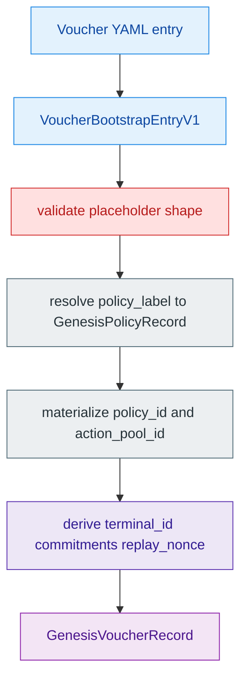
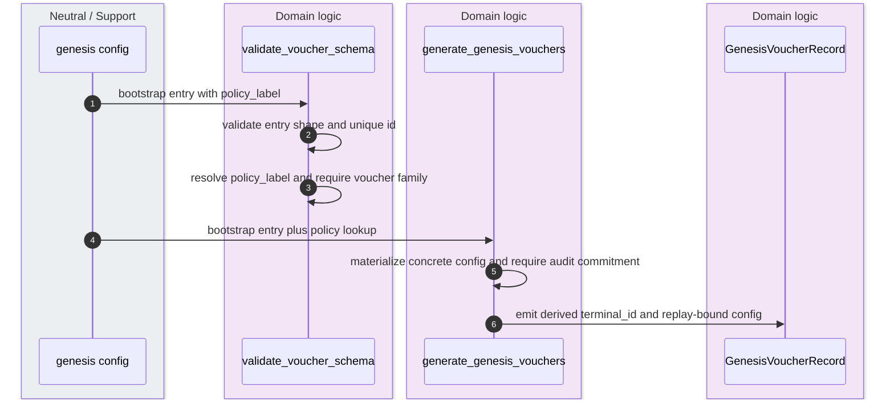
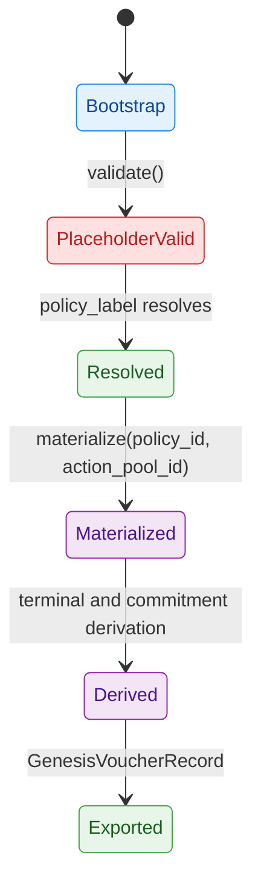

`VoucherBootstrapEntryV1` is a manifest-time bootstrap contract, not the final voucher record. It exists because the YAML author can name fixtures and a `policy_label`, but the concrete `policy_id`, `action_pool_id`, terminal identifier, actor commitments, and final replay nonce do not exist until genesis has already generated policy records and chosen the chain, seed, and root generation context. `crates/z00z_core/src/vouchers/voucher_bootstrap.rs:10-29` `crates/z00z_core/src/genesis/genesis_vouchers.rs:77-204`

## 🎯 At A Glance

| Component | Responsibility | Key file | Source |
|---|---|---|---|
| Bootstrap entry | Carries manifest-time voucher semantics with `policy_label` and fixture names. | `crates/z00z_core/src/vouchers/voucher_bootstrap.rs` | `crates/z00z_core/src/vouchers/voucher_bootstrap.rs:10-29` |
| Placeholder validation | Validates shape by creating a provisional `VoucherConfigEntry` with placeholder IDs. | `crates/z00z_core/src/vouchers/voucher_bootstrap.rs` | `crates/z00z_core/src/vouchers/voucher_bootstrap.rs:31-66` |
| Concrete voucher shape | Defines the fully materialized voucher config and its invariant checks. | `crates/z00z_core/src/vouchers/voucher_config.rs` | `crates/z00z_core/src/vouchers/voucher_config.rs:140-232` |
| Genesis materialization | Resolves `policy_label`, enforces voucher-family policy, derives commitments and nonces, and emits `GenesisVoucherRecord`. | `crates/z00z_core/src/genesis/genesis_vouchers.rs` | `crates/z00z_core/src/genesis/genesis_vouchers.rs:77-204` |
| Config and test surface | Shows canonical YAML entries and asserts policy binding plus derived nonce behavior. | `crates/z00z_core/configs/devnet_vouchers_config.yaml`, `crates/z00z_core/tests/genesis/test_genesis_vouchers.rs` | `crates/z00z_core/configs/devnet_vouchers_config.yaml:1-66` `crates/z00z_core/tests/genesis/test_genesis_vouchers.rs:17-113` |

## 📦 Architecture

<!-- Sources: crates/z00z_core/configs/devnet_vouchers_config.yaml:1-66, crates/z00z_core/src/vouchers/voucher_bootstrap.rs:31-92, crates/z00z_core/src/genesis/genesis_config_validate.rs:238-279, crates/z00z_core/src/genesis/genesis_vouchers.rs:88-204 -->

<!-- Sources: crates/z00z_core/src/genesis/genesis_config_validate.rs:238-279, crates/z00z_core/src/genesis/genesis_vouchers.rs:88-204 -->

<!-- Sources: crates/z00z_core/src/vouchers/voucher_bootstrap.rs:31-92, crates/z00z_core/src/genesis/genesis_vouchers.rs:88-204 -->

## 🔑 Why “BootstrapEntry” Is The Right Name

The entry is not yet a concrete voucher object for two reasons. First, it stores `policy_label`, not the actual `PolicyId` or `ActionPoolId`. Second, it stores fixture names such as `issuer_fixture`, `holder_fixture`, and `beneficiary_fixture`, while the generated record stores derived commitments and a derived `terminal_id`. `crates/z00z_core/src/vouchers/voucher_bootstrap.rs:13-28` `crates/z00z_core/src/genesis/genesis_vouchers.rs:121-200`

Calling it `BootstrapEntry` is therefore semantically accurate: it is the input envelope that bootstraps a real voucher config after policy generation. It is closer to a declarative issuance request than to the final stored voucher leaf. `crates/z00z_core/src/vouchers/voucher_bootstrap.rs:68-92`

## 📁 Placeholder Versus Concrete Fields

| Concern | Bootstrap field | Concrete/runtime field | Where the conversion happens | Source |
|---|---|---|---|---|
| Policy binding | `policy_label` | `policy_id` and `action_pool_id` | `materialize(...)` after policy lookup | `crates/z00z_core/src/vouchers/voucher_bootstrap.rs:20-21` `crates/z00z_core/src/vouchers/voucher_bootstrap.rs:68-92` |
| Actor identity | fixture strings | issuer, holder, beneficiary, and refund-target commitments | `derive_fixture_commitment(...)` | `crates/z00z_core/src/vouchers/voucher_bootstrap.rs:14-17` `crates/z00z_core/src/genesis/genesis_vouchers.rs:56-75` `crates/z00z_core/src/genesis/genesis_vouchers.rs:146-180` |
| Voucher address | implicit in `id` plus bootstrap context | derived `terminal_id` | `derive_voucher_hash(..., "voucher_terminal", ...)` | `crates/z00z_core/src/genesis/genesis_vouchers.rs:115-144` |
| Replay fencing | raw bootstrap `replay_nonce` | chain/seed/root/policy-bound replay nonce | record `config.replay_nonce` rewrite | `crates/z00z_core/src/vouchers/voucher_bootstrap.rs:24` `crates/z00z_core/src/genesis/genesis_vouchers.rs:182-199` |
| Final invariant checks | placeholder `PolicyId([0x11; 32])` and `ActionPoolId([0x22; 32])` | real IDs plus voucher-family policy | bootstrap validate plus schema validate | `crates/z00z_core/src/vouchers/voucher_bootstrap.rs:47-64` `crates/z00z_core/src/genesis/genesis_config_validate.rs:248-275` |

## ⚙️ Validation Gates

| Gate | What it rejects | Source |
|---|---|---|
| Bootstrap `validate()` | Empty key strings, invalid backing, invalid lifecycle/value windows, zero replay nonce, zero optional commitments. | `crates/z00z_core/src/vouchers/voucher_bootstrap.rs:31-66` `crates/z00z_core/src/vouchers/voucher_config.rs:162-232` |
| Config schema validation | Duplicate voucher IDs, unknown `policy_label`, or a policy whose primary family is not `Voucher`. | `crates/z00z_core/src/genesis/genesis_config_validate.rs:238-279` |
| Genesis generation | Missing `audit_commitment` in genesis and terminal collisions. | `crates/z00z_core/src/genesis/genesis_vouchers.rs:107-144` |
| Tests | Missing policy binding and non-derived replay nonces. | `crates/z00z_core/tests/genesis/test_genesis_vouchers.rs:42-77` `crates/z00z_core/tests/genesis/test_genesis_vouchers.rs:82-113` |

## 📌 What A Voucher Is, And What It Is Not

The backing model explains why vouchers can look superficially “asset-like.” `VoucherBackingReferenceV1` may point to a reserve commitment, a consumed asset, or a named genesis reserve, so vouchers are economically tied to value-bearing lanes. But the runtime voucher config still remains voucher-owned: it has its own lifecycle enum, acceptance terms, replay nonce, and policy/action identifiers, and genesis insists that the resolved policy family is `Voucher`. `crates/z00z_core/src/vouchers/voucher_config.rs:7-18` `crates/z00z_core/src/vouchers/voucher_config.rs:140-232` `crates/z00z_core/src/genesis/genesis_config_validate.rs:260-275`

So the correct mental model is not “asset with rights glued on.” It is “voucher object family whose bootstrap form still needs policy and chain context before it can become a concrete voucher record.”

## Related Pages

| Page | Relationship |
|---|---|
| [Object Model And Genesis](./object-model-and-genesis.md) | Broader protocol-level overview across all genesis object families. |
| [Genesis Manifest Refs](./genesis-manifest-refs.md) | Explains how voucher bootstrap entries are loaded from manifest subfiles. |
| [Genesis Run Artifacts](./genesis-run-artifacts.md) | Shows where the final `genesis_vouchers.json` artifact is written. |
