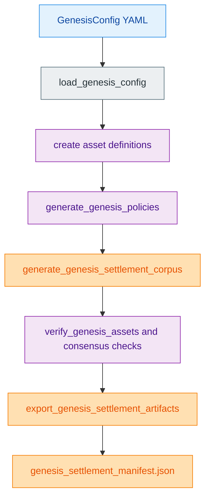
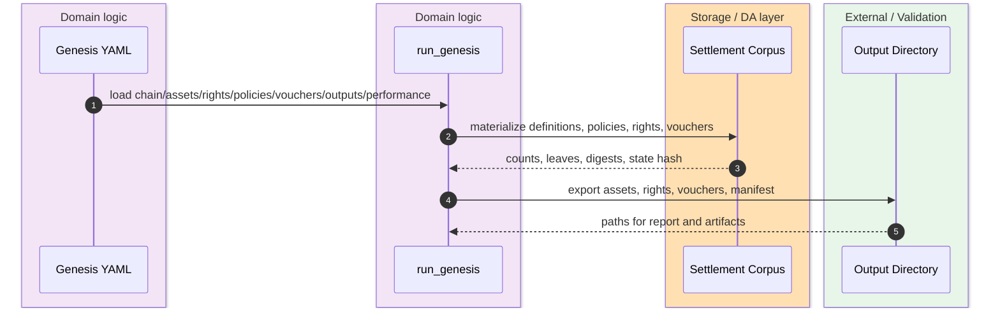

The protocol layer treats genesis as the canonical bootstrap authority for assets, rights, policies, and vouchers, then exports a derived settlement corpus and manifest from that one source of truth. The repo documentation is explicit that registry YAML is secondary data, not a competing genesis authority. `crates/z00z_core/README.md:22-43` `crates/z00z_core/src/lib.rs:115-132`

> [!CAUTION]
> Two non-obvious genesis constraints deserve to stay visible while reading this overview: `performance.num_threads` is part of the manifest, is validated, and now directly drives a dedicated genesis `ThreadPoolBuilder` pool in `run_genesis()`; and `genesis.rs` now owns the internal genesis submodules explicitly while `genesis_output.rs` stays the one canonical output entry with a normal nested support-module import. See [Genesis Caveats](./genesis-caveats.md). `crates/z00z_core/src/genesis/genesis_config.rs` `crates/z00z_core/src/genesis/genesis_config_validate.rs` `crates/z00z_core/src/genesis/genesis_run.rs` `crates/z00z_core/src/genesis/genesis.rs` `crates/z00z_core/src/genesis/genesis_output.rs`

## 🎯 At A Glance

| Component | Responsibility | Key file | Source |
|---|---|---|---|
| Stable protocol facade | Re-exports assets, policies, rights, vouchers, and `ChainType`. | `crates/z00z_core/src/lib.rs` | `crates/z00z_core/src/lib.rs:115-132` |
| Genesis facade | Re-exports the generation, digest, and manifest surfaces. | `crates/z00z_core/src/genesis/mod.rs` | `crates/z00z_core/src/genesis/mod.rs:189-212` |
| Typed config manifest | Loads assets, rights, policies, vouchers, outputs, and performance knobs from YAML. | `crates/z00z_core/src/genesis/genesis_config.rs` | `crates/z00z_core/src/genesis/genesis_config.rs:49-61` |
| Orchestrator | Creates definitions, generates the settlement corpus, verifies proofs, and exports artifacts. | `crates/z00z_core/src/genesis/genesis_run.rs` | `crates/z00z_core/src/genesis/genesis_run.rs:2-228` |
| Voucher bootstrap shape | Validates manifest-time voucher entries, then materializes runtime-ready configs after policy resolution. | `crates/z00z_core/src/vouchers/voucher_bootstrap.rs` | `crates/z00z_core/src/vouchers/voucher_bootstrap.rs:10-92` |

## 🧭 Bootstrap Flow

<!-- Sources: crates/z00z_core/src/genesis/genesis_config.rs:230-246, crates/z00z_core/src/genesis/genesis_run.rs:26-176, crates/z00z_core/src/genesis/genesis_settlement_manifest.rs:341-493 -->

<!-- Sources: crates/z00z_core/src/genesis/genesis_config.rs:49-61, crates/z00z_core/src/genesis/genesis_run.rs:7-24, crates/z00z_core/src/genesis/genesis_run.rs:147-225, crates/z00z_core/src/genesis/genesis_settlement_manifest.rs:458-493 -->

<!-- Sources: crates/z00z_core/src/vouchers/voucher_bootstrap.rs:31-92, crates/z00z_core/src/vouchers/voucher_config.rs:140-220, crates/z00z_core/src/genesis/genesis_config.rs:257-260 -->

## 📦 Object Families

| Family | Where it is declared | What genesis does with it | Source |
|---|---|---|---|
| Assets | `z00z_core::assets` and `AssetConfigEntry` | Builds definitions first, then generates asset leaves and proofs. | `crates/z00z_core/src/lib.rs:116-120` `crates/z00z_core/src/genesis/genesis_run.rs:26-38` |
| Rights | `RightsConfigEntry` in the manifest | Feeds the settlement corpus and later rights export plus manifest counts. | `crates/z00z_core/src/genesis/genesis_config.rs:53-60` `crates/z00z_core/src/genesis/genesis_run.rs:72-82` |
| Policies | `PolicyConfigEntryV1` and generated records | Derives policy/action pools before voucher and right materialization. | `crates/z00z_core/src/genesis/genesis_config.rs:55-58` `crates/z00z_core/src/genesis/genesis_run.rs:69-71` |
| Vouchers | `VoucherBootstrapEntryV1` bootstrap entries | Validates a manifest-time entry, then resolves it into a concrete voucher config. | `crates/z00z_core/src/genesis/genesis_config.rs:57-60` `crates/z00z_core/src/vouchers/voucher_bootstrap.rs:47-92` |

## 🔑 Current-State Caveats

| Topic | What the code currently does | Source |
|---|---|---|
| `performance.num_threads` | The manifest parses and validates `performance.num_threads`, resolves `auto` or fixed values, and `run_genesis()` builds a dedicated manifest-driven Rayon pool from that field before generation and proof verification. | `crates/z00z_core/src/genesis/genesis_config.rs` `crates/z00z_core/src/genesis/genesis_config_validate.rs` `crates/z00z_core/src/genesis/genesis_run.rs` |
| Manifest path | `genesis_settlement_manifest.json` is written into the timestamped `output_dir` returned from `create_timestamped_output_dir(...)`, and that directory is derived from `outputs.assets_export_path`. | `crates/z00z_core/src/genesis/genesis_run.rs:14-16` `crates/z00z_core/src/genesis/genesis_settlement_manifest.rs:10` `crates/z00z_core/src/genesis/genesis_settlement_manifest.rs:487-493` |
| `genesis_output.rs` surface | The file keeps the timestamp helper and declares `genesis_output_support` as a nested module, so there is one canonical output entry inside the flattened `crate::genesis` surface rather than a path-module shim plus re-export. | `crates/z00z_core/src/genesis/genesis.rs` `crates/z00z_core/src/genesis/genesis_output.rs` |

## 📖 References

- `crates/z00z_core/README.md:22-43`
- `crates/z00z_core/src/genesis/mod.rs:189-212`
- `crates/z00z_core/src/genesis/genesis_config.rs:49-61`
- `crates/z00z_core/src/genesis/genesis_run.rs:2-228`
- `crates/z00z_core/src/vouchers/voucher_bootstrap.rs:10-92`

## Related Pages

| Page | Relationship |
|---|---|
| [Genesis Caveats](./genesis-caveats.md) | Centralizes the non-obvious thread-count and include/composition constraints that this overview only summarizes. |
| [Wallet Architecture](../04-wallet-and-rpc/wallet-architecture.md) | Shows how the wallet consumes the typed object model that genesis bootstraps. |
| [Settlement Runtime And Rollup](../05-storage-runtime/settlement-runtime-and-rollup.md) | Follows bootstrap objects into storage and verification layers. |
| [Scenario Pipeline](../06-simulator-and-quality/scenario-pipeline.md) | Shows where the object model is exercised end-to-end. |
