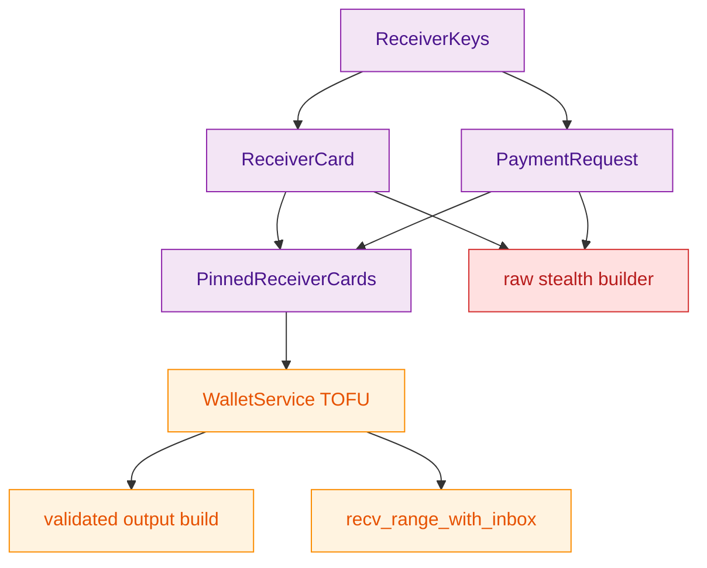
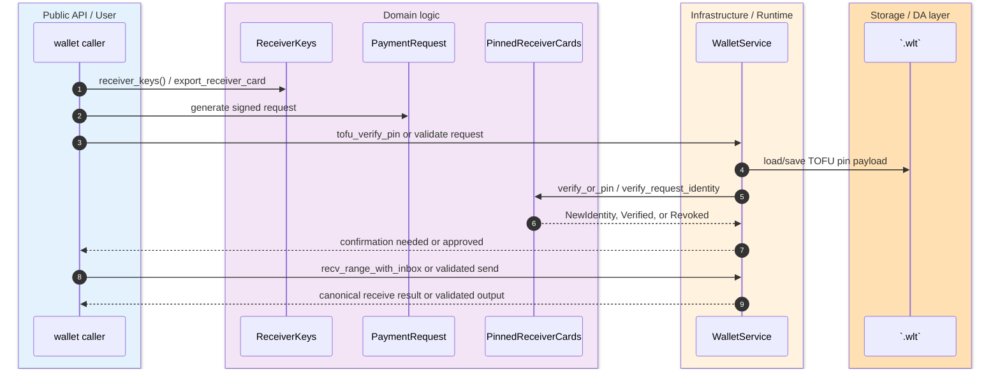
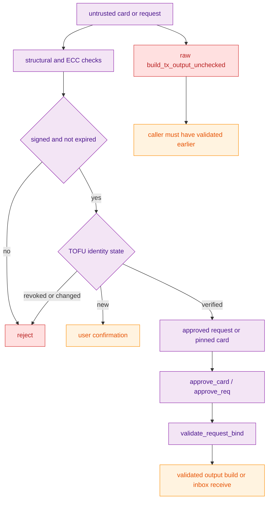

> [!WARNING]
> `ReceiverCard` and `PaymentRequest` are not interchangeable proofs. The card authenticates a routing surface, `validate_all(...)` is the wallet-local approval gate for requests, and the raw stealth builder does not perform either decision internally. `(crates/z00z_wallets/src/receiver/receiver_card.rs:104)` `(crates/z00z_wallets/src/receiver/request.rs:94)` `(crates/z00z_wallets/src/stealth/output.rs:969)`

The live receiver/request lane is already deeper than a simple QR payload story. Wallet code derives canonical live receiver keys for the active wallet, exports signed `ReceiverCard` values, optionally generates signed `PaymentRequest` payloads, persists TOFU identity pins inside `.wlt`, and only then lets validated send or receive flows re-enter canonical stealth-output or scan lanes. The important boundary is that request validation is wallet-local security policy, while raw output building is only a lower-level construction seam. `(crates/z00z_wallets/src/services/wallet_actions_receiver.rs:7)` `(crates/z00z_wallets/src/services/wallet_actions_receiver.rs:81)` `(crates/z00z_wallets/src/services/wallet_actions_tofu.rs:64)` `(crates/z00z_wallets/src/services/wallet_actions_receive.rs:642)`

## 🎯 Overview

| Surface | Status | Responsibility | Source |
|---|---|---|---|
| Receiver-key derivation | `live` | Derive canonical live receiver keys for the active wallet; lower-level receiver bundles still support path-scoped derivation. | `(crates/z00z_wallets/src/services/wallet_actions_receiver.rs:7)` `(crates/z00z_wallets/src/services/wallet_actions_receiver.rs:81)` `(crates/z00z_wallets/src/key/receiver_keys_bundle.rs:34)` |
| `ReceiverCard` export | `live` | Publish a signed route descriptor for incoming stealth payments. | `(crates/z00z_wallets/src/key/receiver_keys_bundle.rs:93)` `(crates/z00z_wallets/src/receiver/receiver_card.rs:108)` |
| `PaymentRequest::validate_all(...)` | `live` | Enforce chain, expiry, signature, and TOFU identity checks before request use. | `(crates/z00z_wallets/src/receiver/request.rs:94)` |
| TOFU persistence | `live` | Persist receiver-card and request identity trust state inside wallet-local storage. | `(crates/z00z_wallets/src/receiver/receiver_card_trust.rs:96)` `(crates/z00z_wallets/src/services/wallet_actions_tofu.rs:64)` |
| `recv_range_with_inbox(...)` | `live` | Validate request-bound inbox metadata and re-enter the authoritative receive lane. | `(crates/z00z_wallets/src/services/wallet_actions_receive.rs:642)` |
| Raw stealth builder | `adapter-only` | Construct outputs only after the caller already performed validation. | `(crates/z00z_wallets/src/stealth/output.rs:973)` |

## 🧭 Architecture

<!-- Sources: crates/z00z_wallets/src/key/receiver_keys_bundle.rs:17, crates/z00z_wallets/src/receiver/receiver_card.rs:108, crates/z00z_wallets/src/receiver/request.rs:94, crates/z00z_wallets/src/services/wallet_actions_tofu.rs:64, crates/z00z_wallets/src/services/wallet_actions_receive.rs:642, crates/z00z_wallets/src/stealth/output.rs:973 -->

| Component | Why it exists | Notes | Source |
|---|---|---|---|
| `ReceiverKeys::from_receiver_secret...` | Builds the full route bundle from one receiver secret. | Wallet path scoping is supported for BIP-44 partitioning. | `(crates/z00z_wallets/src/key/receiver_keys_bundle.rs:17)` `(crates/z00z_wallets/src/key/receiver_keys_bundle.rs:34)` |
| `ReceiverCard` | Signed routing surface for payers. | Explicitly does not prove final spend authority by itself. | `(crates/z00z_wallets/src/receiver/receiver_card.rs:104)` `(crates/z00z_wallets/src/receiver/receiver_card.rs:108)` |
| `PaymentRequest` | Signed request with chain, expiry, amount, and metadata binding. | Approval outcome can be `Approved`, `RequiresUserConfirmation`, or `IdentityMismatch`. | `(crates/z00z_wallets/src/receiver/request.rs:94)` `(crates/z00z_wallets/tests/test_payment_request.rs:149)` `(crates/z00z_wallets/tests/test_payment_request.rs:174)` |
| `PinnedReceiverCards` | Wallet-local TOFU memory of owner and identity keys. | New request identity creates a tentative pin before trust promotion. | `(crates/z00z_wallets/src/receiver/receiver_card_trust.rs:83)` `(crates/z00z_wallets/src/receiver/receiver_card_trust.rs:118)` |
| `wallet_actions_tofu` | Makes TOFU state durable. | Load/save/verify/confirm/revoke are persisted through `.wlt` session access. | `(crates/z00z_wallets/src/services/wallet_actions_tofu.rs:64)` `(crates/z00z_wallets/src/services/wallet_actions_tofu.rs:126)` |
| validated builders | Keep request/card approval separate from output construction. | `approve_card`, `approve_req`, and `validate_request_bind` form the accepted flow. | `(crates/z00z_wallets/src/stealth/output_build.rs:97)` `(crates/z00z_wallets/src/stealth/output_build.rs:128)` `(crates/z00z_wallets/src/stealth/output_build.rs:381)` |

## 📦 Components

| Flow stage | Live contract | Failure mode | Source |
|---|---|---|---|
| Derive receiver material | `WalletService::receiver_keys()` materializes the canonical live `ReceiverKeys` bundle for the active wallet. | A different wallet id or seed yields a different derived live receiver secret before the bundle is built. | `(crates/z00z_wallets/src/services/wallet_actions_receiver.rs:7)` `(crates/z00z_wallets/src/services/wallet_actions_receiver.rs:47)` `(crates/z00z_wallets/src/services/wallet_actions_receiver.rs:81)` |
| Export card | `export_receiver_card()` signs current route material. | Invalid ECC points, mismatched identity key, or expiry reject the card. | `(crates/z00z_wallets/src/key/receiver_keys_bundle.rs:93)` `(crates/z00z_wallets/src/receiver/receiver_card.rs:218)` `(crates/z00z_wallets/src/receiver/receiver_card.rs:244)` |
| Approve request | `validate_all(...)` applies wallet-local policy. | Wrong chain, expired request, bad signature, or revoked pin fail closed. | `(crates/z00z_wallets/src/receiver/request.rs:94)` `(crates/z00z_wallets/tests/test_payment_request.rs:302)` |
| Persist trust | `tofu_verify_pin(...)`, `tofu_confirm(...)`, `tofu_revoke(...)`. | `wasm32` rejects these persistence paths. | `(crates/z00z_wallets/src/services/wallet_actions_tofu.rs:126)` `(crates/z00z_wallets/src/services/wallet_actions_tofu.rs:164)` `(crates/z00z_wallets/src/services/wallet_actions_tofu.rs:218)` |
| Receive by request inbox | `recv_range_with_inbox(...)` records request validation and reorders approved requests. | If none are approved, the wallet returns the first reject-derived error. | `(crates/z00z_wallets/src/services/wallet_actions_receive.rs:642)` |
| Build stealth output | Validated wrappers approve pins and request binding before construction. | Raw `build_tx_output_unchecked(...)` must not be treated as approval authority. | `(crates/z00z_wallets/src/stealth/output.rs:969)` `(crates/z00z_wallets/src/stealth/output.rs:1102)` |

## 🔄 Data Flow

<!-- Sources: crates/z00z_wallets/src/key/receiver_keys_bundle.rs:17, crates/z00z_wallets/src/receiver/request.rs:94, crates/z00z_wallets/src/receiver/receiver_card_trust.rs:96, crates/z00z_wallets/src/services/wallet_actions_tofu.rs:64, crates/z00z_wallets/src/services/wallet_actions_receive.rs:642 -->

Tests make the approval contract concrete. A first-seen request produces `RequiresUserConfirmation`, a repeated matching identity becomes `Approved`, a different identity behind the same owner handle becomes `IdentityMismatch`, and a revoked pin fails with `PinRevoked`. Those transitions are the clearest statement of intended wallet semantics. `(crates/z00z_wallets/tests/test_payment_request.rs:143)` `(crates/z00z_wallets/tests/test_payment_request.rs:149)` `(crates/z00z_wallets/tests/test_payment_request.rs:174)` `(crates/z00z_wallets/tests/test_payment_request.rs:302)`

## ⚙️ Implementation

<!-- Sources: crates/z00z_wallets/src/receiver/request.rs:94, crates/z00z_wallets/src/receiver/receiver_card_trust.rs:96, crates/z00z_wallets/src/stealth/output_build.rs:97, crates/z00z_wallets/src/stealth/output_build.rs:128, crates/z00z_wallets/src/stealth/output_build.rs:381, crates/z00z_wallets/src/stealth/output.rs:973 -->

The accepted send path is intentionally stricter than the raw constructor surface. `approve_card(...)` requires a pinned receiver card with matching view and identity keys, `approve_req(...)` clones pins and requires `ValidationOutcome::Approved`, and `validate_request_bind(...)` makes sure the request and card describe the same route and amount before request-bound tag behavior is allowed. `(crates/z00z_wallets/src/stealth/output_build.rs:97)` `(crates/z00z_wallets/src/stealth/output_build.rs:128)` `(crates/z00z_wallets/src/stealth/output_build.rs:381)`

> [!CAUTION]
> The durable TOFU and inbox receive flow is native-only today. `load_tofu`, `save_tofu`, `tofu_verify_pin`, and `recv_range_with_inbox` all explicitly reject `wasm32`, so browser surfaces must not be documented as equivalent to the native wallet trust model. `(crates/z00z_wallets/src/services/wallet_actions_tofu.rs:64)` `(crates/z00z_wallets/src/services/wallet_actions_tofu.rs:96)` `(crates/z00z_wallets/src/services/wallet_actions_receive.rs:642)`

## 📖 References

- `(crates/z00z_wallets/README.md:183)`
- `(crates/z00z_wallets/src/services/wallet_actions_receiver.rs:7)`
- `(crates/z00z_wallets/src/services/wallet_actions_receiver.rs:81)`
- `(crates/z00z_wallets/src/key/receiver_keys_bundle.rs:17)`
- `(crates/z00z_wallets/src/receiver/receiver_card.rs:104)`
- `(crates/z00z_wallets/src/receiver/request.rs:94)`
- `(crates/z00z_wallets/src/receiver/receiver_card_trust.rs:83)`
- `(crates/z00z_wallets/src/services/wallet_actions_tofu.rs:64)`
- `(crates/z00z_wallets/src/services/wallet_actions_receive.rs:642)`
- `(crates/z00z_wallets/src/stealth/output.rs:969)`
- `(crates/z00z_wallets/src/stealth/output_build.rs:97)`
- `(crates/z00z_wallets/tests/test_payment_request.rs:149)`

## 🔗 Related Pages

| Page | Relationship |
|---|---|
| [Wallet Session Locks](./wallet-session-locks.md) | Explains the session-bearing native wallet context that TOFU persistence and sensitive receive flows rely on. |
| [Wallet WLT Restore](./wallet-wlt-restore.md) | Shows where TOFU pins and other wallet-local receiver state are carried through export and restore. |
| [Wallet Object Packages](./wallet-object-packages.md) | Separates typed post-genesis object actions from the receiver/payment-request stealth route lane. |
| [Wallet Architecture](./wallet-architecture.md) | Places receiver, key, service, and RPC surfaces in the broader wallet crate map. |
