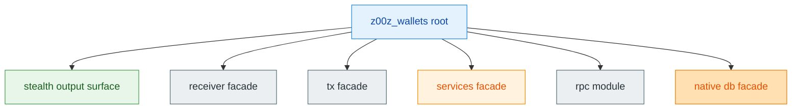
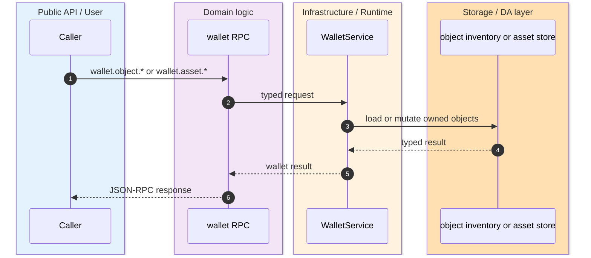
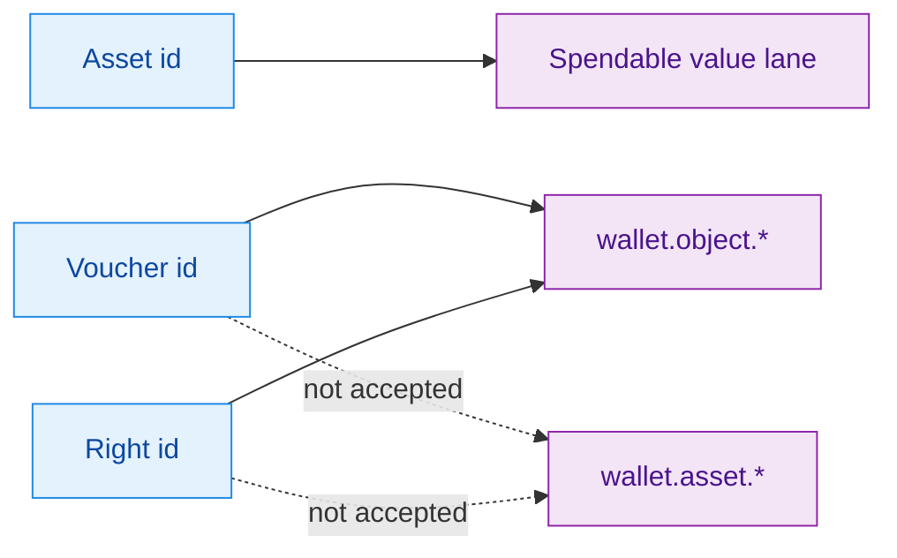

The wallet crate is not an asset-only balance engine anymore. Its documented public model is a typed object inventory in which assets remain spendable cash, vouchers are conditional claims, and rights are authority inventory with zero spendable value. `crates/z00z_wallets/README.md:11-37`

## 🎯 At A Glance

| Component | Responsibility | Key file | Source |
|---|---|---|---|
| Wallet root facade | Re-exports stealth, wallet errors, services, receiver, and tx surfaces. | `crates/z00z_wallets/src/lib.rs` | `crates/z00z_wallets/src/lib.rs:97-156` |
| Services facade | Publishes orchestration boundaries like `WalletService` and `AppService`. | `crates/z00z_wallets/src/services/mod.rs` | `crates/z00z_wallets/src/services/mod.rs:1-24` |
| RPC surface | Groups method modules and registration helpers for wallet/app dispatchers. | `crates/z00z_wallets/src/rpc/mod.rs` | `crates/z00z_wallets/src/rpc/mod.rs:24-91` |
| Transport seam | Supplies transport-only dispatch and local in-process testing helpers. | `crates/z00z_networks/rpc/src/lib.rs` | `crates/z00z_networks/rpc/src/lib.rs:4-19` |

## 🧭 Wallet Surface

<!-- Sources: crates/z00z_wallets/src/lib.rs:97-156, crates/z00z_wallets/README.md:171-183 -->

<!-- Sources: crates/z00z_wallets/README.md:23-37, crates/z00z_wallets/src/rpc/mod.rs:43-91, crates/z00z_wallets/src/services/mod.rs:16-24 -->

<!-- Sources: crates/z00z_wallets/README.md:16-25, crates/z00z_wallets/README.md:38-44 -->

## 📦 Typed Object Model In The Wallet

| Object family | Wallet meaning | Allowed public lane | Source |
|---|---|---|---|
| Assets | Spendable value. | `wallet.asset.*` and `wallet.object.*` projections. | `crates/z00z_wallets/README.md:16-24` |
| Vouchers | Conditional claims with explicit lifecycle and redemption paths. | `wallet.object.*` only. | `crates/z00z_wallets/README.md:16-24` |
| Rights | Authority inventory contributing zero to spendable balance. | `wallet.object.*` only. | `crates/z00z_wallets/README.md:18-25` |
| Unknown-policy objects | Durable quarantine until policy descriptors are accepted. | Quarantine, not spendable balance. | `crates/z00z_wallets/README.md:20-21` `crates/z00z_wallets/README.md:40-44` |

## 🔑 Stable Facades And Internal Detail

| Preferred entrypoint | Why it is preferred | Source |
|---|---|---|
| `z00z_wallets::db::{WltSession, ScanStatePayload}` | Stable wallet-store boundary types. | `crates/z00z_wallets/README.md:171-177` |
| `z00z_wallets::services::{RateLimitPrecheck, WalletService}` | Canonical orchestration layer. | `crates/z00z_wallets/README.md:173-175` `crates/z00z_wallets/src/services/mod.rs:16-24` |
| `z00z_wallets::receiver::*` | Receiver-card and payment-request flows. | `crates/z00z_wallets/README.md:175-177` |
| `z00z_wallets::tx::{ClaimTxVerifier, TxVerifier}` | Transaction verification entrypoints. | `crates/z00z_wallets/README.md:177-181` |

## 📖 References

- `crates/z00z_wallets/README.md:11-44`
- `crates/z00z_wallets/src/lib.rs:97-156`
- `crates/z00z_wallets/src/rpc/mod.rs:24-91`
- `crates/z00z_wallets/src/services/mod.rs:1-24`
- `crates/z00z_networks/rpc/src/lib.rs:4-19`

## Related Pages

| Page | Relationship |
|---|---|
| [Object Model And Genesis](../03-core-protocol/object-model-and-genesis.md) | Defines the object families the wallet projects. |
| [Settlement Runtime And Rollup](../05-storage-runtime/settlement-runtime-and-rollup.md) | Shows where wallet outputs land once committed. |
| [Networking And Telemetry](../07-networking-and-observability/networking-and-telemetry.md) | Expands the transport seam the wallet composes. |
