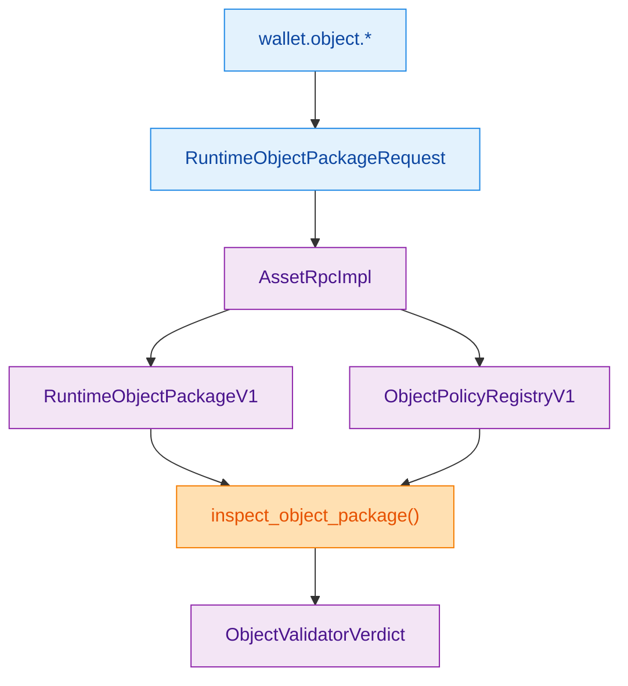
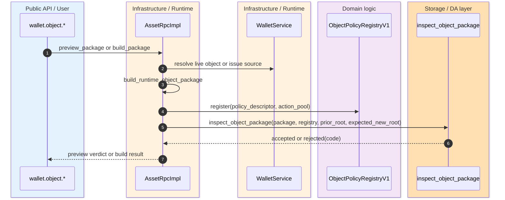
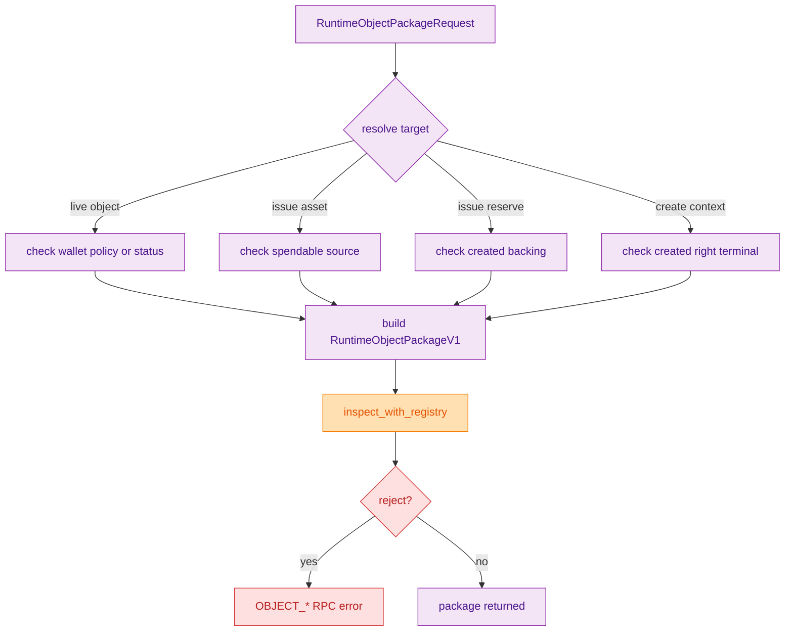

> [!IMPORTANT]
> Typed object work is not genesis-only. The live post-genesis wallet path is `wallet.object.*`, which constructs `RuntimeObjectPackageV1` requests and delegates final admission truth to the storage settlement contract. `(crates/z00z_wallets/src/rpc/object_rpc.rs:19)` `(crates/z00z_wallets/src/rpc/object_rpc_impl.rs:750)` `(crates/z00z_storage/src/settlement/object_package_contract.rs:49)`

This split exists so the wallet can help users target the correct object, action, and policy lane without becoming the semantic authority for vouchers or rights. Wallet RPC resolves the target object or issue source, preflights local availability and root expectations, constructs `RuntimeObjectPackageV1`, and then asks storage to run the ordered admission pipeline. That keeps wallet UX and storage truth coupled, but not conflated. `(crates/z00z_wallets/src/rpc/object_rpc_impl.rs:621)` `(crates/z00z_wallets/src/rpc/object_rpc_impl.rs:687)` `(crates/z00z_storage/src/settlement/object_package_contract.rs:215)`

## 🎯 Overview

| Surface | Status | Responsibility | Source |
|---|---|---|---|
| `wallet.object.*` trait | `live` | Public wallet-visible typed-object namespace for list, preview, build, and lifecycle wrappers. | `(crates/z00z_wallets/src/rpc/object_rpc.rs:19)` |
| `RuntimeObjectPackageRequest` | `live` | Caller-supplied shape for target selection, policy, action pool, witnesses, rights, and delta set. | `(crates/z00z_wallets/src/rpc/object_types.rs:77)` |
| `preview_object_package_impl(...)` | `live` | Wallet-side preflight and verdict projection. | `(crates/z00z_wallets/src/rpc/object_rpc_impl.rs:750)` |
| `build_object_package_impl(...)` | `live` | Rejects non-accepted previews and returns a concrete package. | `(crates/z00z_wallets/src/rpc/object_rpc_impl.rs:834)` |
| `inspect_object_package(...)` | `live` | Storage-owned ordered admission contract for final typed-object truth. | `(crates/z00z_storage/src/settlement/object_package_contract.rs:215)` |

## 🧭 Architecture

<!-- Sources: crates/z00z_wallets/src/rpc/object_rpc.rs:19, crates/z00z_wallets/src/rpc/object_types.rs:77, crates/z00z_wallets/src/rpc/object_rpc_impl.rs:477, crates/z00z_storage/src/settlement/object_package_contract.rs:132, crates/z00z_storage/src/settlement/object_package_contract.rs:215 -->

| Component | Why it exists | Notes | Source |
|---|---|---|---|
| `resolve_package_target(...)` | Prevents ambiguous request targeting. | Exactly one of live object, issue asset, reserve, or create context may be selected. | `(crates/z00z_wallets/src/rpc/object_rpc_impl.rs:621)` |
| `build_runtime_object_package(...)` | Computes storage-facing package ids and copies witness state. | Derives policy descriptor hash, action pool id, and selected action id from the request. | `(crates/z00z_wallets/src/rpc/object_rpc_impl.rs:687)` |
| `inspect_with_registry(...)` | Bridges wallet request descriptors into storage admission. | Registers the request policy and action pool before inspection. | `(crates/z00z_wallets/src/rpc/object_rpc_impl.rs:477)` |
| `RuntimeObjectPackageV1` | Stable typed package contract. | Carries family, action, rights, witness bundle, delta set, fee support ref, and roots. | `(crates/z00z_storage/src/settlement/object_package_contract.rs:49)` |
| `ObjectRejectCode` | Stable reject taxonomy. | Lets the wallet map storage failures to `OBJECT_*` RPC errors. | `(crates/z00z_storage/src/settlement/object_package_contract.rs:71)` `(crates/z00z_wallets/src/rpc/object_rpc_impl.rs:156)` |

## 📦 Components

| Target kind | When it is used | Wallet check before storage | Source |
|---|---|---|---|
| Live voucher or right | Accept, reject, redeem, refund, transfer, delegate, consume, revoke, challenge. | Load by stable key, ensure policy availability, root match, and lifecycle-allowed action. | `(crates/z00z_wallets/src/rpc/object_rpc_impl.rs:605)` `(crates/z00z_wallets/src/rpc/object_rpc_impl.rs:767)` |
| Issue from owned asset | Voucher issue using an asset as the source. | Source asset must be spendable, unspent, unfrozen, not manual-review, and not quarantined. | `(crates/z00z_wallets/src/rpc/object_rpc_impl.rs:336)` `(crates/z00z_wallets/src/rpc/object_rpc_impl.rs:786)` |
| Issue from reserve | Voucher issue bound to reserve commitment or genesis reserve. | Created voucher backing must match the requested reserve. | `(crates/z00z_wallets/src/rpc/object_rpc_impl.rs:344)` `(crates/z00z_wallets/src/rpc/object_rpc_impl.rs:799)` |
| Right create context | Create a new right terminal id. | Created right delta must match the requested terminal id. | `(crates/z00z_wallets/src/rpc/object_rpc_impl.rs:369)` `(crates/z00z_wallets/src/rpc/object_rpc_impl.rs:814)` |
| Inventory view | List typed wallet objects for users before package building. | Requires a live session-backed wallet inventory query. | `(crates/z00z_wallets/src/services/wallet_store_support.rs:171)` `(crates/z00z_wallets/src/rpc/object_rpc_impl.rs:502)` |

## 🔄 Data Flow

<!-- Sources: crates/z00z_wallets/src/rpc/object_rpc_impl.rs:605, crates/z00z_wallets/src/rpc/object_rpc_impl.rs:687, crates/z00z_wallets/src/rpc/object_rpc_impl.rs:750, crates/z00z_wallets/src/rpc/object_rpc_impl.rs:477, crates/z00z_storage/src/settlement/object_package_contract.rs:215 -->

## ⚙️ Implementation

<!-- Sources: crates/z00z_wallets/src/rpc/object_rpc_impl.rs:621, crates/z00z_wallets/src/rpc/object_rpc_impl.rs:687, crates/z00z_wallets/src/rpc/object_rpc_impl.rs:750, crates/z00z_wallets/src/rpc/object_rpc_impl.rs:834 -->

The wallet adds one real preflight layer before storage truth: it rejects unavailable policy objects, manual-review objects, stale confirmation roots, wrong lifecycle states, ambiguous targets, and missing issue sources before even asking storage. But it does not invent the final acceptance language. `inspect_object_package(...)` still owns ordered checks for roots, fee boundary, family rules, rights, replay, witness requirements, and delta-set contract validity. `(crates/z00z_wallets/src/rpc/object_rpc_impl.rs:771)` `(crates/z00z_wallets/src/rpc/object_rpc_impl.rs:780)` `(crates/z00z_storage/src/settlement/object_package_contract.rs:224)` `(crates/z00z_storage/src/settlement/object_package_contract.rs:282)` `(crates/z00z_storage/src/settlement/object_package_contract.rs:300)`

> [!NOTE]
> Assets, vouchers, and rights all appear in wallet inventory, but `wallet.object.*` is the canonical post-genesis typed-object action lane. `wallet.asset.*` remains the cash-only projection and must not absorb voucher or right semantics. `(crates/z00z_wallets/src/rpc/object_rpc.rs:22)` `(crates/z00z_wallets/README.md:11)`

## 📖 References

- `(crates/z00z_wallets/src/rpc/object_rpc.rs:1)`
- `(crates/z00z_wallets/src/rpc/object_types.rs:1)`
- `(crates/z00z_wallets/src/rpc/object_rpc_impl.rs:156)`
- `(crates/z00z_wallets/src/services/wallet_store_support.rs:171)`
- `(crates/z00z_storage/src/settlement/object_package_contract.rs:1)`
- `(crates/z00z_storage/src/settlement/mod.rs:32)`
- `(crates/z00z_runtime/validators/README.md:13)`

## 🔗 Related Pages

| Page | Relationship |
|---|---|
| [Object Package Rejects](../05-storage-runtime/object-package-rejects.md) | Explains the storage-owned reject taxonomy this wallet page builds against. |
| [Wallet Object Quarantine](./wallet-object-quarantine.md) | Covers what happens to typed objects that exist locally but are not yet policy-available. |
| [Wallet Architecture](./wallet-architecture.md) | Places typed object RPC alongside the broader wallet service and receiver facades. |
