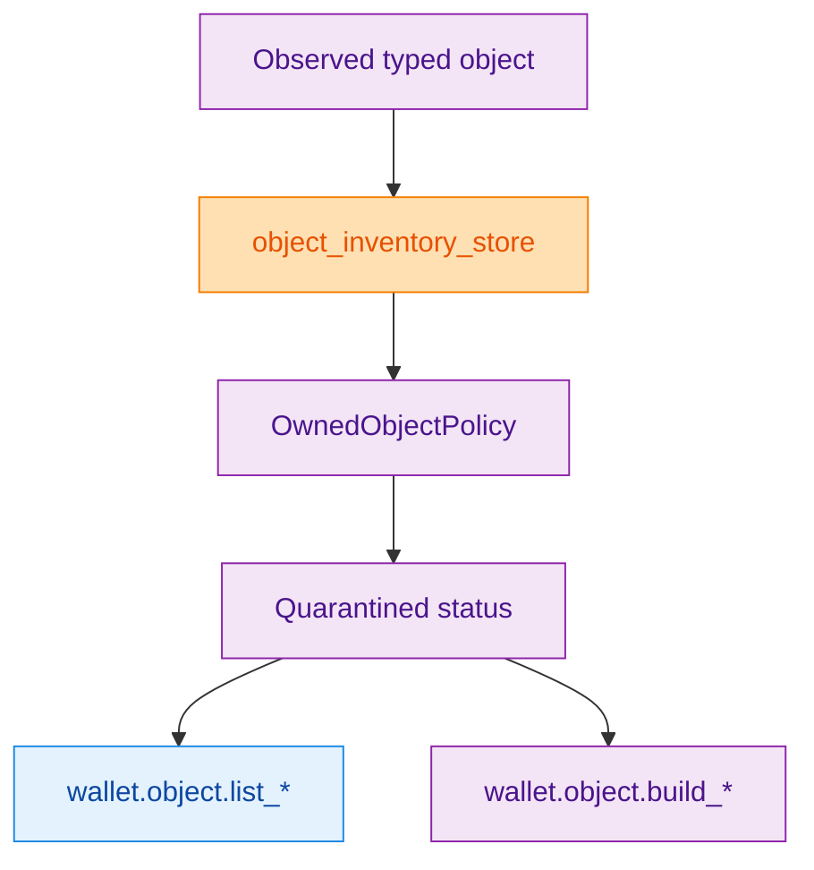
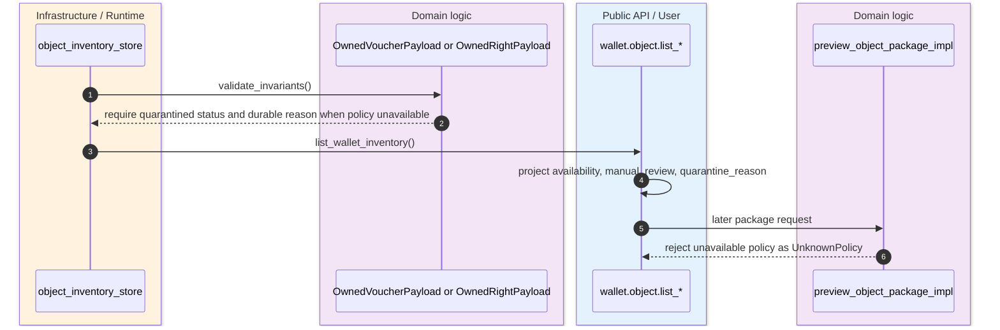
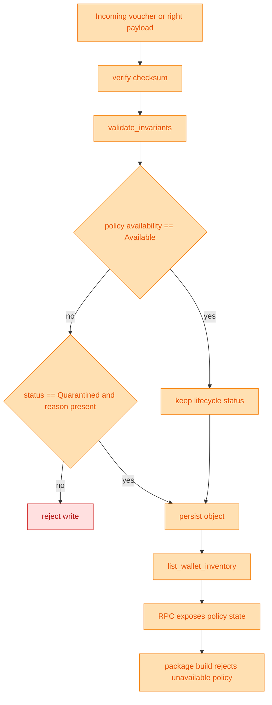

> [!WARNING]
> Quarantine is not an optional UI hint. The live wallet contract says unknown-policy typed objects remain durable across restart, restore, and projection, but they must not become spendable or policy-available until an explicit accepted policy verdict exists. `(crates/z00z_wallets/README.md:20)` `(crates/z00z_wallets/docs/WALLET-GUIDE.md:28)` `(crates/z00z_wallets/src/redb_store/tables.rs:881)`

This exists because the wallet must preserve what it observed without lying about what it can safely act on. If the wallet simply dropped unknown-policy vouchers or rights, it would lose durable evidence. If it treated them as spendable or actionable anyway, it would create semantic drift from the object-policy contract. Quarantine is the middle state: persist the object, keep a durable reason, and project it as non-authoritative for spend or lifecycle actions. `(crates/z00z_wallets/src/redb_store/tables.rs:889)` `(crates/z00z_wallets/src/rpc/object_rpc_impl.rs:771)`

## 🎯 Overview

| Surface | Status | Responsibility | Source |
|---|---|---|---|
| README and wallet guide contract | `live` | Declares durable quarantine as part of the typed-object wallet model. | `(crates/z00z_wallets/README.md:20)` `(crates/z00z_wallets/docs/WALLET-GUIDE.md:58)` |
| Owned voucher invariants | `live` | Rejects unavailable-policy vouchers unless they stay quarantined with a durable reason. | `(crates/z00z_wallets/src/redb_store/tables.rs:881)` |
| Owned right invariants | `live` | Rejects unavailable-policy rights unless they stay quarantined with a durable reason. | `(crates/z00z_wallets/src/redb_store/tables.rs:1020)` |
| Object inventory store | `live` | Persists, deduplicates, and lists assets, vouchers, and rights without dropping quarantined rows. | `(crates/z00z_wallets/src/redb_store/owned_objects.rs:175)` |
| RPC projection | `live` | Exposes availability, manual-review, and quarantine reason in public object records. | `(crates/z00z_wallets/src/rpc/object_types.rs:23)` `(crates/z00z_wallets/src/rpc/object_rpc_impl.rs:66)` |

## 🧭 Architecture

<!-- Sources: crates/z00z_wallets/src/redb_store/owned_objects.rs:175, crates/z00z_wallets/src/redb_store/tables.rs:881, crates/z00z_wallets/src/rpc/object_rpc_impl.rs:434, crates/z00z_wallets/src/rpc/object_types.rs:23 -->

| Component | Why it exists | Notes | Source |
|---|---|---|---|
| `validate_invariants()` on vouchers | Keeps policy availability and lifecycle aligned. | Unavailable policy implies `OwnedVoucherStatus::Quarantined`. | `(crates/z00z_wallets/src/redb_store/tables.rs:881)` |
| `validate_invariants()` on rights | Keeps policy availability and lifecycle aligned. | Unavailable policy implies `OwnedRightStatus::Quarantined`. | `(crates/z00z_wallets/src/redb_store/tables.rs:1020)` |
| `stable_object_key()` | Gives one durable identity key across inventory families. | Voucher/right stable key is the terminal id bytes. | `(crates/z00z_wallets/src/redb_store/tables.rs:1112)` `(crates/z00z_wallets/src/redb_store/tables.rs:1188)` |
| `validate_object_index_rows(...)` | Ensures stored index rows still match the owning object. | Protects inventory queries from index drift. | `(crates/z00z_wallets/src/redb_store/object_queries.rs:137)` |
| Policy projection DTO | Makes quarantine state visible to API consumers. | Carries `availability`, `manual_review`, and `quarantine_reason`. | `(crates/z00z_wallets/src/rpc/object_types.rs:23)` |

## 📦 Components

| Behavior | Asset | Voucher | Right | Source |
|---|---|---|---|---|
| Durable persistence | Yes | Yes | Yes | `(crates/z00z_wallets/src/redb_store/owned_objects.rs:288)` |
| Can be listed in inventory | Yes | Yes | Yes | `(crates/z00z_wallets/src/redb_store/owned_objects.rs:175)` |
| Requires policy projection | Partial | Yes | Yes | `(crates/z00z_wallets/src/rpc/object_rpc_impl.rs:66)` |
| Can be quarantined for unavailable policy | Policy freeze/quarantine reason possible | Mandatory if policy unavailable | Mandatory if policy unavailable | `(crates/z00z_wallets/src/rpc/object_rpc_impl.rs:91)` `(crates/z00z_wallets/src/redb_store/tables.rs:881)` `(crates/z00z_wallets/src/redb_store/tables.rs:1020)` |
| Can be built into lifecycle package while unavailable | No | No | No | `(crates/z00z_wallets/src/rpc/object_rpc_impl.rs:771)` |

## 🔄 Data Flow

<!-- Sources: crates/z00z_wallets/src/redb_store/tables.rs:881, crates/z00z_wallets/src/redb_store/owned_objects.rs:175, crates/z00z_wallets/src/rpc/object_rpc_impl.rs:66, crates/z00z_wallets/src/rpc/object_rpc_impl.rs:771 -->

## ⚙️ Implementation

<!-- Sources: crates/z00z_wallets/src/redb_store/owned_objects.rs:288, crates/z00z_wallets/src/redb_store/tables.rs:881, crates/z00z_wallets/src/redb_store/tables.rs:1020, crates/z00z_wallets/src/rpc/object_rpc_impl.rs:771 -->

`list_wallet_inventory(...)` does not carve quarantined objects out of the durable inventory. It collects asset rows plus non-asset rows, sorts by inventory key, and deduplicates by family plus stable object key. That is the persistence side of quarantine: the wallet keeps the object visible and stable, then the RPC and action layers decide it is not actionable yet. `(crates/z00z_wallets/src/redb_store/owned_objects.rs:186)` `(crates/z00z_wallets/src/redb_store/owned_objects.rs:214)`

The test suite locks this in at two levels. One contract test requires the wallet guide text to keep the marker "Unknown-policy objects remain in durable quarantine", and another storage test rejects an unavailable-policy right without quarantine. That is strong evidence this is not accidental implementation residue. `(crates/z00z_wallets/src/redb_store/test_store_suite.rs:1947)` `(crates/z00z_wallets/src/redb_store/test_store_suite.rs:4526)`

> [!TIP]
> The wallet exposes quarantine through object records instead of silently hiding the row. That gives integrators a durable "known but unusable" state they can present honestly in UI or automation. `(crates/z00z_wallets/src/rpc/object_rpc_impl.rs:66)` `(crates/z00z_wallets/src/rpc/object_types.rs:55)`

## 📖 References

- `(crates/z00z_wallets/README.md:11)`
- `(crates/z00z_wallets/docs/WALLET-GUIDE.md:28)`
- `(crates/z00z_wallets/src/redb_store/owned_objects.rs:1)`
- `(crates/z00z_wallets/src/redb_store/object_queries.rs:20)`
- `(crates/z00z_wallets/src/redb_store/tables.rs:881)`
- `(crates/z00z_wallets/src/rpc/object_rpc_impl.rs:66)`
- `(crates/z00z_wallets/src/rpc/object_types.rs:23)`
- `(crates/z00z_wallets/src/redb_store/test_store_suite.rs:1947)`

## 🔗 Related Pages

| Page | Relationship |
|---|---|
| [Wallet Object Packages](./wallet-object-packages.md) | Shows how package building later rejects quarantined objects instead of turning them into live actions. |
| [Wallet Architecture](./wallet-architecture.md) | Places quarantine inside the broader typed-object wallet model. |
| [Object Package Rejects](../05-storage-runtime/object-package-rejects.md) | Explains the storage-side reject taxonomy that quarantine helps prevent users from hitting blindly. |
