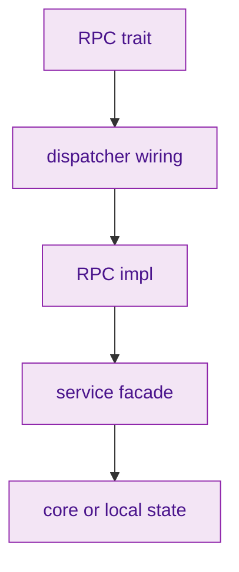
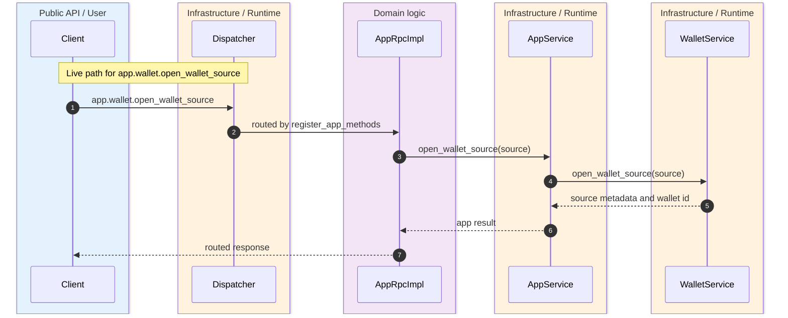
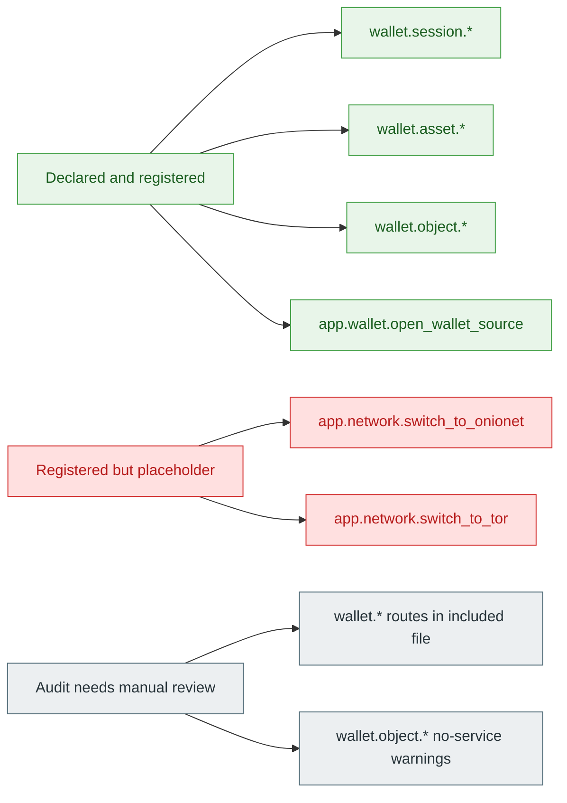

> [!WARNING]
> The wallet RPC surface is not one uniform quality class. Some methods are registered and service-backed, some are registered but intentionally local or placeholder, and some object methods run substantial logic directly in `AssetRpcImpl`. The earlier `app.wallet.open_wallet_source` dispatcher gap is now closed, so current review should focus on truthful runtime ownership and audit coverage rather than a missing route. `crates/z00z_wallets/src/rpc/app_rpc.rs:22-75` `crates/z00z_wallets/src/rpc/app_dispatcher_wiring.rs:52-119`

This page exists because **static audit output alone is not enough**. The repo already contains a dedicated audit script, but the current wiring surface uses split files and `include!`, while some object methods intentionally keep logic in the RPC implementation instead of forcing everything through a service facade. The only reliable way to reason about coverage is to read the trait surface, the dispatcher registrations, the RPC impls, and the service paths together. `crates/z00z_wallets/scripts/audit_rpc_method_wiring.py:238-303` `crates/z00z_wallets/src/rpc/wallet_dispatcher_wiring.rs:41-42`

## 🎯 At A Glance

| Surface | What it owns | Why it matters | Source |
|---|---|---|---|
| `AppRpc` trait | Declared `app.wallet.*` namespace, including `open_wallet_source`. | Defines intended public app RPC contract. | `crates/z00z_wallets/src/rpc/app_rpc.rs:22-75` |
| `AppRpcImpl` | App RPC implementation backed by `AppService`. | Confirms `open_wallet_source` exists at impl level. | `crates/z00z_wallets/src/rpc/app_rpc_impl.rs:17-103` |
| `register_app_methods` | Dispatcher registration for app-owned methods. | Includes `app.wallet.open_wallet_source` on the live route. | `crates/z00z_wallets/src/rpc/app_dispatcher_wiring.rs:52-119` |
| `wallet_dispatcher_wiring.rs` + `wallet_dispatcher_routes.rs` | Full wallet, asset, object, tx, backup, key registrations. | Split registration model means grep-only audit tools need extra care. | `crates/z00z_wallets/src/rpc/wallet_dispatcher_wiring.rs:41-42` `crates/z00z_wallets/src/rpc/wallet_dispatcher_routes.rs:1-507` |
| Audit script | Static triage over trait, wiring, RPC impl, and service/core calls. | Useful, but structurally vulnerable to split-file and `include!` patterns. | `crates/z00z_wallets/scripts/audit_rpc_method_wiring.py:238-303` `crates/z00z_wallets/scripts/audit_rpc_method_wiring.py:349-366` |
| `AssetRpcImpl` object surface | Object preview, build, and lifecycle logic. | A "no service call" result does not automatically mean a stub. | `crates/z00z_wallets/src/rpc/object_rpc_impl.rs:477-499` `crates/z00z_wallets/src/rpc/object_rpc_impl.rs:750-853` |
| `NetworkRpcImpl` | `app.network.*` implementation. | Explicit example of a wired but placeholder RPC lane. | `crates/z00z_wallets/src/rpc/network_rpc_impl.rs:1-43` |

## 🧭 Wiring Model

<!-- Sources: crates/z00z_wallets/src/rpc/app_rpc.rs:22-75, crates/z00z_wallets/src/rpc/app_dispatcher_wiring.rs:52-210, crates/z00z_wallets/src/rpc/wallet_dispatcher_routes.rs:1-507, crates/z00z_wallets/src/rpc/app_rpc_impl.rs:17-103, crates/z00z_wallets/src/rpc/wallet_rpc_impl.rs:21-207 -->

<!-- Sources: crates/z00z_wallets/src/rpc/app_rpc.rs:73-75, crates/z00z_wallets/src/rpc/app_rpc_impl.rs:98-103, crates/z00z_wallets/src/services/app_wallet_lifecycle.rs:12-21, crates/z00z_wallets/src/rpc/app_dispatcher_wiring.rs:52-119 -->

<!-- Sources: crates/z00z_wallets/src/rpc/app_dispatcher_wiring.rs:52-168, crates/z00z_wallets/src/rpc/wallet_dispatcher_routes.rs:1-507, crates/z00z_wallets/src/rpc/network_rpc_impl.rs:34-43 -->

## 📦 Gap Matrix

| Category | Example | Evidence | Interpretation |
|---|---|---|---|
| Declared and service-backed | `wallet.session.lock_wallet`, `wallet.session.unlock_wallet`, `wallet.session.show_seed_phrase` | Registered in wallet routes and implemented through `WalletService`. | Live RPC lane with service mediation. | `crates/z00z_wallets/src/rpc/wallet_dispatcher_routes.rs:2-39` `crates/z00z_wallets/src/rpc/wallet_rpc_impl.rs:33-207` |
| Declared and app-service-backed | `app.wallet.create_wallet`, `app.wallet.recover_from_seed`, `app.wallet.import_wallet` | Registered in `register_app_methods` and implemented through `AppService`. | Live app lifecycle lane. | `crates/z00z_wallets/src/rpc/app_dispatcher_wiring.rs:52-118` `crates/z00z_wallets/src/rpc/app_rpc_impl.rs:29-96` |
| Declared and app-service-backed | `app.wallet.open_wallet_source` | Registered in `register_app_methods` and implemented through `AppService` plus `WalletService`. | Live app discovery lane. | `crates/z00z_wallets/src/rpc/app_dispatcher_wiring.rs:86-93` `crates/z00z_wallets/src/rpc/app_rpc_impl.rs:98-103` `crates/z00z_wallets/src/services/app_wallet_lifecycle.rs:12-21` |
| Declared and RPC-owned logic | `wallet.object.preview_package`, `wallet.object.build_package`, voucher and right lifecycle wrappers | Registered in wallet routes, then executed through `AssetRpcImpl` helpers that build packages and run object inspection. | Real logic exists even without a separate service call. | `crates/z00z_wallets/src/rpc/wallet_dispatcher_routes.rs:300-408` `crates/z00z_wallets/src/rpc/object_rpc_impl.rs:477-499` `crates/z00z_wallets/src/rpc/object_rpc_impl.rs:750-1023` |
| Registered but placeholder semantics | `app.network.switch_to_onionet`, `app.network.switch_to_tor` | Registered and implemented, but return deterministic placeholder behavior via `AppService`. | Reachable test surface, not live overlay behavior. | `crates/z00z_wallets/src/rpc/app_dispatcher_wiring.rs:154-168` `crates/z00z_wallets/src/rpc/network_rpc_impl.rs:34-43` |
| Previously real gap, now closed | `app.wallet.open_wallet_source` | Trait, impl, app-service path, and dispatcher registration now converge on one live route. | Keep as a regression checkpoint, not as an open gap. | `crates/z00z_wallets/src/rpc/app_rpc.rs:73-75` `crates/z00z_wallets/src/rpc/app_rpc_impl.rs:98-103` `crates/z00z_wallets/src/rpc/app_dispatcher_wiring.rs:52-119` `crates/z00z_wallets/src/services/app_wallet_lifecycle.rs:12-21` |

## ⚙️ Why The Audit Script Overstates Some Gaps

`wallet_dispatcher_wiring.rs` pulls the real wallet, asset, object, key, backup, and tx registrations from `wallet_dispatcher_routes.rs` via `include!`. The static scanner, however, reads raw file text from the wiring files returned by `find_dispatcher_wiring_files()` and applies regex over those file bodies. It does not perform macro expansion before searching for `dispatcher.register_*` calls. `crates/z00z_wallets/src/rpc/wallet_dispatcher_wiring.rs:41-42` `crates/z00z_wallets/scripts/audit_rpc_method_wiring.py:238-303` `crates/z00z_wallets/scripts/audit_rpc_method_wiring.py:349-366`

> [!NOTE]
> The next conclusion is an inference from the code structure, not a direct script comment: because the scanner parses raw wiring files and the wallet routes live in an included file, the script has a structural reason to miss registered `wallet.*` methods unless it is taught to expand or read the included route file explicitly.

The same caution applies to "does not call a service" warnings for `wallet.object.*`. `AssetRpcImpl` already contains real object-inspection and package-build logic, including registry setup, verdict construction, preview checks, and lifecycle wrappers. A missing `WalletService` call is therefore **not sufficient evidence** that the method is a stub. `crates/z00z_wallets/src/rpc/object_rpc_impl.rs:477-499` `crates/z00z_wallets/src/rpc/object_rpc_impl.rs:750-1023`

## 🔑 What Is Trustworthy Today

| Signal | Trust level | Why | Source |
|---|---|---|---|
| Literal registration present in wiring files | High | Dispatcher handlers must keep explicit literal method strings for auditability. | `crates/z00z_wallets/src/rpc/dispatcher_handlers.rs:1-5` |
| Trait + impl + service path all exist | High | Confirms the business path exists even if dispatcher registration is missing. | `crates/z00z_wallets/src/rpc/app_rpc.rs:22-75` `crates/z00z_wallets/src/rpc/app_rpc_impl.rs:17-103` |
| "No service call" audit result | Medium | Reliable only when the RPC layer is expected to be a thin facade. | `crates/z00z_wallets/scripts/audit_rpc_method_wiring.py:326-346` |
| "Missing registration" audit result for split wallet routes | Low without manual confirmation | Split-file `include!` layout can hide true registrations from regex-only scans. | `crates/z00z_wallets/src/rpc/wallet_dispatcher_wiring.rs:41-42` `crates/z00z_wallets/src/rpc/wallet_dispatcher_routes.rs:1-507` |

## 📖 References

- `crates/z00z_wallets/src/rpc/app_rpc.rs:22-75`
- `crates/z00z_wallets/src/rpc/app_rpc_impl.rs:17-103`
- `crates/z00z_wallets/src/rpc/app_dispatcher_wiring.rs:52-210`
- `crates/z00z_wallets/src/rpc/wallet_dispatcher_wiring.rs:41-42`
- `crates/z00z_wallets/src/rpc/wallet_dispatcher_routes.rs:1-507`
- `crates/z00z_wallets/src/rpc/wallet_rpc_impl.rs:21-207`
- `crates/z00z_wallets/src/rpc/object_rpc_impl.rs:156-183`
- `crates/z00z_wallets/src/rpc/object_rpc_impl.rs:477-499`
- `crates/z00z_wallets/src/rpc/object_rpc_impl.rs:750-1023`
- `crates/z00z_wallets/src/rpc/network_rpc_impl.rs:1-43`
- `crates/z00z_wallets/src/rpc/dispatcher_handlers.rs:1-5`
- `crates/z00z_wallets/scripts/audit_rpc_method_wiring.py:238-303`
- `crates/z00z_wallets/scripts/audit_rpc_method_wiring.py:349-366`

## Related Pages

| Page | Relationship |
|---|---|
| [Wallet Architecture](./wallet-architecture.md) | Gives the broader wallet facades behind these RPC routes. |
| [Wallet Stub Surface](./wallet-stub-surface.md) | Explains why "stubbed" needs a finer-grained reading than one crate-level label. |
| [Object Package Rejects](../05-storage-runtime/object-package-rejects.md) | Expands the object validation logic used by `wallet.object.*` methods. |
