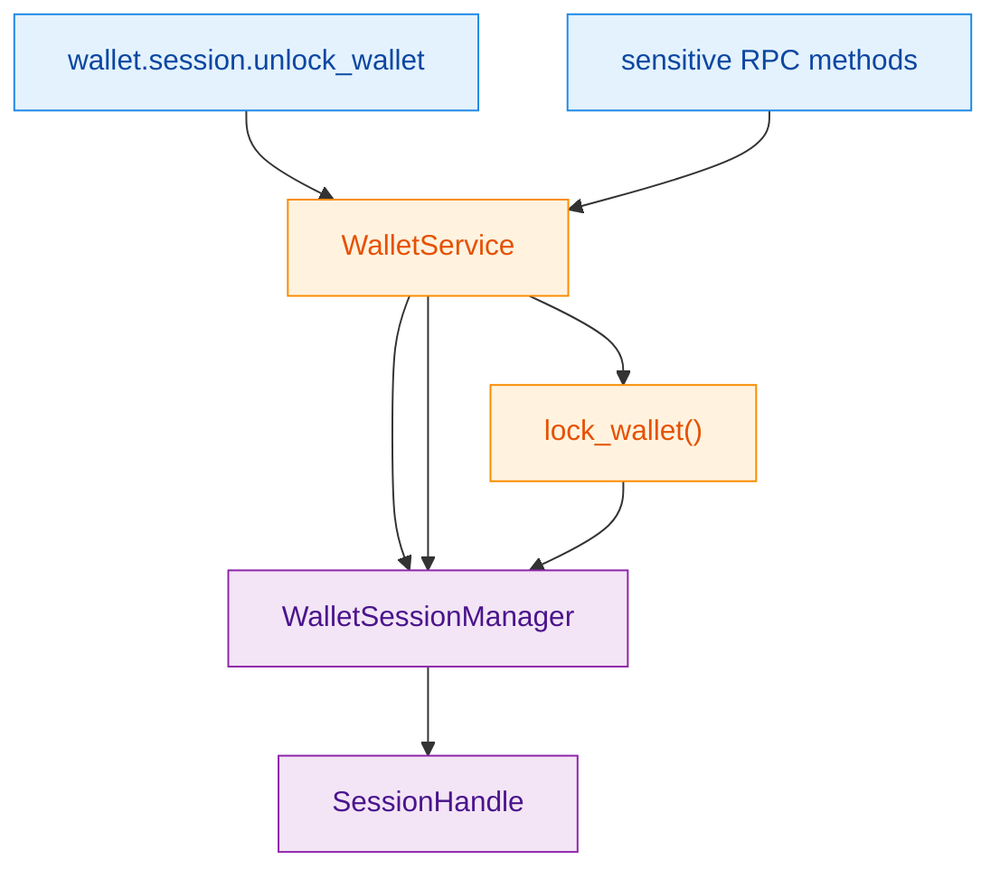
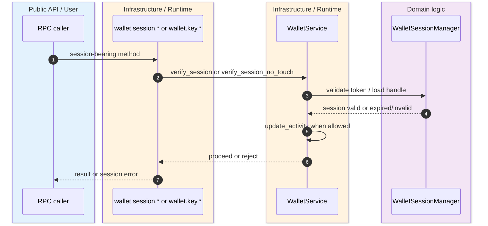
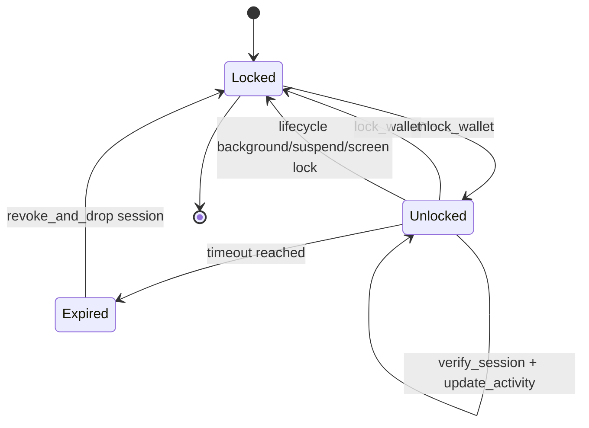

> [!WARNING]
> Wallet sessions here are intentionally process-local and native-only. The live contract says one in-memory owner of key-bearing state exists inside `WalletSessionManager`, and `wasm32` rejects the session path entirely. `(crates/z00z_wallets/src/services/wallet_session_manager.rs:89)` `(crates/z00z_wallets/src/services/wallet_session_runtime_limits.rs:192)` `(crates/z00z_wallets/src/services/wallet_store_restore.rs:43)`

The point of this design is not generic auth middleware. It is to stop sensitive wallet operations from reopening or duplicating key-bearing state ad hoc. Unlock or open creates one managed session per wallet id, the session manager validates tokens, sensitive RPC methods route through `verify_session(...)` or `verify_session_no_touch(...)`, and auto-lock tears the session down by dropping cached derivation state and the `.wlt` session handle. `(crates/z00z_wallets/src/services/wallet_service_core.rs:177)` `(crates/z00z_wallets/src/services/wallet_session_manager.rs:180)` `(crates/z00z_wallets/src/services/wallet_session_runtime.rs:199)`

## 🎯 Overview

| Surface | Status | Responsibility | Source |
|---|---|---|---|
| `WalletSessionManager` | `live` | Owns the only key-bearing session handles and validates session tokens. | `(crates/z00z_wallets/src/services/wallet_session_manager.rs:89)` |
| Sensitive session validation | `live` | `verify_session(...)` refreshes activity; `verify_session_no_touch(...)` checks tokens without mutating activity. | `(crates/z00z_wallets/src/services/wallet_session_runtime_limits.rs:188)` |
| Auto-lock runtime | `live` | Expires inactive unlocked wallets, drops sessions, and clears receiver derivation state. | `(crates/z00z_wallets/src/services/wallet_session_runtime.rs:74)` `(crates/z00z_wallets/src/services/wallet_session_runtime.rs:199)` |
| Rate-limit windows | `live` | Enforces per-wallet limits for unlock, show-seed, and rotate-master-key. | `(crates/z00z_wallets/src/services/wallet_session_runtime_limits.rs:6)` |
| Risk policy | `live` | Marks unlock as high risk, show-seed and rotate-master-key as critical. | `(crates/z00z_wallets/src/rpc/logging_policy.rs:5)` |

## 🧭 Architecture

<!-- Sources: crates/z00z_wallets/src/rpc/wallet_rpc.rs:23, crates/z00z_wallets/src/services/wallet_service_core.rs:177, crates/z00z_wallets/src/services/wallet_session_manager.rs:15, crates/z00z_wallets/src/services/wallet_session_runtime.rs:199 -->

| Component | Why it exists | Notes | Source |
|---|---|---|---|
| `SessionHandle` | Prevents direct public ownership of the raw `.wlt` session. | Wraps the underlying wallet session in a mutex-backed optional handle. | `(crates/z00z_wallets/src/services/wallet_session_manager.rs:15)` |
| `existing_token(...)` | Reuses the active session token if still valid. | Refreshes expiry and last activity. | `(crates/z00z_wallets/src/services/wallet_session_manager.rs:152)` |
| `verify(...)` | Full token check plus activity refresh. | Rejects empty token, mismatched token, and expired session. | `(crates/z00z_wallets/src/services/wallet_session_manager.rs:214)` |
| `validate(...)` | No-touch token check. | Used for prechecks where activity should not be refreshed yet. | `(crates/z00z_wallets/src/services/wallet_session_manager.rs:247)` |
| `get_session_handle_without_touch(...)` | Returns the live handle without touching activity. | Preserves stricter guard semantics for special flows. | `(crates/z00z_wallets/src/services/wallet_session_manager.rs:270)` |

## 📦 Components

| Sensitive lane | Guard | Additional policy | Source |
|---|---|---|---|
| `wallet.session.lock_wallet` | Session token required. | Manual lock also unregisters unlocked tracking and drops session. | `(crates/z00z_wallets/src/rpc/wallet_rpc.rs:24)` `(crates/z00z_wallets/src/services/wallet_session_runtime.rs:204)` |
| `wallet.session.show_seed_phrase` | Session token required. | 3 requests per minute per wallet. | `(crates/z00z_wallets/src/rpc/wallet_rpc.rs:33)` `(crates/z00z_wallets/src/services/wallet_session_runtime_limits.rs:63)` |
| `wallet.key.rotate_master_key` | Session token required. | One request per hour and precheck uses `verify_session_no_touch(...)`. | `(crates/z00z_wallets/src/rpc/key_rpc_server_admin.rs:4)` `(crates/z00z_wallets/src/services/wallet_session_runtime_limits.rs:135)` |
| Unlock flow | No prior session token. | 5 requests per minute plus failure-backoff tracking. | `(crates/z00z_wallets/src/rpc/wallet_rpc.rs:47)` `(crates/z00z_wallets/src/services/wallet_session_runtime_limits.rs:2)` |
| Lifecycle events | No RPC token. | Backgrounded, suspended, and screen-locked events lock all wallets. | `(crates/z00z_wallets/src/services/wallet_session_runtime.rs:225)` |

## 🔄 Data Flow

<!-- Sources: crates/z00z_wallets/src/services/wallet_session_runtime_limits.rs:188, crates/z00z_wallets/src/services/wallet_session_manager.rs:214, crates/z00z_wallets/src/rpc/key_rpc_server_admin.rs:12 -->

## ⚙️ Implementation

<!-- Sources: crates/z00z_wallets/src/services/wallet_session_runtime.rs:74, crates/z00z_wallets/src/services/wallet_session_runtime.rs:121, crates/z00z_wallets/src/services/wallet_session_runtime.rs:199, crates/z00z_wallets/src/services/wallet_session_manager.rs:234 -->

The rate-limit windows are intentionally ephemeral and per-process. `WalletService` stores unlock attempts, show-seed windows, rotate-master-key windows, key-derive windows, and backup-create limits in in-memory maps rather than durable policy state. That means they are real guards, but they are not cross-process or consensus-global policy. `(crates/z00z_wallets/src/services/wallet_service_core.rs:93)` `(crates/z00z_wallets/src/services/wallet_service_core.rs:100)` `(crates/z00z_wallets/src/services/wallet_service_core.rs:107)` `(crates/z00z_wallets/src/services/wallet_service_core.rs:119)`

`lock_wallet(...)` is the hard teardown path. It sets the wallet state back to `Locked`, removes in-memory receiver derivers, drops the managed session, and cleans up the lock file best-effort on native targets. That is why session expiry and lifecycle events both route back through the same lock path instead of trying to partially invalidate state. `(crates/z00z_wallets/src/services/wallet_session_runtime.rs:199)` `(crates/z00z_wallets/src/services/wallet_session_runtime.rs:238)`

> [!CAUTION]
> Because the session contract is `#[cfg(not(target_arch = "wasm32"))]`, browser builds do not get this live session model. The native and wasm surfaces are intentionally not equivalent here, and the live privileged RPC surface now routes through typed `VerifiedSession` / `VerifiedSessionNoTouch` capability objects instead of raw handler convention. `(crates/z00z_wallets/src/services/wallet_session_manager.rs:5)` `(crates/z00z_wallets/src/services/wallet_session_runtime_limits.rs:204)`

## 📖 References

- `(crates/z00z_wallets/src/services/wallet_service_core.rs:63)`
- `(crates/z00z_wallets/src/services/wallet_session_manager.rs:1)`
- `(crates/z00z_wallets/src/services/wallet_session_runtime_limits.rs:1)`
- `(crates/z00z_wallets/src/services/wallet_session_runtime.rs:1)`
- `(crates/z00z_wallets/src/rpc/wallet_rpc.rs:1)`
- `(crates/z00z_wallets/src/rpc/key_rpc_server_admin.rs:1)`
- `(crates/z00z_wallets/src/rpc/logging_policy.rs:1)`

## 🔗 Related Pages

| Page | Relationship |
|---|---|
| [Wallet WLT Restore](./wallet-wlt-restore.md) | Shows where active sessions are reused during export and where lock/teardown matters for persistence. |
| [Wallet Stub Surface](./wallet-stub-surface.md) | Distinguishes live session ownership from still-placeholder wallet service seams. |
| [Wallet RPC Gaps](./wallet-rpc-gaps.md) | Explains which sensitive RPC methods are actually wired into this session contract. |
