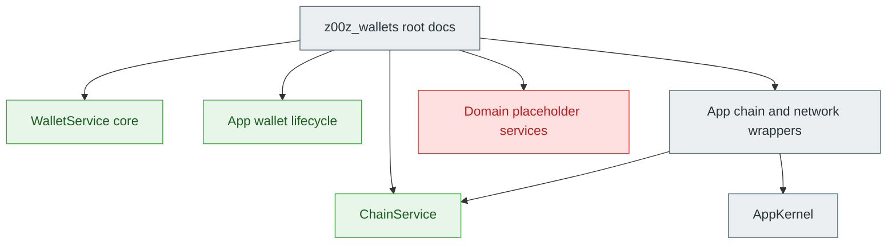
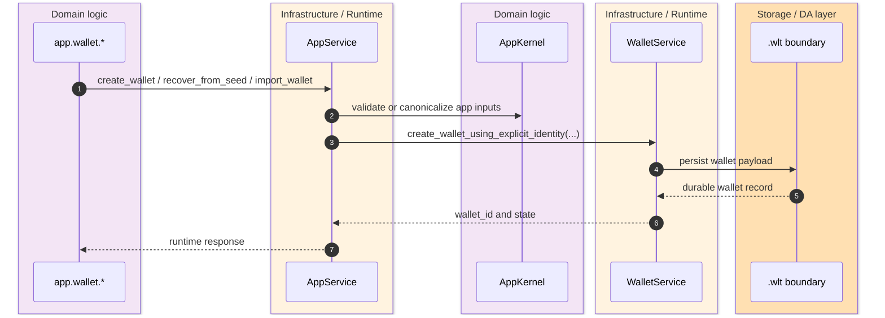
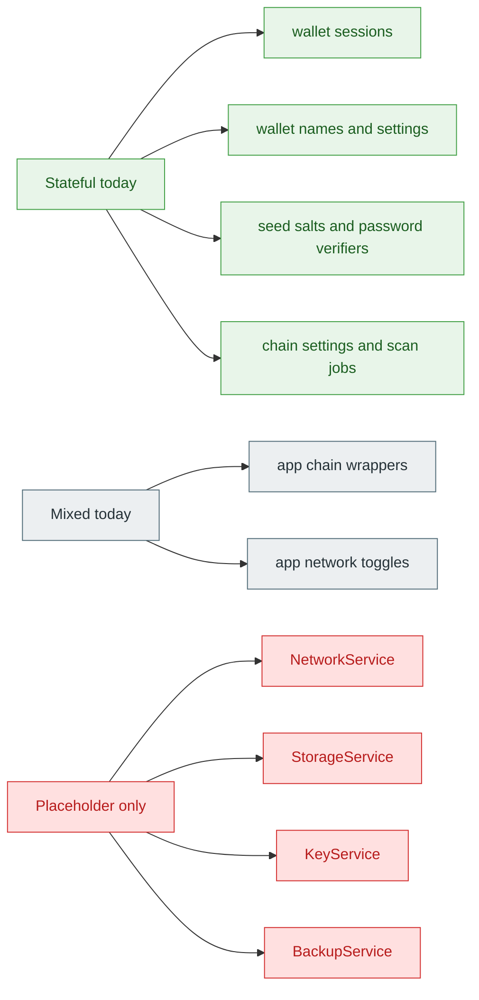

> [!WARNING]
> The wallet crate root is directionally correct when it says `services` and `rpc` are stub-heavy, but that summary is no longer precise enough for design or delivery decisions. Several wallet and app flows already perform real orchestration, persistence, validation, and process-local state management. `crates/z00z_wallets/src/lib.rs:17-32` `crates/z00z_wallets/src/services/wallet_service_core.rs:63-215`

The practical question is not whether `z00z_wallets` is "stubbed" or "implemented". The real question is **which surfaces already own durable or security-sensitive behavior**, and which ones are still only namespace placeholders. That matters because wallet code now spans three different maturity levels at once: typed object inventory and lifecycle orchestration, process-local runtime simulation, and pure scaffolding. `crates/z00z_wallets/README.md:153-193` `crates/z00z_wallets/src/app/app_kernel.rs:88-182`

## 🎯 At A Glance

| Surface | Current status | Why it matters | Source |
|---|---|---|---|
| Crate-root module docs | Mixed summary, still warns about stub-heavy `services` and `rpc`. | Good as a caution, weak as a maturity map. | `crates/z00z_wallets/src/lib.rs:17-32` |
| `WalletService` core | Mixed but stateful. | Owns sessions, `.wlt` persistence boundary, rate limits, in-memory wallet state, seed salts, and claimed assets. | `crates/z00z_wallets/src/services/wallet_service_core.rs:63-215` |
| App wallet lifecycle | Real orchestration. | Create, recover, import, export, delete, and source discovery all go through service logic, not pure placeholders. | `crates/z00z_wallets/src/services/app_wallet_lifecycle.rs:6-243` |
| Chain service | Real process-local runtime. | Holds chain settings, scan jobs, used derivation paths, and synthetic tip state. | `crates/z00z_wallets/src/services/chain_service.rs:27-231` |
| App chain and network wrappers | Mixed. | Chain switching and scanning delegate into real service state; OnionNet and Tor remain deterministic placeholders. | `crates/z00z_wallets/src/services/app_chain_network.rs:6-82` |
| Core `AppKernel` | Mostly placeholder. | Exposes deterministic app-level stubs and intentionally avoids wallet-secret ownership. | `crates/z00z_wallets/src/app/app_kernel.rs:88-188` |
| `NetworkService`, `StorageService`, `KeyService`, `BackupService` | Placeholder-only. | These names reserve domain seams but currently hold no real behavior beyond construction. | `crates/z00z_wallets/src/services/network_service.rs:1-16` `crates/z00z_wallets/src/services/storage_service.rs:1-16` `crates/z00z_wallets/src/services/key_service.rs:1-16` `crates/z00z_wallets/src/services/backup_service.rs:1-16` |

## 🧭 Surface Map

<!-- Sources: crates/z00z_wallets/src/lib.rs:17-44, crates/z00z_wallets/src/services/wallet_service_core.rs:63-215, crates/z00z_wallets/src/services/app_wallet_lifecycle.rs:6-243, crates/z00z_wallets/src/services/chain_service.rs:27-231, crates/z00z_wallets/src/services/app_chain_network.rs:6-82, crates/z00z_wallets/src/app/app_kernel.rs:88-188 -->

<!-- Sources: crates/z00z_wallets/src/services/app_wallet_lifecycle.rs:23-74, crates/z00z_wallets/src/services/app_wallet_lifecycle.rs:76-172, crates/z00z_wallets/src/services/wallet_service_core.rs:176-193, crates/z00z_wallets/src/app/app_kernel.rs:155-166 -->

<!-- Sources: crates/z00z_wallets/src/services/wallet_service_core.rs:84-214, crates/z00z_wallets/src/services/chain_service.rs:29-52, crates/z00z_wallets/src/services/app_chain_network.rs:6-34, crates/z00z_wallets/src/services/network_service.rs:1-16, crates/z00z_wallets/src/services/storage_service.rs:1-16, crates/z00z_wallets/src/services/key_service.rs:1-16, crates/z00z_wallets/src/services/backup_service.rs:1-16 -->

## 📦 What Is Actually Live

The most important live surface is **wallet orchestration state**, not transport. `WalletService` already owns auto-lock policy, wallet states, wallet settings, unlock attempt tracking, sensitive RPC rate-limit windows, session management, `.wlt` persistence, claimed assets, and per-wallet receive outcomes. Calling that whole type a stub would hide the fact that it already centralizes several correctness and security boundaries. `crates/z00z_wallets/src/services/wallet_service_core.rs:77-214`

The second live surface is **app-level wallet lifecycle orchestration**. `AppService` does not only bounce requests into the core app. It validates password policy, normalizes or generates seed phrases, creates explicit wallet identities, performs recovery gap-limit reconciliation, exports encrypted wallet payloads, imports wallet payloads, and opens a wallet source for discovery metadata. Those are real workflow decisions with real inputs and outputs. `crates/z00z_wallets/src/services/app_wallet_lifecycle.rs:12-243`

The third live surface is **process-local chain behavior**. `ChainService` is not a networked chain client yet, but it is not empty either. It persists active chain settings in memory, tracks scan jobs, tracks used derivation paths for recovery, and synthesizes a blockchain tip from observed scan targets. That makes it a real local runtime model, even if it is not yet a production remote-node adapter. `crates/z00z_wallets/src/services/chain_service.rs:27-231`

## ⚙️ What Is Only Mixed

`AppService` network and chain wrappers are **mixed maturity** because they join real stateful and placeholder paths. Chain switching and scan functions delegate into `ChainService`, but OnionNet and Tor switching only return deterministic placeholder responses after touching the core app clock. That makes the app-level surface reachable and testable without making the privacy transport real. `crates/z00z_wallets/src/services/app_chain_network.rs:6-82`

`AppKernel` is also mixed, but weighted toward scaffolding. It intentionally avoids secret ownership and mostly returns deterministic values for app-scoped operations such as switching chains, configuring OnionNet or Tor, starting scans, and export or import placeholders. The only clearly substantive method in the shown range is `create_wallet`, and even that only canonicalizes input into a request object rather than persisting secrets or files. `crates/z00z_wallets/src/app/app_kernel.rs:100-180`

## 🚫 What Is Still Placeholder-Only

The repo still contains domain names that reserve future seams rather than current behavior. `NetworkService`, `StorageService`, `KeyService`, and `BackupService` each expose only `new() -> Self` and no operational methods. These are true placeholders, not "minimal implementations". `crates/z00z_wallets/src/services/network_service.rs:1-16` `crates/z00z_wallets/src/services/storage_service.rs:1-16` `crates/z00z_wallets/src/services/key_service.rs:1-16` `crates/z00z_wallets/src/services/backup_service.rs:1-16`

The crate README still captures this reality in broad strokes: business logic behind service facades is still Phase 2 work, and OnionNet or P2P integration remains planned rather than live. The important correction is not that the README is wrong. The correction is that some service boundaries now carry meaningful behavior and should not be treated as empty scaffolding during architecture or profiling work. `crates/z00z_wallets/README.md:155-193`

## 🔑 Recommended Reading Of The Surface

| Area | Best reading | Why this is the right interpretation | Source |
|---|---|---|---|
| Wallet lifecycle | Real orchestration over mixed lower layers. | The service performs validation, persistence, recovery, and export/import work even when some core app calls are placeholders. | `crates/z00z_wallets/src/services/app_wallet_lifecycle.rs:23-243` |
| Chain scanning | Real process-local simulation. | Scan jobs, status, and tip state exist and mutate, but remote transport is not the owner yet. | `crates/z00z_wallets/src/services/chain_service.rs:125-230` |
| Privacy transport | Placeholder boundary. | OnionNet and Tor toggles are deterministic placeholders, not live overlay control. | `crates/z00z_wallets/src/app/app_kernel.rs:115-128` `crates/z00z_wallets/src/services/app_chain_network.rs:6-34` |
| Per-domain service names | Reserved seams. | The files exist to hold future behavior, but today they add no domain logic. | `crates/z00z_wallets/src/services/network_service.rs:1-16` `crates/z00z_wallets/src/services/storage_service.rs:1-16` |

## 📖 References

- `crates/z00z_wallets/src/lib.rs:17-44`
- `crates/z00z_wallets/src/services/wallet_service_core.rs:63-215`
- `crates/z00z_wallets/src/services/app_wallet_lifecycle.rs:6-243`
- `crates/z00z_wallets/src/services/chain_service.rs:27-231`
- `crates/z00z_wallets/src/services/app_chain_network.rs:6-82`
- `crates/z00z_wallets/src/app/app_kernel.rs:88-188`
- `crates/z00z_wallets/README.md:153-193`

## Related Pages

| Page | Relationship |
|---|---|
| [Wallet Architecture](./wallet-architecture.md) | Explains the stable crate facades and typed object model. |
| [Wallet RPC Gaps](./wallet-rpc-gaps.md) | Maps which wallet RPC surfaces are wired, local-only, or missing. |
| [OnionNet Target Architecture](../07-networking-and-observability/onionnet-target-architecture.md) | Shows why current wallet-side OnionNet toggles are only placeholders. |
