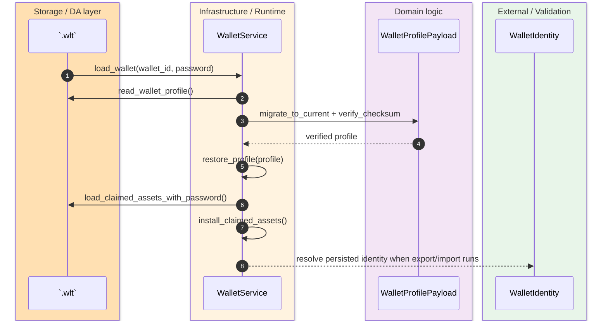
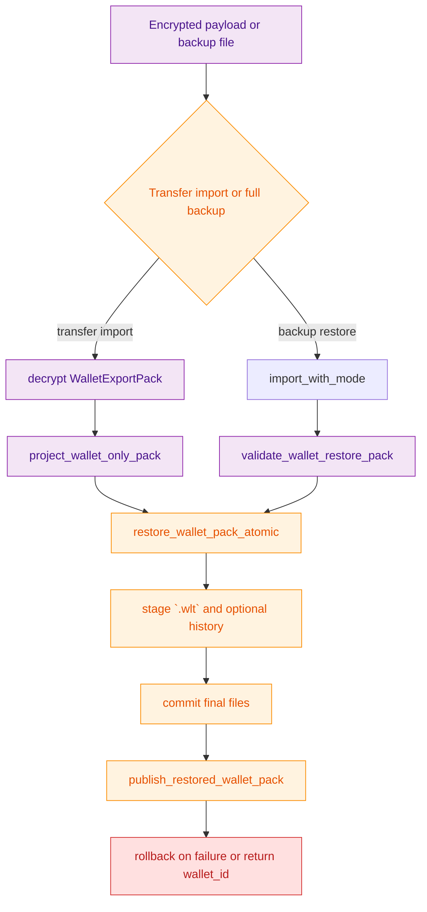

> [!IMPORTANT]
> The live restore path is not the placeholder `BackupService`. Real restore logic already lives in `WalletService` across `.wlt` load, encrypted wallet export import, and atomic backup restore flows. `(crates/z00z_wallets/src/services/backup_service.rs:1)` `(crates/z00z_wallets/src/services/wallet_store_restore.rs:1)` `(crates/z00z_wallets/src/services/wallet_actions_backup.rs:729)`

`z00z_wallets` keeps one wallet-local authority story: `.wlt` is the durable local store, `WalletExportPack` is the canonical transfer bundle, and full backup restore is the wider flow that may also replay tx-history sidecar bytes. The important design point is that these are not separate semantic worlds. They converge on one `WalletService` restore pipeline that validates identity, checksum, and payload shape before publishing restored state. `(crates/z00z_wallets/docs/Z00Z-WALLET-PERSISTENCE.md:12)` `(crates/z00z_wallets/docs/Z00Z-WALLET-PERSISTENCE.md:53)` `(crates/z00z_wallets/src/services/wallet_store_export_pack.rs:43)` `(crates/z00z_wallets/src/services/wallet_actions_backup.rs:729)`

## 🎯 Overview

| Surface | Status | Responsibility | Source |
|---|---|---|---|
| `.wlt` load | `live` | Open the persisted wallet store, decode profile bytes, verify checksum, and restore live in-memory profile state. | `(crates/z00z_wallets/src/services/wallet_store_restore.rs:3)` |
| `WalletExportPack` build | `live` | Export the canonical wallet-state bundle with manifest, profile, owned assets, owned objects, scan state, TOFU, keys, and wallet identity. | `(crates/z00z_wallets/src/services/wallet_store_export_pack.rs:43)` |
| Encrypted payload import | `live` | Decrypt a transfer payload, deserialize `WalletExportPack`, resolve restore identity, and restore wallet-only content. | `(crates/z00z_wallets/src/services/wallet_store_transfer_import.rs:216)` |
| Full backup restore | `live` | Stage `.wlt` and optional tx-history, commit atomically, and roll back on failure. | `(crates/z00z_wallets/src/services/wallet_actions_backup.rs:729)` |
| `BackupService` shim | `placeholder` | Reserves a future service seam but does not own restore semantics today. | `(crates/z00z_wallets/src/services/backup_service.rs:1)` |

## 🧭 Architecture

```mermaid
graph TB
  Wlt["`.wlt` file"]
  Load["load_wallet()"]
  Decode["decode_wallet_profile_bytes()"]
  Restore["restore_profile()"]
  Export["WalletExportPack"]
  Import["import_wallet_payload()"]
  Backup["restore_wallet_pack_atomic()"]

  Wlt --> Load
  Load --> Decode
  Decode --> Restore
  Restore --> Export
  Export --> Import
  Import --> Backup
  Backup --> Restore

  classDef storage fill:#FFE0B2,stroke:#F57C00,color:#E65100
  classDef runtime fill:#FFF3E0,stroke:#FB8C00,color:#E65100
  classDef domain fill:#F3E5F5,stroke:#8E24AA,color:#4A148C
  class Wlt storage
  class Load,Backup,Import runtime
  class Decode,Restore,Export domain
```
<!-- Sources: crates/z00z_wallets/src/services/wallet_store_restore.rs:3, crates/z00z_wallets/src/services/wallet_store_export_pack.rs:43, crates/z00z_wallets/src/services/wallet_store_transfer_import.rs:216, crates/z00z_wallets/src/services/wallet_actions_backup.rs:729 -->

| Component | Why it exists | Notes | Source |
|---|---|---|---|
| `load_wallet_profile_bytes(...)` | Opens the encrypted `.wlt` plane through `WltStore`. | Rejects wasm32 and routes native load through `spawn_blocking`. | `(crates/z00z_wallets/src/services/wallet_store_restore.rs:18)` |
| `decode_wallet_profile_bytes(...)` | Validates transferability of profile bytes into live state. | Applies migration, checksum verification, and wallet-id match. | `(crates/z00z_wallets/src/services/wallet_store_restore.rs:54)` |
| `load_wallet_export_state(...)` | Gathers exportable wallet-local planes. | Reuses an unlocked session when possible, otherwise reopens `.wlt`. | `(crates/z00z_wallets/src/services/wallet_store_export_pack.rs:158)` |
| `restore_wallet_export_pack(...)` | Narrows transfer restore to wallet-only content. | Recomputes manifest checksum after dropping history-sidecar requirements. | `(crates/z00z_wallets/src/services/wallet_store_export_pack.rs:284)` |
| `restore_backup_with_mode(...)` | Selects wallet-only, wallet-plus-history, or tx-history-only restore mode. | Enforces chain-bound backup payloads. | `(crates/z00z_wallets/src/services/wallet_actions_backup.rs:1188)` |

## 📦 Components

| Payload plane | Included in canonical export pack | Restore lane | Source |
|---|---|---|---|
| `wallet_profile` | Yes | Restored into names, states, verifier state, seed salt, deriver state, and settings. | `(crates/z00z_wallets/src/services/wallet_store_export_pack.rs:118)` `(crates/z00z_wallets/src/services/wallet_store_restore.rs:108)` |
| `owned_assets` | Yes | Reinstalled as claimed assets after profile restore. | `(crates/z00z_wallets/src/services/wallet_store_export_pack.rs:125)` `(crates/z00z_wallets/src/services/wallet_actions_backup.rs:955)` |
| `owned_objects` | Yes | Restaged into voucher/right inventory; asset variants are rejected on restore. | `(crates/z00z_wallets/src/services/wallet_store_export_pack.rs:129)` `(crates/z00z_wallets/src/services/wallet_actions_backup.rs:707)` |
| `scan_state`, `stealth_meta`, `tofu_pins`, `keys` | Yes | Stored back into the staged `.wlt` payload set during atomic restore. | `(crates/z00z_wallets/src/services/wallet_store_export_pack.rs:133)` `(crates/z00z_wallets/src/services/wallet_actions_backup.rs:700)` |
| `wallet_identity` | Yes | Used to resolve network and chain on import and backup restore. | `(crates/z00z_wallets/src/services/wallet_store_export_pack.rs:80)` `(crates/z00z_wallets/src/services/wallet_store_transfer_import.rs:270)` |
| tx-history JSONL | Optional sidecar | Only full backup restore replays it into local history. | `(crates/z00z_wallets/src/services/wallet_store_transfer_import.rs:205)` `(crates/z00z_wallets/src/services/wallet_actions_backup.rs:1012)` |

## 🔄 Data Flow


<!-- Sources: crates/z00z_wallets/src/services/wallet_store_restore.rs:3, crates/z00z_wallets/src/services/wallet_store_restore.rs:54, crates/z00z_wallets/src/services/wallet_store_support.rs:160, crates/z00z_wallets/src/services/wallet_store_export_pack.rs:80 -->

The same restore authority is reused by transfer import. `import_wallet_payload(...)` expects encrypted JSON that wraps base64-encoded `EncryptedWalletContainer`; after decryption it deserializes `WalletExportPack`, resolves the effective identity from `wallet_identity`, and delegates into `restore_wallet_export_pack(...)`. That means the transfer surface is not a second restore implementation. It is a transport wrapper around the same wallet-local restore contract. `(crates/z00z_wallets/src/services/wallet_store_transfer_import.rs:216)` `(crates/z00z_wallets/src/services/wallet_store_transfer_import.rs:264)` `(crates/z00z_wallets/src/services/wallet_store_export_pack.rs:284)`

## ⚙️ Implementation


<!-- Sources: crates/z00z_wallets/src/services/wallet_store_transfer_import.rs:216, crates/z00z_wallets/src/services/wallet_store_export_pack.rs:296, crates/z00z_wallets/src/services/wallet_actions_backup.rs:729, crates/z00z_wallets/src/services/wallet_actions_backup.rs:875 -->

`restore_wallet_pack_atomic(...)` is the strongest restore contract in the crate. It validates the restore bundle, stages the new `.wlt`, optionally stages tx-history, backs up the old history, commits the new history first, commits the final `.wlt`, and rolls both planes back if publish into live memory fails afterward. `(crates/z00z_wallets/src/services/wallet_actions_backup.rs:737)` `(crates/z00z_wallets/src/services/wallet_actions_backup.rs:810)` `(crates/z00z_wallets/src/services/wallet_actions_backup.rs:838)` `(crates/z00z_wallets/src/services/wallet_actions_backup.rs:875)`

> [!NOTE]
> `WalletExportPack` is the canonical transfer bundle, but the README and persistence docs are explicit that it is not the long-term public serialization promise for arbitrary consumers. The live contract is the encrypted export or backup surface that wraps it. `(crates/z00z_wallets/README.md:35)` `(crates/z00z_wallets/README.md:235)` `(crates/z00z_wallets/docs/Z00Z-WALLET-PERSISTENCE.md:53)`

## 📖 References

- `(crates/z00z_wallets/src/services/wallet_store_restore.rs:1)`
- `(crates/z00z_wallets/src/services/wallet_store_export_pack.rs:1)`
- `(crates/z00z_wallets/src/services/wallet_store_transfer_import.rs:145)`
- `(crates/z00z_wallets/src/services/wallet_actions_backup.rs:729)`
- `(crates/z00z_wallets/src/services/backup_service.rs:1)`
- `(crates/z00z_wallets/README.md:35)`
- `(crates/z00z_wallets/docs/Z00Z-WALLET-PERSISTENCE.md:12)`
- `(crates/z00z_wallets/docs/WALLET-GUIDE.md:151)`

## 🔗 Related Pages

| Page | Relationship |
|---|---|
| [Wallet Session Locks](./wallet-session-locks.md) | Explains how unlocked in-memory sessions interact with `.wlt` access and export reuse. |
| [Wallet Stub Surface](./wallet-stub-surface.md) | Clarifies why restore is a live path even though `BackupService` itself is placeholder-only. |
| [Wallet Architecture](./wallet-architecture.md) | Places `.wlt`, receiver, service, and RPC lanes in the broader wallet crate map. |
