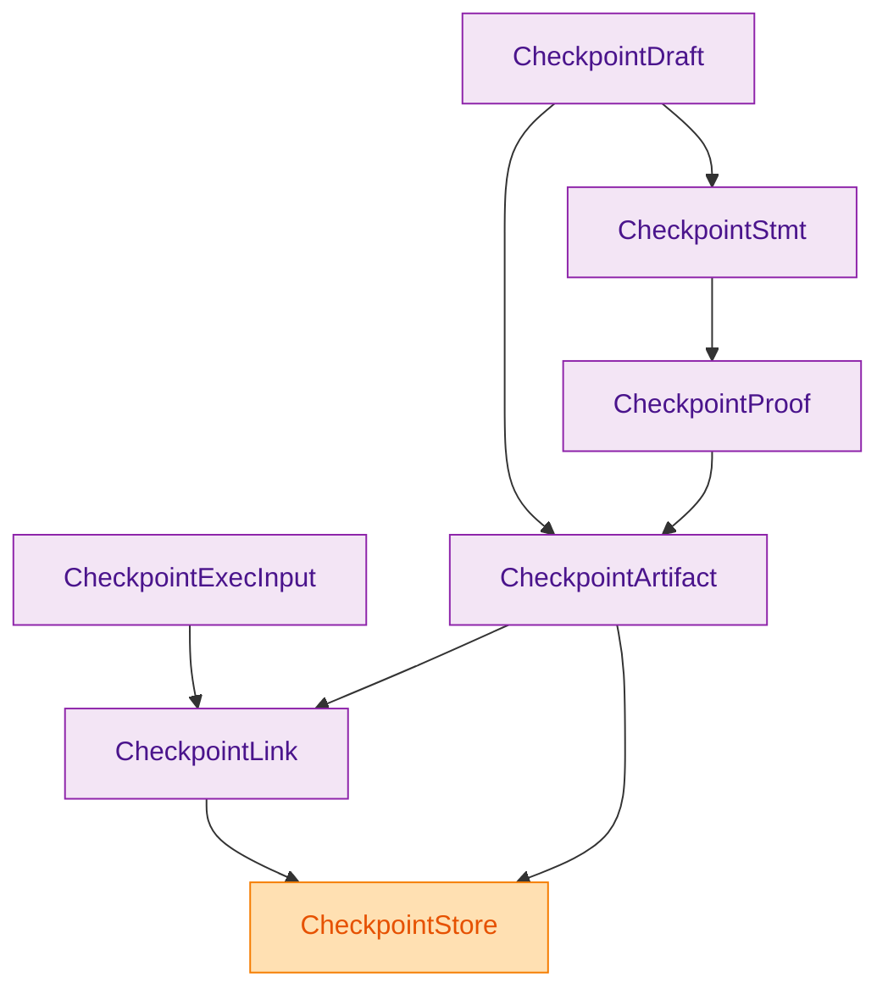
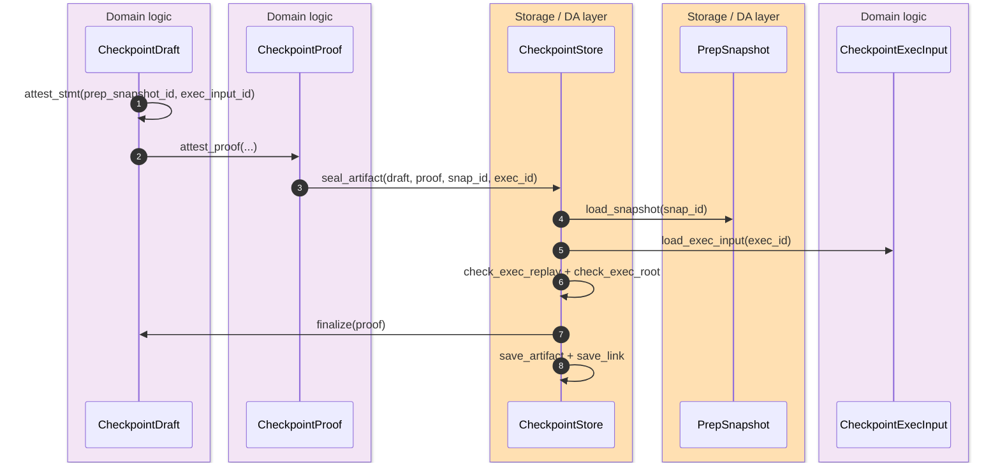

> [!IMPORTANT]
> The checkpoint surface is a first-class storage contract, not just supporting detail for the theorem verifier. The module re-exports drafts, artifacts, statements, exec inputs, ids, links, and the store facade as one canonical family. `(crates/z00z_storage/src/checkpoint/mod.rs:1)` `(crates/z00z_storage/src/checkpoint/mod.rs:27)`

This contract exists to answer a narrow but critical question: when a checkpoint artifact is loaded later, how does the system know it is still bound to the exact replay snapshot and execution input that justified it? Z00Z answers that by making the statement carry the canonical roots and replay ids, making the artifact preserve the statement-owned binding, and making `CheckpointLink` hash the final `checkpoint_id`, `prep_snapshot_id`, and `exec_input_id` together. `(crates/z00z_storage/src/checkpoint/artifact_stmt.rs:10)` `(crates/z00z_storage/src/checkpoint/artifact_final.rs:64)` `(crates/z00z_storage/src/checkpoint/link.rs:175)`

## 🎯 Overview

| Surface | Status | Responsibility | Source |
|---|---|---|---|
| `CheckpointDraft` | `live` | Holds canonical spent and created deltas plus pre/post settlement roots before final attestation. | `(crates/z00z_storage/src/checkpoint/artifact_proof_draft.rs:67)` |
| `CheckpointStmt` | `live` | Binds the draft to `prep_snapshot_id` and `exec_input_id` and produces the backend attestation payload. | `(crates/z00z_storage/src/checkpoint/artifact_stmt.rs:10)` |
| `CheckpointArtifact` | `live` | Final public artifact that carries canonical deltas, optional statement ids, and proof payload. | `(crates/z00z_storage/src/checkpoint/artifact_final.rs:13)` |
| `CheckpointExecInput` | `live` | Replay artifact containing ordered inputs, outputs, and tx proof bytes. | `(crates/z00z_storage/src/checkpoint/exec_input.rs:222)` |
| `CheckpointLink` | `live` | Canonical linkage between final artifact, prep snapshot, and exec input. | `(crates/z00z_storage/src/checkpoint/link.rs:43)` |

## 🧭 Architecture


<!-- Sources: crates/z00z_storage/src/checkpoint/artifact_proof_draft.rs:67, crates/z00z_storage/src/checkpoint/artifact_stmt.rs:24, crates/z00z_storage/src/checkpoint/artifact_final.rs:13, crates/z00z_storage/src/checkpoint/exec_input.rs:222, crates/z00z_storage/src/checkpoint/link.rs:43, crates/z00z_storage/src/checkpoint/store.rs:201 -->

| Component | Why it exists | Notes | Source |
|---|---|---|---|
| `CheckpointProof::new_attest(...)` | Enforces statement-bound opaque attestation. | Rejects empty proof and proof bytes that do not equal the statement backend payload. | `(crates/z00z_storage/src/checkpoint/artifact_proof_draft.rs:22)` |
| `CheckpointDraft::attest_stmt(...)` | Creates the canonical statement from draft plus replay ids. | The draft itself is not enough to name the final checkpoint identity. | `(crates/z00z_storage/src/checkpoint/artifact_proof_draft.rs:190)` |
| `CheckpointArtifact::statement()` | Reconstructs the canonical statement view from stored ids. | Returns `Detached` if ids are absent. | `(crates/z00z_storage/src/checkpoint/artifact_final.rs:64)` |
| `CheckpointExecTx` | Preserves ordered inputs, outputs, and exact tx proof bytes. | Replay later must not synthesize a replacement proof payload. | `(crates/z00z_storage/src/checkpoint/exec_input.rs:126)` |
| `derive_checkpoint_id(...)` | Derives final checkpoint identity from canonical artifact bytes only. | Detached artifacts are rejected on the checkpoint-id path. | `(crates/z00z_storage/src/checkpoint/ids.rs:166)` `(crates/z00z_storage/src/checkpoint/ids.rs:200)` |

## 📦 Components

| Artifact | Bound fields | What it is not allowed to do | Source |
|---|---|---|---|
| Draft | Height, roots, claim root, spent delta, created delta. | It cannot define the final checkpoint id by itself. | `(crates/z00z_storage/src/checkpoint/artifact_proof_draft.rs:68)` |
| Statement | Adds `prep_snapshot_id` and `exec_input_id` to canonical public input. | It does not store arbitrary external metadata. | `(crates/z00z_storage/src/checkpoint/artifact_stmt.rs:20)` |
| Proof | Carries the verifier payload for the statement. | Proof bytes do not replace the statement-owned binding. | `(crates/z00z_storage/src/checkpoint/artifact_proof_draft.rs:57)` |
| Artifact | Stores final deltas plus proof bytes and optional statement ids. | Proof bytes alone do not define checkpoint identity. | `(crates/z00z_storage/src/checkpoint/artifact_final.rs:29)` `(crates/z00z_storage/src/checkpoint/artifact_final.rs:139)` |
| Link | Hash-binds checkpoint id, prep snapshot id, and exec input id. | It is rejected if version or bind bytes drift. | `(crates/z00z_storage/src/checkpoint/link.rs:69)` `(crates/z00z_storage/src/checkpoint/link.rs:122)` |

## 🔄 Data Flow


<!-- Sources: crates/z00z_storage/src/checkpoint/artifact_proof_draft.rs:190, crates/z00z_storage/src/checkpoint/artifact_proof_draft.rs:199, crates/z00z_storage/src/checkpoint/store.rs:223, crates/z00z_storage/src/checkpoint/store.rs:309 -->

## ⚙️ Implementation

```mermaid
flowchart TD
  A[seal_artifact] --> B{statement ids match snap_id and exec_id}
  B -->|no| X[LinkMix]
  B -->|yes| C[load snapshot]
  C --> D[load exec input]
  D --> E[check_exec_replay]
  E --> F[check_exec_root]
  F --> G[draft.finalize(proof)]
  G --> H[derive checkpoint_id]
  H --> I[CheckpointLink::new]
  I --> J[save_link]
  J --> K[load_link re-checks artifact, snapshot, exec coherence]

  classDef storage fill:#FFE0B2,stroke:#F57C00,color:#E65100
  classDef danger fill:#FFE0E0,stroke:#D32F2F,color:#B71C1C
  class A,C,D,E,F,G,H,I,J,K storage
  class B,X danger
```
<!-- Sources: crates/z00z_storage/src/checkpoint/store.rs:154, crates/z00z_storage/src/checkpoint/store.rs:172, crates/z00z_storage/src/checkpoint/store.rs:309, crates/z00z_storage/src/checkpoint/store.rs:348 -->

The `CheckpointLink` bind is deliberately tiny and strict. It rehashes only the `checkpoint_id`, `prep_snapshot_id`, and `exec_input_id` under `z00z.storage.checkpoint.link`, and `check_bind()` rejects any version or bind drift on decode. That keeps link verification honest and cheap: the link does not restate the whole checkpoint, it proves exact identity handoff among the three canonical artifacts. `(crates/z00z_storage/src/checkpoint/link.rs:10)` `(crates/z00z_storage/src/checkpoint/link.rs:122)` `(crates/z00z_storage/src/checkpoint/link.rs:175)`

> [!NOTE]
> `save_artifact(...)` is a raw persistence lane, but the canonical statement-bound path is still `seal_artifact(...)`. That distinction matters because only the seal path proves replay evidence already exists and matches the attested statement. `(crates/z00z_storage/src/checkpoint/store.rs:208)` `(crates/z00z_storage/src/checkpoint/store.rs:223)`

## 📖 References

- `(crates/z00z_storage/src/checkpoint/mod.rs:1)`
- `(crates/z00z_storage/src/checkpoint/artifact_proof_draft.rs:14)`
- `(crates/z00z_storage/src/checkpoint/artifact_final.rs:13)`
- `(crates/z00z_storage/src/checkpoint/artifact_stmt.rs:10)`
- `(crates/z00z_storage/src/checkpoint/exec_input.rs:37)`
- `(crates/z00z_storage/src/checkpoint/link.rs:10)`
- `(crates/z00z_storage/src/checkpoint/ids.rs:156)`
- `(crates/z00z_storage/src/checkpoint/store.rs:154)`

## 🔗 Related Pages

| Page | Relationship |
|---|---|
| [Prep Snapshot Replay](./prep-snapshot-replay.md) | Explains the snapshot artifact referenced by the checkpoint statement and link. |
| [Rollup Theorem Verifier](./rollup-theorem-verifier.md) | Consumes this checkpoint family as public theorem input rather than redefining it. |
| [Publication Route Authority](./publication-route-authority.md) | Covers the adjacent runtime-plus-storage route binding contract that sits beside checkpoint identity. |

