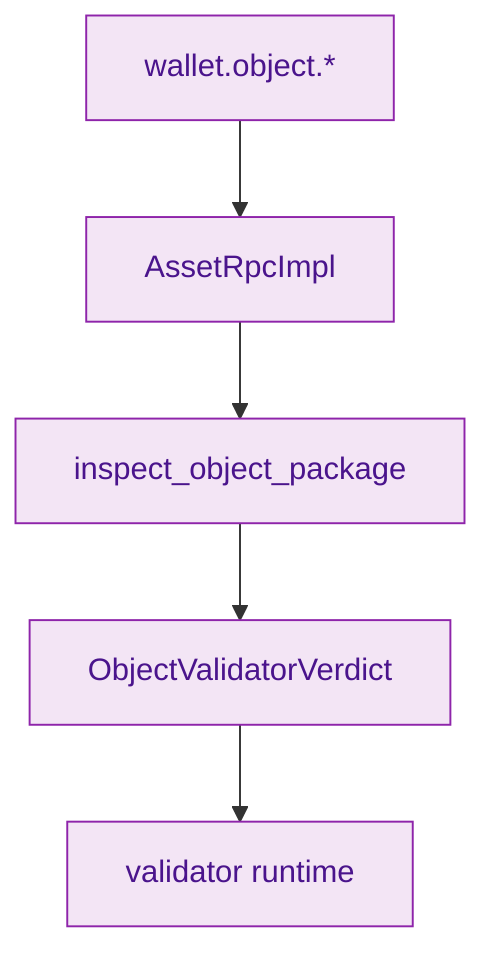
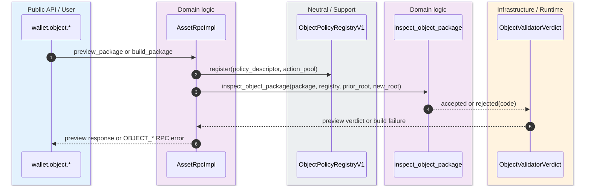
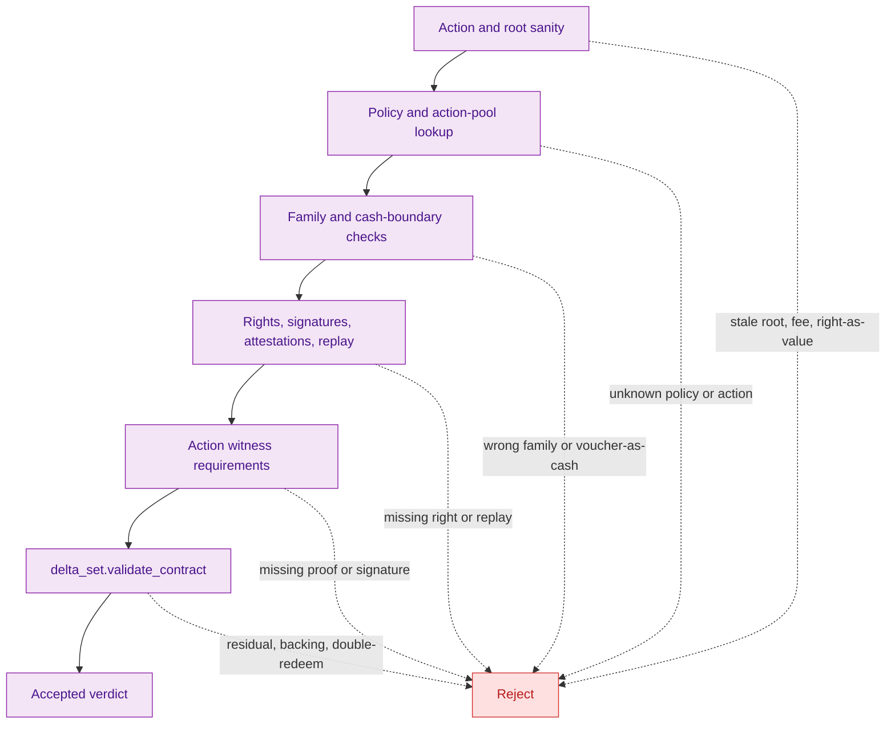

> [!IMPORTANT]
> Typed object admission is already a storage-owned contract, not a future wallet-only idea. `RuntimeObjectPackageV1`, `ObjectRejectCode`, `ObjectValidatorVerdict`, and `inspect_object_package(...)` are exported from the settlement surface and then reused by wallet RPC and validator layers. `crates/z00z_storage/src/settlement/mod.rs:45-49` `crates/z00z_runtime/validators/README.md:15-38`

The purpose of this contract is to ensure that **assets, vouchers, and rights cannot share one vague admission lane**. The package must carry the chosen action, the policy identity, action-pool identity, witness bundle, rights evidence, delta set, fee support reference, and expected roots. Storage then rejects the package in a fixed order so higher layers do not invent their own object semantics. `crates/z00z_storage/src/settlement/object_package_contract.rs:47-130` `crates/z00z_storage/src/settlement/object_package_contract.rs:215-305`

## 🎯 At A Glance

| Component | Responsibility | Why it matters | Source |
|---|---|---|---|
| `RuntimeObjectPackageV1` | Canonical typed object admission package. | Captures family, action, policy hash, witnesses, delta set, and roots in one bundle. | `crates/z00z_storage/src/settlement/object_package_contract.rs:47-69` |
| `ObjectRejectCode` | Stable reject taxonomy. | Names the exact failure mode instead of leaving object rejection opaque. | `crates/z00z_storage/src/settlement/object_package_contract.rs:71-94` |
| `inspect_object_package(...)` | Ordered admission pipeline. | Enforces roots, policy/action identity, family rules, rights, replay, witness requirements, and delta validation. | `crates/z00z_storage/src/settlement/object_package_contract.rs:215-305` |
| `inspect_with_registry(...)` | Wallet-side bridge into storage admission. | Registers the request policy and action pool before calling the storage contract. | `crates/z00z_wallets/src/rpc/object_rpc_impl.rs:477-499` |
| `preview_object_package_impl(...)` / `build_object_package_impl(...)` | Wallet RPC object preview and build lane. | Surfaces verdicts early and maps rejects to RPC errors. | `crates/z00z_wallets/src/rpc/object_rpc_impl.rs:156-183` `crates/z00z_wallets/src/rpc/object_rpc_impl.rs:750-853` |
| Validator boundary | Reuses storage-owned proof and route contracts. | Confirms typed object verdicts are validator scope, not wallet UX scope. | `crates/z00z_runtime/validators/README.md:15-38` |

## 🧭 Ownership And Call Path

<!-- Sources: crates/z00z_wallets/src/rpc/object_rpc_impl.rs:477-499, crates/z00z_wallets/src/rpc/object_rpc_impl.rs:750-853, crates/z00z_storage/src/settlement/mod.rs:45-49, crates/z00z_runtime/validators/README.md:15-38 -->

<!-- Sources: crates/z00z_wallets/src/rpc/object_rpc_impl.rs:156-183, crates/z00z_wallets/src/rpc/object_rpc_impl.rs:477-499, crates/z00z_wallets/src/rpc/object_rpc_impl.rs:750-853, crates/z00z_storage/src/settlement/object_package_contract.rs:215-305 -->

<!-- Sources: crates/z00z_storage/src/settlement/object_package_contract.rs:215-305, crates/z00z_storage/src/settlement/object_package_contract.rs:311-544 -->

## 📦 Package Fields That Matter

| Field | Meaning | Why it exists | Source |
|---|---|---|---|
| `primary_family` | Asset, voucher, or right. | Stops cross-family proof drift. | `crates/z00z_storage/src/settlement/object_package_contract.rs:49-50` |
| `selected_action`, `selected_action_id` | Declared action and its canonical id. | Prevents "policy says one thing, delta does another" drift. | `crates/z00z_storage/src/settlement/object_package_contract.rs:51-53` |
| `policy_descriptor_hash`, `action_pool_id` | Identity of the policy and action pool. | Binds the package to the exact registered rule set. | `crates/z00z_storage/src/settlement/object_package_contract.rs:53-55` |
| `required_rights` | Rights evidence and witness state. | Prevents rights from being hand-waved as ambient authority. | `crates/z00z_storage/src/settlement/object_package_contract.rs:55-57` |
| `object_witnesses` | Signatures, attestations, acceptance proof, replay nonce, root binding, disclosure commitment. | Centralizes witness policy instead of scattering it across higher layers. | `crates/z00z_storage/src/settlement/object_package_contract.rs:34-45` |
| `delta_set` | Underlying settlement mutations. | Lets storage validate that the semantic object operation matches the actual leaf changes. | `crates/z00z_storage/src/settlement/object_package_contract.rs:57-60` |
| `prior_root`, `expected_new_root` | Published root expectations. | Stops stale-root and route-drift acceptance. | `crates/z00z_storage/src/settlement/object_package_contract.rs:60-61` |

## 🔑 Reject Families

| Reject group | Codes | Trigger class | Source |
|---|---|---|---|
| Policy or action identity | `UnknownPolicy`, `UnknownAction` | Declared policy/action does not match the registered descriptors or the delta-set action. | `crates/z00z_storage/src/settlement/object_package_contract.rs:224-259` |
| Root and fee boundary | `StaleRoot`, `FeeBoundary` | Published roots or fee support references drift from the delta set. | `crates/z00z_storage/src/settlement/object_package_contract.rs:230-244` |
| Cash-boundary and family misuse | `RightUsedAsValue`, `VoucherUsedAsCash`, `WrongFamilyProof`, `InvalidBacking` | The package tries to use object families outside the declared spend/claim contract. | `crates/z00z_storage/src/settlement/object_package_contract.rs:245-281` `crates/z00z_storage/src/settlement/object_package_contract.rs:511-544` |
| Rights and witness failure | `MissingRight`, `RightOutOfScope`, `RightExpired`, `RightRevoked`, `RightConsumed`, `MissingSignature`, `MissingAttestation`, `ForcedAcceptance` | Required rights or witnesses are absent or in the wrong state. | `crates/z00z_storage/src/settlement/object_package_contract.rs:282-299` `crates/z00z_storage/src/settlement/object_package_contract.rs:375-501` |
| Replay and lifecycle failure | `Replay`, `DoubleRedeem`, `ResidualMismatch`, `ExpiredVoucherUse` | Replay discipline or voucher lifecycle contract fails. | `crates/z00z_storage/src/settlement/object_package_contract.rs:426-441` `crates/z00z_storage/src/settlement/object_package_contract.rs:511-544` |

## ⚙️ Wallet And Validator Integration

Wallet RPC converts storage reject codes into stable `OBJECT_*` RPC errors through `rpc_reject_code(...)`. `preview_object_package_impl(...)` can therefore expose the full verdict without mutating state, while `build_object_package_impl(...)` hard-fails when the preview verdict carries a reject code. That creates one canonical typed-object preflight lane. `crates/z00z_wallets/src/rpc/object_rpc_impl.rs:156-183` `crates/z00z_wallets/src/rpc/object_rpc_impl.rs:834-853`

Validators then inherit the same object truth boundary. Their README is explicit that settlement roots, proof envelopes, replay semantics, and exact publication route snapshots remain storage-owned, while Phase 059 extends validator responsibility into typed settlement objects. The validator does not invent a second object admission language. `crates/z00z_runtime/validators/README.md:13-38`

## 📖 References

- `crates/z00z_storage/src/settlement/mod.rs:45-49`
- `crates/z00z_storage/src/settlement/object_package_contract.rs:16-544`
- `crates/z00z_wallets/src/rpc/object_rpc_impl.rs:156-183`
- `crates/z00z_wallets/src/rpc/object_rpc_impl.rs:477-499`
- `crates/z00z_wallets/src/rpc/object_rpc_impl.rs:750-1023`
- `crates/z00z_runtime/validators/README.md:13-38`

## Related Pages

| Page | Relationship |
|---|---|
| [Settlement Runtime And Rollup](./settlement-runtime-and-rollup.md) | Shows where storage-owned settlement truth sits in the larger runtime. |
| [Wallet RPC Gaps](../04-wallet-and-rpc/wallet-rpc-gaps.md) | Explains how wallet object RPC reaches this contract. |
| [Publication Route Authority](./publication-route-authority.md) | Covers the separate route-binding contract that typed batches later reuse. |
