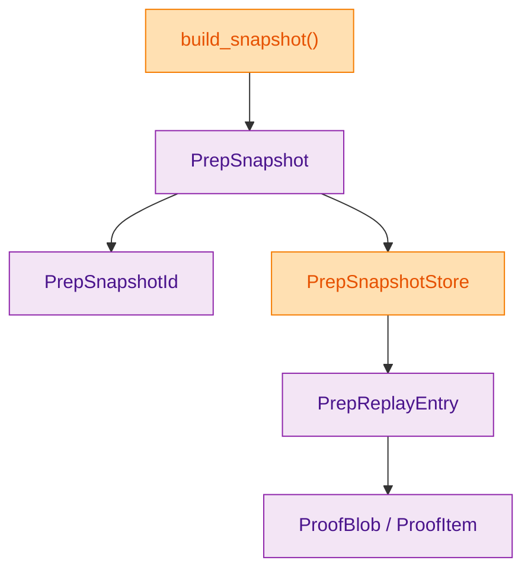
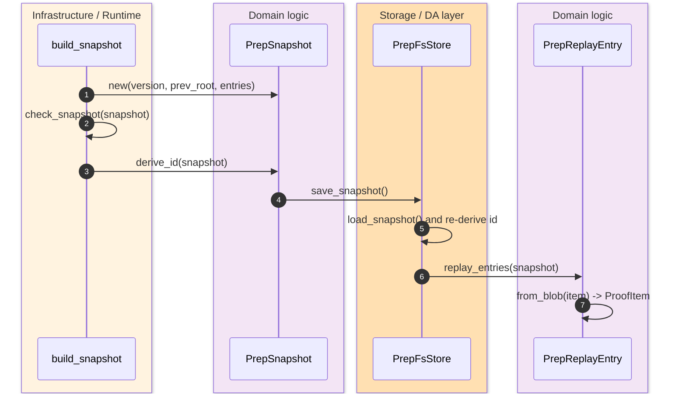
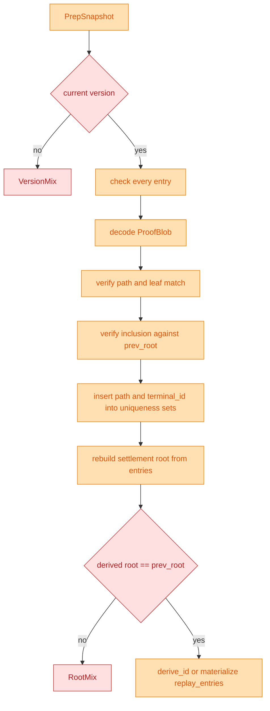

> [!IMPORTANT]
> The snapshot surface is not just a bag of pre-state leaves. It is storage-owned replay evidence that binds canonical paths, terminal leaves, witness blobs, and the prior settlement root before checkpoint execution can be accepted. `(crates/z00z_storage/src/snapshot/store.rs:53)` `(crates/z00z_storage/src/snapshot/store.rs:216)`

The point of `PrepSnapshot` is to freeze a replay-ready view of the pre-state in a form that can be loaded later without guessing which proof context belongs to which leaf. Z00Z therefore keeps the snapshot content-addressed, validates every entry against the claimed root and path semantics, and exposes `PrepReplayEntry` as the typed replay accessor rather than making downstream code decode witness blobs by hand. `(crates/z00z_storage/src/snapshot/types.rs:74)` `(crates/z00z_storage/src/snapshot/codec.rs:25)` `(crates/z00z_storage/src/snapshot/store.rs:66)`

## 🎯 Overview

| Surface | Status | Responsibility | Source |
|---|---|---|---|
| `PrepSnapshot` | `live` | Canonical pre-state snapshot artifact with `prev_root` and ordered `SnapItem` entries. | `(crates/z00z_storage/src/snapshot/types.rs:74)` |
| `PrepSnapshotId` | `live` | External content-addressed id derived from canonical snapshot bytes. | `(crates/z00z_storage/src/snapshot/types.rs:33)` `(crates/z00z_storage/src/snapshot/codec.rs:25)` |
| `PrepReplayEntry` | `live` | Storage-owned typed replay accessor with decoded proof context. | `(crates/z00z_storage/src/snapshot/store.rs:53)` |
| `PrepSnapshotStore` | `live` | Narrow facade for save, load, validate, id derivation, and replay materialization. | `(crates/z00z_storage/src/snapshot/store.rs:91)` |
| `PrepSnapshotError` | `live` | Typed reject taxonomy for snapshot, path, witness, and replay drift. | `(crates/z00z_storage/src/snapshot/error.rs:15)` |

## 🧭 Architecture

<!-- Sources: crates/z00z_storage/src/snapshot/mod.rs:8, crates/z00z_storage/src/snapshot/types.rs:74, crates/z00z_storage/src/snapshot/codec.rs:25, crates/z00z_storage/src/snapshot/store.rs:15, crates/z00z_storage/src/snapshot/store.rs:53 -->

| Component | Why it exists | Notes | Source |
|---|---|---|---|
| `build_snapshot(...)` | Ensures validation runs before id derivation. | Returns both the snapshot and its derived external id. | `(crates/z00z_storage/src/snapshot/store.rs:34)` |
| `encode_snap(...)` / `decode_snap(...)` | Canonical snapshot transport and recovery. | Version gate is enforced on both encode and decode. | `(crates/z00z_storage/src/snapshot/codec.rs:14)` |
| `PrepReplayEntry::from_blob(...)` | Decodes one witness blob and re-binds it to the canonical snapshot item. | Rejects replay path or leaf mismatch. | `(crates/z00z_storage/src/snapshot/store.rs:66)` |
| `check_snapshot(...)` | Full snapshot validation pass. | Enforces unique paths, unique terminal ids, and root reconstruction. | `(crates/z00z_storage/src/snapshot/store.rs:216)` |
| `map_wit(...)` | Converts proof verification failures into snapshot-owned error classes. | Keeps proof drift visible without leaking lower-level enum details into callers. | `(crates/z00z_storage/src/snapshot/store.rs:323)` |

## 📦 Components

| Check | Failure class | What it protects | Source |
|---|---|---|---|
| Entry path and leaf coherence | `PathMix`, `SerialMix`, `TerminalIdMix`, `LeafMix` | Prevents one proof context from being paired with the wrong canonical entry. | `(crates/z00z_storage/src/snapshot/store.rs:263)` `(crates/z00z_storage/src/snapshot/error.rs:27)` `(crates/z00z_storage/src/snapshot/error.rs:30)` `(crates/z00z_storage/src/snapshot/error.rs:33)` `(crates/z00z_storage/src/snapshot/error.rs:36)` |
| Witness decode and proof-family checks | `WitDecode`, `WitMix` | Prevents malformed or non-inclusion proof blobs from entering replay. | `(crates/z00z_storage/src/snapshot/store.rs:266)` `(crates/z00z_storage/src/snapshot/error.rs:42)` `(crates/z00z_storage/src/snapshot/error.rs:45)` |
| Duplicate path and terminal-id rejection | `DupPath`, `DupTerminalId` | Stops ambiguous replay addressing inside one snapshot. | `(crates/z00z_storage/src/snapshot/store.rs:221)` `(crates/z00z_storage/src/snapshot/error.rs:54)` `(crates/z00z_storage/src/snapshot/error.rs:57)` |
| Root reconstruction | `RootMix` | Ensures the full snapshot still rebuilds the claimed `prev_root`. | `(crates/z00z_storage/src/snapshot/store.rs:240)` |
| Replay materialization re-bind | `ReplayPathMix`, `ReplayLeafMix` | Ensures decoded proof context still matches the stored `SnapItem`. | `(crates/z00z_storage/src/snapshot/store.rs:69)` `(crates/z00z_storage/src/snapshot/error.rs:60)` `(crates/z00z_storage/src/snapshot/error.rs:63)` |

## 🔄 Data Flow

<!-- Sources: crates/z00z_storage/src/snapshot/store.rs:34, crates/z00z_storage/src/snapshot/store.rs:155, crates/z00z_storage/src/snapshot/store.rs:202, crates/z00z_storage/src/snapshot/store.rs:66 -->

## ⚙️ Implementation

<!-- Sources: crates/z00z_storage/src/snapshot/store.rs:216, crates/z00z_storage/src/snapshot/store.rs:263, crates/z00z_storage/src/snapshot/store.rs:298, crates/z00z_storage/src/snapshot/store.rs:240 -->

`PrepFsStore::save_snapshot(...)` immediately reloads the just-written artifact and re-derives its id, which is a strong signal that the external id is treated as a real contract rather than a best-effort label. `replay_entries(...)` then refuses to expose raw bytes directly; it validates the snapshot first and only returns decoded `PrepReplayEntry` values after `from_blob(...)` re-binds each witness payload to its canonical `SnapItem`. `(crates/z00z_storage/src/snapshot/store.rs:156)` `(crates/z00z_storage/src/snapshot/store.rs:166)` `(crates/z00z_storage/src/snapshot/store.rs:202)`

> [!NOTE]
> Snapshot ids are derived from canonical encoded bytes with SHA-256 over `encode_snap(snapshot)`. That makes ordering and serialization stability part of the external contract. `(crates/z00z_storage/src/snapshot/codec.rs:14)` `(crates/z00z_storage/src/snapshot/codec.rs:25)`

## 📖 References

- `(crates/z00z_storage/src/snapshot/mod.rs:1)`
- `(crates/z00z_storage/src/snapshot/types.rs:3)`
- `(crates/z00z_storage/src/snapshot/codec.rs:1)`
- `(crates/z00z_storage/src/snapshot/error.rs:1)`
- `(crates/z00z_storage/src/snapshot/store.rs:1)`

## 🔗 Related Pages

| Page | Relationship |
|---|---|
| [Checkpoint Link Contract](./checkpoint-link-contract.md) | Explains how snapshot ids are later bound into checkpoint statements and links. |
| [Settlement Path Proofs](./settlement-path-proofs.md) | Covers the underlying settlement proof families that snapshot replay depends on. |
| [Rollup Theorem Verifier](./rollup-theorem-verifier.md) | Consumes checkpoint-linked replay artifacts after this snapshot layer has already frozen pre-state evidence. |
