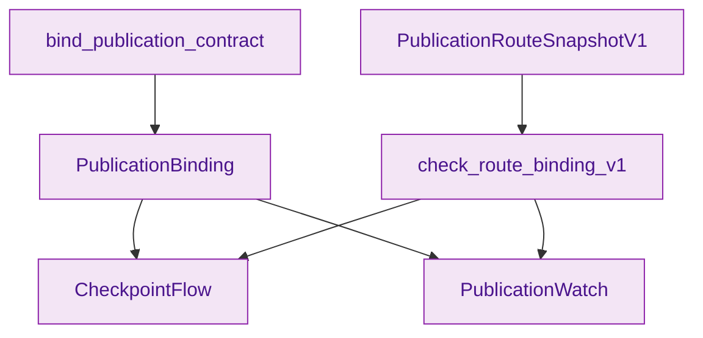
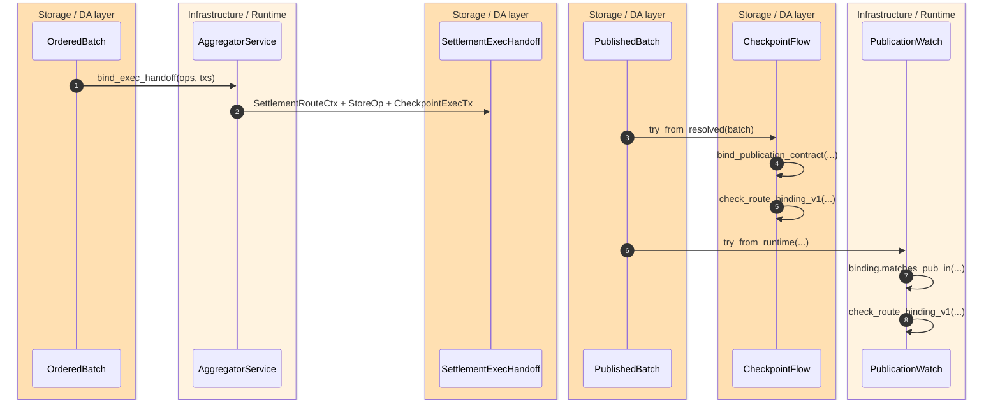
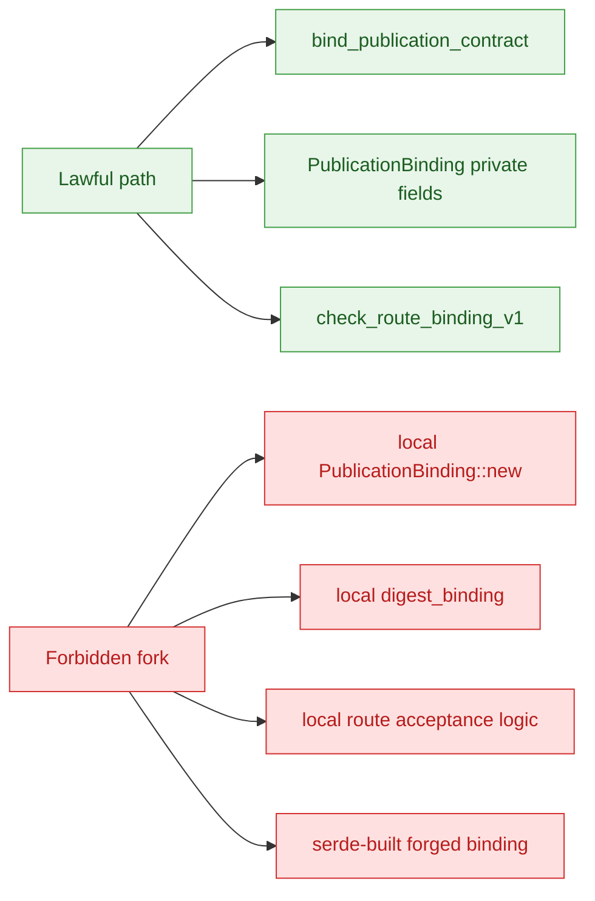

> [!IMPORTANT]
> Publication authority is intentionally split. Runtime owns the one lawful path that derives `PublicationBinding`, storage owns the exact route snapshot and route-check contract, and downstream validators or watchers must reuse both rather than construct local digests or alternate route acceptance rules. `crates/z00z_runtime/aggregators/README.md:15-27` `crates/z00z_storage/src/settlement/proof_batch_verify.rs:90-187`

This contract exists to prevent a subtle but dangerous drift: **one part of the system invents a second publication digest or a second interpretation of which shard route was actually lawful**. Z00Z avoids that by making `PublicationBinding` hard to forge, keeping `SettlementExecHandoff` semantic-only, and forcing validators and watchers to consume storage-owned route snapshots plus the runtime-owned binding. `crates/z00z_runtime/aggregators/src/types.rs:271-373` `crates/z00z_storage/src/settlement/store.rs:122-165`

## 🎯 At A Glance

| Surface | Responsibility | Why it matters | Source |
|---|---|---|---|
| `bind_publication_contract(...)` | One runtime-owned constructor path for `PublicationBinding`. | Prevents local reimplementation of publication digests. | `crates/z00z_runtime/aggregators/src/service.rs:40-48` |
| `PublicationBinding` | Runtime-owned publication digest plus bound `pub_in` facts. | Keeps fields private and `new` crate-private so callers cannot forge bindings. | `crates/z00z_runtime/aggregators/src/types.rs:271-373` |
| `SettlementExecHandoff` | Semantic ops plus committed route metadata only. | Runtime may forward store work and route context, but not proof truth or ad hoc binding digests. | `crates/z00z_storage/src/settlement/store.rs:78-165` |
| `PublicationRouteSnapshotV1` | Storage-owned exact publication route surface. | Captures routing generation, route-table digest, activation checkpoint, and shard set. | `crates/z00z_storage/src/settlement/proof_batch.rs:502-549` |
| `check_route_binding_v1(...)` | Storage-owned route acceptance contract. | Validates digest, checkpoint floor, routing generation, and shard membership. | `crates/z00z_storage/src/settlement/proof_batch_verify.rs:165-187` |
| Validator and watcher reuse | Downstream evidence path. | Confirms consumers rebuild flow via the lawful runtime and storage contracts instead of local forks. | `crates/z00z_runtime/validators/src/checkpoint.rs:19-76` `crates/z00z_runtime/watchers/src/publication.rs:39-93` |
| Guardrail tests | Policy lock-in. | Ensures there is one entrypoint, no serde path, and no downstream digest forks. | `crates/z00z_runtime/aggregators/tests/test_live_guardrails.rs:102-190` |

## 🧭 Anti-Fork Contract

<!-- Sources: crates/z00z_runtime/aggregators/src/service.rs:40-48, crates/z00z_runtime/aggregators/src/types.rs:271-373, crates/z00z_storage/src/settlement/proof_batch.rs:502-549, crates/z00z_storage/src/settlement/proof_batch_verify.rs:165-187, crates/z00z_runtime/validators/src/checkpoint.rs:19-76, crates/z00z_runtime/watchers/src/publication.rs:39-93 -->

<!-- Sources: crates/z00z_runtime/aggregators/src/service.rs:27-48, crates/z00z_runtime/aggregators/src/types.rs:232-249, crates/z00z_storage/src/settlement/store.rs:122-165, crates/z00z_runtime/validators/src/checkpoint.rs:19-76, crates/z00z_runtime/watchers/src/publication.rs:43-93 -->

<!-- Sources: crates/z00z_runtime/aggregators/src/service.rs:40-48, crates/z00z_runtime/aggregators/src/types.rs:285-373, crates/z00z_storage/src/settlement/proof_batch_verify.rs:165-187, crates/z00z_runtime/aggregators/tests/test_live_guardrails.rs:102-190 -->

## 📦 Runtime-Owned Binding Path

`bind_publication_contract(...)` is the only exported runtime function that constructs a `PublicationBinding`. Internally it forwards into `PublicationBinding::new(...)`, but `new` is only `pub(crate)`, not public API. That means downstream crates can read a binding but cannot legally manufacture one through the type itself. `crates/z00z_runtime/aggregators/src/service.rs:40-48` `crates/z00z_runtime/aggregators/src/types.rs:285-307`

The struct design reinforces this. `PublicationBinding` keeps all fields private, stores both `pub_in_digest` and `binding_digest`, exposes read-only getters, and provides only equality helpers such as `matches_pub_in(...)` and `matches_route_table_digest(...)`. There is no serde construction path on the type. `crates/z00z_runtime/aggregators/src/types.rs:271-373`

## ⚙️ Storage-Owned Route Truth

`SettlementExecHandoff` proves that runtime and storage are intentionally separate. The handoff contains only `SettlementRouteCtx`, semantic `StoreOp` items, and checkpoint execution transactions. It does not embed publication digests, proof blobs, or alternate route-verification logic. `crates/z00z_storage/src/settlement/store.rs:122-165`

Storage then owns the exact public route contract through `PublicationRouteSnapshotV1` and `check_route_binding_v1(...)`. The route snapshot requires ordered non-empty shard ids, while the verifier checks route-table digest equality, activation-checkpoint floor, routing-generation match, and shard membership. This is where the shard-set publication truth lives. `crates/z00z_storage/src/settlement/proof_batch.rs:502-549` `crates/z00z_storage/src/settlement/proof_batch_verify.rs:165-187`

## 🔑 Downstream Reuse Rules

Validators reconstruct the lawful publication flow by deriving a checkpoint id, verifying the published `pub_in`, checking the route binding against storage-owned route truth, and then calling `bind_publication_contract(...)`. Watchers take the resulting binding, verify `matches_pub_in(...)`, and again check the route through storage-owned verification. Neither side is supposed to hash or rebuild the binding locally. `crates/z00z_runtime/validators/src/checkpoint.rs:19-76` `crates/z00z_runtime/watchers/src/publication.rs:43-93`

The aggregator README spells out the anti-fork rule in prose: validators, watchers, and simulator traces must reuse the runtime-owned `PublicationBinding`, must consume storage-owned `PublicationRouteSnapshotV1`, must not fork a second publication digest or binding-construction path, and must not fork a second route-table acceptance contract. `crates/z00z_runtime/aggregators/README.md:15-27`

## 🚫 Guardrails That Lock The Contract

| Guardrail | What it blocks | Source |
|---|---|---|
| `PublicationBinding` has one runtime entrypoint | Multiple public construction paths. | `crates/z00z_runtime/aggregators/tests/test_live_guardrails.rs:102-158` |
| No serde derive on `PublicationBinding` | Forged bindings by external deserialization. | `crates/z00z_runtime/aggregators/tests/test_live_guardrails.rs:125-133` |
| Private fields | Struct-literal local binding construction. | `crates/z00z_runtime/aggregators/tests/test_live_guardrails.rs:134-151` |
| No downstream `PublicationBinding::new`, `digest_binding`, `digest_pub_in`, or `Sha256` | Local digest forks in validator or watcher code. | `crates/z00z_runtime/aggregators/tests/test_live_guardrails.rs:160-190` |

## 📖 References

- `crates/z00z_runtime/aggregators/README.md:15-27`
- `crates/z00z_runtime/aggregators/src/service.rs:27-48`
- `crates/z00z_runtime/aggregators/src/types.rs:220-373`
- `crates/z00z_storage/src/settlement/store.rs:78-165`
- `crates/z00z_storage/src/settlement/proof_batch.rs:502-575`
- `crates/z00z_storage/src/settlement/proof_batch_verify.rs:90-187`
- `crates/z00z_runtime/validators/src/checkpoint.rs:19-76`
- `crates/z00z_runtime/watchers/src/publication.rs:39-93`
- `crates/z00z_runtime/aggregators/tests/test_live_guardrails.rs:102-190`

## Related Pages

| Page | Relationship |
|---|---|
| [Settlement Runtime And Rollup](./settlement-runtime-and-rollup.md) | Gives the broader storage-versus-runtime ownership map. |
| [Object Package Rejects](./object-package-rejects.md) | Covers the separate typed-object admission contract later carried through publication. |
| [OnionNet Target Architecture](../07-networking-and-observability/onionnet-target-architecture.md) | Shows the future anonymous ingress layer that is supposed to terminate into runtime handoff. |
