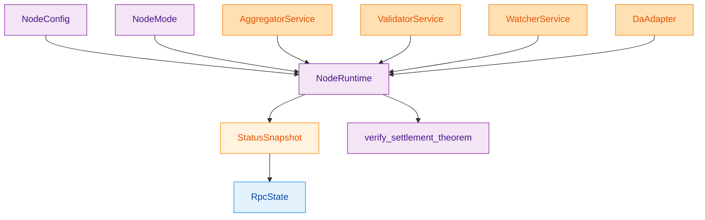
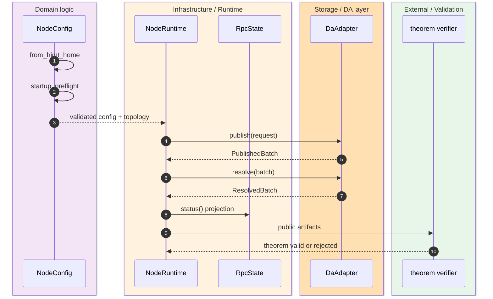
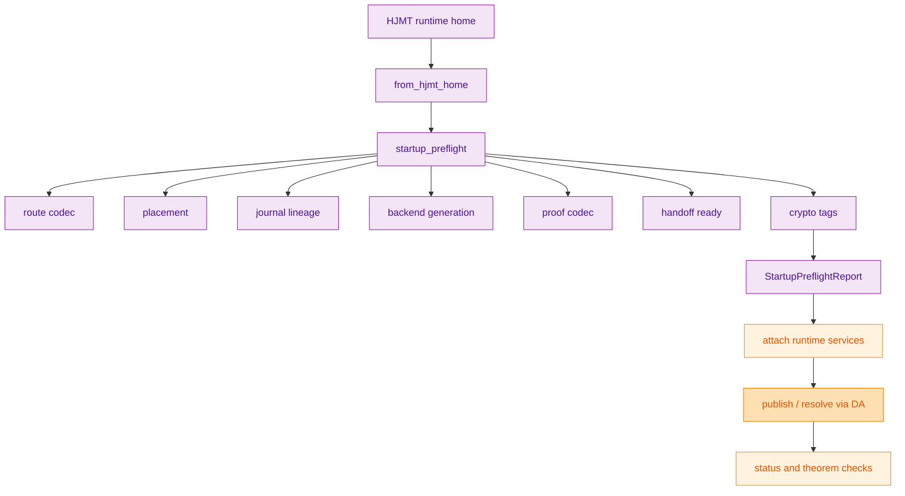

> [!IMPORTANT]
> `z00z_rollup_node` is not only the theorem verifier. The crate root explicitly defines `config`, `da`, `mode`, `rpc`, `runtime`, and `status` as the node-local composition surface, while `verify_settlement_theorem(...)` is only one public consistency check layered on top. `(crates/z00z_rollup_node/README.md:3)` `(crates/z00z_rollup_node/src/lib.rs:8)` `(crates/z00z_rollup_node/src/lib.rs:101)`

The runtime page matters because this crate sits exactly at the boundary where local node orchestration can look more authoritative than it really is. `NodeConfig` loads local topology fixtures and startup evidence, `NodeRuntime` composes attached services, `LocalDaAdapter` simulates publish/resolve with anti-replay checks, `StatusSnapshot` and `RpcState` project a public status view, and the theorem verifier checks only public artifacts. Planner placement authority, bind/publish rules, and storage semantic truth remain in the aggregator and storage crates. `(crates/z00z_rollup_node/README.md:11)` `(crates/z00z_rollup_node/src/runtime.rs:17)` `(crates/z00z_rollup_node/src/da.rs:67)` `(crates/z00z_rollup_node/src/da.rs:171)` `(crates/z00z_rollup_node/src/status.rs:11)`

## 🎯 Overview

| Surface | Status | Responsibility | Source |
|---|---|---|---|
| `NodeConfig::from_hjmt_home(...)` | `live` | Load local HJMT runtime fixture config and validate the profile. | `(crates/z00z_rollup_node/src/config.rs:375)` |
| `startup_preflight(...)` | `live` | Run route, placement, lineage, backend, proof, handoff, and crypto-tag checks before startup. | `(crates/z00z_rollup_node/src/config.rs:423)` |
| `NodeRuntime` | `live` | Compose attached aggregator, validator, watcher, and DA surfaces into one node runtime. | `(crates/z00z_rollup_node/src/runtime.rs:17)` |
| `LocalDaAdapter` | `adapter-only` | Local publish/resolve simulation with replay and metadata-drift protection. | `(crates/z00z_rollup_node/src/da.rs:67)` `(crates/z00z_rollup_node/src/da.rs:171)` |
| `StatusSnapshot` and `RpcState` | `live` | Project status, service attachments, verdicts, placement, and public reject codes. | `(crates/z00z_rollup_node/src/status.rs:11)` `(crates/z00z_rollup_node/src/rpc.rs:10)` |
| `verify_settlement_theorem(...)` | `live` | Verify the public checkpoint/tx/link theorem without rebuilding private witnesses. | `(crates/z00z_rollup_node/README.md:9)` `(crates/z00z_rollup_node/src/lib.rs:101)` |

## 🧭 Architecture

<!-- Sources: crates/z00z_rollup_node/src/config.rs:375, crates/z00z_rollup_node/src/mode.rs:4, crates/z00z_rollup_node/src/runtime.rs:17, crates/z00z_rollup_node/src/status.rs:11, crates/z00z_rollup_node/src/rpc.rs:10, crates/z00z_rollup_node/src/lib.rs:101 -->

| Component | Why it exists | Notes | Source |
|---|---|---|---|
| `NodeMode` | Fixes which runtime posture the node projects. | Includes `Aggregator`, `Validator`, `Watcher`, `Combined`, and `ApiOnly`. | `(crates/z00z_rollup_node/src/mode.rs:4)` |
| `config_digests()` | Makes local config state auditable. | Includes planner, storage, route table, runtime manifest, and aggregator configs. | `(crates/z00z_rollup_node/src/config.rs:397)` |
| `startup_preflight(...)` | Prevents local runtime drift before processes attach. | Emits a report with named checks and digests. | `(crates/z00z_rollup_node/src/config.rs:423)` |
| `canonical_placement(...)` | Chooses the best placement snapshot for public status. | Prefers exec-ticket placement over a stale cached placement view. | `(crates/z00z_rollup_node/src/runtime.rs:74)` `(crates/z00z_rollup_node/src/runtime.rs:86)` |
| `LocalDaAdapter` | Lets the node publish and resolve checkpoint bundles locally. | Rejects duplicate idempotency keys and metadata drift. | `(crates/z00z_rollup_node/src/da.rs:71)` `(crates/z00z_rollup_node/src/da.rs:129)` `(crates/z00z_rollup_node/src/da.rs:171)` |
| `StatusSnapshot::object_reject_codes()` | Projects validator-owned object reject codes for RPC consumers. | Keeps typed-object failures visible without re-deriving validator semantics. | `(crates/z00z_rollup_node/src/status.rs:24)` `(crates/z00z_rollup_node/src/rpc.rs:18)` |

## 📦 Components

| Runtime plane | Live contract | Boundary | Source |
|---|---|---|---|
| Config home | `from_hjmt_home(...)` loads local runtime fixture data. | Must not become storage semantic authority. | `(crates/z00z_rollup_node/src/config.rs:375)` |
| Preflight checks | route codec, placement, journal lineage, backend generation, proof codec, handoff readiness, crypto tags. | Node-local admissibility, not settlement truth. | `(crates/z00z_rollup_node/src/config.rs:434)` `(crates/z00z_rollup_node/src/config.rs:446)` `(crates/z00z_rollup_node/src/config.rs:473)` `(crates/z00z_rollup_node/src/config.rs:491)` |
| Service attachment | `aggregator`, `validator`, `watcher`, `da` optional handles inside `NodeRuntime`. | Detached services remain explicit in status projection. | `(crates/z00z_rollup_node/src/runtime.rs:24)` `(crates/z00z_rollup_node/src/runtime.rs:51)` |
| DA publish/resolve | `publish(...)` and `resolve(...)` around `PublicationRequest` / `PublishedBatch`. | Local adapter checks idempotency, binding digest, and resolve availability. | `(crates/z00z_rollup_node/src/da.rs:37)` `(crates/z00z_rollup_node/src/da.rs:129)` `(crates/z00z_rollup_node/src/da.rs:171)` |
| Public status | `StatusSnapshot` and `RpcState` expose projected public state. | They report, but do not recreate, runtime or validator truth. | `(crates/z00z_rollup_node/src/status.rs:11)` `(crates/z00z_rollup_node/src/rpc.rs:10)` |
| Theorem verification | `verify_settlement_theorem(...)` checks wallet tx + checkpoint bundle consistency. | Not a second bind/publish or proof-authority path. | `(crates/z00z_rollup_node/README.md:16)` `(crates/z00z_rollup_node/src/lib.rs:101)` |

## 🔄 Data Flow

<!-- Sources: crates/z00z_rollup_node/src/config.rs:375, crates/z00z_rollup_node/src/config.rs:423, crates/z00z_rollup_node/src/runtime.rs:51, crates/z00z_rollup_node/src/da.rs:37, crates/z00z_rollup_node/src/lib.rs:101 -->

`status()` is intentionally a projection function, not a discovery engine. It mirrors what the runtime already knows: current mode, topology, service attachment state, last publication, last published batch, canonical placement, exec ticket, validator verdict, provider signal, and watcher observation. Because `canonical_placement(...)` prefers the placement embedded in the last exec ticket, the public node view follows the most authoritative execution-local placement when both are present. `(crates/z00z_rollup_node/src/runtime.rs:51)` `(crates/z00z_rollup_node/src/runtime.rs:74)` `(crates/z00z_rollup_node/src/runtime.rs:86)`

## ⚙️ Implementation

<!-- Sources: crates/z00z_rollup_node/src/config.rs:375, crates/z00z_rollup_node/src/config.rs:423, crates/z00z_rollup_node/src/config.rs:434, crates/z00z_rollup_node/src/config.rs:446, crates/z00z_rollup_node/src/config.rs:491, crates/z00z_rollup_node/src/da.rs:129 -->

`LocalDaAdapter` is the clearest example of this crate's role. It is not a new publication-authority layer; it is a node-local adapter that materializes checkpoint publication records, tracks replay ids, and checks that resolved metadata still matches the checkpoint binding contract. If the adapter record drifts from recomputed binding state, `resolve(...)` returns `MetadataMismatch` rather than papering over the inconsistency. `(crates/z00z_rollup_node/src/da.rs:67)` `(crates/z00z_rollup_node/src/da.rs:129)` `(crates/z00z_rollup_node/src/da.rs:171)`

> [!NOTE]
> The public theorem verifier sits beside the runtime, not above it. `verify_settlement_theorem(...)` consumes the final `TxPackage`, `CheckpointArtifact`, `CheckpointExecInput`, and `CheckpointLink`, then checks public consistency such as checkpoint statement presence, proof payload match, exec-input replay id, root alignment, checkpoint id binding, and tx inclusion. It does not reconstruct private witnesses or replace storage/runtime ownership. `(crates/z00z_rollup_node/src/lib.rs:101)`

## 📖 References

- `(crates/z00z_rollup_node/README.md:3)`
- `(crates/z00z_rollup_node/src/lib.rs:8)`
- `(crates/z00z_rollup_node/src/lib.rs:101)`
- `(crates/z00z_rollup_node/src/config.rs:375)`
- `(crates/z00z_rollup_node/src/config.rs:397)`
- `(crates/z00z_rollup_node/src/config.rs:423)`
- `(crates/z00z_rollup_node/src/runtime.rs:17)`
- `(crates/z00z_rollup_node/src/runtime.rs:51)`
- `(crates/z00z_rollup_node/src/status.rs:11)`
- `(crates/z00z_rollup_node/src/rpc.rs:10)`
- `(crates/z00z_rollup_node/src/da.rs:67)`
- `(crates/z00z_rollup_node/src/mode.rs:4)`

## 🔗 Related Pages

| Page | Relationship |
|---|---|
| [Rollup Theorem Verifier](./rollup-theorem-verifier.md) | Goes deeper on the final public-artifact checks performed by the theorem verifier itself. |
| [Settlement Runtime And Rollup](./settlement-runtime-and-rollup.md) | Places the node runtime in the broader storage/runtime composition story. |
| [Publication Route Authority](./publication-route-authority.md) | Explains why route binding authority stays outside the rollup-node crate. |
| [Checkpoint Link Contract](./checkpoint-link-contract.md) | Covers the storage-owned checkpoint/link bundle that this node runtime publishes and verifies. |
