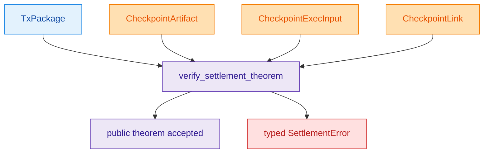
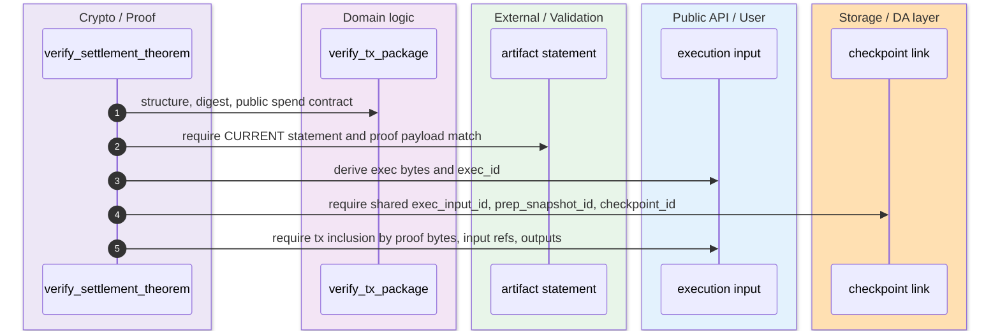
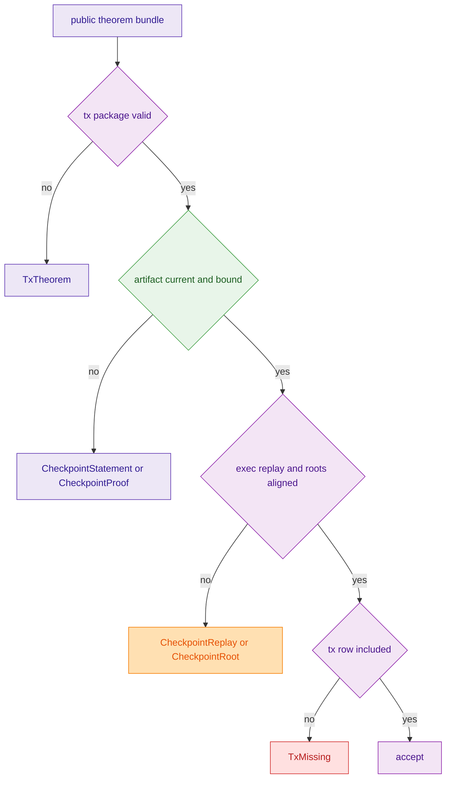

The rollup theorem verifier is deliberately narrow. It verifies one canonical public bundle consisting of a wallet `TxPackage`, a `CheckpointArtifact`, a `CheckpointExecInput`, and a `CheckpointLink`, and it does so without rebuilding private witnesses or treating output range proofs as settlement closure. The rollup README calls the crate the public settlement theorem verifier, and `src/lib.rs` encodes the exact checks. `crates/z00z_rollup_node/README.md:3-15` `crates/z00z_rollup_node/src/lib.rs:85-139`

## 🎯 At A Glance

| Component | Responsibility | Key file | Source |
|---|---|---|---|
| Rollup README | Declares the crate as the public settlement theorem verifier. | `crates/z00z_rollup_node/README.md` | `crates/z00z_rollup_node/README.md:1-15` |
| Theorem verifier | Defines `SettlementTheorem`, `SettlementError`, and `verify_settlement_theorem(...)`. | `crates/z00z_rollup_node/src/lib.rs` | `crates/z00z_rollup_node/src/lib.rs:56-139` |
| Inclusion checks | Matches transaction package proof bytes, input refs, and output leaves against execution input rows. | `crates/z00z_rollup_node/src/lib.rs` | `crates/z00z_rollup_node/src/lib.rs:174-253` |
| End-to-end theorem test | Builds a real fixture bundle and tests verifier failure modes. | `crates/z00z_rollup_node/tests/test_rollup_theorem_guard.rs` | `crates/z00z_rollup_node/tests/test_rollup_theorem_guard.rs:1-257` |
| Broader preflight gate | Shows what startup preflight checks that the theorem verifier itself does not. | `crates/z00z_rollup_node/tests/test_hjmt_preflight.rs`, `crates/z00z_rollup_node/src/config.rs` | `crates/z00z_rollup_node/tests/test_hjmt_preflight.rs:24-124` `crates/z00z_rollup_node/src/config.rs:172-200` |

## 📦 Architecture

<!-- Sources: crates/z00z_rollup_node/src/lib.rs:85-139 -->

<!-- Sources: crates/z00z_rollup_node/src/lib.rs:97-139, crates/z00z_rollup_node/src/lib.rs:141-253 -->

<!-- Sources: crates/z00z_rollup_node/src/lib.rs:97-139, crates/z00z_rollup_node/src/lib.rs:174-253 -->

## 🔑 Exact Checks

| Check | How it is implemented | Error lane | Source |
|---|---|---|---|
| Tx package theorem | Serializes the package, runs `TxVerifierImpl::verify_structure`, recomputes `tx_digest_hex`, and verifies the public spend contract. | `TxTheorem` | `crates/z00z_rollup_node/src/lib.rs:141-165` |
| Current checkpoint statement | Rejects `CheckpointStatement::Detached`. | `CheckpointStatement` | `crates/z00z_rollup_node/src/lib.rs:101-106` |
| Artifact proof payload binding | Requires `artifact.cp_proof()` to equal the statement backend payload. | `CheckpointProof` | `crates/z00z_rollup_node/src/lib.rs:108-110` |
| Execution replay binding | Re-encodes `CheckpointExecInput`, derives `exec_id`, and checks it against both statement and link. | `CheckpointReplay` | `crates/z00z_rollup_node/src/lib.rs:112-117` |
| Snapshot and root alignment | Requires shared `prep_snapshot_id`, shared previous root across statement, artifact, exec input, and tx spend proof. | `CheckpointLink` or `CheckpointRoot` | `crates/z00z_rollup_node/src/lib.rs:118-130` |
| Checkpoint link binding | Re-derives `checkpoint_id` from the artifact and requires the link to carry it. | `CheckpointLink` | `crates/z00z_rollup_node/src/lib.rs:132-137` |
| Tx inclusion | Compares tx proof bytes, input terminal/serial refs, and output leaves against execution input rows. | `TxMissing` | `crates/z00z_rollup_node/src/lib.rs:174-253` |

## 📌 Intentional Non-Goals

The verifier explicitly accepts only public artifacts and never rebuilds private witnesses. That boundary is encoded in the rustdoc on `verify_settlement_theorem(...)`, not just in surrounding prose. It also never treats output range proofs as settlement closure; it relies on the already-public spend contract and checkpoint artifacts instead. `crates/z00z_rollup_node/src/lib.rs:97-101`

That is why the theorem tests build a complete fixture bundle ahead of time: the verifier consumes already-formed public artifacts instead of proving private construction itself. `crates/z00z_rollup_node/tests/test_rollup_theorem_guard.rs:110-257`

## ⚙️ What Startup Preflight Adds

`verify_settlement_theorem(...)` is narrower than node startup preflight. The preflight path in `NodeConfig` also checks HJMT route-digest alignment, expected journal lineage, proof codec readiness, handoff readiness, and other startup checks that are outside the theorem verifier's scope. The preflight tests exercise wrong-lineage, missing-route, wrong-root-generation, and wrong-proof-version cases. `crates/z00z_rollup_node/src/config.rs:172-200` `crates/z00z_rollup_node/src/config.rs:423-515` `crates/z00z_rollup_node/tests/test_hjmt_preflight.rs:79-220`

So the theorem verifier should be read as the final public consistency check for one published settlement bundle, not as a replacement for runtime or storage readiness gates.

## Related Pages

| Page | Relationship |
|---|---|
| [Settlement Path Proofs](./settlement-path-proofs.md) | Explains the storage-owned proof artifacts that remain below this public theorem layer. |
| [Runtime Aggregator Surface](./runtime-aggregator-surface.md) | Covers the planner and publication surfaces that produce the route-bound execution context. |
| [Scenario1 Object Artifacts](../06-simulator-and-quality/scenario1-object-artifacts.md) | Shows where the simulator emits `val_flow`, `watch_flow`, and HJMT-related public packet evidence. |
