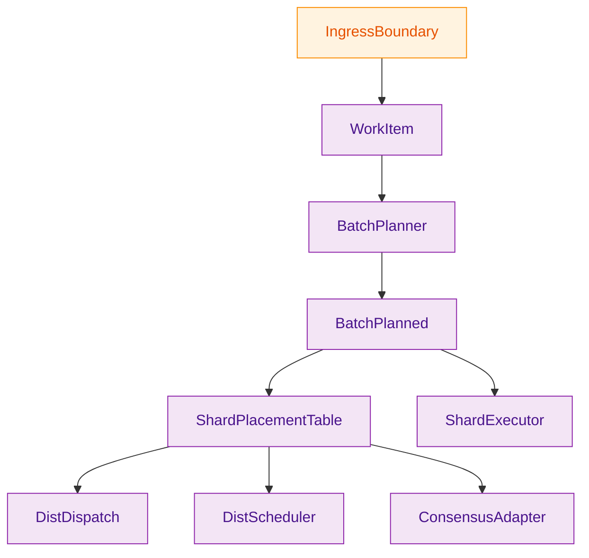
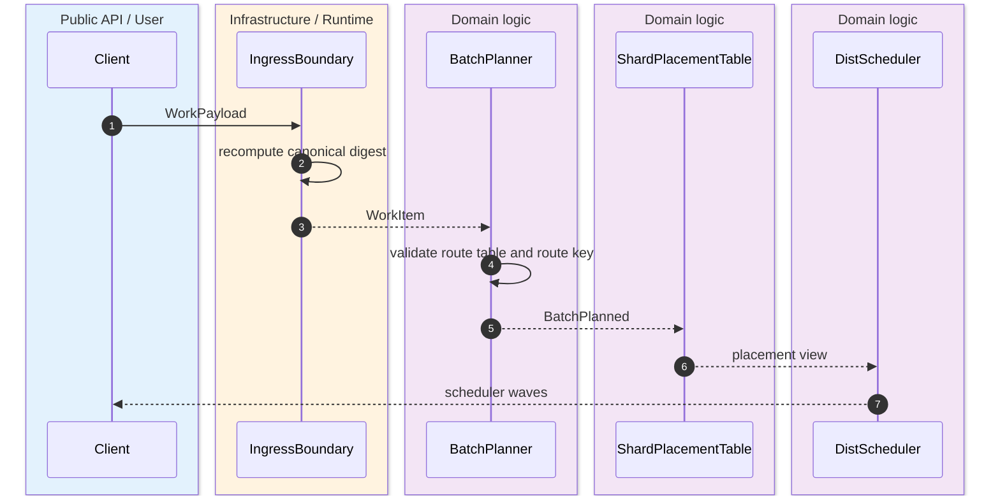
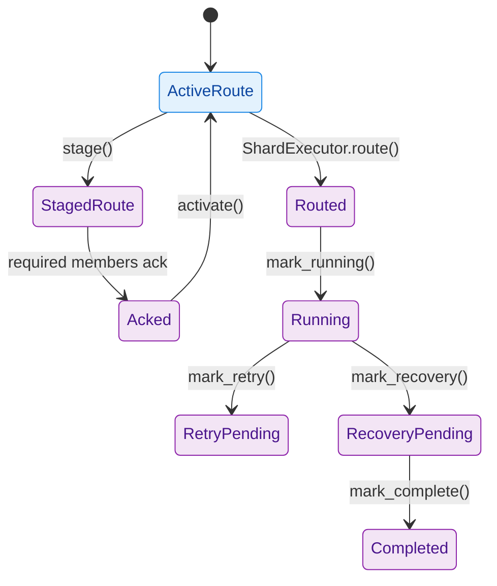

`z00z_runtime/aggregators` is the runtime-owned planning and publication boundary. It does not own settlement semantics or rollup verification, but it does own the planner-ready `WorkItem` path, the canonical `ShardRouteTable` byte contract, shard placement, rollout activation, distributed scheduling, local consensus, and recovery gating. The crate README and `lib.rs` make that split explicit. `crates/z00z_runtime/aggregators/README.md:3-28` `crates/z00z_runtime/aggregators/src/lib.rs:1-44`

## 🎯 At A Glance

| Component | Responsibility | Key file | Source |
|---|---|---|---|
| Ingress | Recomputes payload-bound digests and rejects forged digest metadata. | `crates/z00z_runtime/aggregators/src/ingress.rs` | `crates/z00z_runtime/aggregators/src/ingress.rs:12-65` |
| Route table and planner | Canonicalizes route-table bytes, validates full hash coverage, and builds single-shard planned batches. | `crates/z00z_runtime/aggregators/src/batch_planner.rs` | `crates/z00z_runtime/aggregators/src/batch_planner.rs:79-167` `crates/z00z_runtime/aggregators/src/batch_planner.rs:273-360` |
| Placement | Binds shards to primaries, standbys, and expected journal lineage. | `crates/z00z_runtime/aggregators/src/placement.rs` | `crates/z00z_runtime/aggregators/src/placement.rs:48-159` |
| Rollout and dispatch | Stages, acknowledges, activates route-table migrations, and dispatches shard-owned work. | `crates/z00z_runtime/aggregators/src/dist_dispatch.rs` | `crates/z00z_runtime/aggregators/src/dist_dispatch.rs:91-258` `crates/z00z_runtime/aggregators/src/dist_dispatch.rs:273-309` |
| Scheduler and consensus | Groups work into owner-bound waves and keeps local same-shard quorum state aligned with placement. | `crates/z00z_runtime/aggregators/src/dist_scheduler.rs`, `crates/z00z_runtime/aggregators/src/consensus_adapter.rs` | `crates/z00z_runtime/aggregators/src/dist_scheduler.rs:38-131` `crates/z00z_runtime/aggregators/src/consensus_adapter.rs:99-244` |

## 📦 Architecture

<!-- Sources: crates/z00z_runtime/aggregators/src/lib.rs:18-43, crates/z00z_runtime/aggregators/src/ingress.rs:12-65, crates/z00z_runtime/aggregators/src/batch_planner.rs:273-360, crates/z00z_runtime/aggregators/src/placement.rs:109-159, crates/z00z_runtime/aggregators/src/dist_dispatch.rs:262-315, crates/z00z_runtime/aggregators/src/dist_scheduler.rs:38-131, crates/z00z_runtime/aggregators/src/consensus_adapter.rs:99-244, crates/z00z_runtime/aggregators/src/shard_exec.rs:15-76 -->

<!-- Sources: crates/z00z_runtime/aggregators/src/ingress.rs:12-65, crates/z00z_runtime/aggregators/src/batch_planner.rs:289-357, crates/z00z_runtime/aggregators/src/placement.rs:141-159, crates/z00z_runtime/aggregators/src/dist_scheduler.rs:52-131 -->

<!-- Sources: crates/z00z_runtime/aggregators/src/dist_dispatch.rs:127-258, crates/z00z_runtime/aggregators/src/shard_exec.rs:7-76 -->

## 🔑 Core Contracts

| Surface | Runtime rule | Source |
|---|---|---|
| Ingress | Caller-supplied digest strings are never planner authority; ingress recomputes the digest from payload bytes and rejects mismatches. | `crates/z00z_runtime/aggregators/README.md:20-23` `crates/z00z_runtime/aggregators/src/ingress.rs:27-65` |
| Route table | Shard sets must be sorted and unique; rules must be sorted, gap-free, and cover the full hash domain; later generations must carry `previous_generation_digest`. | `crates/z00z_runtime/aggregators/src/batch_planner.rs:103-167` `crates/z00z_runtime/aggregators/src/batch_planner.rs:169-257` |
| Current planning wave | One planned batch must stay single-shard in the current runtime wave. | `crates/z00z_runtime/aggregators/README.md:7-9` `crates/z00z_runtime/aggregators/src/batch_planner.rs:346-356` |
| Placement | Route ownership is tied to `primary_id`, standby set, and `expected_journal_lineage`. | `crates/z00z_runtime/aggregators/src/placement.rs:48-107` |
| Scheduler | Throughput claims stay publication-root scoped even when work fans out into scheduler waves. | `crates/z00z_runtime/aggregators/README.md:11-13` `crates/z00z_runtime/aggregators/src/dist_scheduler.rs:114-130` |

## ⚙️ Route Rollout And Dispatch

| Step | Enforcement | Source |
|---|---|---|
| Stage a rollout | Rejects double-staging, validates migration against the active table, and requires at least one acknowledgement target. | `crates/z00z_runtime/aggregators/src/dist_dispatch.rs:127-170` |
| Acknowledge | Rejects stale ack, late joiner, wrong generation, or stale digest. | `crates/z00z_runtime/aggregators/src/dist_dispatch.rs:172-217` |
| Activate | Requires checkpoint reach and a full ack set before the staged route becomes active. | `crates/z00z_runtime/aggregators/src/dist_dispatch.rs:219-258` |
| Construct dispatch surface | `DistDispatch::new(...)` rejects placement tables that do not align with the route generation and rejects empty owner sets. | `crates/z00z_runtime/aggregators/src/dist_dispatch.rs:273-309` |

## 📌 Scheduler, Consensus, And Execution

`DistScheduler` groups normalized items by `(owner_id, shard_id)`, materializes one planned batch per group, and emits waves that pop one batch per owner queue. `crates/z00z_runtime/aggregators/src/dist_scheduler.rs:58-130`

`ConsensusAdapter` is explicitly placement-bound: it reconstructs the expected member set from the live placement table and rejects membership drift. It also freezes a term if two conflicting journal candidates reach the same quorum term, which is the local same-term split-brain fence. `crates/z00z_runtime/aggregators/src/consensus_adapter.rs:147-173` `crates/z00z_runtime/aggregators/src/consensus_adapter.rs:175-244`

`ShardExecutor` keeps the execution-state model intentionally narrow: `Routed`, `Running`, `RetryPending`, `RecoveryPending`, and `Completed`. Those states are runtime metadata, not proof-visible truth. `crates/z00z_runtime/aggregators/src/shard_exec.rs:7-76` `crates/z00z_runtime/aggregators/README.md:14-16`

## Related Pages

| Page | Relationship |
|---|---|
| [Publication Route Authority](./publication-route-authority.md) | Explains the lawful runtime binding path into storage publication checks. |
| [Settlement Recovery Failover](./settlement-recovery-failover.md) | Focuses on the recovery slice of this broader runtime surface. |
| [Rollup Theorem Verifier](./rollup-theorem-verifier.md) | Shows what the rollup node consumes downstream after runtime planning and publication. |
