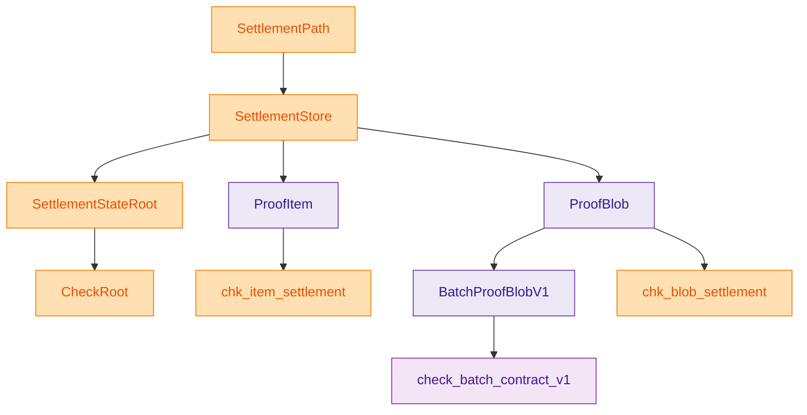
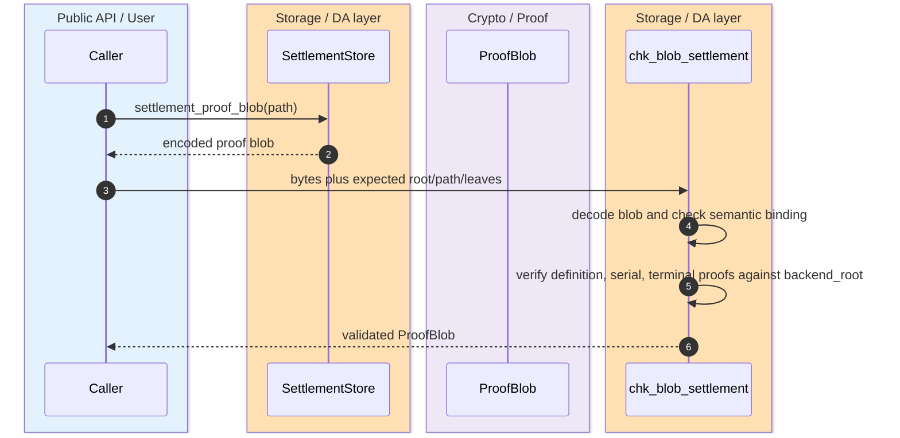
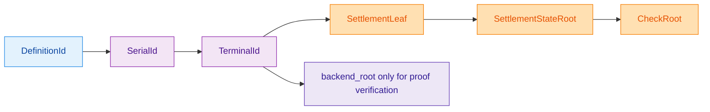

The settlement surface is intentionally typed around one canonical path shape: `definition_id -> serial_id -> terminal_id`. Everything else in the proof model hangs off that path discipline. The storage README is explicit that flat aliases, raw backend proof types, and root conflation are outside the public contract, and `mod.rs` re-exports only storage-owned roots, path types, proof envelopes, and validators. `crates/z00z_storage/src/settlement/README.md:3-16` `crates/z00z_storage/src/settlement/mod.rs:32-93`

## 🎯 At A Glance

| Component | Responsibility | Key file | Source |
|---|---|---|---|
| Public contract README | Defines canonical path order, root roles, and proof ownership. | `crates/z00z_storage/src/settlement/README.md` | `crates/z00z_storage/src/settlement/README.md:8-16` `crates/z00z_storage/src/settlement/README.md:104-120` |
| Public facade | Re-exports roots, path types, proof types, batch proof types, and validators. | `crates/z00z_storage/src/settlement/mod.rs` | `crates/z00z_storage/src/settlement/mod.rs:32-93` |
| Single-path proof envelope | Defines `ProofBlob`, `backend_root`, root binding, and blob validators. | `crates/z00z_storage/src/settlement/proof.rs` | `crates/z00z_storage/src/settlement/proof.rs:457-601` `crates/z00z_storage/src/settlement/proof.rs:1132-1218` |
| Batch proof contract | Verifies the shared batch envelope fail-closed, including root binding and canonical path ordering. | `crates/z00z_storage/src/settlement/proof_batch_verify.rs` | `crates/z00z_storage/src/settlement/proof_batch_verify.rs:65-73` `crates/z00z_storage/src/settlement/proof_batch_verify.rs:189-220` |
| Storage facade | Keeps semantic settlement APIs and proof emission behind `SettlementTreeBackend`. | `crates/z00z_storage/src/settlement/store.rs` | `crates/z00z_storage/src/settlement/store.rs:309-470` |

## 📦 Architecture

<!-- Sources: crates/z00z_storage/src/settlement/README.md:126-149, crates/z00z_storage/src/settlement/mod.rs:38-87, crates/z00z_storage/src/settlement/store.rs:313-387, crates/z00z_storage/src/settlement/proof.rs:1132-1232, crates/z00z_storage/src/settlement/proof_batch_verify.rs:65-73 -->

<!-- Sources: crates/z00z_storage/src/settlement/README.md:216-254, crates/z00z_storage/src/settlement/proof.rs:1161-1218 -->

<!-- Sources: crates/z00z_storage/src/settlement/README.md:84-120, crates/z00z_storage/src/settlement/proof.rs:477-507, crates/z00z_storage/src/settlement/proof.rs:581-589 -->

## 🔑 Path And Root Model

| Contract | Meaning | Source |
|---|---|---|
| `DefinitionId` | Namespace-level identity for one definition family. | `crates/z00z_storage/src/settlement/README.md:84-91` |
| `SerialId` | Serial bucket within one definition namespace. | `crates/z00z_storage/src/settlement/README.md:84-91` |
| `TerminalId` | Terminal settlement leaf identity. | `crates/z00z_storage/src/settlement/README.md:84-91` |
| `SettlementStateRoot` | Public semantic commitment for the canonical hierarchy. | `crates/z00z_storage/src/settlement/README.md:94-100` |
| `CheckRoot` | Checkpoint-facing type derived from `SettlementStateRoot`. | `crates/z00z_storage/src/settlement/README.md:96-100` |
| `backend_root` | Proof-local physical root bytes, never a public state root. | `crates/z00z_storage/src/settlement/README.md:108-120` `crates/z00z_storage/src/settlement/proof.rs:581-589` |

## 📁 Proof Surface

| API | What it proves | Important boundary | Source |
|---|---|---|---|
| `ProofItem` | Semantic tuple of root, path, definition leaf, serial leaf, and leaf payload. | No backend branch proofs. | `crates/z00z_storage/src/settlement/README.md:233-240` |
| `ProofBlob` | One storage-owned witness blob with semantic item plus backend proof bytes. | Carries `backend_root` but binds it to `SettlementStateRoot` via `root_bind`. | `crates/z00z_storage/src/settlement/proof.rs:457-507` `crates/z00z_storage/src/settlement/proof.rs:1069-1076` |
| `ProofScanOut` | Sanitized view after verification. | Strips raw branch proofs so callers do not treat membership evidence as broader theorem evidence. | `crates/z00z_storage/src/settlement/proof.rs:937-1066` |
| `BatchProofBlobV1` | Shared batch proof envelope. | Must verify fail-closed through `check_batch_contract_v1(...)`. | `crates/z00z_storage/src/settlement/README.md:249-254` `crates/z00z_storage/src/settlement/proof_batch_verify.rs:65-73` |

## ⚙️ Verification Steps

| Verifier | What it checks | What it intentionally does not do | Source |
|---|---|---|---|
| `chk_item_settlement(...)` | Root equality, path equality, definition-leaf match, serial-leaf match, terminal-leaf match. | No backend proof decoding. | `crates/z00z_storage/src/settlement/proof.rs:1132-1159` |
| `chk_blob_settlement(...)` | Decodes the blob, reuses `chk_item_settlement(...)`, checks terminal leaf hash, checks `root_bind`, verifies definition/serial/terminal proofs against `backend_root`. | Does not reinterpret `backend_root` as semantic state authority. | `crates/z00z_storage/src/settlement/proof.rs:1161-1218` |
| `check_batch_contract_v1(...)` | Checks header, canonical path ordering, exact usage, openings, transcript binding, and atomic roots. | Does not permit partial acceptance on contract drift. | `crates/z00z_storage/src/settlement/proof_batch_verify.rs:65-73` `crates/z00z_storage/src/settlement/proof_batch_verify.rs:189-220` |

## 📌 Boundary Rules

Downstream code is supposed to consume `SettlementStore`, `ProofItem`, `ProofBlob`, `chk_item_settlement`, and `chk_blob_settlement` rather than reconstruct witness semantics by hand. The README calls out three forbidden compressions explicitly: do not treat `backend_root` as the public state root, do not collapse the three-level path into one flat identity, and do not expose raw JMT proof or node types from higher layers. `crates/z00z_storage/src/settlement/README.md:526-538`

## Related Pages

| Page | Relationship |
|---|---|
| [Settlement Runtime And Rollup](./settlement-runtime-and-rollup.md) | Higher-level overview of how storage composes with runtime and rollup. |
| [Object Package Rejects](./object-package-rejects.md) | Admission surface built on top of the same typed object and proof model. |
| [Rollup Theorem Verifier](./rollup-theorem-verifier.md) | Explains how rollup reuses only public checkpoint and spend artifacts rather than raw settlement proofs. |
