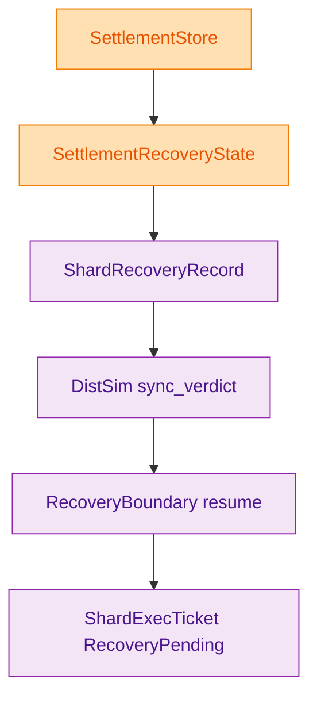
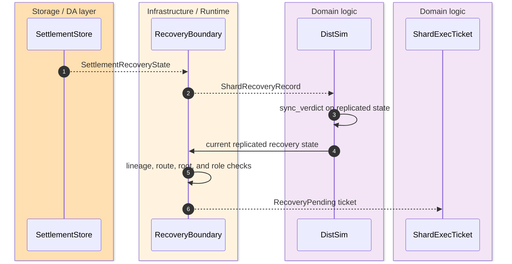
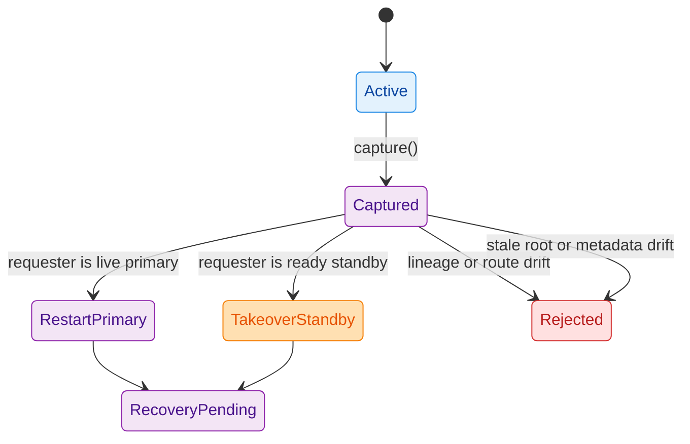

Recovery is intentionally modeled as a storage-exported semantic state plus a runtime-owned restart gate, not as a second source of truth. `SettlementStore::recovery_state()` exports the durable recovery record, runtime wraps that into `ShardRecoveryRecord`, and `RecoveryBoundary::resume(...)` only re-enters execution when journal lineage, routing generation, shard identity, state root, and backend generation metadata all still match. `crates/z00z_storage/src/settlement/README.md:193-210` `crates/z00z_storage/src/settlement/store.rs:659-700` `crates/z00z_runtime/aggregators/src/recovery.rs:63-212`

## 🎯 At A Glance

| Component | Responsibility | Key file | Source |
|---|---|---|---|
| Recovery contract README | Defines recovery metadata as the exported baseline and rejects shared WAL authority. | `crates/z00z_storage/src/settlement/README.md` | `crates/z00z_storage/src/settlement/README.md:193-210` |
| Recovery state type | Owns `version`, `state_root`, proof metadata, `journal_lineage`, and optional route context. | `crates/z00z_storage/src/settlement/store.rs` | `crates/z00z_storage/src/settlement/store.rs:241-298` |
| Runtime recovery gate | Enforces restart and standby takeover legality. | `crates/z00z_runtime/aggregators/src/recovery.rs` | `crates/z00z_runtime/aggregators/src/recovery.rs:63-212` |
| Distributed simulator | Pre-filters replicated state drift before calling `RecoveryBoundary`. | `crates/z00z_runtime/aggregators/src/dist_sim.rs` | `crates/z00z_runtime/aggregators/src/dist_sim.rs:272-356` |
| Recovery policy summary | Documents same-lineage takeover and fail-closed rejection classes. | `crates/z00z_runtime/aggregators/README.md` | `crates/z00z_runtime/aggregators/README.md:30-38` |
| Concrete scenarios | Proves same-lineage takeover and primary restart through tests. | `crates/z00z_runtime/aggregators/tests/test_hjmt_failover_same_lineage.rs` | `crates/z00z_runtime/aggregators/tests/test_hjmt_failover_same_lineage.rs:53-118` |

## 📦 Architecture

<!-- Sources: crates/z00z_storage/src/settlement/store.rs:659-700, crates/z00z_runtime/aggregators/src/recovery.rs:41-70, crates/z00z_runtime/aggregators/src/dist_sim.rs:272-356 -->

<!-- Sources: crates/z00z_storage/src/settlement/store.rs:659-700, crates/z00z_runtime/aggregators/src/dist_sim.rs:272-356, crates/z00z_runtime/aggregators/src/recovery.rs:71-212 -->

<!-- Sources: crates/z00z_runtime/aggregators/src/recovery.rs:41-212, crates/z00z_runtime/aggregators/README.md:32-37 -->

## 🔑 Exported Recovery Payload

| Field | Meaning | Source |
|---|---|---|
| `version` | Durable HJMT version of the active state. | `crates/z00z_storage/src/settlement/store.rs:243-250` |
| `state_root` | Current semantic `SettlementStateRoot`. | `crates/z00z_storage/src/settlement/store.rs:243-250` |
| `root_generation` and `proof_version` | Storage proof-generation metadata that must remain stable across restart. | `crates/z00z_storage/src/settlement/store.rs:245-248` |
| `bucket_policy_generation` and `bucket_policy_id` | Active bucket policy identity carried into recovery checks. | `crates/z00z_storage/src/settlement/store.rs:248-249` |
| `journal_lineage` | Durable lineage digest used to reject wrong-lineage resumes. | `crates/z00z_storage/src/settlement/store.rs:250-280` |
| `route` | Optional `SettlementRouteCtx`; required for nonzero recovery versions in runtime resume. | `crates/z00z_storage/src/settlement/store.rs:251-282` `crates/z00z_runtime/aggregators/src/recovery.rs:104-145` |

## ⚙️ Resume Gate Conditions

| Check | Failure meaning | Source |
|---|---|---|
| Placement still owns the shard | Recovery route is no longer owned by the live placement table. | `crates/z00z_runtime/aggregators/src/recovery.rs:71-78` |
| Routing generation still matches | Placement drifted to a different route generation. | `crates/z00z_runtime/aggregators/src/recovery.rs:80-85` |
| Live primary still matches | Prevents split-brain primary drift. | `crates/z00z_runtime/aggregators/src/recovery.rs:87-92` |
| Expected journal lineage matches everywhere | Rejects wrong-lineage recovery. | `crates/z00z_runtime/aggregators/src/recovery.rs:94-102` |
| Durable route metadata still matches shard placement | Rejects wrong shard, wrong route digest, and stale batch replay. | `crates/z00z_runtime/aggregators/src/recovery.rs:104-145` |
| Durable version and state root still match | Rejects stale restart and stale local root. | `crates/z00z_runtime/aggregators/src/recovery.rs:148-170` |
| Requester role is lawful | Only the live primary may restart; only a ready standby may take over. | `crates/z00z_runtime/aggregators/src/recovery.rs:173-205` |

## 📌 Distributed Simulation Layer

`DistSim` is not an optional toy layer here. Before it delegates to `RecoveryBoundary`, it checks that the requesting node actually holds replicated state for the latest batch, latest `journal_lineage`, latest version, latest state root, latest backend generation metadata, and the same route context. That catches partial replay, wrong-lineage replication, stale local roots, and wrong-shard route drift before runtime even evaluates the role-based resume rules. `crates/z00z_runtime/aggregators/src/dist_sim.rs:272-356`

The runtime README summarizes the same contract in operational language: same-lineage standby takeover is lawful only when shard id, routing generation, journal lineage, and live local root metadata all match; wrong lineage, wrong generation, stale local root, stale restart, standby down, and split-brain states reject fail-closed. `crates/z00z_runtime/aggregators/README.md:30-38`

## Related Pages

| Page | Relationship |
|---|---|
| [Publication Route Authority](./publication-route-authority.md) | Explains the lawful runtime-to-storage handoff path that precedes recovery evidence. |
| [Runtime Aggregator Surface](./runtime-aggregator-surface.md) | Covers the broader planner, placement, dispatch, and consensus seams around this recovery gate. |
| [Settlement Path Proofs](./settlement-path-proofs.md) | Explains the proof-generation metadata reused in the recovery payload. |
