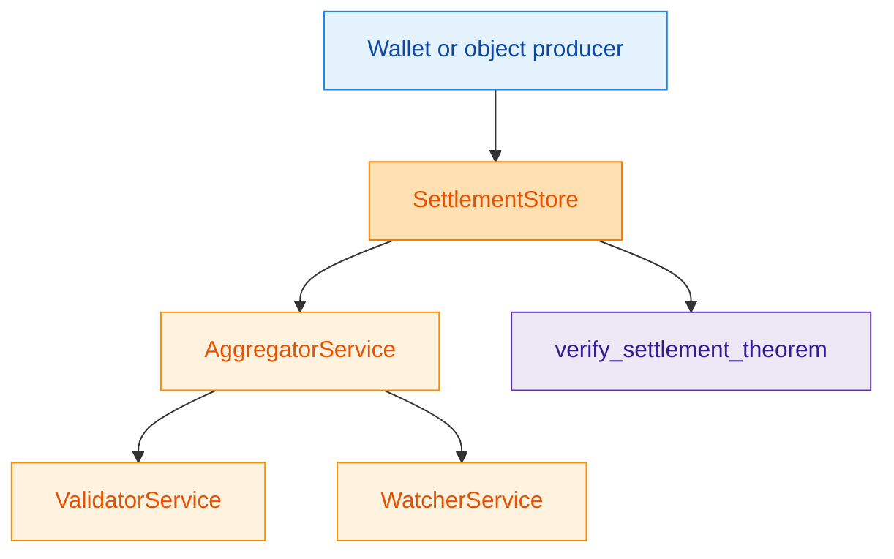
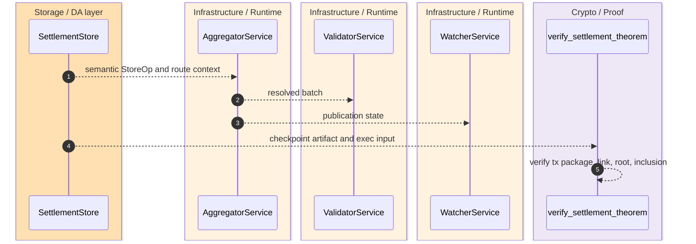
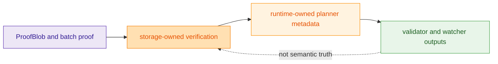

The canonical seam is explicit and single-path: runtime owns bind and publish, storage owns settlement roots plus proof and recovery truth, and rollup owns only the final public theorem verification over those published artifacts. Validators, watchers, and simulator traces consume that same seam; they must not create competing roots, proof contracts, publication bindings, or theorem paths. `crates/z00z_storage/README.md:4-18` `crates/z00z_runtime/aggregators/README.md:3-29` `crates/z00z_rollup_node/README.md:3-15`

## 🎯 At A Glance

| Component | Responsibility | Key file | Source |
|---|---|---|---|
| Settlement module | Exposes `SettlementPath`, `SettlementStateRoot`, stores, proof checks, and object package contracts. | `crates/z00z_storage/src/settlement/mod.rs` | `crates/z00z_storage/src/settlement/mod.rs:32-93` |
| Aggregator runtime | Owns planning, placement, publication, and recovery boundaries. | `crates/z00z_runtime/aggregators/src/lib.rs` | `crates/z00z_runtime/aggregators/src/lib.rs:18-44` |
| Validator runtime | Owns checkpoint flow, tx/claim verification, and verdict emission. | `crates/z00z_runtime/validators/src/lib.rs` | `crates/z00z_runtime/validators/src/lib.rs:14-28` |
| Watcher runtime | Owns observation and alert surfaces over published state. | `crates/z00z_runtime/watchers/src/lib.rs` | `crates/z00z_runtime/watchers/src/lib.rs:13-20` |
| Rollup verifier | Verifies the canonical theorem bundle without reconstructing private witnesses. | `crates/z00z_rollup_node/src/lib.rs` | `crates/z00z_rollup_node/src/lib.rs:85-165` |

## 🧭 Ownership Flow

<!-- Sources: crates/z00z_storage/src/settlement/README.md:144-157, crates/z00z_runtime/aggregators/README.md:14-16, crates/z00z_runtime/validators/README.md:13-18, crates/z00z_runtime/watchers/README.md:11-16, crates/z00z_rollup_node/README.md:8-15 -->

<!-- Sources: crates/z00z_storage/src/settlement/README.md:172-183, crates/z00z_runtime/aggregators/src/lib.rs:34-44, crates/z00z_rollup_node/src/lib.rs:97-165 -->

<!-- Sources: crates/z00z_storage/src/settlement/README.md:214-255, crates/z00z_runtime/watchers/README.md:13-16, crates/z00z_runtime/validators/README.md:15-18 -->

## 📦 Why Storage Is The Semantic Authority

| Storage export | Meaning | Why downstream consumers must not replace it | Source |
|---|---|---|---|
| `SettlementPath` | Canonical typed address `definition_id -> serial_id -> terminal_id`. | Downstream code should consume typed paths, not invent flat aliases. | `crates/z00z_storage/src/settlement/README.md:8-16` `crates/z00z_storage/src/settlement/README.md:82-103` |
| `SettlementStateRoot` and `CheckRoot` | Semantic settlement commitment and checkpoint-facing root type. | `backend_root` is intentionally private proof-local data. | `crates/z00z_storage/src/settlement/README.md:104-121` |
| `ObjectPolicyRegistryV1` and `RuntimeObjectPackageV1` | Storage-owned object package contract used by validators. | Validator and runtime layers reuse the contract rather than forking a second object-policy surface. | `crates/z00z_storage/src/settlement/mod.rs:45-49` `crates/z00z_runtime/validators/src/lib.rs:26-28` |

## 🔑 Downstream Boundaries

| Crate | What it may consume | What it must not claim | Source |
|---|---|---|---|
| `z00z_runtime/aggregators` | Route metadata, placement, publication binding, semantic `StoreOp` handoff. | Settlement semantics or proof truth. | `crates/z00z_runtime/aggregators/README.md:20-29` |
| `z00z_runtime/validators` | Resolved batches, storage-owned proof contracts, object packages. | Planner admission or watcher projection. | `crates/z00z_runtime/validators/README.md:13-18` |
| `z00z_runtime/watchers` | Published state and placement metadata for observation. | Semantic truth beyond evidence and alerting. | `crates/z00z_runtime/watchers/README.md:11-16` |
| `z00z_rollup_node` | `TxPackage`, `CheckpointArtifact`, `CheckpointExecInput`, `CheckpointLink`. | A second protocol owner or private-witness rebuilder. | `crates/z00z_rollup_node/src/lib.rs:85-165` |

## 📖 References

- `crates/z00z_storage/src/settlement/mod.rs:32-93`
- `crates/z00z_storage/src/settlement/README.md:82-121`
- `crates/z00z_runtime/aggregators/src/lib.rs:18-44`
- `crates/z00z_runtime/validators/src/lib.rs:14-28`
- `crates/z00z_rollup_node/src/lib.rs:97-165`

## Related Pages

| Page | Relationship |
|---|---|
| [Object Model And Genesis](../03-core-protocol/object-model-and-genesis.md) | Explains the objects that eventually become settlement leaves. |
| [Wallet Architecture](../04-wallet-and-rpc/wallet-architecture.md) | Shows the user-facing producer of many settlement objects. |
| [Scenario Pipeline](../06-simulator-and-quality/scenario-pipeline.md) | Demonstrates how these layers are exercised end to end. |
