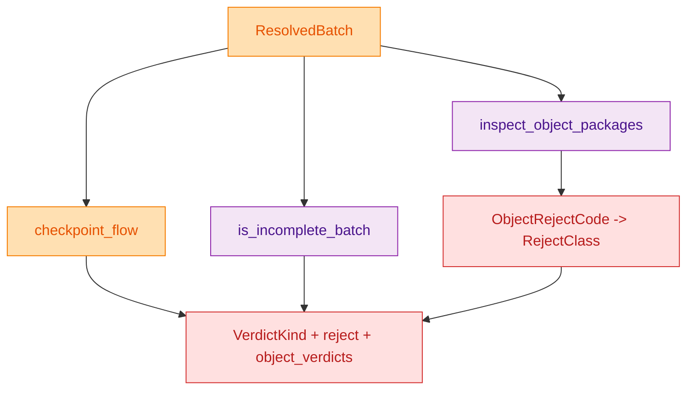
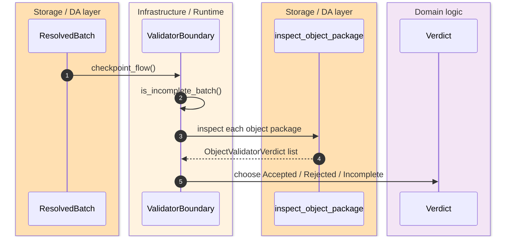
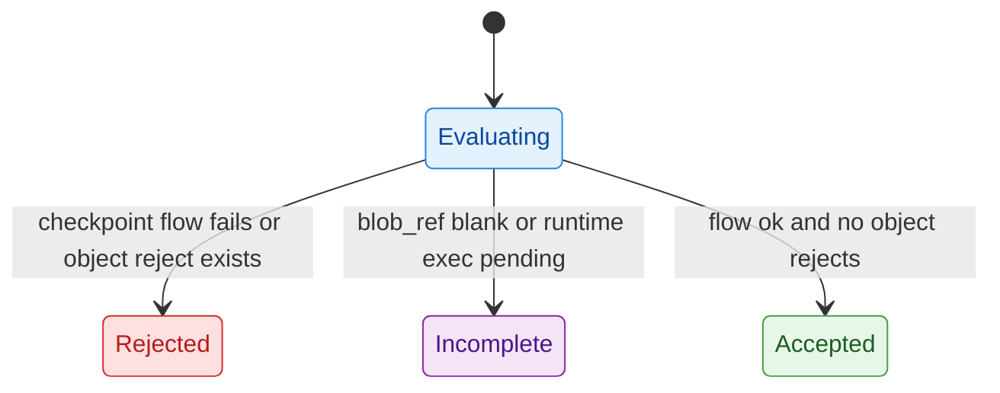

The validator crate is the point where runtime batches stop being "already prepared" and become a **canonical verdict**. It does not own planner admission, watcher projection, or storage proof contracts, but it does own the final decision shape over checkpoint flow plus typed object packages. Phase 059 makes that verdict surface materially richer by requiring fail-closed handling for policy, rights, voucher, replay, and fee-boundary faults. `crates/z00z_runtime/validators/README.md:1-38` `crates/z00z_runtime/validators/src/engine.rs:13-95`

## At A Glance

| Component | Responsibility | Key file | Source |
|---|---|---|---|
| Crate boundary | Declares validator ownership and limits. | `crates/z00z_runtime/validators/README.md` | `crates/z00z_runtime/validators/README.md:3-38` |
| Public facade | Re-exports verdict types plus storage-owned object inspection contracts. | `crates/z00z_runtime/validators/src/lib.rs` | `crates/z00z_runtime/validators/src/lib.rs:4-28` |
| Verdict model | Defines `ResolvedBatch`, `Verdict`, `VerdictKind`, `RejectClass`, and object-code mapping. | `crates/z00z_runtime/validators/src/verdict.rs` | `crates/z00z_runtime/validators/src/verdict.rs:12-133` |
| Validator engine | Composes checkpoint flow, incomplete-batch detection, object inspection, and final verdict selection. | `crates/z00z_runtime/validators/src/engine.rs` | `crates/z00z_runtime/validators/src/engine.rs:13-95` |
| Contract tests | Show accepted, rejected, and fail-closed typed-object verdicts. | `crates/z00z_runtime/validators/tests/test_object_policy_verdicts.rs` | `crates/z00z_runtime/validators/tests/test_object_policy_verdicts.rs:40-227` |

## Architecture

<!-- Sources: crates/z00z_runtime/validators/src/verdict.rs:12-133, crates/z00z_runtime/validators/src/engine.rs:20-95 -->

<!-- Sources: crates/z00z_runtime/validators/src/engine.rs:20-95, crates/z00z_runtime/validators/src/lib.rs:17-28 -->

<!-- Sources: crates/z00z_runtime/validators/src/engine.rs:20-31, crates/z00z_runtime/validators/src/engine.rs:67-95 -->

## What Validators Own, And What They Reuse

| Surface | Owner | Why | Source |
|---|---|---|---|
| `Verdict`, `VerdictKind`, `RejectClass` | Validator crate | This is the canonical validator output contract. | `crates/z00z_runtime/validators/src/verdict.rs:69-108` |
| `ResolvedBatch` projection over published, ordered, artifact, nullifiers, placement, and exec ticket | Validator crate | It is the validator-side input bundle for verdict formation. | `crates/z00z_runtime/validators/src/verdict.rs:12-67` |
| `ShardPlacementView` and `ShardExecTicket` metadata | Runtime-owned, validator-readable | Validators may read them but do not own their semantics. | `crates/z00z_runtime/validators/README.md:15-17` `crates/z00z_runtime/validators/src/verdict.rs:22-33` |
| Settlement roots, proof envelopes, replay semantics, and route snapshots | Storage-owned | Validators must consume the storage contract rather than fork it. | `crates/z00z_runtime/validators/README.md:15-17` |
| `inspect_object_package`, `ObjectPolicyRegistryV1`, reject codes | Storage-owned but validator-reexported | Validator surface intentionally reuses storage's typed-object contract. | `crates/z00z_runtime/validators/src/lib.rs:25-28` |

## Verdict Composition Logic

The engine runs in a strict order. First it derives checkpoint flow. Then it marks a batch incomplete when the published blob ref is blank or the runtime exec ticket is still in `RetryPending` or `RecoveryPending`. Only if checkpoint flow succeeds does it inspect typed object packages. After that it collapses the first flow or object reject into one top-level `RejectClass` and chooses `Rejected`, `Incomplete`, or `Accepted`. `crates/z00z_runtime/validators/src/engine.rs:20-31` `crates/z00z_runtime/validators/src/engine.rs:43-95`

| Decision point | Condition | Result | Source |
|---|---|---|---|
| Checkpoint flow fails | `CheckpointFlow::try_from_resolved(batch)` returns `Err` | Batch-level reject before object-package inspection. | `crates/z00z_runtime/validators/src/engine.rs:43-45` `crates/z00z_runtime/validators/src/engine.rs:67-72` |
| Runtime still pending | Blank `blob_ref` or exec state `RetryPending` / `RecoveryPending` | `VerdictKind::Incomplete` when no reject exists. | `crates/z00z_runtime/validators/src/engine.rs:22-31` `crates/z00z_runtime/validators/src/engine.rs:85-90` |
| Object reject present | First `ObjectValidatorVerdict.reject` exists | Top-level batch reject uses mapped `RejectClass`. | `crates/z00z_runtime/validators/src/engine.rs:74-79` |
| No flow error and no object reject | All checks pass | `VerdictKind::Accepted` with publication binding. | `crates/z00z_runtime/validators/src/engine.rs:81-94` |

## Reject Lanes

`RejectClass` is intentionally coarser than `ObjectRejectCode`. The validator surface keeps detailed per-object verdicts, but collapses them into stable batch-level lanes for higher-level consumers. `crates/z00z_runtime/validators/src/verdict.rs:69-133`

| Object reject code family | Batch-level lane | Source |
|---|---|---|
| `UnknownPolicy` | `PolicyUnknown` | `crates/z00z_runtime/validators/src/verdict.rs:110-114` |
| `Replay` | `ReplayConflict` | `crates/z00z_runtime/validators/src/verdict.rs:113-115` |
| `StaleRoot` | `StateRootMismatch` | `crates/z00z_runtime/validators/src/verdict.rs:114-115` |
| Missing, expired, revoked, consumed, or out-of-scope rights plus missing signature or attestation | `AuthInvalid` | `crates/z00z_runtime/validators/src/verdict.rs:116-123` |
| Unknown action, invalid backing, wrong-family proof, voucher-used-as-cash, right-used-as-value, double redeem, residual mismatch, fee-boundary, expired voucher use | `ProofInvalid` | `crates/z00z_runtime/validators/src/verdict.rs:124-132` |

## Contract Tests

The tests show the intended use of those lanes rather than leaving them implicit.

| Test case | Expected outcome | Why it matters | Source |
|---|---|---|---|
| Known registered object package | `Accepted` with no reject and a publication binding. | Shows the happy path still goes through the same validator boundary. | `crates/z00z_runtime/validators/tests/test_object_policy_verdicts.rs:40-64` |
| Unknown policy | `Rejected` + `PolicyUnknown` + `ObjectRejectCode::UnknownPolicy`. | Proves fail-closed policy admission. | `crates/z00z_runtime/validators/tests/test_object_policy_verdicts.rs:66-87` |
| Missing right | `Rejected` + `AuthInvalid` + `ObjectRejectCode::MissingRight`. | Confirms rights failures are auth-lane verdicts, not generic proof errors. | `crates/z00z_runtime/validators/tests/test_object_policy_verdicts.rs:89-125` |
| Fee-boundary violation | `Rejected` + `ProofInvalid` + `ObjectRejectCode::FeeBoundary`. | Proves fee support cannot smuggle value across object-role boundaries. | `crates/z00z_runtime/validators/tests/test_object_policy_verdicts.rs:127-153` |
| Malformed fee envelope | Still `Rejected` + `ProofInvalid`. | Shows the validator lane is robust against malformed fee-support artifacts too. | `crates/z00z_runtime/validators/tests/test_object_policy_verdicts.rs:155-196` |
| Locked asset spend without unlock right | `Rejected` + `AuthInvalid`. | Demonstrates typed object verdicts are not voucher-only. | `crates/z00z_runtime/validators/tests/test_object_policy_verdicts.rs:198-227` |

## Related Pages

| Page | Relationship |
|---|---|
| [Object Package Rejects](./object-package-rejects.md) | Storage-owned typed object admission taxonomy that validators consume. |
| [Publication Route Authority](./publication-route-authority.md) | Explains why publication binding and route truth are not validator-owned. |
| [Settlement Runtime And Rollup](./settlement-runtime-and-rollup.md) | Broader storage, runtime, validator, and rollup composition overview. |
