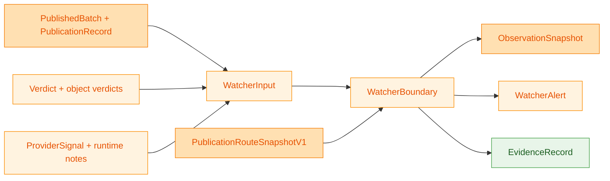
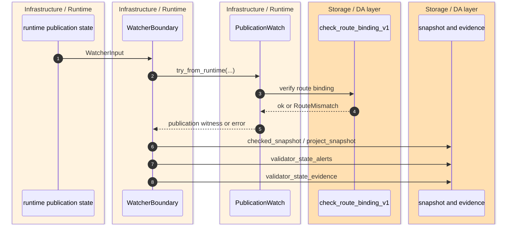
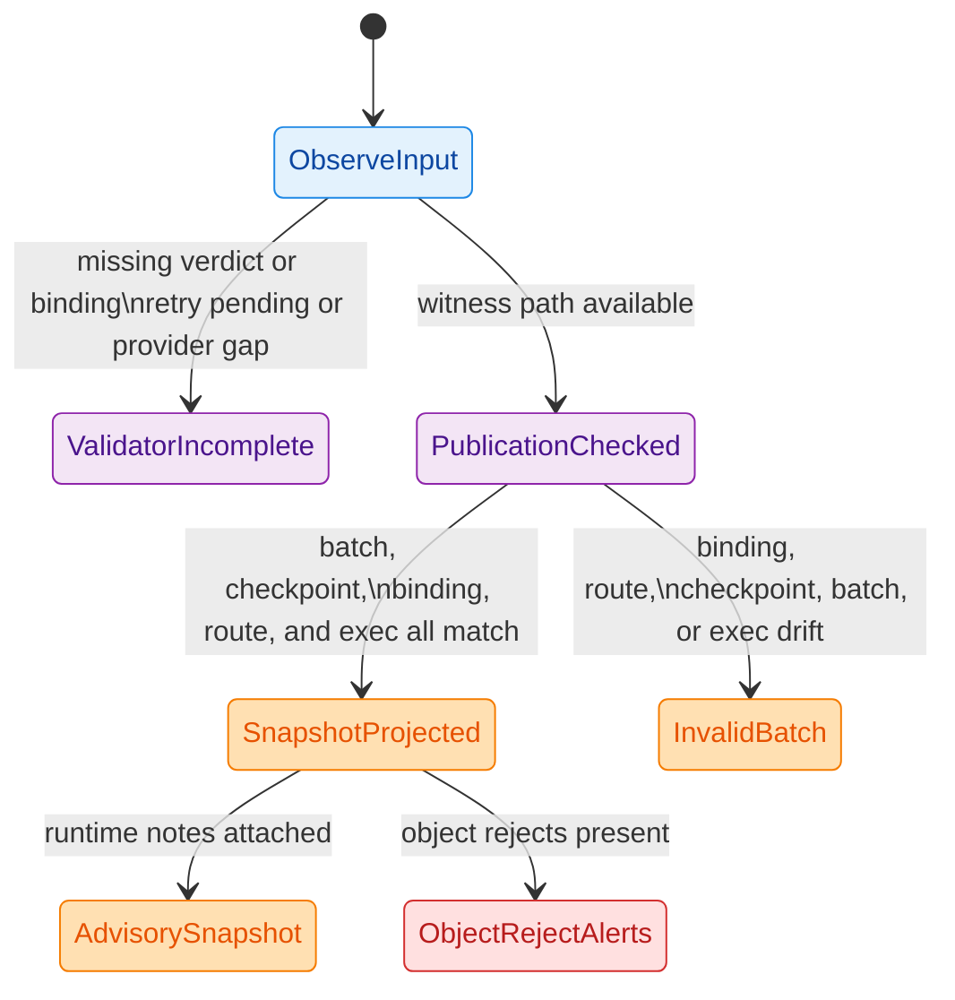

> [!NOTE]
> `z00z_runtime/watchers` is intentionally an **observation boundary**, not a second settlement or validator authority. It consumes already-published runtime state, reuses validator and storage truth, and emits alerts plus evidence records for operators. `crates/z00z_runtime/watchers/README.md:3-16` `crates/z00z_runtime/watchers/src/publication.rs:28-43`

The reason this crate exists is operational discipline. Z00Z wants publication health, route drift, DA-provider status, and typed object reject visibility to be observable without letting the observability layer invent new semantic truth. The README makes that boundary explicit, and the implementation preserves it by routing every publication witness through validator-owned bindings and storage-owned route checks. `crates/z00z_runtime/watchers/README.md:11-34` `crates/z00z_runtime/watchers/src/engine.rs:65-121` `crates/z00z_runtime/watchers/src/publication.rs:39-93`

## At A Glance

| Component | Responsibility | Key file | Source |
|---|---|---|---|
| Boundary contract | Declares watchers as evidence-and-alert surface over already-published runtime state. | `crates/z00z_runtime/watchers/README.md` | `crates/z00z_runtime/watchers/README.md:3-34` |
| Root facade | Re-exports alert, provider, evidence, publication, and snapshot surfaces only. | `crates/z00z_runtime/watchers/src/lib.rs` | `crates/z00z_runtime/watchers/src/lib.rs:1-20` |
| Observation engine | Builds snapshots, derives validator-state alerts, and maps object rejects to severities. | `crates/z00z_runtime/watchers/src/engine.rs` | `crates/z00z_runtime/watchers/src/engine.rs:17-313` |
| Alert model | Defines alert kinds, severities, and alert subjects. | `crates/z00z_runtime/watchers/src/alerts.rs` | `crates/z00z_runtime/watchers/src/alerts.rs:6-74` |
| Publication witness | Reconstructs one watcher-side publication witness by reusing runtime binding and storage route truth. | `crates/z00z_runtime/watchers/src/publication.rs` | `crates/z00z_runtime/watchers/src/publication.rs:10-93` |
| Evidence export | Stores the observation bundle and exposes helpers that prefer exec placement over fallback placement. | `crates/z00z_runtime/watchers/src/evidence_export.rs` | `crates/z00z_runtime/watchers/src/evidence_export.rs:15-88` |
| Boundary tests | Lock in placement preference, advisory runtime notes, publication drift rejection, and object reject severity. | `crates/z00z_runtime/watchers/tests/*.rs` | `crates/z00z_runtime/watchers/tests/test_hjmt_publication_contract.rs:18-638` `crates/z00z_runtime/watchers/tests/test_object_alerts.rs:7-118` |

## Architecture

<!-- Sources: crates/z00z_runtime/watchers/src/engine.rs:17-31, crates/z00z_runtime/watchers/src/engine.rs:110-121, crates/z00z_runtime/watchers/src/publication.rs:28-37, crates/z00z_runtime/watchers/src/evidence_export.rs:15-28 -->

<!-- Sources: crates/z00z_runtime/watchers/src/engine.rs:110-183, crates/z00z_runtime/watchers/src/publication.rs:39-93, crates/z00z_runtime/watchers/src/evidence_export.rs:65-80 -->

<!-- Sources: crates/z00z_runtime/watchers/src/engine.rs:49-94, crates/z00z_runtime/watchers/src/engine.rs:123-183, crates/z00z_runtime/watchers/src/engine.rs:233-313, crates/z00z_runtime/watchers/src/publication.rs:10-25 -->

## Observation Boundary

`WatcherInput` is deliberately downstream-facing. It accepts a `PublishedBatch`, a `PublicationRecord`, optional `SoftConfirmation`, optional placement views, an optional `ShardExecTicket`, an optional validator `Verdict`, optional `ProviderSignal`, and runtime distribution notes. That means watchers do not generate publication state themselves; they observe state that runtime and validators already produced. `crates/z00z_runtime/watchers/src/engine.rs:17-27`

The first important boundary rule is placement preference. `WatcherBoundary::placement_view` chooses the placement carried by the exec ticket when that ticket exists and only falls back to the plain placement view otherwise. The heavy contract test `snapshot_prefers_exec_placement` locks that in, so the operational picture follows execution metadata when available instead of treating fallback placement as stronger truth. `crates/z00z_runtime/watchers/src/engine.rs:96-108` `crates/z00z_runtime/watchers/tests/test_hjmt_publication_contract.rs:18-83`

The second rule is advisory runtime notes. `apply_runtime_notes` copies runtime notes into the snapshot, sets `runtime_truth = false`, and increments alert counts based on the distribution-note severity. The corresponding test proves that route-rollout, shard-stall, and shard-freeze notes remain observability metadata instead of silently changing verdict semantics. `crates/z00z_runtime/watchers/src/engine.rs:38-47` `crates/z00z_runtime/watchers/src/engine.rs:145-170` `crates/z00z_runtime/watchers/tests/test_hjmt_publication_contract.rs:578-638`

## Publication Witness Path

`PublicationWatch::try_from_runtime` is the core anti-drift mechanism. It requires a verdict, requires a publication binding inside that verdict, checks batch-id agreement across published batch, publication record, and binding, checks checkpoint agreement, verifies that the binding matches `pub_in`, optionally validates the exec ticket batch id, and finally delegates exact route acceptance to storage via `check_route_binding_v1(...)`. Watchers therefore do not invent a second route contract; they consume the runtime-owned binding and the storage-owned route snapshot together. `crates/z00z_runtime/watchers/src/publication.rs:39-93`

That split matters operationally because watcher failures are typed. `MissingVerdict` and `MissingBinding` are treated as validator-incomplete conditions, while batch, checkpoint, binding, route, and exec mismatches are true publication inconsistencies. `validator_state_alert_inner` converts the first group into a warning and the second group into a critical `InvalidBatch` alert. `crates/z00z_runtime/watchers/src/publication.rs:10-25` `crates/z00z_runtime/watchers/src/engine.rs:65-94`

The tests exercise the exact drift classes that the crate claims to watch: binding drift, checkpoint drift, exec-ticket drift, route digest drift, route generation drift, stale route activation, missing verdict, missing binding, retry-pending publication state, and provider gaps. Those tests are the strongest evidence that the boundary is intentionally narrow rather than aspirational prose. `crates/z00z_runtime/watchers/tests/test_hjmt_publication_contract.rs:200-576`

## Alert Families And Severity

The README names the Phase 059 watcher extension clearly: unknown policy usage, invalid voucher backing, wrong-family proof attempts, replay and duplicate redemption, expired object use, acceptance or refund boundary violations, and rights crossing object-role boundaries. The implementation realizes that requirement by allowing alert kinds to wrap `ObjectRejectCode` directly and by mapping each reject into a `Warn` or `Critical` severity. `crates/z00z_runtime/watchers/README.md:18-34` `crates/z00z_runtime/watchers/src/alerts.rs:42-67` `crates/z00z_runtime/watchers/src/engine.rs:233-313`

| Alert surface | Severity behavior | Why it is separate | Source |
|---|---|---|---|
| `ValidatorIncomplete` | `Warn` | Signals missing verdict, missing binding, retry pending, or provider gap without claiming semantic failure. | `crates/z00z_runtime/watchers/src/engine.rs:49-94` |
| `InvalidBatch` | `Critical` | Signals publication-witness drift after the watcher had enough evidence to check it. | `crates/z00z_runtime/watchers/src/engine.rs:83-93` |
| Distribution-note alerts | Follows note level | Keeps scheduler, failover, route, and storage hazards observable without changing ownership. | `crates/z00z_runtime/watchers/src/engine.rs:193-205` `crates/z00z_runtime/watchers/src/engine.rs:294-312` |
| Critical object rejects | `UnknownPolicy`, `InvalidBacking`, `WrongFamilyProof`, `VoucherUsedAsCash`, `RightUsedAsValue`, `Replay`, `DoubleRedeem`, `StaleRoot`, `FeeBoundary` | These describe hard contract violations or replay-class failures. | `crates/z00z_runtime/watchers/src/engine.rs:269-280` |
| Warning object rejects | `UnknownAction`, `MissingRight`, `RightOutOfScope`, `RightExpired`, `RightRevoked`, `RightConsumed`, `ResidualMismatch`, `ForcedAcceptance`, `MissingSignature`, `MissingAttestation`, `ExpiredVoucherUse` | These still matter, but the watcher classifies them below the hard-failure bucket. | `crates/z00z_runtime/watchers/src/engine.rs:280-291` |

The object-alert tests pin the behavior to concrete outcomes. `UnknownPolicy`, `FeeBoundary`, `DoubleRedeem`, and `Replay` become critical watcher alerts, while `MissingRight` and `RightExpired` remain warnings. That gives operators a stable severity contract over validator object verdicts instead of free-form logging. `crates/z00z_runtime/watchers/tests/test_object_alerts.rs:7-105`

## Evidence Export

`EvidenceRecord` is the crate's durable observation bundle. It stores the evidence key, alert kind and severity, alert subject, publication record, published batch, soft confirmation, placement, exec ticket, validator verdict, and provider signal. The helper methods then reconstruct the operational story without upgrading the watcher into an authority: `runtime_placement()` prefers exec placement, `publication_binding()` reads the validator-owned binding from the verdict, `binding_digest()` exposes the digest for export, `object_reject_codes()` projects typed-object failures, and `publication_watch()` reruns the same witness path on the stored evidence. `crates/z00z_runtime/watchers/src/evidence_export.rs:15-80`

The `evidence_keeps_publication_story` test shows why this structure is useful. One evidence record can prove which checkpoint, binding digest, publication route, runtime route, and exec metadata were being observed when an alert fired. That is enough for operator investigation without granting the evidence log any right to reinterpret storage or validator truth. `crates/z00z_runtime/watchers/tests/test_hjmt_publication_contract.rs:133-198`

## Operational Inputs

Watchers have almost no local configuration surface in the inspected code. Instead, behavior is driven by runtime-supplied inputs and by strict interpretation rules inside `WatcherBoundary`. `crates/z00z_runtime/watchers/src/engine.rs:17-31`

| Input or rule | Default or optionality | Operational effect | Source |
|---|---|---|---|
| `exec_ticket` over `placement` | Both optional; exec ticket wins when present | Aligns watcher placement with execution metadata. | `crates/z00z_runtime/watchers/src/engine.rs:96-108` |
| `verdict` | Optional | Missing verdict produces `ValidatorIncomplete` rather than synthetic success. | `crates/z00z_runtime/watchers/src/publication.rs:43-55` `crates/z00z_runtime/watchers/tests/test_hjmt_publication_contract.rs:430-460` |
| `provider_signal` | Optional | `Pending`, `RetryPending`, or `Missing` can mark a publication gap and downgrade the state to incomplete. | `crates/z00z_runtime/watchers/src/engine.rs:49-63` `crates/z00z_runtime/watchers/tests/test_hjmt_publication_contract.rs:533-576` |
| `runtime_notes` | Empty by default | Makes the snapshot advisory and increments alert counts by note severity. | `crates/z00z_runtime/watchers/src/engine.rs:38-47` |
| Crate-local feature flags | None in the workspace feature inventory | Confirms the current surface is narrow and input-driven rather than feature-gated. | `Cargo-features.md:50-53` |

## What Watchers Do Not Own

| Non-goal | Actual owner | Source |
|---|---|---|
| Planner authority | Runtime aggregator or planner surfaces | `crates/z00z_runtime/watchers/README.md:13-16` |
| Validator verdict rules | Validator crates | `crates/z00z_runtime/watchers/README.md:15-16` |
| Settlement semantics | Storage and settlement surfaces | `crates/z00z_runtime/watchers/README.md:15-16` |
| Route-table truth | Storage-owned `PublicationRouteSnapshotV1` plus `check_route_binding_v1(...)` | `crates/z00z_runtime/watchers/src/publication.rs:29-33` `crates/z00z_runtime/watchers/src/publication.rs:78-84` |
| Publication binding construction | Runtime-owned binding carried inside validator verdicts | `crates/z00z_runtime/watchers/src/publication.rs:50-54` |

## Related Pages

| Page | Relationship |
|---|---|
| [Settlement Runtime And Rollup](./settlement-runtime-and-rollup.md) | Broader storage, runtime, and rollup ownership map around the watcher boundary. |
| [Publication Route Authority](./publication-route-authority.md) | Explains why route acceptance and publication binding stay outside watchers. |
| [Validator Verdict Lanes](./validator-verdict-lanes.md) | Covers the validator-owned verdict surface that watchers observe. |
