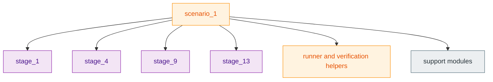
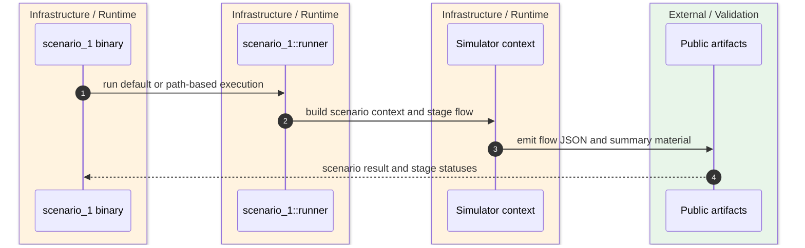
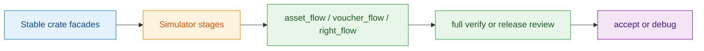

`z00z_simulator` is intentionally an integration harness, not a second application framework. Its README and module root are explicit that scenario code must enter other crates through stable facades and that `scenario_1` remains the canonical executable home for the Phase 059 object model. `crates/z00z_simulator/README.md:6-30` `crates/z00z_simulator/README.md:62-92`

## 🎯 At A Glance

| Component | Responsibility | Key file | Source |
|---|---|---|---|
| Simulator root | Re-exports actor, config, context, design, result, and scenario facades. | `crates/z00z_simulator/src/lib.rs` | `crates/z00z_simulator/src/lib.rs:6-39` |
| `scenario_1` module | Declares stages, runner, and process guard for the canonical scenario pipeline. | `crates/z00z_simulator/src/scenario_1/mod.rs` | `crates/z00z_simulator/src/scenario_1/mod.rs:8-37` |
| CLI binary | Resolves `--config` and `--design` arguments, then delegates to the runner. | `crates/z00z_simulator/bin/scenario_1.rs` | `crates/z00z_simulator/bin/scenario_1.rs:11-73` |
| Release-style verify gate | Supplies the heavy repository verification path that the simulator complements. | `.github/skills/z00z-full-verify-gate/scripts/full_verify.sh` | `.github/skills/z00z-full-verify-gate/scripts/full_verify.sh:64-103` |

## 🧭 Scenario Shape

<!-- Sources: crates/z00z_simulator/src/scenario_1/mod.rs:8-27 -->

<!-- Sources: crates/z00z_simulator/bin/scenario_1.rs:11-67, crates/z00z_simulator/src/lib.rs:23-39, crates/z00z_simulator/README.md:75-92 -->

<!-- Sources: crates/z00z_simulator/README.md:24-30, crates/z00z_simulator/README.md:75-92, .github/skills/z00z-full-verify-gate/scripts/full_verify.sh:79-83 -->

## 📦 Why `scenario_1` Matters

| Aspect | Current contract | Source |
|---|---|---|
| Canonical executable | `scenario_1` is the live home of the Phase 059 object model and was extended in place. | `crates/z00z_simulator/README.md:62-66` |
| Object lanes | Covers asset transfer, voucher lifecycle, right lifecycle, and right-gated voucher actions. | `crates/z00z_simulator/README.md:67-73` |
| Artifact anchors | Publishes `asset_flow.json`, `voucher_flow.json`, `right_flow.json`, `wallet_scan.json`, `val_flow.json`, `watch_flow.json`, and `sim_summary.md`. | `crates/z00z_simulator/README.md:75-89` |
| Negative evidence | Reject and fix surfaces are mandatory in the Phase 059 packet. | `crates/z00z_simulator/README.md:91-93` |

## 🔑 Integration Boundary Rules

| Rule | Meaning in practice | Source |
|---|---|---|
| Use stable facades | If the harness needs a new entrypoint, add it to the owner crate instead of deep-importing internals. | `crates/z00z_simulator/README.md:24-30` |
| Harness-only code stays narrow | Deterministic fixture setup is fine; business-rule ownership is not. | `crates/z00z_simulator/README.md:12-22` |
| Secret artifact policy is strict | Plaintext wallet-secret artifacts are debug-only, gated, and outside the default contract. | `crates/z00z_simulator/README.md:32-45` |

## 📖 References

- `crates/z00z_simulator/README.md:6-30`
- `crates/z00z_simulator/README.md:62-92`
- `crates/z00z_simulator/src/lib.rs:6-39`
- `crates/z00z_simulator/src/scenario_1/mod.rs:8-37`
- `crates/z00z_simulator/bin/scenario_1.rs:11-73`

## Related Pages

| Page | Relationship |
|---|---|
| [Workspace Overview](../01-getting-started/workspace-overview.md) | Gives the top-level context for why the simulator exists as its own crate. |
| [Wallet Architecture](../04-wallet-and-rpc/wallet-architecture.md) | One of the main stable facades the simulator composes. |
| [Settlement Runtime And Rollup](../05-storage-runtime/settlement-runtime-and-rollup.md) | Covers the downstream layers the simulator exercises. |
