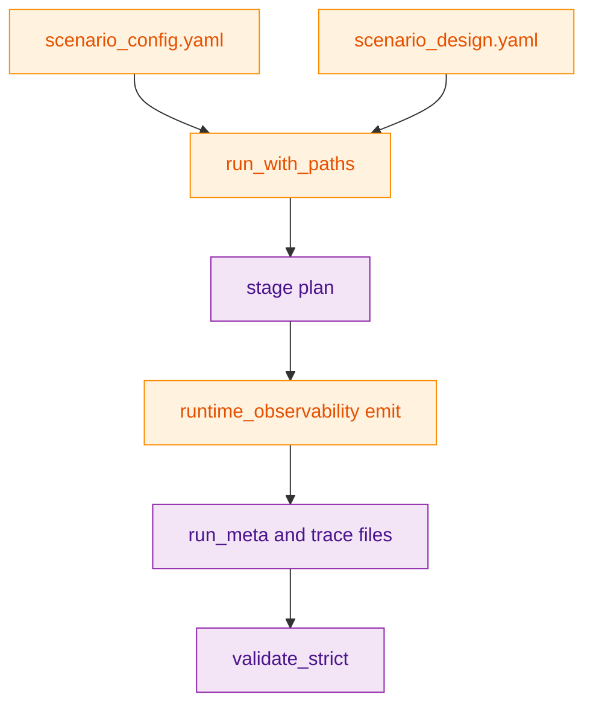
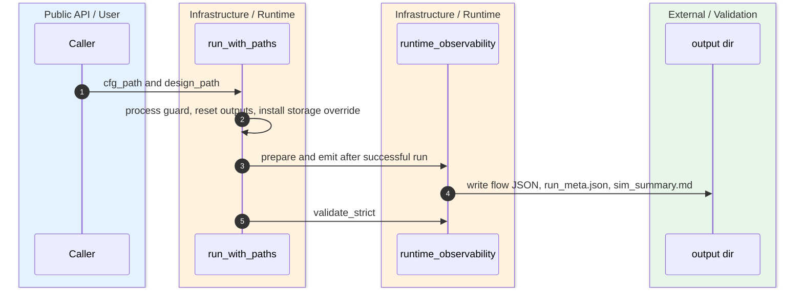
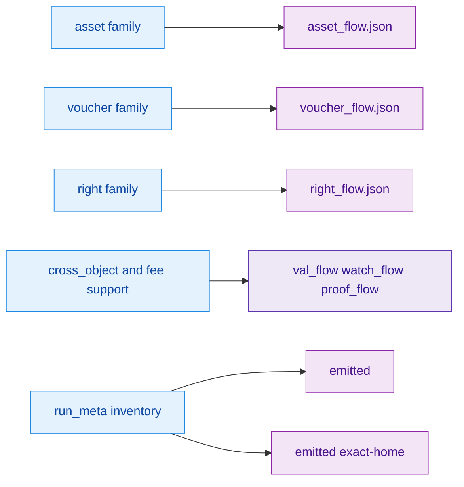

`scenario_1` is not just a demo. It is the canonical executable home for the Phase 059 object model, and its public packet is defined by a combination of the simulator README, the runner, `scenario_config.yaml`, runtime-observability emission code, and explicit guard tests. That is why the object flows, artifact inventory, and strict packet validation all live in code, not only in prose. `crates/z00z_simulator/README.md:62-93` `crates/z00z_simulator/src/scenario_1/runner.rs:119-191`

## 🎯 At A Glance

| Component | Responsibility | Key file | Source |
|---|---|---|---|
| Simulator README | Declares `scenario_1` the canonical Phase 059 executable home and names the public anchors. | `crates/z00z_simulator/README.md` | `crates/z00z_simulator/README.md:62-93` |
| Runner | Owns config/design load, process guard, output sandbox reset, storage override, emission, and strict validation. | `crates/z00z_simulator/src/scenario_1/runner.rs` | `crates/z00z_simulator/src/scenario_1/runner.rs:125-191` `crates/z00z_simulator/src/scenario_1/runner.rs:231-273` |
| Object flow matrix | Enumerates positive and negative asset, voucher, right, and cross-object cases plus evidence-file anchors. | `crates/z00z_simulator/src/scenario_1/scenario_config.yaml` | `crates/z00z_simulator/src/scenario_1/scenario_config.yaml:348-623` |
| Runtime observability | Emits packet traces, `run_meta.json`, `sim_summary.md`, and artifact inventory, then validates them strictly. | `crates/z00z_simulator/src/scenario_1/runtime_observability.rs` | `crates/z00z_simulator/src/scenario_1/runtime_observability.rs:1119-1455` `crates/z00z_simulator/src/scenario_1/runtime_observability.rs:4176-4325` |
| Guard tests and Stage 13 schema | Lock the matrix contract and define HJMT example artifacts used by object-flow evidence. | `crates/z00z_simulator/tests/scenario_1/test_scenario1_object_flows.rs`, `crates/z00z_simulator/src/scenario_1/stage_13/report.rs` | `crates/z00z_simulator/tests/scenario_1/test_scenario1_object_flows.rs:811-980` `crates/z00z_simulator/src/scenario_1/stage_13/report.rs:7-160` |

## 📦 Architecture

<!-- Sources: crates/z00z_simulator/src/scenario_1/runner.rs:125-191, crates/z00z_simulator/src/scenario_1/runtime_observability.rs:1119-1455, crates/z00z_simulator/src/scenario_1/scenario_config.yaml:21-143 -->

<!-- Sources: crates/z00z_simulator/src/scenario_1/runner.rs:129-191, crates/z00z_simulator/src/scenario_1/runtime_observability.rs:1119-1455 -->

<!-- Sources: crates/z00z_simulator/src/scenario_1/scenario_config.yaml:348-623, crates/z00z_simulator/src/scenario_1/runtime_observability.rs:4176-4267, crates/z00z_simulator/tests/scenario_1/test_scenario1_object_flows.rs:936-980 -->

## 🔑 Object-Flow Matrix

| Slice | Current contract | Source |
|---|---|---|
| Positive matrix size | `18` positive flows. | `crates/z00z_simulator/tests/scenario_1/test_scenario1_object_flows.rs:821-857` |
| Negative matrix size | `15` negative flows. | `crates/z00z_simulator/tests/scenario_1/test_scenario1_object_flows.rs:821-877` |
| Families covered | Asset, voucher, right, cross-object, and fee-support lanes. | `crates/z00z_simulator/src/scenario_1/scenario_config.yaml:348-623` |
| Mandatory anchors | Voucher and cross-object cases must stay anchored to `voucher_flow.json`; right-participating cases must stay anchored to `right_flow.json`, subject to the explicit exceptions guarded in tests. | `crates/z00z_simulator/tests/scenario_1/test_scenario1_object_flows.rs:936-980` |
| Canonical negative verdict format | Rejects must stay on `rejected:OBJECT_*` codes. | `crates/z00z_simulator/tests/scenario_1/test_scenario1_object_flows.rs:974-980` |

## 📁 Public Packet Inventory

| Artifact class | Files | Status in `run_meta` inventory | Source |
|---|---|---|---|
| Emitted packet control files | `run_meta.json`, `wallet_scan.json`, `sim_summary.md` | `emitted` | `crates/z00z_simulator/src/scenario_1/scenario_config.yaml:132-142` `crates/z00z_simulator/src/scenario_1/runtime_observability.rs:4176-4267` |
| Emitted public flow files | `hist_flow.json`, `occ_flow.json` | `emitted` | `crates/z00z_simulator/src/scenario_1/scenario_config.yaml:136-138` `crates/z00z_simulator/src/scenario_1/runtime_observability.rs:4242-4250` |
| Exact-home public anchors | `asset_flow.json`, `voucher_flow.json`, `right_flow.json` | `emitted` | `crates/z00z_simulator/src/scenario_1/scenario_config.yaml`; `crates/z00z_simulator/src/scenario_1/runtime_observability.rs` |
| Runtime traces | `cfg_flow`, `tx_flow`, `route_flow`, `plan_flow`, `journal_flow`, `scope_flow`, `proc_flow`, `recovery_flow`, `leaf_flow`, `proof_flow`, `pub_flow`, `val_flow`, `watch_flow` | `emitted` | `crates/z00z_simulator/src/scenario_1/scenario_config.yaml:118-131` `crates/z00z_simulator/src/scenario_1/runtime_observability.rs:1172-1391` |

## ⚙️ Runner And Validation Semantics

| Concern | What the runner does | Source |
|---|---|---|
| Process-global exclusivity | Takes one canonical in-process guard so scenario runs do not stomp shared env overrides and storage roots. | `crates/z00z_simulator/src/scenario_1/runner.rs:129-135` |
| Output sandbox | Validates the output root, recreates it, and installs a simulator-managed storage override. | `crates/z00z_simulator/src/scenario_1/runner.rs:154-157` `crates/z00z_simulator/src/scenario_1/runner.rs:231-273` |
| Emit only on successful run | Calls `runtime_observability::emit(...)` and then `validate_strict(...)` only if the scenario result is OK. | `crates/z00z_simulator/src/scenario_1/runner.rs:174-185` |
| Strict packet regeneration | `validate_strict(...)` reruns packet validation in strict mode. | `crates/z00z_simulator/src/scenario_1/runtime_observability.rs:1446-1452` |

## 📌 Stage 13 HJMT Evidence

Stage 13 is where the packet grows beyond simple transaction and watcher traces into explicit HJMT example artifacts. Its report schema carries example IDs, backend mode, API surface, verifier status, proof family, leaf family, settlement path, proof size, and replay-related metadata. That is why several object-flow rows point at `hjmt/hjmt_settlement_examples.json` or `hjmt/hjmt_tamper_report.json` rather than only at `val_flow.json`. `crates/z00z_simulator/src/scenario_1/stage_13/report.rs:7-160` `crates/z00z_simulator/src/scenario_1/scenario_config.yaml:490-497` `crates/z00z_simulator/src/scenario_1/scenario_config.yaml:616-623`

## Related Pages

| Page | Relationship |
|---|---|
| [Scenario Pipeline](./scenario-pipeline.md) | Higher-level overview of why `scenario_1` exists as the canonical harness. |
| [Object Model And Genesis](../03-core-protocol/object-model-and-genesis.md) | Explains the object families that this packet exercises. |
| [Rollup Theorem Verifier](../05-storage-runtime/rollup-theorem-verifier.md) | Follows `val_flow` and watcher-side public evidence into rollup verification. |
