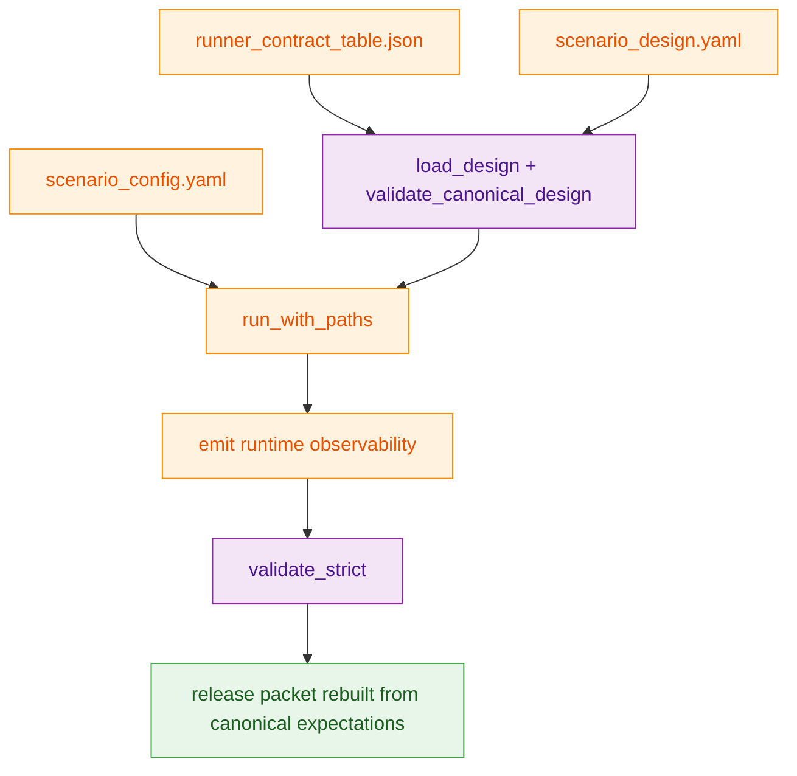
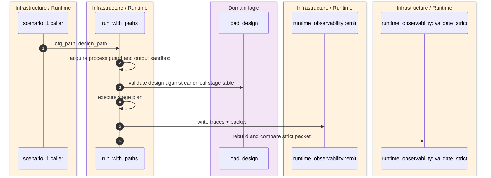
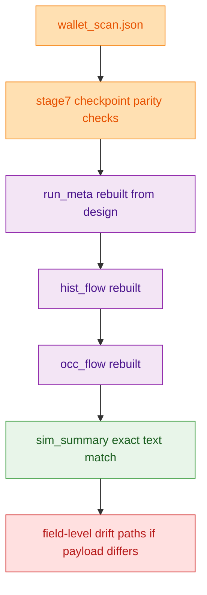

`scenario_1` is deliberately not a free-form integration script. The runner loads a design file, validates it against a checked-in 13-stage canonical table, executes through one canonical in-process path, emits the public observability packet, and then rebuilds that packet to detect drift against the design contract rather than trusting whatever happened to be written during the run. `crates/z00z_simulator/src/scenario_1/runner_contract.rs:22-30` `crates/z00z_simulator/src/scenario_1/runner.rs:124-185` `crates/z00z_simulator/src/scenario_1/runtime_observability.rs:4451-4617`

## At A Glance

| Component | Responsibility | Key file | Source |
|---|---|---|---|
| Canonical stage table | Pins stage ids, names, descriptions, Rust entrypoints, config sources, and step contracts. | `crates/z00z_simulator/src/scenario_1/runner_contract_table.json` | `crates/z00z_simulator/src/scenario_1/runner_contract_table.json:1-122` |
| Design validator | Rejects stage-order, name, description, `rust_entry`, `config_source`, step-count, step-id, action, and post-condition drift. | `crates/z00z_simulator/src/scenario_1/runner_contract.rs` | `crates/z00z_simulator/src/scenario_1/runner_contract.rs:22-132` |
| Runner | Loads config and design, applies sandbox and process guards, executes the stage plan, emits observability, then runs strict validation. | `crates/z00z_simulator/src/scenario_1/runner.rs` | `crates/z00z_simulator/src/scenario_1/runner.rs:124-185` `crates/z00z_simulator/src/scenario_1/runner.rs:469-541` |
| Release-packet builder | Emits `run_meta.json`, inventory rows, public-lane guards, and `sim_summary.md` under a versioned packet contract. | `crates/z00z_simulator/src/scenario_1/runtime_observability.rs` | `crates/z00z_simulator/src/scenario_1/runtime_observability.rs:58-80` `crates/z00z_simulator/src/scenario_1/runtime_observability.rs:4176-4317` |
| Drift detector | Rebuilds expected trace and packet payloads, then reports exact field-path drift on mismatch. | `crates/z00z_simulator/src/scenario_1/runtime_observability.rs` | `crates/z00z_simulator/src/scenario_1/runtime_observability.rs:1438-1455` `crates/z00z_simulator/src/scenario_1/runtime_observability.rs:4451-4617` `crates/z00z_simulator/src/scenario_1/runtime_observability.rs:6155-6215` |
| Stage-surface tests | Lock stage names, descriptions, `rust_entry`, `config_source`, and many step ids so design drift fails tests before runtime output is trusted. | `crates/z00z_simulator/tests/scenario_1/test_scenario1_stage_surface.rs` | `crates/z00z_simulator/tests/scenario_1/test_scenario1_stage_surface.rs:107-140` `crates/z00z_simulator/tests/scenario_1/test_scenario1_stage_surface.rs:156-225` `crates/z00z_simulator/tests/scenario_1/test_scenario1_stage_surface.rs:227-325` |

## Architecture

<!-- Sources: crates/z00z_simulator/src/scenario_1/runner_contract.rs:22-30, crates/z00z_simulator/src/scenario_1/runner_contract.rs:33-132, crates/z00z_simulator/src/scenario_1/runner.rs:124-185, crates/z00z_simulator/src/scenario_1/runtime_observability.rs:1446-1455, crates/z00z_simulator/src/scenario_1/runtime_observability.rs:1579-1587 -->

<!-- Sources: crates/z00z_simulator/src/scenario_1/runner.rs:124-185, crates/z00z_simulator/src/scenario_1/runner.rs:469-541, crates/z00z_simulator/src/scenario_1/runner_contract.rs:27-132, crates/z00z_simulator/src/scenario_1/runtime_observability.rs:1446-1455 -->

<!-- Sources: crates/z00z_simulator/src/scenario_1/runtime_observability.rs:4451-4617, crates/z00z_simulator/src/scenario_1/runtime_observability.rs:4401-4410, crates/z00z_simulator/src/scenario_1/runtime_observability.rs:6155-6215 -->

## Canonical 13-Stage Contract

The canonical contract is not only "there are 13 stages." Each stage is pinned to a stable stage number, name, description, `rust_entry`, config section, and explicit step inventory. `crates/z00z_simulator/src/scenario_1/runner_contract.rs:33-132` `crates/z00z_simulator/tests/scenario_1/test_scenario1_stage_surface.rs:107-140`

| Stage | Name | Rust entry | Config source | Canonical role | Source |
|---|---|---|---|---|---|
| 1 | `genesis_init` | `stage_1::run(ctx)` | `stage1_paths + stage1_genesis_config` | Deterministic genesis bootstrap and settlement artifacts. | `crates/z00z_simulator/src/scenario_1/runner_contract_table.json:2-10` |
| 2 | `wallet_create` | `stage_2::run(ctx)` | `stage2_wallet_create` | Wallet creation, lifecycle, backup, and receiver export contract. | `crates/z00z_simulator/src/scenario_1/runner_contract_table.json:12-28` |
| 3 | `claim_prepare` | `stage_3::run_claim_prepare(ctx, stage)` | `stage3_claim` | Claim-lane import and prepared snapshot. | `crates/z00z_simulator/src/scenario_1/runner_contract_table.json:30-34` |
| 4 | `claim_publish` | `stage_4::run_claim_publish(ctx, stage)` | `stage4_claim_publish` | Claim-store publication and rights injection. | `crates/z00z_simulator/src/scenario_1/runner_contract_table.json:36-40` |
| 5 | `tx_plan` | `stage_5::run_tx_plan(ctx, stage)` | `stage4_tx_prepare` | Plan-only surface; no canonical tx artifact writes. | `crates/z00z_simulator/src/scenario_1/runner_contract_table.json:42-45` |
| 6 | `tx_prepare` | `stage_6::run_tx_prepare(ctx, stage)` | `stage4_tx_prepare` | Canonical tx handoff producer for downstream lanes. | `crates/z00z_simulator/src/scenario_1/runner_contract_table.json:47-61` |
| 7 | `transfer_receive` | `stage_7::run_transfer_receive(ctx, stage)` | `stage5_transfer` | Report-only receive bridge. | `crates/z00z_simulator/src/scenario_1/runner_contract_table.json:63-69` |
| 8 | `transfer_claim` | `stage_8::run_transfer_claim(ctx, stage)` | `stage5_transfer` | Explicit claim transition from receive handoff. | `crates/z00z_simulator/src/scenario_1/runner_contract_table.json:71-78` |
| 9 | `bundle_build` | `stage_9::run_bundle_build(ctx, stage)` | `stage6_bundle` | Checkpoint bridge and `exec_input` handoff build. | `crates/z00z_simulator/src/scenario_1/runner_contract_table.json:80-88` |
| 10 | `bundle_publish` | `stage_10::run_bundle_publish(ctx, stage)` | `stage6_bundle` | Publish-side bundle report surface. | `crates/z00z_simulator/src/scenario_1/runner_contract_table.json:90-98` |
| 11 | `checkpoint_apply_storage` | `stage_11::run_apply(ctx, stage)` | `stage7_paths` | Storage-backed checkpoint apply and shared summary. | `crates/z00z_simulator/src/scenario_1/runner_contract_table.json:100-104` |
| 12 | `checkpoint_finalize` | `stage_12::run_finalize(ctx, stage)` | `stage8_paths` | Final checkpoint publication and final surfaces. | `crates/z00z_simulator/src/scenario_1/runner_contract_table.json:106-110` |
| 13 | `hjmt_settlement_examples` | `stage_13::run_hjmt_examples(ctx, stage)` | `stage13_hjmt_settlement_examples` | Live HJMT proof and artifact contract. | `crates/z00z_simulator/src/scenario_1/runner_contract_table.json:112-120` |

## Runner-Level Guards Before Any Packet Is Trusted

| Guard | What it prevents | Source |
|---|---|---|
| Process-global scenario guard | Parallel tests cannot stomp shared runtime, storage, verification-root, or trace-pack state. | `crates/z00z_simulator/src/scenario_1/runner.rs:129-134` |
| Fresh claim registry reset | Old in-process claim membership rows cannot leak into a new run. | `crates/z00z_simulator/src/scenario_1/runner.rs:133-135` |
| Output sandbox validation | Runs may only write under approved simulator output roots, selected fixture roots, or target roots. | `crates/z00z_simulator/src/scenario_1/runner.rs:154-157` `crates/z00z_simulator/src/scenario_1/runner.rs:469-541` |
| Canonical design validation | Any mismatch in stage metadata or steps fails before the stage plan runs. | `crates/z00z_simulator/src/scenario_1/runner.rs:152-159` `crates/z00z_simulator/src/scenario_1/runner_contract.rs:33-132` |
| Strict observability validation | Public artifacts are emitted and then revalidated under `PacketMode::Strict`. | `crates/z00z_simulator/src/scenario_1/runner.rs:174-185` `crates/z00z_simulator/src/scenario_1/runtime_observability.rs:1446-1455` |

## Release-Packet Drift Guards

The public packet contract is versioned as `phase058_release_packet_v1`, and the builder hardcodes public-lane claims such as `execution_mode=release`, `public_lane_status=canonical_public_lane`, `stage_sync_status=design_and_runtime_aligned`, and `secret_artifacts_excluded=true`. The validator then reconstructs the packet and rejects any mismatch. `crates/z00z_simulator/src/scenario_1/runtime_observability.rs:58-80` `crates/z00z_simulator/src/scenario_1/runtime_observability.rs:4287-4317`

| Guard class | Expected source of truth | Failure mode | Source |
|---|---|---|---|
| `wallet_scan_file` parity | Stage-7 checkpoint summary and packet config must name the same wallet-scan artifact. | `stage7 checkpoint wallet_scan_file drifted` | `crates/z00z_simulator/src/scenario_1/runtime_observability.rs:4459-4467` |
| Wallet scan semantic parity | `wallet_scan.json` must stay `ok`, use `jmt_scan`, validate every candidate proof, and match stage-7 root and detection counters. | Status, path, proof-count, root, count, or amount drift rejections. | `crates/z00z_simulator/src/scenario_1/runtime_observability.rs:4469-4503` |
| `run_meta.json` rebuild | Rebuilt from trace-file names, digests, artifact inventory, wallet summary, and `expected_stage_results(design)`. | Trace payload mismatch in `run_meta.json`. | `crates/z00z_simulator/src/scenario_1/runtime_observability.rs:4210-4267` `crates/z00z_simulator/src/scenario_1/runtime_observability.rs:4280-4317` `crates/z00z_simulator/src/scenario_1/runtime_observability.rs:4401-4410` `crates/z00z_simulator/src/scenario_1/runtime_observability.rs:4521-4545` |
| `hist_flow.json` rebuild | Strict mode recomputes the historical public flow from code, config, and trace files instead of trusting the emitted copy. | Historical flow payload drift. | `crates/z00z_simulator/src/scenario_1/runtime_observability.rs:4551-4579` |
| `occ_flow.json` rebuild | Recomputed from the same canonical inputs. | Occupancy flow payload drift. | `crates/z00z_simulator/src/scenario_1/runtime_observability.rs:4581-4600` |
| `sim_summary.md` exact text | Summary is rebuilt from the canonical `RunMeta` shape. | `summary drifted from canonical release packet` | `crates/z00z_simulator/src/scenario_1/runtime_observability.rs:4320-4399` `crates/z00z_simulator/src/scenario_1/runtime_observability.rs:4602-4614` |
| Field-path drift diagnostics | When JSON differs, the validator walks both trees and reports path previews. | `runtime trace payload drifted: drift fields: ...` | `crates/z00z_simulator/src/scenario_1/runtime_observability.rs:6155-6215` |

## Why The Packet Is Rebuilt From Design, Not Only From The Run

The strongest guard in this area is subtle: release-packet validation does not compare `run_meta.json` against the live `ScenarioResult` that was just emitted. It reconstructs the expected stage list from the design file by mapping every declared stage to `{stage, name, result: "ok"}` through `expected_stage_results(design)`. That means a stage-surface rename or design drift can fail even if the runtime happened to emit internally consistent artifacts. `crates/z00z_simulator/src/scenario_1/runtime_observability.rs:4401-4410` `crates/z00z_simulator/src/scenario_1/runtime_observability.rs:4521-4525`

That design-derived rebuild sits on top of the separate design-validator layer and the stage-surface tests. Together those three layers make stage drift expensive: checked-in canonical table, runtime load-time validation, and post-emission public packet reconstruction. `crates/z00z_simulator/src/scenario_1/runner_contract.rs:33-132` `crates/z00z_simulator/tests/scenario_1/test_scenario1_stage_surface.rs:156-325`

## Related Pages

| Page | Relationship |
|---|---|
| [Scenario Pipeline](./scenario-pipeline.md) | Higher-level overview of scenario_1 as the canonical simulator harness. |
| [Scenario1 Object Artifacts](./scenario1-object-artifacts.md) | Deeper artifact inventory for the public packet and Stage 13 evidence. |
| [Rollup Theorem Verifier](../05-storage-runtime/rollup-theorem-verifier.md) | Downstream verifier contract for published settlement artifacts. |
