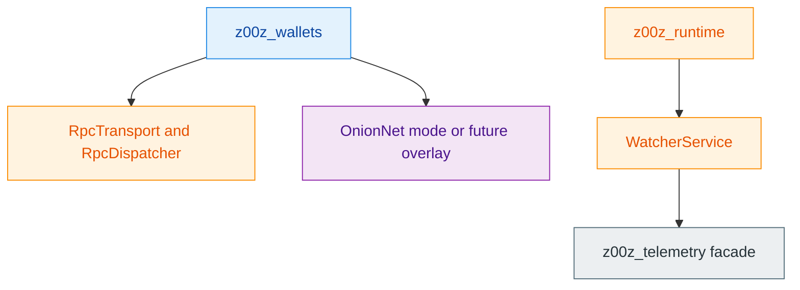
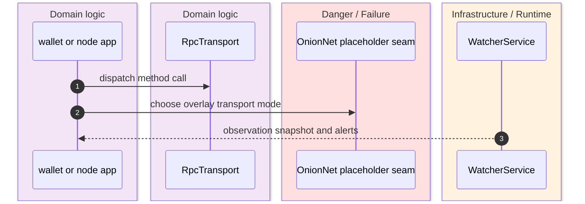
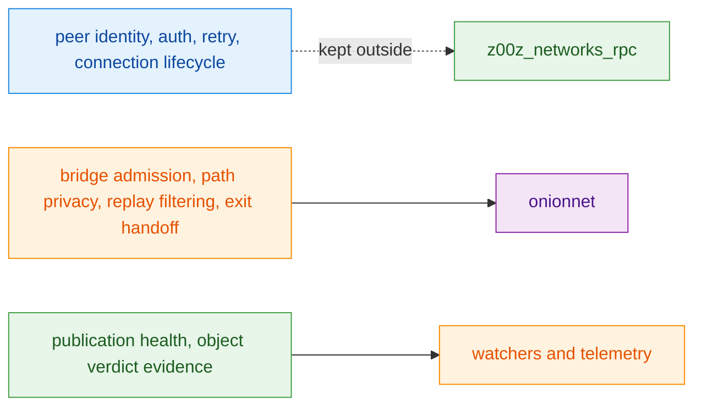

The networking and observability story is deliberately split into three different ownership zones: transport-only RPC in `z00z_networks_rpc`, a reserved privacy-overlay namespace in `onionnet`, and operational observation surfaces in watcher and telemetry crates. The code repeatedly warns against collapsing these into one generic “network” module. `crates/z00z_networks/rpc/README.md:3-18` `crates/z00z_networks/onionnet/README.md:16-31` `crates/z00z_runtime/watchers/README.md:11-16`

## 🎯 At A Glance

| Component | Responsibility | Key file | Source |
|---|---|---|---|
| `z00z_networks_rpc` | RPC request dispatch, transport adaptation, local transport, and WASM client. | `crates/z00z_networks/rpc/src/lib.rs` | `crates/z00z_networks/rpc/src/lib.rs:64-98` |
| `onionnet` | Reserved Phase 115 privacy-overlay crate boundary. | `crates/z00z_networks/onionnet/src/lib.rs` | `crates/z00z_networks/onionnet/src/lib.rs:13-126` |
| Watchers | Publication, provider, and alert observation surfaces. | `crates/z00z_runtime/watchers/src/lib.rs` | `crates/z00z_runtime/watchers/src/lib.rs:13-20` |
| Telemetry facade | Stable workspace entrypoint for shared observability concerns. | `crates/z00z_telemetry/README.md` | `crates/z00z_telemetry/README.md:3-12` |

## 🧭 Network And Ops Layering

<!-- Sources: crates/z00z_networks/rpc/src/lib.rs:4-19, crates/z00z_networks/onionnet/README.md:18-25, crates/z00z_runtime/watchers/src/lib.rs:13-20, crates/z00z_telemetry/README.md:3-12 -->

<!-- Sources: crates/z00z_networks/rpc/README.md:7-18, crates/z00z_networks/onionnet/README.md:16-31, crates/z00z_runtime/watchers/README.md:11-16 -->

<!-- Sources: crates/z00z_networks/rpc/src/lib.rs:8-19, crates/z00z_networks/onionnet/README.md:18-25, crates/z00z_runtime/watchers/README.md:18-34 -->

## 🔑 Why RPC And OnionNet Stay Separate

| Surface | Current scope | Explicit exclusion | Source |
|---|---|---|---|
| `z00z_networks_rpc` | Generic transport and dispatch. | Peer identity, auth, retry policy, connection lifecycle. | `crates/z00z_networks/rpc/src/lib.rs:4-19` |
| `onionnet` | Privacy-ingress transport concerns and reserved module structure. | RPC aliasing, sequencer logic, validator logic, or a standalone application service. | `crates/z00z_networks/onionnet/README.md:16-31` `crates/z00z_networks/onionnet/src/lib.rs:2-18` |

## 📦 Observability Surfaces

| Surface | What it emits | Why it matters | Source |
|---|---|---|---|
| `WatcherService` | Observation snapshots and alert classes. | Provides operational evidence without becoming semantic truth. | `crates/z00z_runtime/watchers/src/lib.rs:13-20` `crates/z00z_runtime/watchers/README.md:11-16` |
| Phase 059 alert families | Unknown policy, invalid backing, wrong-family proof, replay, expiry, and boundary violations. | Makes typed object failures observable without moving verdict ownership. | `crates/z00z_runtime/watchers/README.md:18-34` |
| `z00z_telemetry` | Stable crate-level home for shared observability wiring. | Avoids duplicating observability entrypoints across workspace crates. | `crates/z00z_telemetry/README.md:3-12` `crates/z00z_telemetry/src/lib.rs:1-2` |

## 📖 References

- `crates/z00z_networks/rpc/src/lib.rs:4-19`
- `crates/z00z_networks/onionnet/README.md:16-31`
- `crates/z00z_networks/onionnet/src/lib.rs:13-126`
- `crates/z00z_runtime/watchers/README.md:11-34`
- `crates/z00z_telemetry/README.md:3-12`

## Related Pages

| Page | Relationship |
|---|---|
| [Wallet Architecture](../04-wallet-and-rpc/wallet-architecture.md) | Shows the main crate that consumes the RPC transport seam. |
| [Crate Boundaries](../02-architecture/crate-boundaries.md) | Explains why RPC, overlay, and observability are intentionally split. |
| [Settlement Runtime And Rollup](../05-storage-runtime/settlement-runtime-and-rollup.md) | Shows where watcher evidence fits in the runtime pipeline. |
