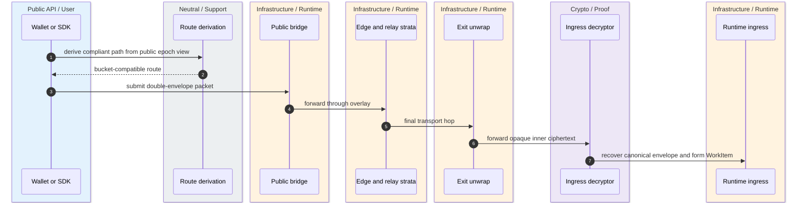
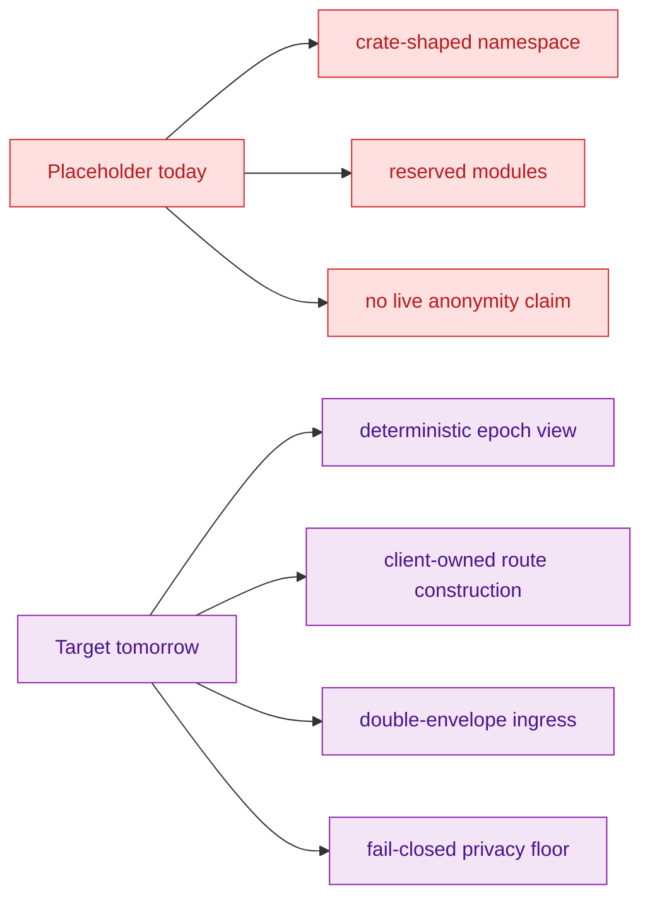

> [!WARNING]
> OnionNet is not a live anonymity subsystem in the current repository. The crate and README explicitly define it as a reserved namespace and placeholder boundary for future overlay work, while the main whitepaper states that wallet-side OnionNet switching still returns deterministic placeholder behavior. `crates/z00z_networks/onionnet/README.md:5-31` `crates/z00z_networks/onionnet/src/lib.rs:2-18` `docs/Z00Z-Main-Whitepaper.md:864-882`

OnionNet matters because Z00Z wants **anonymous runtime-bound ingress without handing topology authority to a hidden committee or turning the exit node into the canonical payload reader**. That is a much narrower and harder goal than "private transport". The repository already reflects this distinction: the code preserves the boundary now, the design papers define the target in detail, and the docs are careful not to over-claim present-tense anonymity. `docs/Z00Z-OnionNet-Whitepaper.md:29-81` `docs/tech-papers/Z00Z-Roadmap-Blueprint.md:837-868`

## 🎯 At A Glance

| Surface | Present status | Why it matters | Source |
|---|---|---|---|
| OnionNet README | Reserved crate boundary with a placeholder rule. | States what OnionNet owns and what it does not own. | `crates/z00z_networks/onionnet/README.md:5-52` |
| OnionNet crate | Module-shaped placeholder with typed reserved seams. | Proves current code is namespace reservation, not implementation. | `crates/z00z_networks/onionnet/src/lib.rs:13-126` |
| OnionNet whitepaper | Full target architecture. | Defines deterministic active-set ingress, client-owned route construction, and double-envelope confidentiality. | `docs/Z00Z-OnionNet-Whitepaper.md:47-81` `docs/Z00Z-OnionNet-Whitepaper.md:320-335` |
| Main whitepaper | Current security honesty. | Explicitly separates live state confidentiality from future transport anonymity. | `docs/Z00Z-Main-Whitepaper.md:864-882` |
| Roadmap blueprint | System placement and blockers. | Connects OnionNet to runtime ingress and lists what remains unfrozen. | `docs/tech-papers/Z00Z-Roadmap-Blueprint.md:812-868` |

## 🧭 Present Boundary Versus Target System

```mermaid
graph TB
  RPC[z00z_networks_rpc]
  Onion[onionnet placeholder crate]
  Wallet[wallet transport mode toggle]
  Runtime[AggregatorIngress::admit(WorkItem)]

  Wallet --> RPC
  Wallet -. future overlay selection .-> Onion
  Onion -. future fail-closed ingress .-> Runtime

  classDef live fill:#E8F5E9,stroke:#43A047,color:#1B5E20
  classDef future fill:#ECEFF1,stroke:#546E7A,color:#263238
  classDef risk fill:#FFE0E0,stroke:#D32F2F,color:#B71C1C
  class RPC,Wallet live
  class Onion,Runtime future
```
<!-- Sources: crates/z00z_networks/onionnet/README.md:16-31, crates/z00z_networks/onionnet/src/lib.rs:2-18, docs/tech-papers/Z00Z-Roadmap-Blueprint.md:850-856, docs/Z00Z-Main-Whitepaper.md:866-882 -->


<!-- Sources: docs/Z00Z-OnionNet-Whitepaper.md:71-81, docs/Z00Z-OnionNet-Whitepaper.md:127-129, docs/Z00Z-OnionNet-Whitepaper.md:320-335, docs/tech-papers/Z00Z-Roadmap-Blueprint.md:852-856 -->


<!-- Sources: crates/z00z_networks/onionnet/README.md:27-47, crates/z00z_networks/onionnet/src/lib.rs:13-126, docs/Z00Z-OnionNet-Whitepaper.md:47-81, docs/Z00Z-OnionNet-Whitepaper.md:141-171, docs/Z00Z-OnionNet-Whitepaper.md:320-335, docs/tech-papers/Z00Z-Roadmap-Blueprint.md:858-868 -->

## 📦 What Exists In Code Today

The current crate is intentionally **module-shaped, not behavior-shaped**. It defines configuration, identity, bootstrap, QUIC transport, link crypto, packet classes, Sphinx path policy, session windows, bridge ingress adapters, edge admission, relay forwarding, exit handoff, and telemetry as placeholder types or traits. That is useful because it freezes the namespace and ownership seams early, but it does not make the overlay live. `crates/z00z_networks/onionnet/src/lib.rs:13-126`

The README explains the boundary just as clearly. `z00z_networks_rpc` owns request and response transport only. OnionNet is supposed to own bridge admission, link protection, path privacy, replay filtering, and exit handoff into canonical runtime ingress. Wallet code may choose OnionNet as a transport mode, but it does not own routing, relay, replay, or exit semantics. `crates/z00z_networks/onionnet/README.md:16-31`

## 🔑 What The Target Architecture Requires

The whitepaper and roadmap make four architectural commitments that go beyond a generic onion-routing story.

| Target property | Meaning | Why it is stronger than "private transport" | Source |
|---|---|---|---|
| Deterministic epoch view | Honest participants derive the same active set and route-validity context from public inputs. | Removes hidden live-topology authority. | `docs/Z00Z-OnionNet-Whitepaper.md:63-69` `docs/Z00Z-OnionNet-Whitepaper.md:141-149` |
| Client-owned route construction | Wallet or SDK recomputes compliant routes locally. | Prevents the bridge from becoming a hidden end-to-end route oracle. | `docs/Z00Z-OnionNet-Whitepaper.md:71-76` |
| Double-envelope confidentiality | Exit unwraps transport only; ingress decryptor recovers the canonical envelope. | Pushes semantic visibility away from the exit boundary. | `docs/Z00Z-OnionNet-Whitepaper.md:320-335` |
| Fail-closed privacy floor | Low diversity or thin lanes must contract or fail closed instead of pretending privacy remains intact. | Makes sparse-load degradation explicit rather than implicit. | `docs/Z00Z-OnionNet-Whitepaper.md:149-171` `docs/tech-papers/Z00Z-Roadmap-Blueprint.md:858-866` |

## ⚙️ Reserved Modules And Their Intended Role

| Module | Current code shape | Intended role | Source |
|---|---|---|---|
| `config`, `bootstrap` | Empty structs today. | Overlay settings and manifest refresh boundaries. | `crates/z00z_networks/onionnet/src/lib.rs:13-18` `crates/z00z_networks/onionnet/src/lib.rs:27-32` |
| `identity`, `transport_quic`, `link_crypto` | Empty structs today. | Node transport identity and adjacent-link carriage plus protection. | `crates/z00z_networks/onionnet/src/lib.rs:20-46` |
| `packet`, `sphinx_path`, `session` | Minimal enum or empty policy structs. | Fixed packet classes, route privacy, and replay windows. | `crates/z00z_networks/onionnet/src/lib.rs:48-76` |
| `bridge_api`, `edge`, `relay`, `exit` | Empty trait or policy structs. | Public ingress adapters, relay strata, and exit handoff into runtime. | `crates/z00z_networks/onionnet/src/lib.rs:78-105` |
| `telemetry` | Empty struct. | Overlay health and operator evidence. | `crates/z00z_networks/onionnet/src/lib.rs:107-112` |

## 🚫 What Must Not Be Claimed Yet

The main whitepaper is explicit that current Z00Z security claims are **theorem-level validity and replay-bounded state transition**, not network-level anonymity. OnionNet is a future transport shell, and wallet-side OnionNet switching is still deterministic placeholder behavior. `docs/Z00Z-Main-Whitepaper.md:864-882`

The roadmap and OnionNet paper are just as explicit about the blockers. Public-registry rules, route derivation, witness distribution, replay and AAD binding, ingress-recipient confidentiality, challenge evidence, low-load privacy policy, and any break-glass authority are still unfrozen. That means the system has a real architectural target but not a deployable anonymity contract. `docs/tech-papers/Z00Z-Roadmap-Blueprint.md:858-868` `docs/Z00Z-OnionNet-Whitepaper.md:617` `docs/Z00Z-OnionNet-Whitepaper.md:661-666`

## 📖 References

- `crates/z00z_networks/onionnet/README.md:5-52`
- `crates/z00z_networks/onionnet/src/lib.rs:2-126`
- `docs/Z00Z-OnionNet-Whitepaper.md:29-81`
- `docs/Z00Z-OnionNet-Whitepaper.md:125-171`
- `docs/Z00Z-OnionNet-Whitepaper.md:320-335`
- `docs/Z00Z-Main-Whitepaper.md:864-882`
- `docs/tech-papers/Z00Z-Roadmap-Blueprint.md:812-868`

## Related Pages

| Page | Relationship |
|---|---|
| [Networking And Telemetry](./networking-and-telemetry.md) | Covers the current live RPC and watcher transport seams around OnionNet. |
| [Wallet Stub Surface](../04-wallet-and-rpc/wallet-stub-surface.md) | Shows the placeholder OnionNet toggle from the wallet side. |
| [Publication Route Authority](../05-storage-runtime/publication-route-authority.md) | Explains the runtime handoff boundary OnionNet is supposed to terminate into. |
