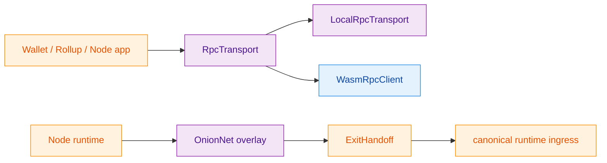
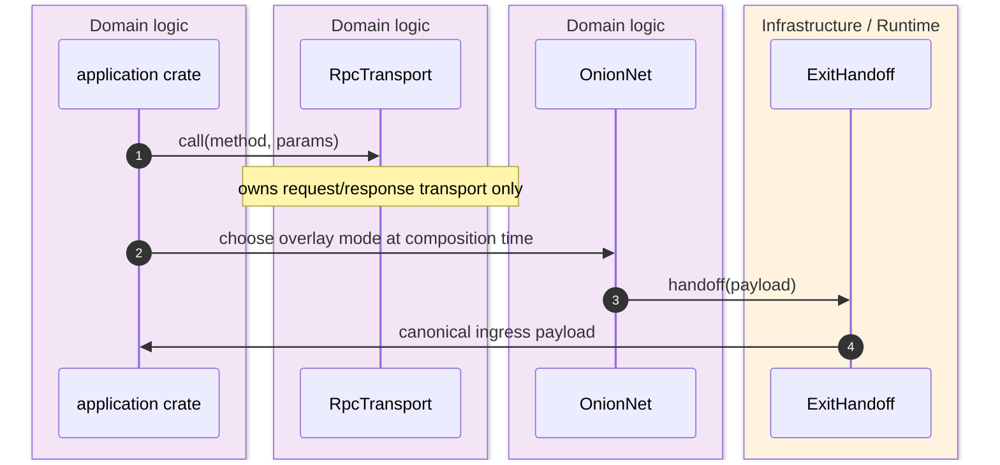
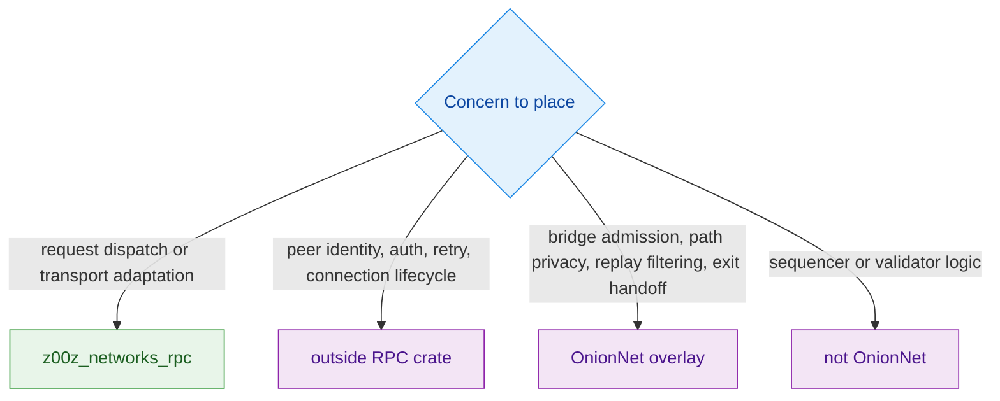

The repository draws a hard line between **request transport** and **privacy ingress**. `z00z_networks_rpc` owns typed request or response carriage plus dispatch helpers, while OnionNet is reserved as the node-owned privacy overlay that sits before canonical ingress. Treating those layers as interchangeable would collapse retry and dispatch plumbing into anonymity, routing, and replay policy that the code explicitly keeps separate. `crates/z00z_networks/rpc/README.md:3-18` `crates/z00z_networks/rpc/src/transport.rs:1-30` `crates/z00z_networks/onionnet/README.md:5-25`

## At A Glance

| Component | Responsibility | Key file | Source |
|---|---|---|---|
| RPC boundary statement | Declares this crate transport-focused and excludes peer identity, auth, retry policy, and connection lifecycle. | `crates/z00z_networks/rpc/README.md` | `crates/z00z_networks/rpc/README.md:3-18` |
| RPC crate facade | Re-exports only error, transport trait, dispatcher, and local or WASM transport seams. | `crates/z00z_networks/rpc/src/lib.rs` | `crates/z00z_networks/rpc/src/lib.rs:1-98` |
| `RpcTransport` contract | Narrows transport to one method call and one typed response or transport error. | `crates/z00z_networks/rpc/src/transport.rs` | `crates/z00z_networks/rpc/src/transport.rs:1-30` |
| OnionNet boundary statement | Declares OnionNet a node-owned privacy overlay, not an RPC alias or application service. | `crates/z00z_networks/onionnet/README.md` | `crates/z00z_networks/onionnet/README.md:5-25` |
| OnionNet placeholder modules | Reserves the future overlay namespace for identity, bridge, relay, exit, telemetry, and privacy packet seams. | `crates/z00z_networks/onionnet/src/lib.rs` | `crates/z00z_networks/onionnet/src/lib.rs:1-126` |

## Architecture

<!-- Sources: crates/z00z_networks/rpc/src/lib.rs:4-19, crates/z00z_networks/rpc/src/lib.rs:64-98, crates/z00z_networks/rpc/src/transport.rs:12-30, crates/z00z_networks/onionnet/README.md:16-25, crates/z00z_networks/onionnet/src/lib.rs:78-126 -->

<!-- Sources: crates/z00z_networks/rpc/src/transport.rs:12-30, crates/z00z_networks/onionnet/README.md:18-25, crates/z00z_networks/onionnet/src/lib.rs:78-103 -->

<!-- Sources: crates/z00z_networks/rpc/README.md:7-18, crates/z00z_networks/rpc/src/lib.rs:8-19, crates/z00z_networks/onionnet/README.md:16-25 -->

## RPC Transport Boundary

The RPC crate is intentionally reusable precisely because it does less. The top-level docs say it owns request dispatch, transport adaptation, and local testing helpers only, and the `RpcTransport` trait itself is a single async `call(method, params)` surface that returns a `Value` or `RpcError`. There is no peer identity field, no auth state, no retry contract, and no connection lifecycle state embedded in that trait. `crates/z00z_networks/rpc/src/lib.rs:4-19` `crates/z00z_networks/rpc/src/transport.rs:12-30`

| RPC surface | What it owns | What it explicitly does not own | Source |
|---|---|---|---|
| `RpcTransport` | One request and one typed response. | Peer identity, auth, retry, connection lifecycle. | `crates/z00z_networks/rpc/src/transport.rs:12-30` |
| `RpcDispatcher` | Native method routing. | Business semantics or higher-level network policy. | `crates/z00z_networks/rpc/README.md:13-18` `crates/z00z_networks/rpc/src/lib.rs:64-98` |
| `LocalRpcTransport` | In-process integration and transport-local tests. | Overlay routing or node privacy semantics. | `crates/z00z_networks/rpc/README.md:15-18` |
| `WasmRpcClient` | Browser-facing transport adapter. | Wallet privacy overlay control plane. | `crates/z00z_networks/rpc/README.md:15-18` `crates/z00z_networks/rpc/src/lib.rs:69-90` |

## OnionNet Overlay Boundary

OnionNet is reserved as a **node-owned privacy overlay**. Even in placeholder form, its README is explicit that it owns bridge admission, link protection, path privacy, replay filtering, and exit handoff into canonical ingress. The placeholder module tree already mirrors that target: `identity`, `transport_quic`, `link_crypto`, `packet`, `sphinx_path`, `session`, `bridge_api`, `edge`, `relay`, `exit`, and `telemetry`. `crates/z00z_networks/onionnet/README.md:16-31` `crates/z00z_networks/onionnet/src/lib.rs:13-126`

| Overlay seam | Placeholder meaning today | Why it is not RPC transport | Source |
|---|---|---|---|
| `identity::NodeTransportIdentity` | Node-owned transport identity root. | RPC intentionally excludes identity ownership. | `crates/z00z_networks/onionnet/src/lib.rs:20-25` `crates/z00z_networks/rpc/src/transport.rs:19-21` |
| `transport_quic::QuinnTransportConfig` | Node-to-node carriage seam. | RPC transport is a generic request carrier, not overlay topology. | `crates/z00z_networks/onionnet/src/lib.rs:34-39` |
| `packet::PacketClass` | Overlay traffic-class model for data, cover, loop, and control. | RPC has no privacy-traffic taxonomy. | `crates/z00z_networks/onionnet/src/lib.rs:48-61` |
| `edge`, `relay`, `exit` | First-hop admission, relay forwarding, and canonical ingress handoff. | Those are overlay routing responsibilities, not RPC method dispatch. | `crates/z00z_networks/onionnet/src/lib.rs:84-104` |

## The Real Boundary Rule

The practical rule is simple. If the concern is "how do I carry one RPC method call between two endpoints," it belongs in `z00z_networks_rpc`. If the concern is "how do I protect first-hop privacy, route through relays, classify cover traffic, or hand off from an anonymous overlay into canonical ingress," it belongs in OnionNet or the later composition root that wires OnionNet in. `crates/z00z_networks/rpc/README.md:7-18` `crates/z00z_networks/onionnet/README.md:18-25`

That is also why the README says wallets may select OnionNet as a transport mode while still not owning OnionNet routing, relay, replay, or exit semantics. Wallets compose the boundary; they do not redefine it. `crates/z00z_networks/onionnet/README.md:22-25`

## Related Pages

| Page | Relationship |
|---|---|
| [Networking And Telemetry](./networking-and-telemetry.md) | Broader networking and observability overview. |
| [OnionNet Target Architecture](./onionnet-target-architecture.md) | Deeper dive into the placeholder-vs-target overlay story. |
| [Wallet RPC Gaps](../04-wallet-and-rpc/wallet-rpc-gaps.md) | RPC method wiring on the wallet side, which still sits above this transport boundary. |
