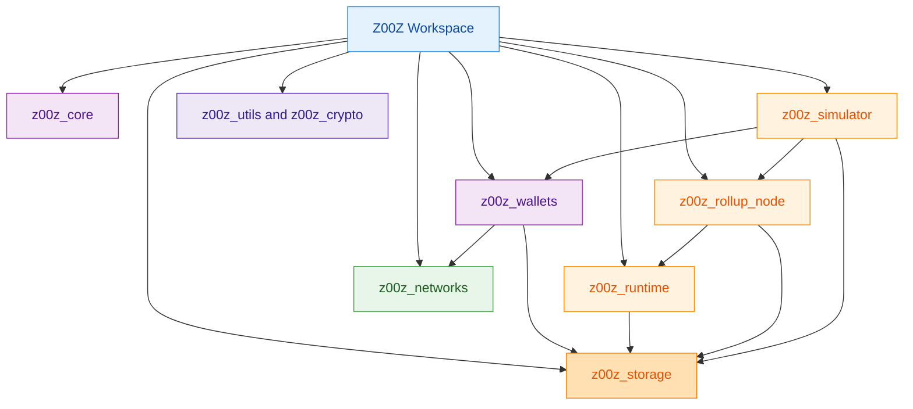
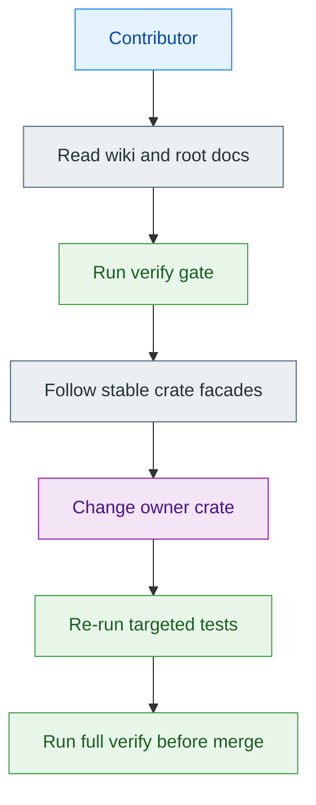
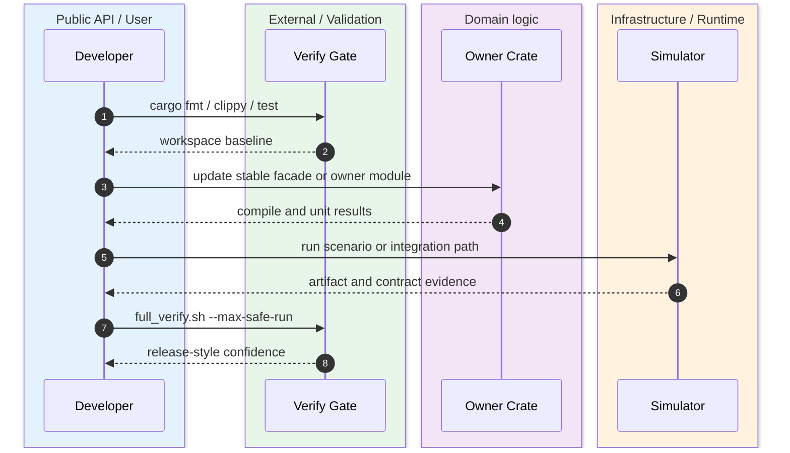

Z00Z is a Cargo workspace that deliberately splits protocol, wallet, storage, runtime, simulator, networking, and observability responsibilities into separate crates instead of treating the repository as one monolithic node package. The workspace manifest and crate-root docs show that the project is organized around stable facades and explicit ownership boundaries. `Cargo.toml:1-76` `README.md:1-8` `crates/z00z_core/README.md:3-17` `crates/z00z_wallets/README.md:11-37`

## 🎯 Quick Start

| Command | Why run it | Source |
|---|---|---|
| `cargo fmt --check` | Enforce formatting before deeper verification. | `.github/skills/z00z-full-verify-gate/scripts/full_verify.sh:73-76` |
| `cargo clippy --workspace --release --all-targets --all-features -- -D warnings` | Run the canonical workspace lint gate. | `.github/skills/z00z-full-verify-gate/scripts/full_verify.sh:73-76` |
| `cargo test --all` | Baseline regression pass for all crates. | `.github/copilot-instructions.md:141-149` |
| `./.github/skills/z00z-full-verify-gate/scripts/full_verify.sh --max-safe-run` | Run the repository’s release-style verify gate, including optional heavy stages. | `.github/skills/z00z-full-verify-gate/scripts/full_verify.sh:64-103` |
| `cargo run --package z00z_simulator --bin scenario_1 -- --help` | Inspect the canonical simulator entrypoint. | `crates/z00z_simulator/Cargo.toml:26-36` `crates/z00z_simulator/bin/scenario_1.rs:71-73` |

## 🧭 Architecture Overview

<!-- Sources: Cargo.toml:3-17, crates/z00z_core/src/lib.rs:103-132, crates/z00z_wallets/src/lib.rs:97-156, crates/z00z_storage/src/lib.rs:4-15, crates/z00z_simulator/Cargo.toml:38-55 -->

<!-- Sources: deep-wiki-readme.md:71-106, .github/copilot-instructions.md:141-149, crates/z00z_simulator/README.md:24-30, .github/skills/z00z-full-verify-gate/scripts/full_verify.sh:64-103 -->

<!-- Sources: .github/skills/z00z-full-verify-gate/scripts/full_verify.sh:64-103, crates/z00z_simulator/README.md:46-60, crates/z00z_core/README.md:22-36, crates/z00z_wallets/README.md:171-183 -->

## 📚 Documentation Map

| Section | What it explains | Start here when you need | Page |
|---|---|---|---|
| Getting Started | Workspace shape, setup, and verify loop. | First contact with the repo. | [Workspace Overview](./01-getting-started/workspace-overview.md) |
| Architecture | Layering and ownership seams. | Deciding where code belongs. | [System Overview](./02-architecture/system-overview.md) |
| Core Protocol | Object families, genesis, and bootstrap artifacts. | Understanding how protocol objects enter the system. | [Object Model And Genesis](./03-core-protocol/object-model-and-genesis.md) |
| Wallet And RPC | Wallet inventory, services, and JSON-RPC exposure. | Working on user-facing state and transport seams. | [Wallet Architecture](./04-wallet-and-rpc/wallet-architecture.md) |
| Storage Runtime And Rollup | Settlement proofs, runtime batching, validator/watcher surfaces, rollup theorem checks. | Tracing a committed object into storage or rollup evidence. | [Settlement Runtime And Rollup](./05-storage-runtime/settlement-runtime-and-rollup.md) |
| Simulator And Quality | Scenario harness and release-style evidence flow. | Reproducing multi-crate behavior. | [Scenario Pipeline](./06-simulator-and-quality/scenario-pipeline.md) |
| Networking And Observability | RPC transport, OnionNet placeholder, watcher and telemetry surfaces. | Following transport and ops-facing boundaries. | [Networking And Telemetry](./07-networking-and-observability/networking-and-telemetry.md) |

## 🔑 Key Files

| File | Why it matters | Source |
|---|---|---|
| `Cargo.toml` | Defines the workspace members and default member set. | `Cargo.toml:3-34` |
| `crates/z00z_core/src/lib.rs` | Publishes the stable protocol facade. | `crates/z00z_core/src/lib.rs:103-132` |
| `crates/z00z_wallets/src/lib.rs` | Publishes the wallet’s stable entrypoints and re-exports. | `crates/z00z_wallets/src/lib.rs:97-156` |
| `crates/z00z_storage/src/settlement/mod.rs` | Re-exports the live settlement contract used by runtime and validators. | `crates/z00z_storage/src/settlement/mod.rs:32-93` |
| `crates/z00z_simulator/src/scenario_1/mod.rs` | Declares the canonical scenario stages and runner surface. | `crates/z00z_simulator/src/scenario_1/mod.rs:8-37` |
| `./.github/skills/z00z-full-verify-gate/scripts/full_verify.sh` | Encodes the canonical repository-wide verification sequence. | `.github/skills/z00z-full-verify-gate/scripts/full_verify.sh:64-103` |

## ⚙️ Tech Stack Summary

| Layer | Primary surface | Notes | Source |
|---|---|---|---|
| Workspace orchestration | Cargo workspace | Fourteen default members form the live build surface. | `Cargo.toml:3-34` |
| Core protocol | `z00z_core` | Assets, genesis, policies, rights, and vouchers live here. | `crates/z00z_core/src/lib.rs:103-132` |
| Crypto and shared primitives | `z00z_crypto`, `z00z_utils` | One facade for crypto, one cross-cutting crate for I/O/config/time/logging/RNG. | `crates/z00z_crypto/README.md:7-25` `crates/z00z_utils/README.md:3-25` |
| User state and transport edges | `z00z_wallets`, `z00z_networks_rpc` | Wallet owns typed inventory; RPC crate stays transport-only. | `crates/z00z_wallets/README.md:11-37` `crates/z00z_networks/rpc/README.md:3-18` |
| Durability and verification | `z00z_storage`, `z00z_rollup_node`, runtime crates | Storage owns settlement truth; runtime plans; validators/watchers observe; rollup node composes. | `crates/z00z_storage/README.md:4-18` `crates/z00z_rollup_node/README.md:3-15` |

## 📖 References

- `Cargo.toml:1-76`
- `README.md:1-8`
- `crates/z00z_core/README.md:3-36`
- `crates/z00z_wallets/README.md:11-37`
- `crates/z00z_storage/README.md:4-18`
- `.github/skills/z00z-full-verify-gate/scripts/full_verify.sh:64-103`

## Related Pages

| Page | Relationship |
|---|---|
| [Workspace Overview](./01-getting-started/workspace-overview.md) | Expands the workspace-level structure behind this landing page. |
| [System Overview](./02-architecture/system-overview.md) | Explains the layered architecture hinted at by the diagrams above. |
| [Scenario Pipeline](./06-simulator-and-quality/scenario-pipeline.md) | Shows how multi-crate behavior is exercised in practice. |
