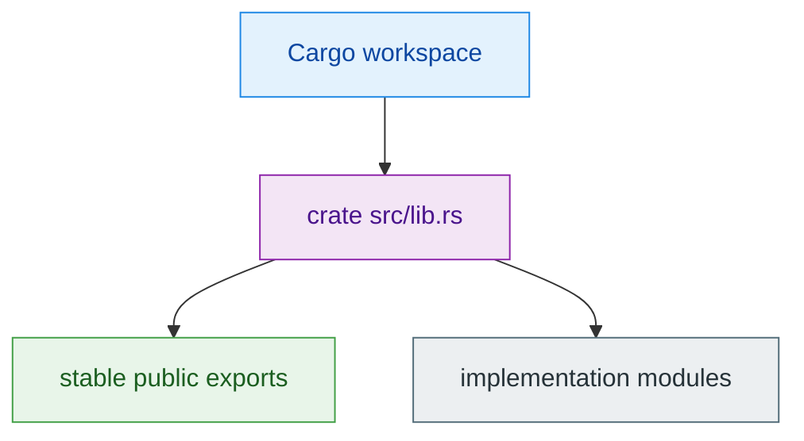
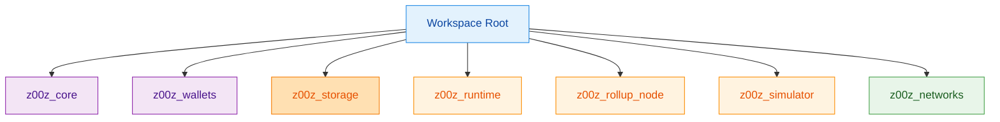
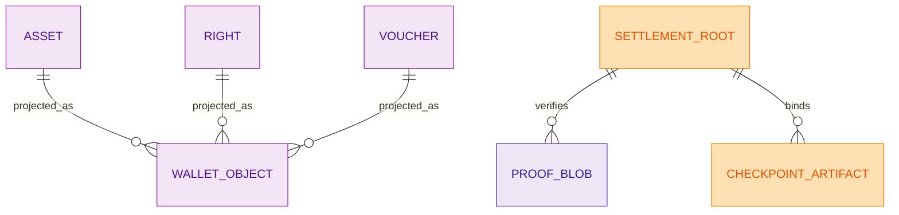
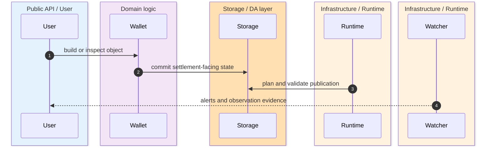

This guide assumes you already know how to program in Python or JavaScript and need a working mental model for a Rust workspace that treats ownership boundaries, stable facades, and release-style verification as first-class concerns. `Cargo.toml:3-17` `crates/z00z_core/src/lib.rs:103-132` `.github/skills/z00z-full-verify-gate/scripts/full_verify.sh:64-103`

## 🎯 At A Glance

| Topic | What matters first | Source |
|---|---|---|
| Workspace shape | Fourteen default workspace members, each with clear ownership. | `Cargo.toml:3-34` |
| Protocol core | `z00z_core` owns assets, genesis, policies, rights, vouchers. | `crates/z00z_core/src/lib.rs:103-132` |
| Wallet surface | Wallet inventory is typed; assets, vouchers, and rights are not interchangeable. | `crates/z00z_wallets/README.md:11-37` |
| Verification | The repository expects a full verify cycle, not only `cargo test`. | `.github/skills/z00z-full-verify-gate/scripts/full_verify.sh:64-103` |

## 🧩 Part I: Rust For Python And JavaScript Engineers

| Concept | Rust in this repo | Python/JS analogy | Source |
|---|---|---|---|
| Crate root facade | `src/lib.rs` re-exports supported public API. | Module `__init__.py` or package barrel export, but stricter. | `crates/z00z_core/src/lib.rs:112-132` |
| Feature flags | Cargo features gate optional behavior like deterministic RNG or WASM. | Optional dependency flags or build-time environment switches. | `crates/z00z_core/Cargo.toml:43-59` `crates/z00z_wallets/Cargo.toml:153-187` |
| Result-oriented error flow | Public crates publish typed errors instead of throwing dynamically. | Explicit exception classes, but encoded in function signatures. | `crates/z00z_rollup_node/src/lib.rs:56-83` |

<!-- Sources: Cargo.toml:3-34, crates/z00z_core/src/lib.rs:103-132, crates/z00z_wallets/src/lib.rs:97-156 -->

## 🧭 Part II: This Codebase

### 📦 Project Structure

<!-- Sources: Cargo.toml:3-17, crates/z00z_simulator/Cargo.toml:38-55 -->

| Directory or crate | Why it exists | Source |
|---|---|---|
| `crates/z00z_core` | Protocol object and genesis authority. | `crates/z00z_core/README.md:22-43` |
| `crates/z00z_wallets` | Wallet state, object inventory, RPC, persistence. | `crates/z00z_wallets/README.md:27-37` |
| `crates/z00z_storage` | Settlement truth and proof surfaces. | `crates/z00z_storage/README.md:4-18` |
| `crates/z00z_simulator` | End-to-end scenario harness and artifact producer. | `crates/z00z_simulator/README.md:46-60` |

### 🔑 Core Concepts

<!-- Sources: crates/z00z_wallets/README.md:13-37, crates/z00z_storage/src/settlement/mod.rs:45-57, crates/z00z_rollup_node/src/lib.rs:85-95 -->

| Term | Plain-English meaning | Source |
|---|---|---|
| Asset | Spendable value object. | `crates/z00z_wallets/README.md:16-17` |
| Voucher | Conditional claim object with lifecycle rules. | `crates/z00z_wallets/README.md:17-18` |
| Right | Authority object, not spendable balance. | `crates/z00z_wallets/README.md:18-19` |
| Settlement root | Storage-owned state commitment. | `crates/z00z_storage/src/settlement/README.md:94-121` |

### 🔄 Request Lifecycle

<!-- Sources: crates/z00z_wallets/src/rpc/mod.rs:43-91, crates/z00z_storage/src/settlement/mod.rs:83-93, crates/z00z_runtime/watchers/src/lib.rs:13-20 -->

## 🚀 Part III: Getting Productive

### ⚙️ Prerequisites And Setup

| Tool | Version hint | Install or verify command | Source |
|---|---|---|---|
| Rust toolchain | Rust 1.90 workspace target | `rustup show` | `Cargo.toml:49-60` |
| WASM target | Needed for wallet browser lane | `rustup target add wasm32-unknown-unknown` | `crates/z00z_wallets/README.md:97-99` |
| Verify gate | Repository-local script | `./.github/skills/z00z-full-verify-gate/scripts/full_verify.sh` | `.github/skills/z00z-full-verify-gate/scripts/full_verify.sh:64-103` |

### 🛠️ Your First Task

<!-- Sources: crates/z00z_core/README.md:3-20, crates/z00z_wallets/README.md:171-183, .github/skills/z00z-full-verify-gate/scripts/full_verify.sh:64-103 -->

1. Start with the crate README and crate root.
2. Change the owner crate, not a nearby helper crate.
3. Run a targeted command such as `cargo test -p z00z_core --release --all-features`.
4. Finish with `./.github/skills/z00z-full-verify-gate/scripts/full_verify.sh --max-safe-run`.

### 🧪 Running Tests

| Goal | Command | Source |
|---|---|---|
| All workspace tests | `cargo test --all` | `.github/copilot-instructions.md:141-149` |
| One crate | `cargo test -p z00z_core --release --all-features` | `crates/z00z_core/Cargo.toml:43-69` |
| Wallet WASM check | `cargo check -p z00z_wallets --target wasm32-unknown-unknown --features wasm` | `crates/z00z_wallets/README.md:117-127` |
| Simulator CLI wiring | `cargo run -p z00z_simulator --bin scenario_1 -- --help` | `crates/z00z_simulator/bin/scenario_1.rs:71-73` |

### ⚠️ Common Pitfalls

| Symptom | Cause | Fix |
|---|---|---|
| Change compiles locally but breaks release verification | You skipped the full verify gate. | Run the repository script, not only crate-local tests. |
| A voucher or right appears in a cash-only path | You treated `wallet.asset.*` as a generic object API. | Keep typed-object work under `wallet.object.*`. |
| Simulator code deep-imports another crate | Harness code started owning a business rule. | Add or use a stable facade in the owner crate. |

### 📚 Quick Glossary

| Term | Meaning |
|---|---|
| Facade | The stable public API exported from a crate root or shallow module. |
| Owner crate | The crate that defines the canonical semantics for a concern. |
| Settlement | The storage-owned representation of committed object state. |
| Publication | Runtime movement of validated batches toward durable evidence. |
| Release packet | The public evidence set emitted by scenario and verification flows. |

## 📖 References

- `Cargo.toml:3-34`
- `crates/z00z_core/src/lib.rs:103-132`
- `crates/z00z_wallets/README.md:11-44`
- `crates/z00z_storage/src/settlement/README.md:82-121`
- `.github/skills/z00z-full-verify-gate/scripts/full_verify.sh:64-103`

## Related Pages

| Page | Relationship |
|---|---|
| [Workspace Overview](../01-getting-started/workspace-overview.md) | Shorter version of the same orientation map. |
| [Object Model And Genesis](../03-core-protocol/object-model-and-genesis.md) | Deep dive on the core domain vocabulary introduced here. |
| [Scenario Pipeline](../06-simulator-and-quality/scenario-pipeline.md) | Shows the integration harness mentioned in the contribution workflow. |
