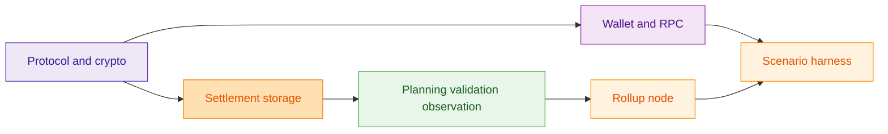
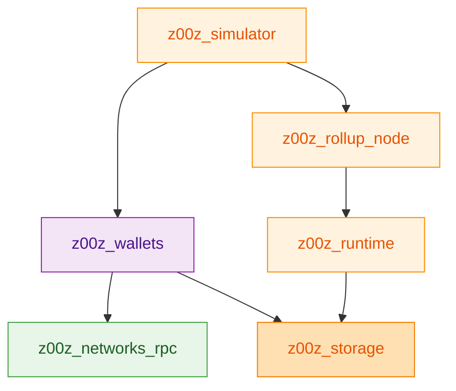
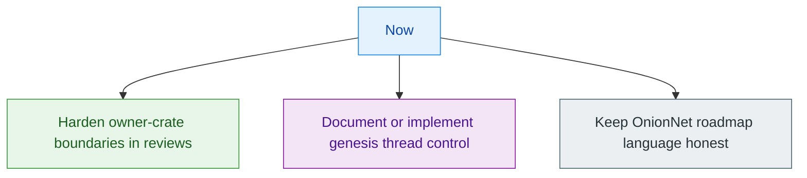

Z00Z is organized as a set of explicit owner crates for protocol, wallet state, settlement storage, runtime publication, and end-to-end scenario evidence. That separation reduces hidden coupling, but it also means delivery risk concentrates at the interfaces between crates rather than inside one deployable service. `Cargo.toml:3-17` `crates/z00z_rollup_node/README.md:3-15`

## 🎯 Capability Map

| Capability | Status | Maturity | Dependencies | Source |
|---|---|---|---|---|
| Confidential protocol object model | Built | Medium | `z00z_core`, `z00z_crypto` | `crates/z00z_core/src/lib.rs:103-132` |
| Typed wallet inventory | Built | Medium | `z00z_wallets`, `z00z_storage` | `crates/z00z_wallets/README.md:11-37` |
| Settlement proof and checkpoint surface | Built | Medium | `z00z_storage`, `z00z_rollup_node` | `crates/z00z_storage/README.md:4-18` `crates/z00z_rollup_node/README.md:3-15` |
| Distributed planner/runtime simulation | Partial | Medium | runtime crates, simulator | `crates/z00z_runtime/aggregators/README.md:3-29` `crates/z00z_simulator/README.md:62-92` |
| Privacy overlay networking | Planned placeholder | Low | `onionnet` | `crates/z00z_networks/onionnet/README.md:3-31` |

## 🧭 Architecture At A Glance

<!-- Sources: crates/z00z_core/src/lib.rs:103-132, crates/z00z_wallets/src/lib.rs:97-156, crates/z00z_storage/src/lib.rs:4-15, crates/z00z_rollup_node/README.md:3-15, crates/z00z_simulator/README.md:6-30 -->

## 🧩 Team Topology

| Component family | Implied owner domain | Criticality | Bus factor | Source |
|---|---|---|---|---|
| Protocol and genesis | Core protocol team | High | Low-to-medium | `crates/z00z_core/README.md:22-43` |
| Wallet and RPC | Wallet/application team | High | Low-to-medium | `crates/z00z_wallets/README.md:47-55` |
| Storage and runtime | Platform/runtime team | High | Low-to-medium | `crates/z00z_storage/README.md:4-18` `crates/z00z_runtime/aggregators/README.md:18-29` |
| Simulator and telemetry | Developer productivity/ops | Medium | Medium | `crates/z00z_simulator/README.md:46-60` `crates/z00z_telemetry/README.md:3-12` |

## ⚠️ Risk Assessment

| Risk | Likelihood | Impact | Mitigation | Owner | Source |
|---|---|---|---|---|---|
| Boundary drift between owner crates | Medium | High | Keep changes at stable facades and enforce full verify gate. | Platform leads | `crates/z00z_utils/README.md:20-25` `.github/skills/z00z-full-verify-gate/scripts/full_verify.sh:64-103` |
| Placeholder networking overlay | High | Medium | Treat OnionNet as roadmap scope, not production capability. | Network leads | `crates/z00z_networks/onionnet/README.md:27-31` |
| Genesis threading drift after future refactors | Medium | Medium | Keep `performance.num_threads` as the one canonical manifest-to-execution path and regression-test dedicated pool wiring. | Core protocol leads | `crates/z00z_core/src/genesis/genesis_config.rs` `crates/z00z_core/src/genesis/genesis_run.rs` |

## 📈 Cost And Scaling Model

| Cost driver | Scaling behavior | Trigger for next investment | Source |
|---|---|---|---|
| Genesis and proof-heavy CPU work | Scales with proof generation and verification volume. | When proof throughput becomes a release bottleneck. | `crates/z00z_core/src/genesis/mod.rs:83-89` |
| Runtime publication and observation | Scales with planned batches and publication evidence. | When route, verdict, or observation stages dominate latency. | `crates/z00z_runtime/aggregators/README.md:11-16` `crates/z00z_runtime/watchers/README.md:13-16` |

## 🗺️ Dependency Map

<!-- Sources: crates/z00z_wallets/Cargo.toml:76-87, crates/z00z_simulator/Cargo.toml:46-55, crates/z00z_rollup_node/src/lib.rs:19-31 -->

## 📊 Technical Debt Summary

| Issue | Business impact | Effort to fix | Priority | Source |
|---|---|---|---|---|
| Unimplemented privacy-overlay seam | Delays network-mode roadmap promises. | Medium | High | `crates/z00z_networks/onionnet/README.md:27-31` |
| Genesis threading regressions could reopen a second tuning path | Would reintroduce operator drift between manifest config and actual bootstrap execution. | Small-to-medium | Medium | `crates/z00z_core/src/genesis/genesis_config.rs` |

## ✅ Recommendations

<!-- Sources: crates/z00z_utils/README.md:20-25, crates/z00z_core/src/genesis/genesis_config.rs:205-221, crates/z00z_networks/onionnet/README.md:27-31 -->

1. Treat owner-crate boundaries as a delivery KPI, because most correctness and security risk lives at those seams.
2. Keep `performance.num_threads` on the one canonical manifest-to-execution path as bootstrap scale increases.
3. Keep OnionNet in roadmap language only until the placeholder crate turns into a verified implementation surface.

## 📖 References

- `Cargo.toml:3-17`
- `crates/z00z_core/src/genesis/genesis_config.rs:205-221`
- `crates/z00z_rollup_node/README.md:3-15`
- `crates/z00z_runtime/aggregators/README.md:18-29`
- `crates/z00z_networks/onionnet/README.md:27-31`

## Related Pages

| Page | Relationship |
|---|---|
| [Staff Engineer Guide](./staff-engineer-guide.md) | Technical source for the leadership abstractions in this guide. |
| [System Overview](../02-architecture/system-overview.md) | Direct engineering architecture context. |
