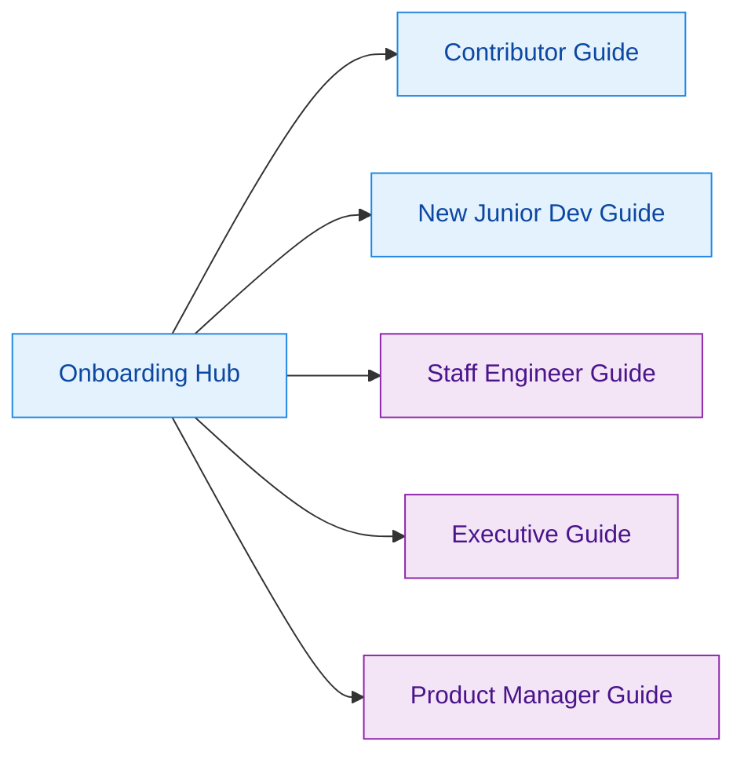

Z00Z is a privacy-focused blockchain workspace with separate crates for protocol, wallet, storage, runtime, simulator, and observability concerns. The best onboarding path depends on whether you need implementation detail, architectural judgment, business risk framing, user-facing capability language, or a slower first pass through the repo. (Cargo.toml:3) (README.md:1)

## 🎯 Guide Selector

| Guide | Audience | What You'll Learn | Time |
|---|---|---|---|
| [Contributor Guide](./contributor-guide.md) | New contributors with Python/JS experience | Repo setup, crate reading order, object model, verify flow, first change checklist | ~30 min |
| [ Junior Dev Guide](./junior-dev-guide.md) | New junior engineers who need a slower, safer first pass | What to read first, which crate owns what, safe commands, and when to ask for help | ~25 min |
| [Staff Engineer Guide](./staff-engineer-guide.md) | Staff/principal engineers | The core ownership insight, cross-crate seams, risks, and deep-reading order | ~45 min |
| [Executive Guide](./executive-guide.md) | Engineering leaders | Capability map, scaling pressure, risk profile, and next-quarter priorities | ~20 min |
| [Product Manager Guide](./product-manager-guide.md) | Product managers and non-engineering stakeholders | What users can do, what the system cannot do yet, privacy and artifact constraints | ~20 min |

## 🧭 Orientation Map

<!-- Sources: Cargo.toml:3-17, crates/z00z_wallets/README.md:11-37, crates/z00z_simulator/README.md:62-92 -->

## 📖 References

- (Cargo.toml:3)
- (README.md:1)
- (crates/z00z_wallets/README.md:11)
- (crates/z00z_simulator/README.md:62)

## Related Pages

| Page | Relationship |
|---|---|
| [Workspace Overview](../wiki/01-getting-started/workspace-overview.md) | Shared prerequisite for every onboarding path. |
| [System Overview](../wiki/02-architecture/system-overview.md) | Best follow-up after any onboarding guide. |
