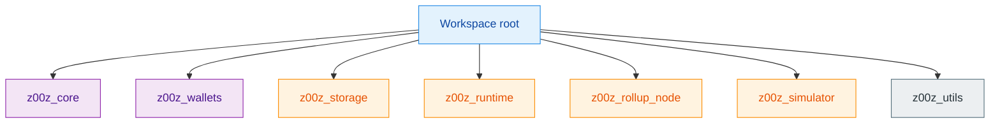
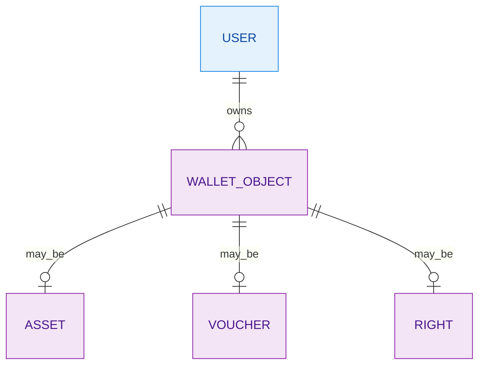
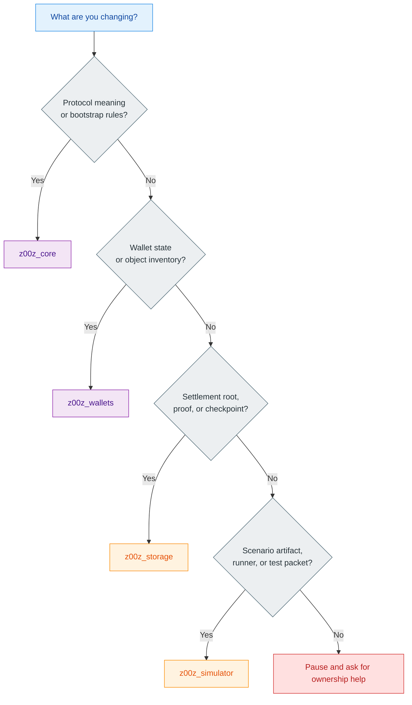
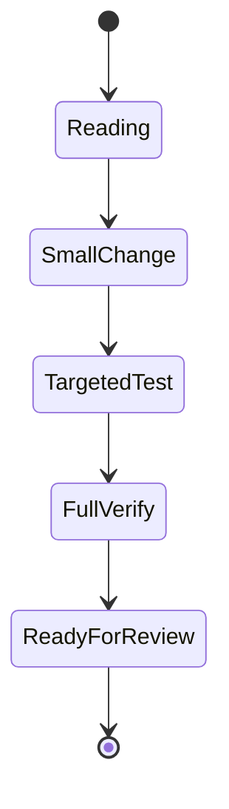

Z00Z is not one big app. It is a Rust workspace where different crates own different kinds of truth: protocol objects, wallet state, settlement proofs, runtime planning, and simulator evidence. If you learn which crate owns which decision, the repo becomes much easier to change safely. (Cargo.toml:3) (crates/z00z_core/README.md:22) (crates/z00z_storage/README.md:4)

## 🎯 What To Learn First

| Topic | Why it matters | Source |
|---|---|---|
| Workspace members | The repo is split into separate crates with separate ownership. | (Cargo.toml:3) |
| Object families | Assets, vouchers, and rights are not interchangeable. | (crates/z00z_wallets/README.md:13) |
| Storage truth | Settlement roots and proofs belong to storage, not to wallet or simulator code. | (crates/z00z_storage/src/settlement/README.md:94) |
| Verify gate | “It compiled” is not enough in this repo. | (.github/skills/z00z-full-verify-gate/scripts/full_verify.sh:73) |

## 🧭 Workspace Map

<!-- Sources: Cargo.toml:3-17, crates/z00z_core/src/lib.rs:103-132, crates/z00z_wallets/src/lib.rs:97-156, crates/z00z_storage/src/lib.rs:4-15, crates/z00z_simulator/src/lib.rs:6-39 -->

| Crate | Junior-friendly summary | Source |
|---|---|---|
| `z00z_core` | Defines protocol objects and bootstrap rules. | (crates/z00z_core/README.md:22) |
| `z00z_wallets` | Holds user-facing wallet state and typed object inventory. | (crates/z00z_wallets/README.md:27) |
| `z00z_storage` | Owns committed settlement state, roots, and proof checks. | (crates/z00z_storage/README.md:4) |
| `z00z_simulator` | Runs end-to-end scenarios and emits evidence files. | (crates/z00z_simulator/README.md:46) |
| `z00z_utils` | Shared primitives like codecs, I/O, time, logging, and RNG. | (crates/z00z_utils/README.md:5) |

## 📦 Three Object Families

<!-- Sources: crates/z00z_wallets/README.md:13-25, crates/z00z_wallets/README.md:27-37 -->

| Object | What it means | What juniors usually get wrong | Source |
|---|---|---|---|
| Asset | Spendable value. | Assuming every object can go through cash-transfer code. | (crates/z00z_wallets/README.md:16) |
| Voucher | A claim with lifecycle steps such as accept, redeem, refund, or expiry. | Treating it like free cash. | (crates/z00z_wallets/README.md:17) (crates/z00z_simulator/README.md:69) |
| Right | A permission object that allows specific actions. | Counting it as balance. | (crates/z00z_wallets/README.md:18) |

## 🔍 How To Pick The Right Crate

<!-- Sources: crates/z00z_core/README.md:22-43, crates/z00z_wallets/README.md:27-37, crates/z00z_storage/README.md:4-18, crates/z00z_simulator/README.md:12-30 -->

| If your change touches... | Start here | Source |
|---|---|---|
| Assets, rights, vouchers, genesis | `z00z_core` | (crates/z00z_core/src/lib.rs:103) |
| Wallet object inventory, receive flows, RPC wrappers | `z00z_wallets` | (crates/z00z_wallets/src/lib.rs:97) |
| Settlement path, root, proof, checkpoint contract | `z00z_storage` | (crates/z00z_storage/src/settlement/README.md:82) |
| Public scenario packet or stage runner | `z00z_simulator` | (crates/z00z_simulator/README.md:46) |

## 🚀 First Week Checklist

| Step | Command or reading target | What success looks like | Source |
|---|---|---|---|
| 1 | Read `README.md`, then `crates/z00z_core/README.md` | You can explain what assets, vouchers, and rights are. | (README.md:1) (crates/z00z_core/README.md:22) |
| 2 | `cargo test -p z00z_core --release --all-features` | The core crate passes before you touch it. | (crates/z00z_core/Cargo.toml:43) |
| 3 | `cargo run -p z00z_simulator --bin scenario_1 -- --help` | The scenario harness CLI resolves and prints usage. | (crates/z00z_simulator/bin/scenario_1.rs:71) |
| 4 | `./.github/skills/z00z-full-verify-gate/scripts/full_verify.sh --max-safe-run` | Full repo validation completes after your change. | (.github/skills/z00z-full-verify-gate/scripts/full_verify.sh:67) |

<!-- Sources: crates/z00z_core/README.md:22-43, crates/z00z_simulator/bin/scenario_1.rs:11-73, .github/skills/z00z-full-verify-gate/scripts/full_verify.sh:73-83 -->

## ⚠️ Mistakes To Avoid

| Mistake | Why it hurts | Better move | Source |
|---|---|---|---|
| Editing a nearby crate instead of the owner crate | It creates duplicate authority. | Change the crate that owns the meaning. | (crates/z00z_utils/README.md:20) |
| Treating voucher or right flows as cash flows | Those objects have different rules. | Keep typed-object work under `wallet.object.*`. | (crates/z00z_wallets/README.md:23) |
| Assuming simulator code is production logic | The simulator is a harness, not the business owner. | Add a stable facade in the owner crate first. | (crates/z00z_simulator/README.md:18) |
| Stopping after one local test | Repo policy expects broader validation. | Finish with the verify gate. | (.github/skills/z00z-full-verify-gate/scripts/full_verify.sh:73) |

## 🆘 When To Ask For Help

Ask earlier than you think if:

1. You need to change both `z00z_wallets` and `z00z_storage` for one behavior.
2. You are unsure whether an object is value, claim, or authority.
3. A change touches settlement roots, proofs, checkpoint artifacts, or rollup verification.
4. You feel tempted to deep-import an internal module because the facade does not expose what you need yet.

Those are usually ownership-boundary questions, not “junior-only” questions. (crates/z00z_storage/src/settlement/README.md:104) (crates/z00z_rollup_node/src/lib.rs:97) (crates/z00z_simulator/README.md:24)

## 📚 Good Reading Order

| Order | File or page | Why it helps |
|---|---|---|
| 1 | `README.md` | Tiny top-level repo summary. |
| 2 | `crates/z00z_core/README.md` | Explains bootstrap authority and object model. |
| 3 | `crates/z00z_wallets/README.md` | Explains how typed objects appear in the wallet. |
| 4 | `crates/z00z_storage/src/settlement/README.md` | Explains committed truth and proof boundaries. |
| 5 | `../wiki/06-simulator-and-quality/scenario-pipeline.md` | Shows how the system is exercised end to end. |

## 📖 References

- (Cargo.toml:3)
- (README.md:1)
- (crates/z00z_core/README.md:22)
- (crates/z00z_wallets/README.md:13)
- (crates/z00z_storage/src/settlement/README.md:94)
- (.github/skills/z00z-full-verify-gate/scripts/full_verify.sh:73)
