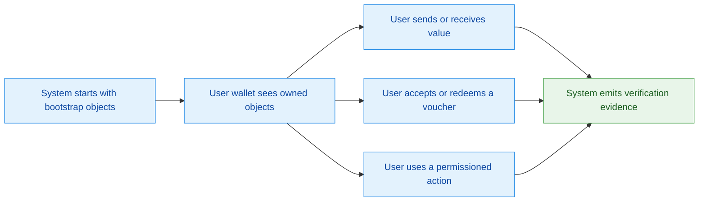
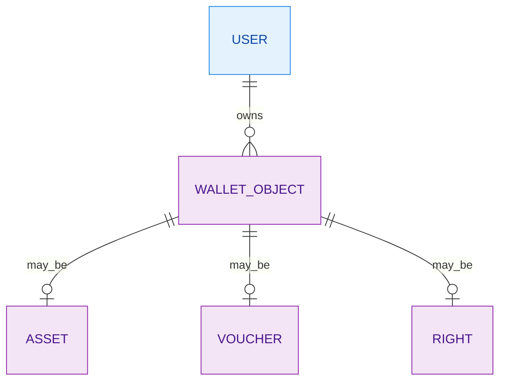
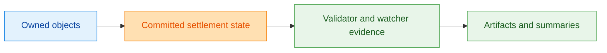

Z00Z is designed to handle several kinds of private digital objects, not just cash-like balances. The important product distinction is that some objects are spendable money, some are redeemable claims, and some are permissions that let a user perform specific actions. `crates/z00z_wallets/README.md:13-25`

## 🎯 User Journey Map

<!-- Sources: crates/z00z_core/README.md:22-43, crates/z00z_wallets/README.md:13-37, crates/z00z_simulator/README.md:67-92 -->

## 📦 Feature Capability Map

| Feature | Status | User-facing behavior | Limitations | Source |
|---|---|---|---|---|
| Private asset holding and transfer | Live | Users can hold and move asset-based value. | Cash lane is assets-only; not every object type is spendable. | `crates/z00z_wallets/README.md:16-17` `crates/z00z_wallets/README.md:38-44` |
| Voucher flows | Live in scenario and wallet object model | Users can hold, accept, reject, transfer, redeem, refund, or let vouchers expire. | Voucher activity is not the same as cash balance. | `crates/z00z_simulator/README.md:69-73` |
| Permissioned rights | Live in object model | Users can hold authority objects that enable allowed actions. | Rights contribute zero spendable value. | `crates/z00z_wallets/README.md:18-19` |
| Privacy overlay networking | Planned | A future privacy transport mode is reserved. | The crate is currently a placeholder, not a complete product surface. | `crates/z00z_networks/onionnet/README.md:27-31` |

## 🧾 Data Model (Product View)

<!-- Sources: crates/z00z_wallets/README.md:13-37 -->

## ⚙️ Configuration And Feature Controls

| Flag or control | What it changes | Default meaning | Who should treat it carefully | Source |
|---|---|---|---|---|
| `wallet_debug_tools` | Enables debug-only plaintext wallet dump tooling. | Off in normal product flows. | Engineering only. | `crates/z00z_simulator/Cargo.toml:22-24` `crates/z00z_wallets/Cargo.toml:185-187` |
| `wasm` wallet build | Enables browser-facing wallet build checks. | Off unless the browser lane is being built. | Engineering and QA. | `crates/z00z_wallets/Cargo.toml:171-173` |

## ⏱️ Performance And Expectations

| Operation | Expected behavior | Constraint | Source |
|---|---|---|---|
| Genesis bootstrap | Produces the initial object set and manifest. | Thread tuning is not visibly driven by the manifest field in the current orchestration path. | `crates/z00z_core/src/genesis/genesis_run.rs:17-25` |
| Scenario evidence generation | Produces asset, voucher, right, wallet, validator, and watcher evidence files. | This is an integration harness, not a user-facing application shell. | `crates/z00z_simulator/README.md:75-92` |

## ⚠️ Known Limitations

| Limitation | User impact | Workaround | Planned fix signal | Source |
|---|---|---|---|---|
| Rights and vouchers are not cash inputs | Users cannot spend those objects through cash-only asset flows. | Use typed object flows, not cash transfer paths. | None stated; current rule is explicit. | `crates/z00z_wallets/README.md:38-44` |
| Privacy overlay is not yet live | Product cannot promise that network mode today. | Position it as roadmap only. | Placeholder namespace already reserved. | `crates/z00z_networks/onionnet/README.md:27-31` |

## 🔒 Data And Privacy

<!-- Sources: crates/z00z_wallets/README.md:29-37, crates/z00z_storage/README.md:4-18, crates/z00z_runtime/watchers/README.md:13-16, crates/z00z_simulator/README.md:75-92 -->

| Data type | Where it shows up | Retention or policy hint | Source |
|---|---|---|---|
| Owned objects | Wallet inventory and object RPC surfaces. | Unknown-policy objects stay quarantined instead of becoming spendable immediately. | `crates/z00z_wallets/README.md:20-21` |
| Settlement evidence | Storage roots, proofs, checkpoint artifacts. | Managed as storage-owned truth. | `crates/z00z_storage/src/settlement/README.md:104-121` |
| Simulator release artifacts | Flow JSON files and summary docs. | Public evidence anchors are named explicitly. | `crates/z00z_simulator/README.md:75-89` |

## 📚 Glossary

| Term | Plain-language meaning |
|---|---|
| Asset | A spendable private value object. |
| Voucher | A claim that may need acceptance or redemption steps. |
| Right | A permission object that enables a specific kind of action. |
| Settlement | The committed record of object state. |
| Scenario | A reproducible multi-step exercise of the system. |

## ❓ FAQ

| Question | Answer | Source |
|---|---|---|
| Can users treat vouchers like money? | No. Voucher objects are separate from cash-only asset flows. | `crates/z00z_wallets/README.md:16-18` `crates/z00z_wallets/README.md:38-44` |
| Is the privacy overlay already a product feature? | No. The repository reserves the namespace, but the overlay remains placeholder scope. | `crates/z00z_networks/onionnet/README.md:27-31` |
| Where does proof and publication evidence come from? | From storage, runtime, validator, watcher, and simulator artifact flows. | `crates/z00z_storage/README.md:4-18` `crates/z00z_simulator/README.md:75-92` |

## 📖 References

- `crates/z00z_wallets/README.md:13-44`
- `crates/z00z_simulator/README.md:67-92`
- `crates/z00z_networks/onionnet/README.md:27-31`
- `crates/z00z_storage/src/settlement/README.md:104-121`

## Related Pages

| Page | Relationship |
|---|---|
| [Contributor Guide](./contributor-guide.md) | More technical version of this capability map. |
| [Settlement Runtime And Rollup](../05-storage-runtime/settlement-runtime-and-rollup.md) | Deeper engineering explanation of the evidence flow. |
