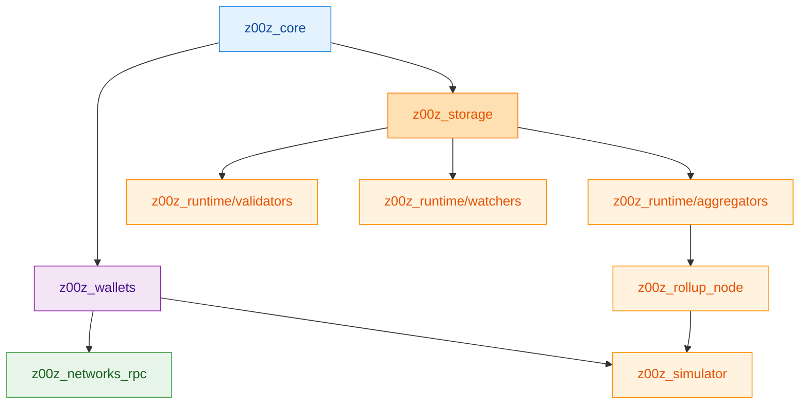
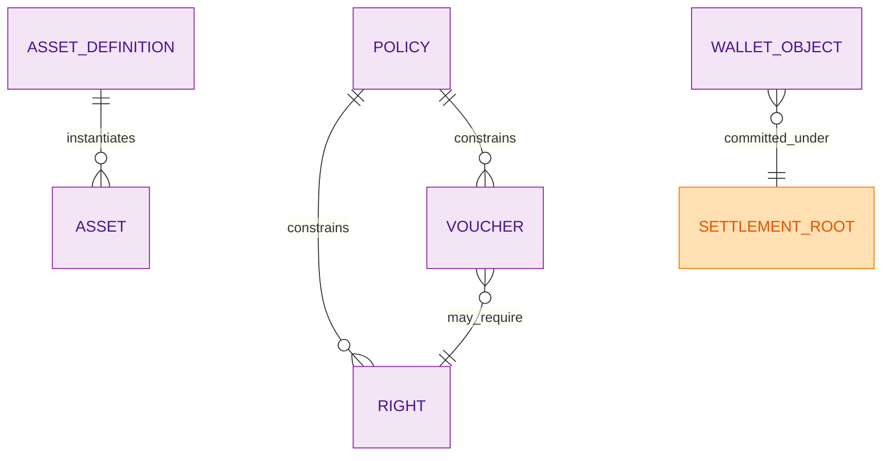
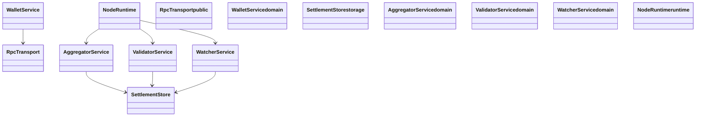
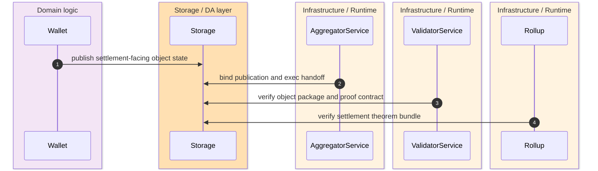
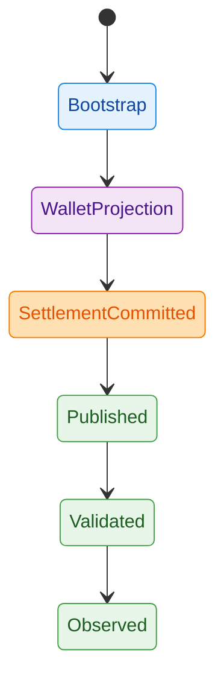

The central architectural fact about Z00Z is simple but load-bearing: semantic truth is intentionally fragmented by owner crate so that no convenience layer silently becomes the second authority for protocol, settlement, wallet, or transport behavior. `crates/z00z_core/README.md:22-43` `crates/z00z_storage/README.md:4-18` `crates/z00z_networks/rpc/README.md:5-18`

## 🎯 Executive Summary

| Topic | Position | Source |
|---|---|---|
| Protocol semantics | Live in `z00z_core`. | `crates/z00z_core/src/lib.rs:103-132` |
| Settlement truth | Lives in `z00z_storage`. | `crates/z00z_storage/src/settlement/mod.rs:32-93` |
| Planner and publication flow | Live in `z00z_runtime/aggregators`. | `crates/z00z_runtime/aggregators/src/lib.rs:18-44` |
| Final theorem composition | Lives in `z00z_rollup_node`. | `crates/z00z_rollup_node/src/lib.rs:85-165` |

## 🔑 The Core Architectural Insight

Z00Z is easier to reason about if you model it as a chain of owner crates rather than a chain of services. Every downstream layer is expected to consume the owner’s public contract and stop there.

```python
def route_change(change_kind: str) -> str:
    if change_kind in {"asset_semantics", "genesis", "voucher_rules", "rights"}:
        return "z00z_core"
    if change_kind in {"wallet_inventory", "receiver", "wallet_rpc"}:
        return "z00z_wallets"
    if change_kind in {"settlement_root", "proof_blob", "checkpoint_root"}:
        return "z00z_storage"
    if change_kind in {"planner", "publication_binding", "verdict"}:
        return "z00z_runtime"
    return "re-evaluate ownership"
```

## 🧭 System Architecture


<!-- Sources: crates/z00z_wallets/Cargo.toml:76-87, crates/z00z_simulator/Cargo.toml:38-55, crates/z00z_rollup_node/src/lib.rs:15-31 -->

## 🗂️ Domain Model


<!-- Sources: crates/z00z_core/src/lib.rs:116-132, crates/z00z_core/src/vouchers/voucher_policy.rs:7-18, crates/z00z_wallets/README.md:13-37, crates/z00z_storage/src/settlement/README.md:172-183 -->

| Entity | Invariant | Enforced by | Source |
|---|---|---|---|
| Voucher | `remaining_value` must not exceed `face_value`, and live vouchers need a positive remainder unless terminal. | `VoucherConfigEntry::validate()` | `crates/z00z_core/src/vouchers/voucher_config.rs:162-205` |
| Voucher bootstrap entry | Shape must validate before policy/action IDs are resolved. | `VoucherBootstrapEntryV1::validate()` | `crates/z00z_core/src/vouchers/voucher_bootstrap.rs:31-66` |
| Settlement root | Semantic root and proof-local physical root must stay distinct. | Settlement README and proof contracts | `crates/z00z_storage/src/settlement/README.md:104-121` |

## 🧱 Key Abstractions


<!-- Sources: crates/z00z_networks/rpc/src/lib.rs:64-98, crates/z00z_wallets/src/services/mod.rs:16-24, crates/z00z_storage/src/settlement/mod.rs:83-88, crates/z00z_runtime/aggregators/src/lib.rs:34-44, crates/z00z_runtime/validators/src/lib.rs:14-28, crates/z00z_runtime/watchers/src/lib.rs:13-20, crates/z00z_rollup_node/README.md:12-15 -->

## 🔄 Request Lifecycle


<!-- Sources: crates/z00z_storage/src/settlement/README.md:172-183, crates/z00z_runtime/aggregators/README.md:14-16, crates/z00z_rollup_node/src/lib.rs:97-165 -->

## 🔁 State Transitions


<!-- Sources: crates/z00z_core/src/genesis/genesis_run.rs:26-176, crates/z00z_wallets/README.md:27-37, crates/z00z_runtime/validators/README.md:15-18, crates/z00z_runtime/watchers/README.md:13-16 -->

## 📋 Decision Log

| Decision | Alternatives considered | Rationale | Source |
|---|---|---|---|
| Keep RPC transport-only | Full network stack in the RPC crate | Preserves reusable transport semantics without importing auth or peer policy. | `crates/z00z_networks/rpc/README.md:5-18` |
| Keep OnionNet crate-shaped before implementation | Wait until overlay code is ready | Avoid namespace churn and future path rewrites. | `crates/z00z_networks/onionnet/README.md:27-31` |
| Keep simulator separate | Put scenario glue into wallet or runtime crates | Prevents harness behavior from becoming production ownership. | `crates/z00z_simulator/README.md:12-22` |

## 📈 Performance Characteristics

| Hot path | Observable characteristic | Source |
|---|---|---|
| Genesis generation | Builds a dedicated manifest-driven Rayon pool and logs both host parallelism and configured genesis pool size during generation. | `crates/z00z_core/src/genesis/genesis_run.rs` |
| Rollup theorem verification | Re-serializes and rechecks structure, digest, roots, and inclusion without private witnesses. | `crates/z00z_rollup_node/src/lib.rs:141-197` |

## 🛡️ Security Model

| Concern | Current stance | Source |
|---|---|---|
| Weak genesis seed | Rejected during schema validation. | `crates/z00z_core/src/genesis/genesis_config_validate.rs:57-78` |
| Voucher replay and malformed lifecycle | Rejected by voucher validation rules. | `crates/z00z_core/src/vouchers/voucher_config.rs:177-220` |
| Wallet object/cash boundary | Voucher and right IDs must not leak into cash-only send/receive paths. | `crates/z00z_wallets/README.md:38-44` |

## 🧪 Testing Strategy

| Area | Evidence surface | Source |
|---|---|---|
| Repository-wide verification | `full_verify.sh` runs format, lint, tests, doc, bench, runnable targets, and optional heavy stages. | `.github/skills/z00z-full-verify-gate/scripts/full_verify.sh:73-83` |
| Scenario integration | `scenario_1` crate binary plus stage contract artifacts. | `crates/z00z_simulator/Cargo.toml:26-36` `crates/z00z_simulator/README.md:75-92` |

## ⚠️ Known Technical Debt

| Issue | Risk level | Affected files | Source |
|---|---|---|---|
| `performance.num_threads` now owns the live manifest-to-thread-pool path, so regressions here would reintroduce a second tuning authority. | Medium | `genesis_config.rs`, `genesis_config_validate.rs`, `genesis_run.rs` | `crates/z00z_core/src/genesis/genesis_config.rs` `crates/z00z_core/src/genesis/genesis_run.rs` |
| `onionnet` is intentionally placeholder-only, so future overlay work remains an integration risk until real code lands. | Medium | `crates/z00z_networks/onionnet/src/lib.rs` | `crates/z00z_networks/onionnet/src/lib.rs:13-126` |

## 📚 Where To Go Deep

| Order | Read next | Why |
|---|---|---|
| 1 | [Object Model And Genesis](../03-core-protocol/object-model-and-genesis.md) | Understand bootstrap truth and typed objects. |
| 2 | [Settlement Runtime And Rollup](../05-storage-runtime/settlement-runtime-and-rollup.md) | Follow those objects into committed storage and theorem verification. |
| 3 | [Scenario Pipeline](../06-simulator-and-quality/scenario-pipeline.md) | See how the multi-crate contract is exercised. |

## 📖 References

- `crates/z00z_core/src/lib.rs:103-132`
- `crates/z00z_storage/src/settlement/mod.rs:32-93`
- `crates/z00z_runtime/aggregators/src/lib.rs:18-44`
- `crates/z00z_rollup_node/src/lib.rs:97-165`
- `crates/z00z_simulator/README.md:12-22`

## Related Pages

| Page | Relationship |
|---|---|
| [Crate Boundaries](../02-architecture/crate-boundaries.md) | Architectural prerequisite for the ownership-first model above. |
| [Object Model And Genesis](../03-core-protocol/object-model-and-genesis.md) | First deep technical reading pass. |
| [Settlement Runtime And Rollup](../05-storage-runtime/settlement-runtime-and-rollup.md) | Follows the owner-crate chain into durable evidence. |
